# CSS3深入笔记

来源：慕课网2019前端工程师职位 - 页面化妆师CSS3

# ch1 CSS3选择器


## 1.基本选择器

### 子元素选择器（直接后代选择器）


一个小技巧：vscode中快速生成


```html
<head>
  <style type="text/css">
    section > div{
      color: #f00;
    }
  </style>
</head>
<body>
  <section>
    <div>article外面的文字</div>
    <article>
      <div>article里面的文字</div>
    </article>
  </section>
</body>
```


### 相邻兄弟选择器


```html
<head>
  <style type="text/css">
    section > div + article{
      color: #f00;
    }
  </style>
</head>
<body>
  <section>
    <div>article外面的文字</div>
    <article>
      <div>article里面的文字</div>
    </article>
    <article>
      <div>article里面的文字</div>
    </article>
  </section>
</body>
```


### 通用兄弟选择器


```html
<head>
  <style type="text/css">
    section > div ~ article{
      color: #f00;
    }
  </style>
</head>
<body>
  <section>
    <article>
      <div>article里面的文字</div>
    </article>
    <div>article外面的文字</div>
    <article>
      <div>article里面的文字</div>
    </article>
    <article>
      <div>article里面的文字</div>
    </article>
    <article>
      <div>article里面的文字</div>
    </article>
  </section>
</body>
```


### 群组选择器


```html
<head>
  <style type="text/css">
    section > article,
    section > aside,
    section > div{
      color: #ff0000;
        margin: 10px 0;
      background: #abcdef;
    }
  </style>
</head>
<body>
  <section>
    <article>article</article>
    <aside>aside</aside>
    <div>div</div>
  </section>
</body>
</html>
```


## 2.属性选择器


### `Element[attribute]`


### `Element[attribute="value"]`


```html
<style type="text/css">
    a[href="#"]{
      color: red;
    }
    a[href~="#"]{
      color: green;
    }
  </style>
</head>
<body>
  <a href="attribute.html">attribute</a>
  <a href="#">attribute</a>
  <a href="#1">attribute</a>
  <a href="#2">attribute</a>
  <a href="#3">attribute</a>
  <a href="#4">attribute</a>
</body>
```


### `Element[attribute~"value"]`


```html
<style type="text/css">
    a[class~="two"]{
      color: #ffff00;;
    }
  </style>
</head>
<body>
  <a href="attribute.html">attribute</a>
  <a href="#">attribute</a>
  <a class="one two" href="#">attribute</a>
  <a class="two there"href="#">attribute</a>
  <a href="#1">attribute</a>
</body>
```


### `Element[attribute^="value"]`

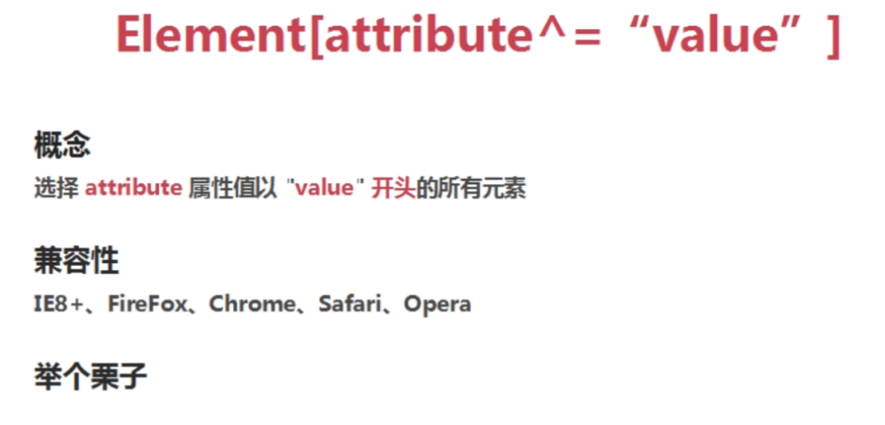

```html
<head>
  <style type="text/css">
    a[href^="#"]{
      color: green;
    }
  </style>
</head>
<body>
  <a href="attribute.html">attribute</a>
  <a href="#">attribute</a>
  <a href="#1">attribute</a>
  <a href="#2">attribute</a>
</body>
</html>
```


### `Element[attribute$="value"]`


```html
<style type="text/css">
    a[href$="#"]{
      color:lightblue;
    }
  </style>
</head>
<body>
  <a href="#">attribute</a>
  <a href="#1">attribute</a>
  <a href="#2">attribute</a>
  <a href="1#">attribute</a>
  <a href="2#">attribute</a>
</body>

```


### `Element[attribute*="value"]`


```html
<!DOCTYPE html>
 <style type="text/css">
    a[href*="#"]{
      color:lightblue;
    }
  </style>
</head>
<body>
  <a href="attribute.html">attribute</a>
  <a href="#">attribute</a>
  <a href="#1">attribute</a>
  <a href="#2">attribute</a>
  <a href="1#">attribute</a>
  <a href="2#">attribute</a>
  <a href="1#1">attribute</a>
  <a href="2#2">attribute</a>
</body>
</html>
```


### `Element[attribute|="value"]`


```html
<style type="text/css">
    a[href|="#"]{
      color:gold;
    }
  </style>
</head>
<body>
  <a href="attribute.html">attribute</a>
  <a href="#">attribute</a>
  <a href="#1">attribute</a>
  <a href="#2">attribute</a>
  <a href="1#">attribute</a>
  <a href="2#">attribute</a>
  <a href="#-1">attribute</a>
  <a href="#-2">attribute</a>
</body>
```


## 3.伪类选择器


### 动态伪类


```html
<head>
  <meta charset="UTF-8">
  <meta name="viewport" content="width=device-width, initial-scale=1.0">
  <title>Document</title>
  <style type="text/css">
    input{
      width: 200px;
      height: 30px;
      border:5px solid #f00
    }
    input:focus{
      background: #abcdef;
    }
  </style>
</head>
<body>
  <input type="text">
```


光标进入变成蓝色


### UI元素状态伪类


```html
 <style type="text/css">
    input{
      width: 100px;
      height: 30px;
    }
    input:enabled{
      border:1px solid red
    }
    input:disabled{
      background: #abcdef;
      border: 1px solid yellow;
    }
  </style>
</head>
<body>
  <input type="text" disabled>
  <input type="text" >
  <input type="text" >
  <input type="text" >
</body>
```


### CSS3结构类


#### `Element:first-child`


```html
  <style type="text/css">
   section:first-child{
     color:red
   }
  </style>
</head>
<body>
  <section>
    <div>1-1</div>
    <div>1-2</div>
    <div>1-3</div>
  </section>
  <section>
    <div>2-1</div>
    <div>2-2</div>
    <div>2-3</div>
  </section>
```


```html
  <style type="text/css">
   div:first-child{
     color:red
   }
  </style>
</head>
<body>
  <div>0-1</div>
  <div>0-2</div>
  <div>0-3</div>
  <section>
    <div>1-1</div>
    <div>1-2</div>
    <div>1-3</div>
  </section>
  <section>
    <div>2-1</div>
    <div>2-2</div>
    <div>2-3</div>
  </section>
```

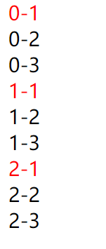

配合其他选择器使用

#### `Element:last-child`


```html
  <style type="text/css">
   div:last-child{
     color:red
   }
  </style>
</head>
<body>
  <div>0-1</div>
  <div>0-2</div>
  <div>0-3</div>
  <section>
    <div>1-1</div>
    <div>1-2</div>
    <div>1-3</div>
  </section>
  <section>
    <div>2-1</div>
    <div>2-2</div>
    <div>2-3</div>
  </section>
```


#### `Element:nth-child(N)`


```html
  <style type="text/css">
   ul>li:nth-child(3){
     background: red;
   }
  </style>
</head>
<body>
  <ul>
    <li>1</li>
    <li>2</li>
    <li>3</li>
    <li>4</li>
    <li>5</li>
    <li>6</li>
    <li>7</li>
    <li>8</li>
  </ul>
  <hr>
```


存疑：这道题不会做


#### 参数N的选择


例如

```css
div:nth-child(2n)
div:nth-child(3n+1)
```

#### `Element:nth-last-child(N)`


可以理解为：计数时，不按类型，但是显示的时候，还是要看的

#### `Element:nth-of-type(N)`


可以理解为：计数时，就数特定的类型


```html
<style type="text/css">
    div:nth-of-type(2){
      color: red;/*只属div的第二个*/
    }
  </style>
</head>
<body>
  <div>0-1</div>
  <section>
    <div>1-1</div>
    <div>1-2</div>
    <div>1-3</div>
  </section>
  <div>0-2</div>
  <div>0-3</div>
  <section>
    <div>2-1</div>
    <div>2-2</div>
    <div>2-3</div>
  </section>
</body>
```


#### `Element:nth-last-of-typr(N)`


```html
 <style type="text/css">
    div:nth-of-type(2){
      color: red;
    }
  </style>
</head>

<body>
  <div>0-1</div>
  <section>
    <div>1-1</div>
    <div>1-2</div>
    <div>1-3</div>
  </section>
  <div>0-2</div>
  <div>0-3</div>
  <section>
    <div>2-1</div>
    <div>2-2</div>
    <div>2-3</div>
  </section>
</body>

</html>
```


#### `Element:only-child`


（找独生子女哈哈哈哈哈）


#### `Element:empty`


### 分类选择器

##### :not


```html
  <style type="text/css">
  *{
    padding: 0;
    margin: 0;
    border: none;
  }
  a{
    text-decoration: none;
    display: block;
    float: left;  
    width: 100px;
    height: 30px;
  }
  nav{
    width: 800px;
    margin: 0 auto;
  }
  /*最后一个标签后面不需要*/
  nav > a:not(:last-of-type){
    border-right: 1px solid red;
  }
  </style>
</head>

<body>
  <!--写导航条-->
  <nav>
    <a href="#">first</a>
    <a href="#">second</a>
    <a href="#">third</a>
    <a href="#">fourth</a>
    <a href="#">five</a>
  </nav>
</body> 

</html>
```


#### CSS权重

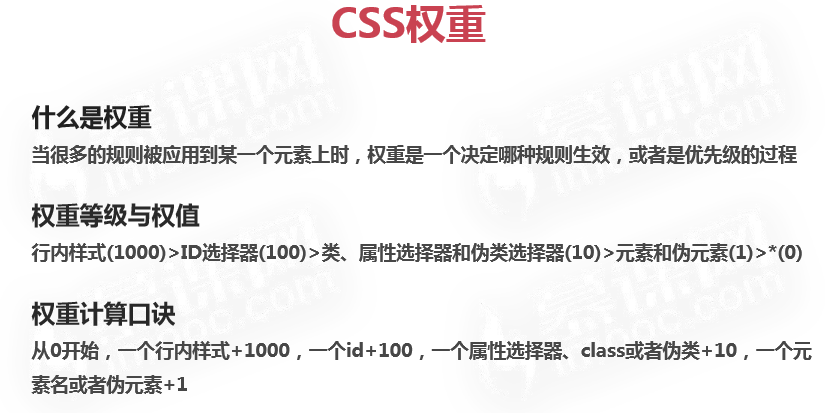


### 伪元素


 


比较实用，经常用于清除浮动

在这里为了清除header的浮动，让其高度由子元素撑开

```html
<head>
  <title>Document</title>
  <style type="text/css">
  /*清除浮动*/
  header::after{
    display: block;
    content: "";
    clear: both;
  }
  header{
    background: #abcdef;
  }
  header > article{
    float: left;
    width: 40%;
    height: 30px;
    background: #ff0000;
  }
  header > aside{
    float: right;
    width: 40%;
    height: 50px;
    background: #ff0;
  }
  </style>
</head>
<body>
  <header>
    <article></article>
    <aside></aside>
  </header>
</body> 

```


```html
<style type="text/css">
  div::selection{
    background: red;
    color: #ff0;
  }
  </style>
</head>
<body>
  <div>
    选中部分成为红底白字哈哈哈哈哈
  </div>
</html>
```


# ch2 CSS3边框与圆角

## 1. CSS3圆角


```css
border-radius:5em;/*浏览器的默认字体的5em*/
border-radius:50%;/*关于自己的百分比，宽高一样则变成一正圆形*/
```


考虑兼容性


一个案例：

```html
<!DOCTYPE html>
<html lang="en">
<head>
  <meta charset="UTF-8">
  <meta name="viewport" content="width=device-width, initial-scale=1.0">
  <title>talk</title>
  <style type="text/css">
    div{
      position: relative;
      width: 500px;
      height: 300px;
      border: 1px solid black;
      border-radius:50%;
      font-size: 24px;
      font-weight: bold;
      text-align: center;
      line-height: 300px;
    }
    div:before,
    div:after{
      position: absolute;/*子绝父相*/
      content: "";
      width: 50px;
      height: 50px;
      display: block;
      border:1px solid black;
      border-radius: 50%;
    }
    div:before{
      width: 50px;
      height: 50px;
      bottom: -20px;
      right: 0;
    }
    div:after{
      width: 50px;
      height: 50px;
      bottom: -75px;
      right: -75px;
    }
  </style>
</head>
<body>
  <div>大家好，欢迎学习CSS！</div>
</body>
</html>
```

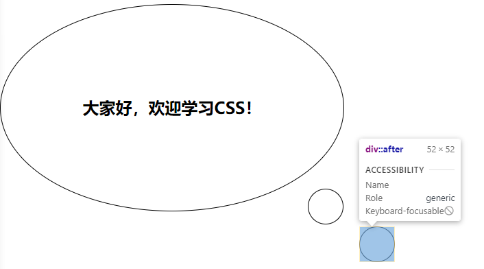

## 2. CSS3盒阴影


```css
    div{
      position: relative;
      width: 500px;
      height: 300px;
      margin: 0 auto;
      background: red;
      box-shadow: 50px 20px 0 0 yellow;
    }
```


## 3. CSS3边界图片


# ch3 CSS3背景与渐变

## 1. 背景


### 背景图像区域 background-clip


```html
  <style type="text/css">
  *{
    margin: 0;
    padding: 0;
    border: none;
  }
  div{
    width: 800px;
    height: 400px;
    padding: 50px;
    border: 50px solid transparent;
    background: url('bg1.jpg') no-repeat center center;
    background-clip: border-box;
    /* background-clip: padding-box; */
    /* background-clip: content-box; */
  }
  span.div_border{
    position: absolute;
    top:0;
    left:0;
    width: 800px;
    height: 400px;
    padding: 50px;
    border: 50px solid rgba(255, 0, 0, 0.25);
  }
  span.div_padding{
    position: absolute;
    top:50px;
    left:50px  ;
    width: 700px;
    height: 300px;
    padding: 50px;
    border: 50px solid rgba(255, 255, 0, 0.25);
  }

  </style>
</head>
<body>
  <div></div>
  <span class="div_border"></span>
  <span class="div_padding"></span>
</body>
</html>
```

 **background-clip: border-box;**


**background-clip: padding-box;**


  **background-clip: content-box;**


### 背景图片定位 background-origin


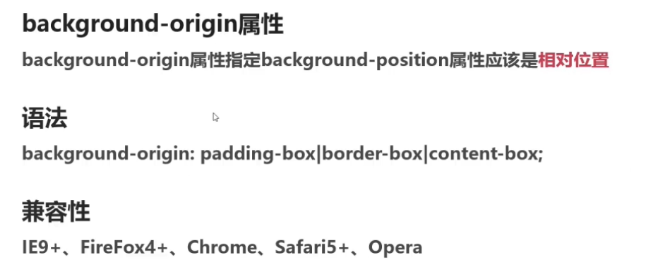


### 背景图片大小 background-size


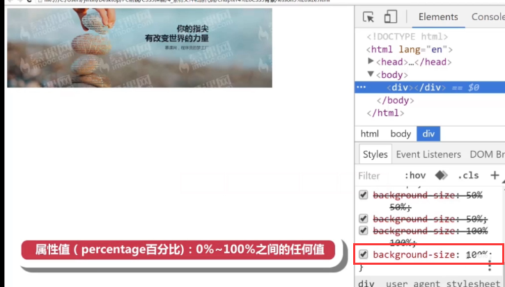


  ### 多重背景图像 background-image


### 背景属性整合 background


## 2. 渐变


### 线性渐变，角度，结点，透明


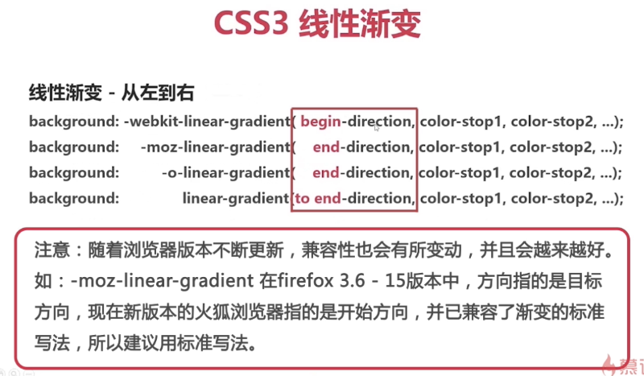

```html
  <style type="text/css">
  *{
    margin: 0;
    padding: 0;
    border: none;
  }
  div{
    width: 800px;
    height: 400px;
    background: linear-gradient(to right,red,blue);
  }

  </style>
</head>
<body>
  <div></div>
</body>
```


```css
    background: linear-gradient(to right bottom,red,blue);
```


```css
    background: linear-gradient(to right bottom,red,yellow,blue);
```


```css
background: linear-gradient(-45deg,red,yellow）
```


```css
    background: linear-gradient(90deg,red 10%,orange 15%,yellow,green,blue,purple );/*最后一个元素不写值，默认是100%；如果第一个不写值，默认是0%*/
```


```css
 background: linear-gradient(90deg,rgba(255,0,0,0),rgba(255,0,0,1));
```


### 重复渐变

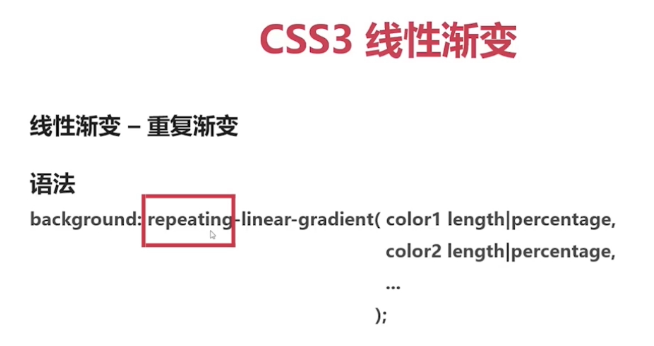

```css
background: repeating-linear-gradient(90deg,red 0%,blue 10%,red 20%);
```


### 径向渐变


**一个简单应用**


```html
  <style type="text/css">
  *{
    margin: 0;
    padding: 0;
    
    border: none;
  }
  div{
    width: 600px;
    height: 600px;
    background-color: #abcdef;
    background-image: linear-gradient(45deg,red 25%,transparent 25%),
                linear-gradient(-45deg,red 25%,transparent 25%),
                linear-gradient(45deg,transparent 75%,red 75%),
                linear-gradient(-45deg,transparent 75%,red 75%);
    background-size: 100px 100px;
  }
  </style>
</head>
<body>
```


# ch4 CSS3文本与字体

## 1.文本阴影


 h-shadow 水平偏移 v-shadow 竖直偏移 blur 模糊举例 color颜色

```html
<style type="text/css">
h1{
  text-shadow: 15px 25px 2px red;
}
  </style>
</head>
<body>
  <h1>text-shadow</h1>
</body>
</html>
```


**text-outline属性**

规定文本轮廓

**语法**

> text-outline:thickness blur color;

thickness 宽度值

## 2.换行


normal 使用浏览器默认规则

break-all 所有换行的地方就换行

keep-all 半角空格或连字符的地方换行


只针对英文，针对中日韩文之类的不起作用


## 3. 新文本属性


inherit是继承


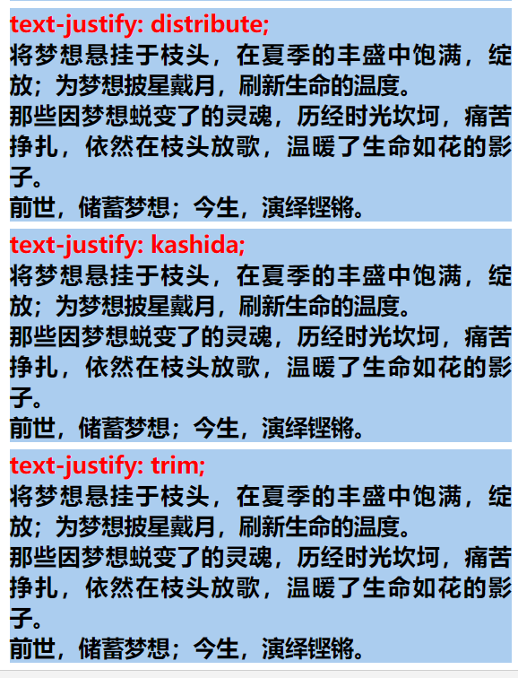


clip 修建文本  | ellipsis 修剪（带上一个省略号）|  string 自己写一个符号代替隐藏的内容


**注意：** 

* `text-overflow`要起作用一定要 加上`overflow:hidden`属性

## 4. CSS3字体

之前使用的是web安全字体（windows自带的），如果电脑上没有安装这个字体。浏览器无法从系统文件中找到这个字体。

font-face让网站开发不再局限于安全字体。


### @font-face的语法规则


source 字体存放路径，可多个；

font-family和src必选，其他可选

### @font-face的取值说明


### @font-face的字体格式


* RAW 写入式，支持就支持，不支持就不支持
* 可以用在手机端，移动端兼容性不同要注意


* web字体中的最佳格式
* 压缩版本，字体版本变小，提高网页的访问速度
* **居然不兼容手机端！**


* IE专用（IE4+）


* 其实就是Svg图片

### @font-face字体的应用


```html
<!DOCTYPE html>
<html lang="en">

<head>
<meta charset="UTF-8">
<title>CSS字体</title>
<style type="text/css">
@font-face {
    font-family: 'myfont';
    src: url('font/myFont.eot');
    src: url('font/myFont.eot?#iefix') format('embedded-opentype'),
         url('font/myFont.ttf') format('truetype'),
         url('font/myFont.woff') format('woff'),
         url('font/myFont.svg#myFont') format('svg');
}
h1 {
    font-family: 'myfont';
}
</style>
</head>

<body>
<h1>将梦想悬挂于枝头，在夏季的丰盛中饱满，绽放；为梦想披星戴月，刷新生命的温度。那些因梦想蜕变了的灵魂，历经时光坎坷，痛苦挣扎，依然在枝头放歌，温暖了生命如花的影子。前世，储蓄梦想；今生，演绎铿锵。</h1>
</body>

</html>

```


## 5. CSS3获取特殊字体


这个网址帮助我们获取特殊字体。

例如上传ttf格式，选择压缩版本，然后download your kit

# ch5 CSS3转换

**重点！！**


## 1. transform简介


## 2. transform的2D转换


### rotate() 旋转

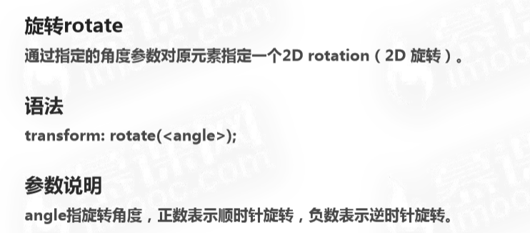

```css
<style type="text/css">
div { width: 1500px; height: 250px; background: #abcdef; margin: auto; }
div > img {
	transform: rotate(45deg);
}
</style>
</head>
<body>
<div></div>
```


### translate() 平移


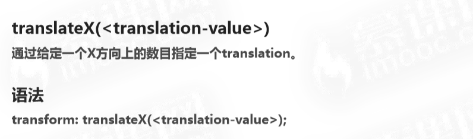


```html
<style type="text/css">
div { width: 1500px; height: 250px; background: #abcdef; margin: auto; }
div > img {
	transform: translateY(-20%);
}
</style>
</head>
<body>
<div></div>
```

说明坐标原点与父容器的上边缘重合


### scale() 缩放


原点线在中间

```html
<style type="text/css">
div { width: 1500px; height: 250px; background: #abcdef; margin: auto; }
div > img {
	transform: scale(0.5, 0.8 );
}
</style>
</head>
<body>
<div></div>
```


一个参数是 **等比缩放**

### skew() 扭曲或斜切


```html
<style type="text/css">
div { width: 1500px; height: 250px; background: #abcdef; margin: auto; }
div > img {
	transform: skew(10deg, 30deg);
}
</style>
</head>
<body>
<div></div>
```


## 3.transform的3D转换


### rotate3d()


```html
<style type="text/css">
div { width: 1500px; height: 250px; background: #abcdef; margin: auto; }
div > img {
	transform: rotate3d(1, 1, 1, 45deg);
}
</style>
</head>
<body>
<div></div>
```


### translate3d()


>  translateZ在页面上看不出来，更多用于 **遮罩**


```html
<style type="text/css">
div { width: 1500px; height: 250px; background: #abcdef; margin: auto; }
div > img {
	transform: translate3d(200px, 200px, 200px);
}
</style>
</head>
<body>
<div></div>
```


### scale3d()


```html
<style type="text/css">
div { width: 1500px; height: 250px; background: #abcdef; margin: auto; }
div > img {
	transform: scale3d(.5, .5, .5);
}
</style>
</head>
<body>
<div></div>
```

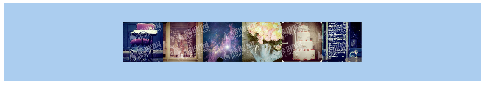

## 4.transform与坐标系统


坐标系统的引入，是用于元素的平移，选择，缩放等等

```css
transform-origin:left top;/*使用左上角作为基准点*/
transform-origin:25% top;/*靠近左上角一定距离的基准点*/
```

## 5. CSS3矩阵


```html
<style type="text/css">
div { width: 1500px; height: 250px; background: #abcdef; margin: 100px auto; }
div:nth-child(1) > img {
	transform: matrix(.5, 0, 0, .5, 0, 0);
}
div:nth-child(2) > img {
	transform: scale(.5, .5);
}
</style>
</head>
<body>
<div></div>
<div></div>
```


## 6. 扩展属性


# ch6 CSS过渡

## 1. 过渡概念


> CSS3过渡：一个元素，它的属性从一个值变化到另一个值

## 2. transition属性

### transition-property

 指向相关属性


```css
transition-property:color;
transition-property:opacity
```

> 如果不写transition-property属性，表示all所有属性支持过渡

### transition-duration

要是想看到过渡的整个过程？那就让过渡的速度变慢 — duration


### transition-timing-function

**只能使用一个属性值**


ease ease-in 结束比较生硬


### transition-delay

**设置 `transition-delay`后，等待time时候后执行**


### transition复合属性

**总结：CSS3 transition属性**

- **transition-property 指定属性名**
- **transition-duration 过渡时间**
- **transition-timing-function 过渡方法**
- **transition-delay 延迟**

复合属性，注意顺序一定不能错！


# ch7 CSS3动画


## 1. 介绍


> **注意：手机设备的浏览器在使用CSS3动画时，要加上webkit前缀**

## 2. annimation属性详解

### animation-name


```css
div>.inner {
      background-image: url(images/circle_inner.png);
      -webkit-animation-name: circle_inner;
      animation-name: circle_inner;
    }
    
    @keyframes circle_inner {
      from {
        transform: rotateX(0deg);
      }

      to {
        transform: rotateX(360deg);
      }
    }
    
<body>
  <div>
    <div class="inner"></div>
  </div>
</body>
```


### animation-duration


**注意：**

* 对于数值0.5s，可以写成.5s
* W3C推荐这种去掉0的写法

### animation-timing-function


### animation-delay


###  animation-iteration-count


### animation-direction


注意：

* alternate /  alternate-reverse 需要**配合循环属性才能实现效果**

### animation-fill-mode


### animation-play-state


使用`animation-play-state: paused`将动画暂停：

```css
    div>.inner {
      background-image: url(images/circle_inner.png);
      -webkit-animation-name: circle_inner;
      animation-name: circle_inner;
      -webkit-animation-duration: 10s;
      animation-duration: 10s;
      -webkit-animation-timing-function: linear;
      animation-timing-function: linear;
      -webkit-animation-delay: 2s;
      animation-delay: 2s;
      -webkit-animation-iteration-count: infinite;
      animation-iteration-count: infinite;
      -webkit-animation-direction: alternate;
      animation-direction: alternate;
      -webkit-animation-fill-mode: forwards;
      animation-fill-mode: forwards;
      /*暂停动画*/
      -webkit-animation-play-state: paused;
      animation-play-state: paused;
    }
```

```css
/*当鼠标移到上面的时候开始动画*/    
div:hover>div {
      cursor: pointer;
      -webkit-animation-play-state: running;
      animation-play-state: running;
    }
```

### animatio复合属性


```css
    div>.inner {
      background-image: url(images/circle_inner.png);
      -webkit-animation: circle_inner linear 10s infinite;
      animation: circle_inner linear 10s 2s infinite;
    }
```

* 在animation里 name 和duration是必需的，其他的智能识别字段
* 所以使用delay时要同时定义duration和delay（因为先识别duration）
* 上述例子：duration：10s  delay：2s

## 3.关键帧 Keyframes


> animation-name: animationname; 定义好的动画

这个效果就是先慢后快再慢的转动

```css
	div>.inner {
      background-image: url(images/circle_inner.png);
      -webkit-animation: circle_inner linear 10s infinite;
      animation: circle_inner linear 10s infinite;
    }
   
   @keyframes circle_inner {
      from {
        transform: rotateX(0deg);
      }
      25% {
        transform: rotateX(45deg);
      }
      75% {
        transform: rotateX(315deg);
      }
      to {
        transform: rotateX(360deg);
      }
    }
```

注意:

* animation 写在 -webkit-animation后面
* 通用标准格式写在后面，浏览器先读webkit-animation，再读animation，如果标准格式兼容，就以标准格式渲染，如果不兼容，以wekit格式渲染。
* 尽量使用通用方法

## 4.动画性能优化

> **优化动画的一些要点：**
>
> 1. **position-fixed替代background-attachment**
> 2. **带图片的元素放在伪元素中**
> 3. **巧用will-change**


* 实际上是使用骗取浏览器的方式来使用GPU加速
*  
* 也有一定的代价：增加层叠元素，占用RAM和GPU存储空间
* 如果有个机制：一会让要触发3D引擎，浏览器提前准备一下以便备用 —— 这个CSS属性就是 will-change

### will-change


```css
will-change:transform
will-change:left/top/margin/等等 （这个不推荐）
```

