# 第1章 课程介绍&环境搭建

电子书文档：http://es.xiecheng.live/

备注：2020.10.31-11.6 一周，只看了ES6部分

## 1-1 课程介绍

* ES：ECMAScript，是一种标准
* JS是ES的一种实现

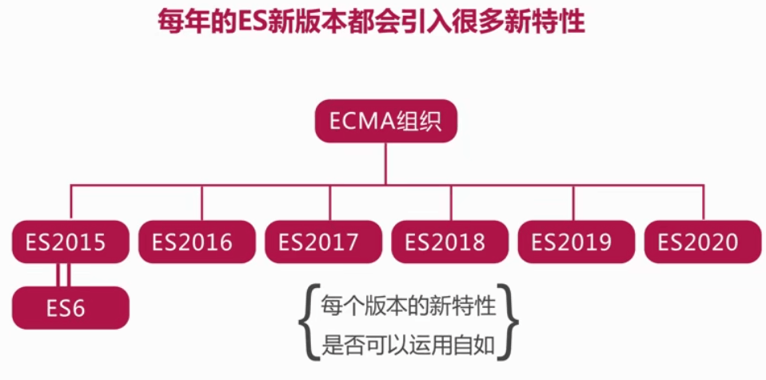

##  1-2 Node安装与NPM源切换


**bebel**可以将es6的语法编译为es5 https://www.babeljs.cn/

* `NPM`：Node Package Manager
* `NRM`：npm register manager
  * nrm ls 查看可用源
  * nrm test 测试源响应时间
  * nrm use taobao 切换源
  * nrm add imooc http://192.168.1.100:666 增加定制源
  * nrm del imooc 删除源

##  1-3 构建开发环境

安装：`npm install -g imooc-es-cli`

https://www.npmjs.com/ 这里的包都可以通过npm安装

本课程：https://www.npmjs.com/package/imooc-es-cli

```
PS F:\codeExer\ES6-11> imooc-es-cli --version
1.0.3
```


注意：static里面的文件不会被webpack打包编译，其中的es6语法也不会被转换成es5

# 第2章 ECMAScript2015（ES6）必备知识

本章详细介绍ES6中新的声明方式、解构赋值、数组扩展、函数扩展、对象扩展等内容，通过与ES5语法的对比讲解，突显出ES新特性的魅力所在。通过这些必备知识的学习，能够使我们的代码更加严谨，开发效率大大提高。

##  2-1 新的声明方式let


* 不属于顶层对象window

  ```js
  let a = 5;
  console.log(a);//a
  console.log(window.a);//undefined，避免污染全局变量
  ```

* 不允许重复声明

* 不存在变量提升

  ```js
  console.log(a);//undefined
  var a=5;//具有变量提升,代码并不安全
  
  console.log(b);//error
  let b=3;
  ```

* 暂时性死区

  ```js
  var a=5;
  if(true){
    a=6;
    let a;//error 声明之前使用会报错
  }
  ```

* **块级作用域**

  原来es5只有全局作用域和函数作用域，es6中let是有块级作用域的

  ```js
  for(let i=0;i<3;i++){
    console.log(i);//0，1，2
  }
  ```

  一个面试题

  ```js
  for(var i=0;i<3;i++){
    setTimeout(function(){
      console.log(i);
    })
  }
  //会输出3个3
  //settimeout异步操作，事件循环机制中在同步操作执行后才会操作，3次settimout取到的i都是for循环结果的结果3
  
  for(var i=0;i<3;i++){
    (function(j){
      setTimeout(function(){
        console.log(j);
      })
    })(i);
  }
  //会输出0，1，2
  //使用闭包：闭包的特点：有一个外部函数，有一个内部函数，内部函数会调用外部函数的变量，这样外部函数的变量i的状态不会被释放
  
  for(let i=0;i<3;i++){
    setTimeout(function(){
      console.log(i);
    })
  }
  //会输出0，1，2
  ```

  在babel的官网可以看es6如何转换为es5语法（上述例子可以看到在使用let的时候babel自动生成了闭包）

  

##   2-3 新的声明方式const

```js
//ES5中定义常量
Object.defineProperty(window,'PI',{
  value:3.14,
  writable:false
})
console.log(PI);//3.14
PI = 5;
console.log(PI);//3.14

//ES6
const a = 5;//常量定义时就要指定初始值
a = 6;//error
```

* const也具有块级作用域
* 存在暂时性死区

对于基本数据类型，设置为const之后**不能重新赋值**（如上），对于**引用类型**，变量所指向的**内存地址不变**，只是地址里存的内容改变

```js
const obj1 = {
  name:'xie',
}
console.log(obj1);//{ name: 'xie' }
obj1.age = 34;
console.log(obj1);//{ name: 'xie', age: 34 }

const arr = [1,2,3];
arr.push(4);
console.log(arr);//[ 1, 2, 3, 4 ]
```


注意：可以使用Object.freeze，但它只是浅层冻结（最外层冻结）

##   2-4 解构赋值

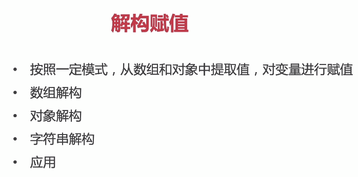

* 数组解构

  ```js
  let [a,b,c] = [1,2,3];
  console.log(a,b,c);//1 2 3 
  
  let [a,b,[c,d]] = [1,2,[3,4]];
  console.log(a,b,c,d);//1 2 3 4 
  
  let [a,b,[c]] = [1,2,[3,4]];
  console.log(a,b,c);//1 2 3
  
  let [a,b,c]= [1,2,[3,4]];
  console.log(a,b,c);//1 2 [3,4]
  
  let [a,b,c,d=5]= [1,2,[3,4]];
  console.log(a,b,c,d);//1 2 [3,4] 5
  
  let [a,b,c,d=5]= [1,2,[3,4],6];
  console.log(a,b,c,d);//1 2 [3,4] 6
  ```

* 对象解构

  ```js
  let user = {
    name:"sun",
    age:23
  }
  
  //ES5
  // let name = user.name;
  // let age = user.age;
  // console.log(name,age);
  
  //ES6
  // let {name,age} = user;
  // console.log(name,age);//sun 23
  
  //起别名
  let {name:uname,age:uage} = user;
  console.log(uname,uage);//sun 23
  
  ```

* 字符串解构

  ```js
  let str = 'imooc';
  // for (let i = 0; i <str.length; i++) {
  //   console.log(str[i]);
  // }
  
  let [a,b,c,d,e] = str
  console.log(a,b,c,d,e);//i m o o c
  ```

* 应用：提取json数据（其实就是对象解构）

  ```js
  //json数据
  let json = '{"user":"sxc","pwd":"123456"}'
  
  let {user,pwd} = JSON.parse(json)
  console.log(user,pwd);// sxc 123456
  ```

##   2-5 数组的各种遍历方式


* **forEach**

  ```js
  let arr = [1,2,3]
  //foreach
  arr.forEach(function(elem,index,array){
    console.log(elem,index);
  });
  ```
  

【注意】：foreach不支持continue和break

* **reduce**

  1. 数组求和

     ```js
     let arr = [1,2,3]
     
     let sum = arr.reduce(function(prev,cur,index,array){
       return prev+cur;
     },0)
     console.log(sum);
     ```

  2. 求最大值

     ```js
     let arr = [1,2,3]
     
     let max = arr.reduce(function(prev,cur){
       return Math.max(prev,cur)
     },0)
     console.log(max);
     ```

  3. 去重

     ```js
     let arr = [1,2,1,3]
     
     let newarr = arr.reduce(function(prev,cur){
       prev.indexOf(cur) == -1 && prev.push(cur);
       return prev
     },[])
     console.log(newarr);//[1, 2, 3]
     ```
     
  4. 统计词频
  
     ```js
     function count(str) {
       //去除空白字符处理
       str = str.replace(/\s*/g,'');
       //统计词频
       let arr = [...str];
       let res = arr.reduce(function(prev,cur){
         prev[cur] ? prev[cur]++ : prev[cur]=1;
         return prev;
       },{})
       return res;
     }
     var result = count('hello world');
     console.log(result);//{ h: 1, e: 1, l: 3, o: 2, w: 1, r: 1, d: 1 }
     ```
  
     


**find**

```js
let arr = [1,2,2,3]

let res = arr.find(function(value){
  return value ==2;
})
console.log(res);//2
```

**findIndex**

```js
let arr = [1,2,2,3]
let res = arr.findIndex(function(value){
  return value ==2;
})
console.log(res);//1
```

**for of**

```js
let arr = [1,2,2,3]

for(let item of arr){
  console.log(item);
}

for(let item of arr.values()){
  console.log(item);
}

for(let item of arr.keys()){
  console.log(item);
}

for(let [index,item] of arr.entries()){
  console.log(index,item);
}
```

##  2-6 数组的扩展


**类数组/伪数组**

```js
let divs3 = document.querySelectorAll('.xx');
console.log(divs3);//NodeList [] 这就是一个伪数组
console.log(divs3 instanceof Array);//false
//ES5
let arr = Array.prototype.slice(divs3)//把伪数组转化成数组
console.log(arr);//[]
arr.push(123);
console.log(arr);//[123]
```

**Array.from()**

```js
//ES6
let arrayLike = {
  0:'es6',
  1:'es7',
  2:'es8',
  length:3
}
let arr = Array.from(arrayLike);//把伪数组转化成数组
console.log(arr);//["es6", "es7", "es8"]
```

**Array.of**

```js
let arr = Array.of(1,2);
console.log(arr);//[1, 2]
```

**copyWithin**

```js
let arr = [1,2,3,4,5];
console.log(arr.copyWithin(1,3));//[1, 4, 5, 4, 5]
```

**fill**

```js
let arr = [1,2,3,4,5];
arr.fill('imooc',1,3)//从1替换到3（不包含3
console.log(arr);// [1, "imooc", "imooc", 4, 5]

arr.fill(0);
console.log(arr);//[0, 0, 0, 0, 0]
```

**includes()**

```js
let arr = [1,2,3,NaN];
console.log(arr.includes(2));//true
console.log(arr.includes(NaN));//true
```

【注意】：indexof返回数组索引，检测不出来NaN，includes可以检测NaN

##   2-7 函数的参数


**参数的默认值**

```js
function foo(x,y='world'){
  console.log(x,y);
}

foo('hello',0)
```

【注意】：参数的默认值要放在最后面

**与解构赋值结合**

```js
function foo({x,y=5}){
  console.log(x,y);
}

foo({x:1})//1 5
foo({})//undefined 5
foo()//error`
```

**length属性**

```js
// function foo(x,y,z){
//   console.log(x,y);
// }
// console.log(foo.length);//3

function foo(x,y,z=3){
  console.log(x,y);
}
console.log(foo.length);//2

```

【注意】：length属性返回 没有指定默认值的参数的个数

**作用域**

作用域链的概念

**函数的name属性**

```js
function foo(){}
console.log(foo.name);//foo

console.log((new Function).name);//anonymous
```

##  2-8 扩展运算符与rest参数


两个操作刚好相反

**扩展运算符**（在等号右边/做实参）

```js
//扩展运算符
//eg1
function foo(a,b,c){
  console.log(a,b,c);
}
let arr = [1,2,3]
//foo(arr)//[1, 2, 3] undefined undefined
foo(...arr)//1 2 3
console.log(...arr);//1 2 3

//eg2 合并数组
let arr1 = [1,2,3];
let arr2 = [4,5,6];
arr1.push(...arr2);
console.log(arr1);

//eg3
let str = 'imooc';
var arr = [...str];
console.log(arr);//["i", "m", "o", "o", "c"]
```

**rest参数** （在等号左边/做形参）

```js
//rest参数 
//eg1 对于不确定参数
function foo(...args){
  console.log(args);
  let sum = 0;
  args.forEach(function(item){
    sum+=item;
  })
  return sum;
}
foo(1,2);//[1, 2]
foo(1,2,3);//[1, 2,3]

//eg2
function foo(x,...args){
  console.log(x);
  console.log(args);
}
foo(1,2);//1,[2]
foo(1,2,3);//1,[2,3]

//eg3 与解构联合使用
let [x,...y] = [1,2,3];
console.log(x);//1
console.log(y);//[2,3]

```

##   2-9 箭头函数


```js
//箭头左边参数，右边函数体
let sum = (x,y)=>{
  return x+y;
}
//let sum = (x,y)=> x+y 简写
console.log(sum(3,4));
```

这里看博客：https://blog.csdn.net/sinat_38368658/article/details/109388351

**（重要）关于this指向的问题：**

首先先明白一个定义：**this是指对当前对象的引用**
### 案例
对于如下结构:

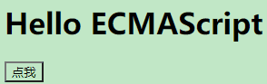


```js
<body>
        <h1>Hello ECMAS cript</h1>
        <button id="btn">点我</button>
        <script src="static/2-1.js"></script>
    </body>
```

**代码1**

```js
let oBtn = document.querySelector('#btn');
oBtn.addEventListener('click',function(){
  console.log(this);
})
```

this指的是对当前对象的引用，btn绑定的click事件，所以当前引用应该是btn

当点击按钮时，会看到


**代码2**

现在有一个定时器，希望点击后一秒再输出this，我们根据该需求编写如下代码：

```js
let oBtn = document.querySelector('#btn');
oBtn.addEventListener('click',function(){
  setTimeout(function(){
    console.log(this);
  },1000)
})
```

当点击按钮时，会看到


可以看到this指向了window，说明当前对象是window，指的是**调用的对象**，setTimeout是window的一个方法，即上述代码与`window.setTimeout(function(){console.log(this); },1000)`等价，所以setTimeout里面的this就指向了window

**代码3**

**改变this指向版本1**

但是我们想要获取到oBtn对象。在ES5里有3个方法可以改变this指向：即 call apply 和bind。这里使用bind （因为all和apply会让该方法马上执行）。

bind里的参数表示希望当前里面的这个作用域指向谁，bind里的参数就写它。（bind里的this指的是oBtn，传递进去后，setTimeout的this就指的是obtn）

```js
let oBtn = document.querySelector('#btn');
oBtn.addEventListener('click',function(){
  setTimeout(function(){
    console.log(this);
  }.bind(this),1000)
})
```

当点击按钮后，打印出


捋一下上面的关系：


**代码4**

**改变this指向版本2**

除了使用bind函数改变了this指向，我们还可以使用ES6的箭头函数，代码如下：

```js
let oBtn = document.querySelector('#btn');
oBtn.addEventListener('click',function(){
  console.log(this);
  setTimeout(()=>{
    console.log(this);
  },1000)
})
```

这时的this指向button，因为**在箭头函数里，this指向定义时所在的对象，而不是调用时所在的对象**（其实**箭头函数里面并没有this**，箭头函数里的this是继承了箭头函数外的执行环境里的this），所以往setTimout里面的this是找到了外面的oBtn。

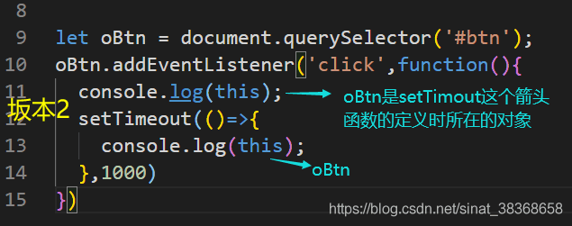

##   2-10 对象的扩展


**属性简洁表示法**

```js
let name ="sun"
let age = 34
let obj = {
  name,
  age
}
console.log(obj);
```

如果对象的key和value名字一样，可以直接简写

**属性名表达式**

如果属性的key是一个变量，则加 []

```js
let name ="sun";
let age = 34;
let s = "school";
let obj = {
  name,
  age,
  [s]:'imooc',
  study(){
    console.log(this.name);
  }
}
console.log(obj);
```

**Object.is()**

判断两个值是否严格相等

```js
console.log(Object.is(NaN.Nan));//true
```

**扩展运算符与Object.assign()**

```js
let x= {
  a:3,
  b:4
}
let y = {...x};
console.log(y)//{a: 3, b: 4}
```

```js
let x= {
  a:3,
  b:4
}
let y = {
  c:5
};
Object.assign(y,x);
console.log(y);
```

**in**

* 当前对象是否包含某个属性
* 判断数组的某一下标（即当前位置）是否有值（返回true/false）

**对象的遍历方式**

```js
let obj = {
  name:"sxc",
  age:18,
  school:'imooc'
}
//1
for(let key in obj){
  console.log(key,obj[key]);
}
//2
Object.keys(obj).forEach(key => {
  console.log(key,obj[key]);
})
//3
Object.getOwnPropertyNames(obj).forEach(key => {
  console.log(key,obj[key]);
})
//4
Reflect.ownKeys(obj).forEach(key => {
  console.log(key,obj[key]);
})
```

##   2-11 深拷贝与浅拷贝


```js
let target ={
  a:{
    b:{
      c:1
    },
    e:4,
    f:5,
    g:6
  }
};
let source = {
  a:{
    b:{
      c:1
    },
    e:2,
    f:3
  }
};
Object.assign(target,source);
console.log(target);
```

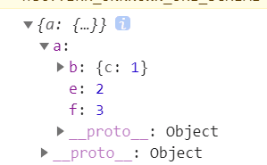

可以看到没有复制到属性g

**Object.assign**对基本数据类型复制可以，对于复杂引用类型，只是复制了地址。并不安全，只是一个**浅拷贝。**

在看一个例子：

```js
//深拷贝
let a = 5;
let b = a;
a = 6 ;
console.log(a,b);//6,5 

//浅拷贝
let obj1 = {
  name:"sxc",
  age:20
}
let obj2 = obj1;//obj1和obj2指向了同一块堆内存地址
console.log(obj1);//{name: "sxc", age: 20}
obj1.age = 13;
console.log(obj2);//{name: "sxc", age: 13}
```


**如何实现对象的深拷贝？**

1. **利用JSON**

>  `Json.parse`把json字符串转换成一个对象。`Json.stringify`把对象转换成JSON格式字符串

```js
//如何实现引用类型深拷贝？
let obj1 = {
  name:"sxc",
  age:20
}
let str = JSON.stringify(obj1);
let obj2 = JSON.parse(str);
obj1.age = 12;
console.log(obj2);//{name: "sxc", age: 20}
```

2. **自己封装一个递归函数**

```js
//检查类型
let checkType = data =>{
  return Object.prototype.toString.call(data).slice(8,-1);
}

let deepClone = target =>{
  let targetType = checkType(target)
  let result;
  if(targetType === 'Object'){
    result = {}
  }else if(targetType === 'Array'){
    result = []
  }else{
    return target;
  }
  //循环遍历所有属性
  for(let i in target){
    let value = target[i];
    let valueType = checkType(value);
    if(valueType === 'Object' || valueType === 'Array'){
      result[i] = deepClone(value);//递归
    }else{
      result[i] = value;
    }
  }
  return result;
}

//测试
let arr1 = [1,2,{age:18}]
let arr2 = deepClone(arr1);
arr1[2].age = 34;
console.log(arr2);//arr2的age=18

let obj1 ={
  name:'sun',
  hobby:['coding','eatting']
}
let obj2 = deepClone(obj1);
obj1.hobby[0]="sleep";
console.log(obj2);//hobby: (2) ["coding", "eatting"]
```

# 第3章 ECMAScript2015（ES6）之新特性

本章详细介绍ES6中引入的新特性包括Class、Symbol、Set、Map、Proxy、Reflect，以及字符串、数值、正则表达式的扩展，通过这些新特性的学习，我们能够更快速的通过这些新特性实现我们想要的功能，更加深刻的体会到ES6的强大之处。...

## 3-1 面向过程与面向对象

**JS是一种基于对象（Object-based）的语言**


##  3-2 ES5中的类与继承

ES5中使用函数（构造函数）模拟类


注意：  属性定义在构造函数中，方法在`proptotype（原型）`中定义。

**继承**

来看例子

**借用构造函数继承**

注意：只能继承父类的属性，无法继承方法

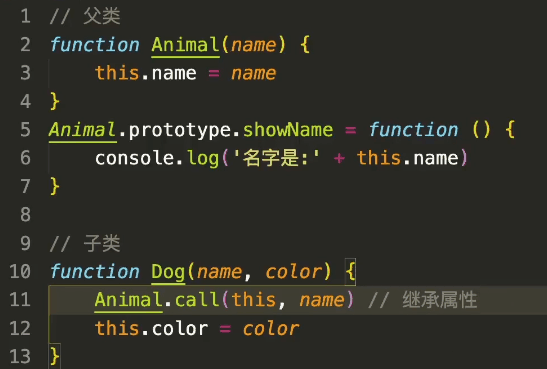

call（）的参数

1. 要把this指向谁，就把谁传递进去（当前想把dog的this指向animal，就把dog的this传进去
2. 指向当前方法里的一个个属性

**组合式继承（常用）**


##  3-3 ES6中的类与继承


**class**

ES6定义类的一个语法糖

```js
class People{
  constructor(name,age){
    this.name = name;
    this.age = age;
  }
  showName(){
    console.log(this.name);
  }
}

let p1 = new People('sxc',19);
console.log(p1);
```

**extends**

```js
let p1 = new People('sxc',19);
console.log(p1);

class Coder extends People{
  constructor(name,age,company){
    super(name,age);
    this.company = company;
  }
  showCompany(){
    console.log(this.company);
  }
}

let c1 = new Coder('zhangsan',25,'imooc');
console.log(c1);
c1.showName();
c1.showCompany();
```

**constructor**

构造函数

**static**

定义静态属性和静态方法

```js
class People{
  constructor(name,age){
    this.name = name;
    this.age = age;
    this._sex = -1;//防止死循环，再定义一个属性
  }
  showName(){
    console.log(this.name);
  }
  //class内部只能定义静态方法
  static getCount(){
    return 5;
  }
}

//静态属性
People.count = 9;
console.log(typeof(People));//function 本质仍是es5
console.log(People.getCount());

class Coder extends People{
  constructor(name,age,company){
    super(name,age);
    this.company = company;
  }
  showCompany(){
    console.log(this.company);
  }
}

console.log(Coder.getCount());
```

**super**

调用父类的构造函数

**get/set**

定义最顶层属性，当获取属性和设置属性有点业务逻辑操作，就可以使用get/sex设置顶层属性

```js
class People{
  constructor(name,age){
    this.name = name;
    this.age = age;
    this._sex = -1;//防止死循环，再定义一个属性
  }
  get sex(){
    if(this._sex === 1){
      return 'male'
    }else if(this._sex === 0){
      return 'female';
    }else{
      return 'error';
    }
  }
  set sex(val){ //1:male 0:female
    if(val === 0 || val ===1){
      this._sex = val;
    }
  }
  showName(){
    console.log(this.name);
  }
}

let p1 = new People('sxc',19);
console.log(p1);
p1.sex = 1;
console.log(p1.sex);
```

##  3-4 新的原始数据类型Symbol


**一种新的原始数据类型**

> ES5的原始数据类型:undefined boolean null string number Object(方法数组都属于对象)
>
> ES6新增Symbol

```js
// //symbol声明1
// let s1 = Symbol();
// let s2 = Symbol();
// console.log(s1);//Symbol()
// console.log(s2);//Symbol()
// console.log(s1===s2);//false

// //symbol声明2
// let s1 = Symbol('foo');
// let s2 = Symbol('bar');
// console.log(s1);//Symbol(foo)
// console.log(s2);//Symbol(bar)

//3
const obj = {
  name:'imooc'
}
let s = Symbol(obj);
console.log(s);//Symbol([object Object])
console.log(s.desciption);
```

注意：

**Symbol.for**

通过Symbol.for就登记到了全局

```js
//symbol声明1
let s1 = Symbol.for('foo');
let s2 = Symbol.for('foo');
console.log(s1===s2);//true
```

**Symbol.keyfor()**

返回一个全局已登记的symbol类型的key

```js
let s1 = Symbol('foo');
console.log(Symbol.keyFor(s1));//undefined
let s2 = Symbol.for('foo');
console.log(Symbol.keyFor(s2));//foo 
```

**Symbol应用场景**

**一 把Symbol作为对象的key以保证当前key并不冲突**


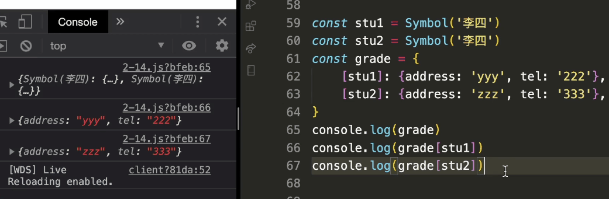

**二 对symbol属性的读取**

作为不可读取的私有属性

```js
const sym = Symbol('imooc')
class User {
  constructor(name){
    this.name = name;
    this[sym] = 'imooc.com';
  }
  getName(){
    return this.name + this[sym]
  }
}

const user = new User('sxc');

// //遍历除了symbol的属性
// for(let key in user){
//   console.log(key);//name
// }
// for(let key of Object.keys(user)){
//   console.log(key);//name
// }
// //只能取到symbol
// for(let key of Object.getOwnPropertySymbols(user)){
//   console.log(key);Symbol(imooc)
// }
//同时取到普通属性和symbol属性
for(let key of Reflect.ownKeys(user)){
  console.log(key);//name Symbol(imooc)
}
```

**三 消除魔术字符串**

多次出现的，每次敲容易敲错的，容易与代码实现耦和的


**修改版本1：**


```js
console.log(getArea(shapeType.triangle))
```

**修改版本2**

在这个例子中并不关心属性的值是什么，可以直接使用symbol


##  3-5 新的数据结构Set

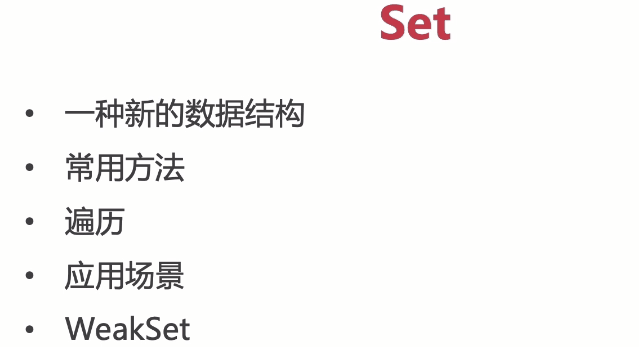

**set数据结构**

set里面的成员值都是唯一的

```js
let s = new Set([1,2,3,2]);
console.log(s);//Set(3) {1, 2, 3}
```

**常用方法**

* add添加 
* delete删除 
* clear清空 
* has是否包含某值
* size 输出大小

```js
let s = new Set([1,2,3,2]);
s.add('es');
//s.delete(2);
// s.clear();
console.log(s.has('imooc'));
console.log(s.size);
console.log(s);

```

**遍历**

```js
let s = new Set([1,2,3,2]);
s.add('es');

//遍历
s.forEach(item =>{
  console.log(item);
});

for( let item of s){
  console.log(item);
}

for( let item of s.keys()){
  console.log(item);
}
for( let item of s.values()){
  console.log(item);
}
for( let item of s.entries()){
  console.log(item[0],item[1]);//set也有key-value 只是key和value都一样
}
```

**应用场景**

1. 数组去重

   ```js
   let arr = [1,2,3,4,2,3];
   let s = new Set(arr);
   console.log(s);
   ```

2. 合并去重

   ```js
   let arr1 = [1,2,3,4];
   let arr2 = [2,3,4,5,6];
   let s = new Set([...arr2,...arr2]);
   console.log(s);//Set(5) {2, 3, 4, 5, 6}
   console.log([...s]);// [2, 3, 4, 5, 6]
   console.log(Array.from(s));//[2, 3, 4, 5, 6]
   ```

3. 求数组交集

   ```js
   let arr1 = [1,2,3,4];
   let arr2 = [2,3,4,5,6];
   let s1 = new Set(arr1);
   let s2 = new Set(arr2);
   let result = new Set(arr1.filter(item => s2.has(item)));
   console.log(Array.from(result));//[2,3,4]
   ```

4. 求数组差集

   ```js
   let arr1 = [1,2,3,4];
   let arr2 = [2,3,4,5,6];
   let s1 = new Set(arr1);
   let s2 = new Set(arr2);
   let arr3 = new Set(arr1.filter(item => !s2.has(item)));
   let arr4 = new Set(arr2.filter(item => !s1.has(item)));
   console.log(Array.from([...arr3,...arr4]));//[1,5,6]
   ```

**WeakSet**

只能存储对象！

add添加对象，delete删除对象，has判断对象是否存在


**weakSet不可以遍历！！**

weakset里的对象都是弱引用，**垃圾回收机制不考虑weakset的引用**

##  3-7 新的数据结构Map

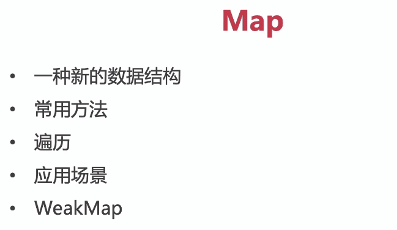

**Map数据结构**

**常用方法**

set设置key-value键值对，get(key)获得对应的value值，delete删除，has(key)判断是否有值

```js
let m = new Map();
let obj = {
  name:'imooc'
}
m.set(obj,'es')
console.log(m);
console.log(m.get(obj));
m.delete(obj);
console.log(m.has(obj));//false
```

map里传入数组


**遍历**

```js
let map  = new Map([
  ['name','imooc'],
  ['age',5]
])
console.log(map);
//遍历
map.forEach((value,key) => console.log(value,key));

for(let [key,value] of map){
  console.log(key,value);
};

for(let key of map.keys()){
  console.log(key);
};

for(let value of map.values()){
  console.log(value);
};

for(let [key,value] of map.entries()){
  console.log(key,value);
};
```

**应用场景**

使用Object的地方都可以考虑使用map


**WeakMap**

weakmap的键名只支持引用数据类型

```js
let wm = new WeakMap();
wm.set([1],2);
console.log(wm);
```

不支持clear，遍历，size方法

弱引用，不计入垃圾回收机制

##  3-8 字符串的扩展

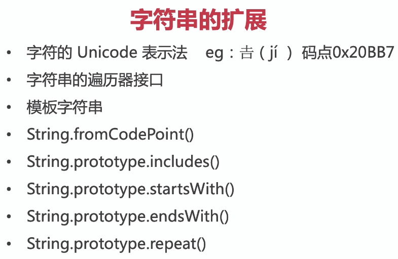

**Unicode**

```
\uxxxx
```

**字符串的遍历器接口**

使用for-of可以遍历字符串

```js
for(let item of 'imooc'){
  console.log(item);
}
```

**模板字符串**

例子

1. 可以换行


2. 表达式

```js
const a = 20;
const b =5;
const str = `我的年龄是:${a+b}`//${}里面的值是变量表达式
console.log(str);//我的年龄是:25
```

3. 嵌套模板

```js
//嵌套模板
const isLargeScreen = ()=>{
  return true;
}
let class1 = 'icon';
class1 += isLargeScreen() ? ' icon-big':' icon-small';
console.log(class1);

let class2 = `icon icon-${isLargeScreen()?'big':'small'}`;
console.log(class2);

//输出icon icon-big
```

4. 带标签的模板字符串

```js
//带标签的模板字符串
const foo = (a,b,c,d) =>{
  console.log(a);
  console.log(b);
  console.log(c);
  console.log(d);
}

const name = 'sxc';
const age = 18;
foo`这是${name},它的年龄是${age}`


```

raw是原始字符串


**一些新方法**

```js
console.log(String.fromCodePoint(0x20BB7));

const str = 'imooc';
console.log(str.includes('mooc'));//true
console.log(str.startsWith('im'));//true

const newStr = str.repeat(10);
console.log(newStr);//imoocimoocimoocimoocimoocimoocimoocimoocimoocimooc

```

##  3-10 正则表达式的扩展


##  3-11 数值的扩展


**二进制 0B 八进制0O**

```js
// //ES5
// //十进制 -> 二进制
// const a = 5;
// console.log(a.toString(2));//101

// //二进制 -> 十进制
// const b = 101;
// console.log(parseInt(b,2));//5

//ES6
const a= 0B101;
console.log(a);//5

const b = 0O777;
console.log(b);//511
```

**Number的方法**

....

**0.1+0.2 === 0.3?**

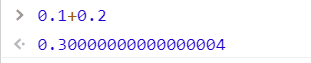

IEEE754 双精度标准存储

超出存储范围的后面的位会被舍掉


在ES中，整数的最大值是`Math.pow(2,53)`,最小值是负的这个值

```js
const max = Math.pow(2,53);
console.log(max);//9007199254740992

console.log(Number.MAX_SAFE_INTEGER === max-1);//true
console.log(Number.MIN_SAFE_INTEGER);
```

**Math新增方法**


Math.sign(判断是整数还是负数还是零)

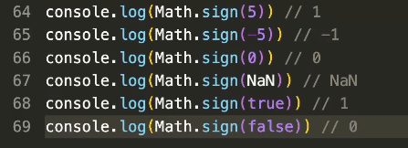

Math.cdrt计算一个数的立方根

##  3-12 代理Proxy


ES5的代理方式

```js
//ES5
let obj = {}
let newVal = '';
Object.defineProperty(obj,'name',{
  get(){
    return newVal;
  },
  set(val){
    console.log('set');
    newVal = val;
  }
})
obj.name = 'es';
console.log(obj.name);
```

ES6的代理方式

这是一个没有设置钩子函数的例子

```js
//proxy
let obj = {}
let p = new Proxy(obj,{})
p.name = 'imooc';
console.log(obj.name);
for(let key in obj){
  console.log(key);
}
```

**get钩子函数的使用**

对于数组的代理例子:

```js
//增加拦截钩子
//get
let arr = [7,8,9];
arr = new Proxy(arr,{
  get(target,prop){
    //console.log(target,prop);
    return prop in target ? target[prop] : 'error';
  }
})
console.log(arr[10]);
```

对于对象的代理例子：返回在字典中对应的值

```js
//字典
let dict = {
  'hello':'你好',
  'world':'世界'
}
dict = new Proxy(dict,{
  get(target,prop){
    return prop in target ? target[prop] : prop;
  }
})
console.log(dict['world']);//世界
console.log(dict['mooc']);//mooc
```

**set钩子函数的使用**

set后面参数，target当前代理对象，prop当前目标属性的值，value要给目标属性设置的值

```js
//set
//只能在数组中添加number类型的值用代理怎么做？
let arr = [];
arr = new Proxy(arr,{
  set(target,prop,val){
    if(typeof val === 'number'){
      target[prop] = val;
      return true;
    }else{
      return false;
    }
  }
})
arr.push(5);
arr.push(6);
console.log(arr[0],arr[1]);//5 6 
```

**has钩子函数**

判断当前key是否在对象里面，返回的是布尔值

```js
//has
//传入的值是否在当前范围内
let range = {
  start:1,
  end:5
}

range = new Proxy(range,{
  has(target,prop){
    return prop >= target.start && prop <= target.end;
  }
})
console.log(2 in range);
```

**ownkeys**

在对象的循环遍历时进行拦截

```js
//ownLeys
let obj = {
  name:'imooc',
  [Symbol('es')]:'es6'
}

//返回不是symbol的键名
console.log(Object.getOwnPropertyNames(obj));//["name"]
//返回symbol
console.log(Object.getOwnPropertySymbols(obj));//symbol(es)

console.log(Object.keys(obj));//["name"]
for(let key in obj){
  console.log(key);///name
}
```

```js
//遍历时不想遍历到带下划线的私有属性
//根据拦截规则，返回复合条件的对象属性
let userinfo = {
  username: 'sxc',
  age:18,
  _password:'***'
}

userinfo = new Proxy(userinfo,{
  ownKeys(target){
    return Object.keys(target).filter(key => !key.startsWith('_'))
  }
})

for(let key in userinfo){
  console.log(key);
}
console.log(Object.keys(userinfo));
//输出username和age

```

### 综合例子

当前一个对象user具有多个属性，用proxy防止对带下划线的属性的获取/设置/删除/循环遍历等任何操作

```js
let user = {
  username: 'sxc',
  age:18,
  _password:'***'
}

user = new Proxy(user,{
  //get获取的拦截
  get(target,prop){
    if(prop.startsWith('_')){
      throw new Error('不可访问')
    }else{
      return target[prop]
    }
  },
  //set
  set(target,prop,val){
    if(prop.startsWith('_')){
      throw new Error('不可设置值')
    }else{
      target[prop]= val;
      return true;
    }
  },
  //删除拦截
  deleteProperty(target,prop){
    if(prop.startsWith('_')){
      throw new Error('不可删除')
    }else{
      delete target[prop];
      return true;
    }
  },
  //遍历拦截
  ownKeys(target){
    return Object.keys(target).filter(key => !key.startsWith('_'))
  }
})

//测试

//测试get
//console.log(user.age);//18
// console.log(user._password);//error

//测试set拦截
// user.age = 18;
// console.log(user.age);//18
// try{
//   user._password = 'new pass';
// }catch(e){
//   console.log(e.message);//不可设置
// }

//测试delete拦截
// try{
//   delete user._password;
// }catch(e){
//   console.log(e.message);//不可删除
// }

//测试遍历拦截
// for(let key in user){
//   console.log(key);//username age
// }
```

**apply拦截**

用于拦截函数调用以及call和apply的操作，注意其代理的是一个函数

apply target拦截对象 ctx上下文 args 函数的参数数组

```js
//apply
let sum = (...args) => {
  let num =0;
  args.forEach(item =>{
    num += item;
  })
  return num;
}

sum = new Proxy(sum,{
  apply(target,ctx,args){
    return target(...args)*2
  }
})
console.log(sum(1,2));//6
console.log(sum.call(null,1,2,3));//12
console.log(sum.apply(null,[1,2,3]));//12
```

**constructor**

```js
//construct 
//拦截new命令
let User = class{
  constructor(name){
    this.name = name;
  }
}
User = new Proxy(User,{
  construct(target,args,newTarget){
    console.log('construct');
    return new target(...args)
  }
})
console.log(new User('imooc'));

//打印出：
//construct
//User {name: "imooc"}
```


##  3-14 反射Reflect


# 第4章 ECMAScript2015（ES6）之异步编程与模块化

本章详细介绍ES6中异步编程解决方案：Promise与Generator，异步编程是ES中的重点与难点，通过对异步编程必备知识的讲解使大家了解异步编程的关键点与新语法的优势。并且本章还讲解了迭代器Iterator与模块化Module，通过案例使大家了解如何使不可迭代的数据结构也可以通过for...of迭代出来，通过模块化学习可以使我们代码更...

## 4-1 异步操作必备知识


**JS是单线程**

同一时间只能处理一个任务

**同步任务与异步任务**

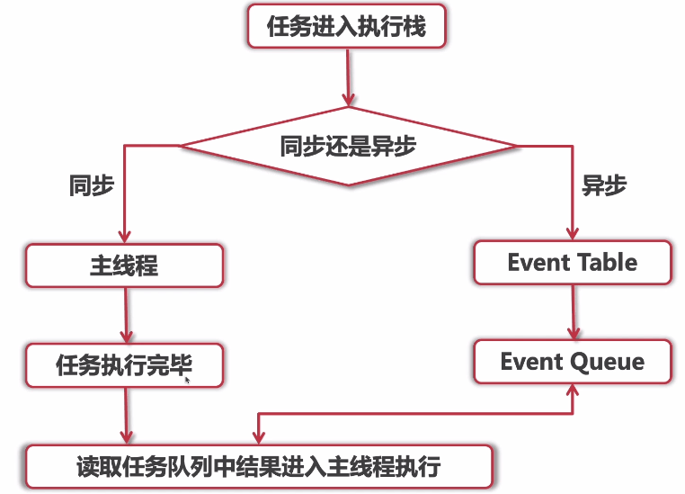

setTimeout是一个异步任务，setTimeout后面的方法就叫做回调函数。

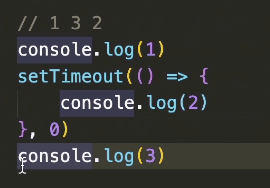

##  4-2 Ajax原理与Callback Hell

**Ajax**

Asynchronous JavaScript and XML（即**异步的JavaScript和XML**），一种在**无需重新加载整个网页的情况下，能够更新部分网页**的技术

**Ajax原理**

1. 创建`XMLHttpRequest`对象
2. 创建一个新的HTTP请求，并使用send发送请求
3. 服务端响应，获取返回的数据

封装代码：

```js
//Ajax原理
function ajax(url,callback) {
  //1.创建XMLHttpRequest
  var xmlhttp;
  if (window.XMLHttpRequest) {
    xmlhttp = new XMLHttpRequest();
  } else {
    xmlhttp = new ActiveXObject('Microsoft.XMLHTTP');
  }
  //2.发送请求
  xmlhttp.open('GET', url, true);
  xmlhttp.send();
  //3.服务端响应
  xmlhttp.onreadystatechange = function () {
    if (xmlhttp.readyState === 4 && xmlhttp.status === 200) {
      var obj = JSON.parse(xmlhttp.responseText);
      callback(obj);
    }
  }
}

var url = 'http://musicapi.xiecheng.live/personalized';//测试ip
ajax(url,res =>{
  console.log(res);
});

```

**callback hell**

回调深渊，回调地狱

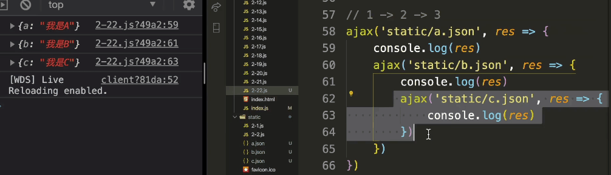

应用场景：例如省市县三级联动

这种越写越深的代码解构，叫回调地狱，耦合性强，代码可读性和维护性变差。

ES6中有哪些更好的方式对当前的异步请求进行管理呢？使用Promise

##  4-3 异步编程解决方案Promise

### 4.3.1 Promise

可以解决回调地狱的问题，如何使用promise让异步操作变得更加优雅

resolve决定，解决；表示异步操作执行成功的回调函数

reject拒绝，失败；表示异步操作执行失败的回调函数

基本用法：

```js
//对异步状态进行状态管理
let p = new Promise((resolve,reject)=>{
  setTimeout(()=>{
    console.log("mooc")
  },1000)
}).then( res =>{
  console.log(res);
},error =>{
  console.log(error);
})
```

一个例子：


### 4.3.2 Promise的基本用法

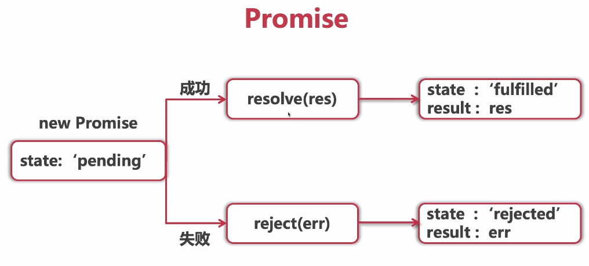

Promise有三种状态，pending,resolve,reject

示例：


**Promise的状态是不可逆的**，状态一旦确定下来，就再也不会改变。

看例子：

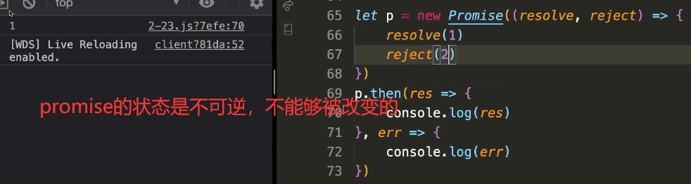


### 4.3.3 用primose改造ajax操作的回调深渊问题

改造以下这个例子：


**版本1**

```js
new Promise((resolve,reject) => {
  ajax('static/a.json',res=>{
    console.log(res);
    resolve()
  })
}).then(res =>{
  console.log('a成功');
  return new Promise((resolve,reject)=>{
    ajax('static/b.json',res=>{
      console.log(res);
      resolve()
    })
  })
}).then(res => {
  console.log('b成功');
  return new Promise((resolve,reject)=>{
    ajax('static/c.json',res=>{
      console.log(res);
      resolve()
    })
  }).then(res => {
  console.log('c成功');
  });
});
```

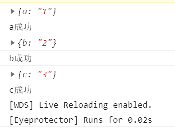

**坂本2**

```js
function getPromise(url){
  return new Promise((resolve,reject) => {
    ajax(url,res => {
      resolve(res)
    })
  })
}

getPromise('static/a.json')
  .then(res=>{
    console.log(res);
    return getPromise('static/b.json')
  }).then(res =>{
    console.log(res);
    return getPromise('static/c.json')
  }).then(res=>{
    console.log(res);
  })
```


**版本3**

增加对于失败情况的处理

```js
//Ajax原理
function ajax(url,successCallback,failCallback) {
  //1.创建XMLHttpRequest
  var xmlhttp;
  if (window.XMLHttpRequest) {
    xmlhttp = new XMLHttpRequest();
  } else {
    xmlhttp = new ActiveXObject('Microsoft.XMLHTTP');
  }
  //2.发送请求
  xmlhttp.open('GET', url, true);
  xmlhttp.send();
  //3.服务端响应
  xmlhttp.onreadystatechange = function () {
    if (xmlhttp.readyState === 4 && xmlhttp.status === 200) {
      var obj = JSON.parse(xmlhttp.responseText);
      successCallback && successCallback(obj);
    }else if(xmlhttp.readyState === 4 && xmlhttp.status === 404){
      failCallback && failCallback(xmlhttp.statusText);
    }
  }
}

function getPromise(url){
  return new Promise((resolve,reject) => {
    ajax(url,res => {
      resolve(res)
    },err =>{
      reject(err)
    })
  })
}

getPromise('static/aa.json')
  .then(res=>{
    console.log(res);
    return getPromise('static/b.json')
  }).then(res =>{
    console.log(res);
    return getPromise('static/c.json')
  }).then(res=>{
    console.log(res);
  }).catch(err =>{
    console.log(err);//有一个请求失败就会进入到catch
  })
```

##  4-4 Promise的静态方法


```js
//成功的状态
let p1 = Promise.resolve('success');
console.log(p1);
p1.then(res =>{
  console.log(res);
})

//失败的状态
let p2 = Promise.reject('fail');
console.log(p2);
p2.catch(err =>{
  console.log(err);
})
```


再讲一个实际应用场景：

有的时候，我们没有promise实例却又想要使用then和reject/catch的时候可以使用promise的实例方法，Promise.resolve表示一个成功的状态，Promise.reject表示一个失败的状态

```js
//一些操作成功返回promise，失败返回了一个字符串
function foo(flag){
  if(flag){
    return new Promise(resolve =>{
      //一些异步操作
      //...
      resolve('success')
    })
  }else{
    return Promise.reject('fail')
  }
}

foo(false).then(res =>{
  console.log(res);
},err =>{
  console.log(err);
})
```

一个例子：

希望现有的这三个promise异步操作都执行完之后再进行一些操作。

```js

let p1 = new Promise((resolve,reject)=>{
  setTimeout(()=>{
    console.log(1);
    resolve('1成功');
  },1000)
})

let p2 = new Promise((resolve,reject)=>{
  setTimeout(()=>{
    console.log(2);
    resolve('2成功');
  },2000)
})

let p3 = new Promise((resolve,reject)=>{
  setTimeout(()=>{
    console.log(3);
    resolve('3成功');
  },3000)
})

Promise.all([p1,p2,p3]).then(res =>{
  console.log(res);
})

```

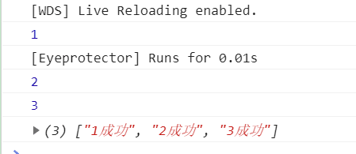

race只要有一个完成就认为完成，all是所有完成才认为完成

```js
Promise.race([p1,p2,p3]).then(res =>{
  console.log(res);
})
```


**一个Promise.all的应用场景**：

上传多个图片

```js
//上传多个图片
const imgArr = ['1.jpg','2.jpg','3.jpg']
let promiseArr = [];
imgArr.forEach(item =>{
  promiseArr.push(new Promise((resolve,reject)=>{
    //某一张图片上传的操作
    //...
    //上传操作完成
    resolve();
  }));
})
Promise.all(promiseArr).then(res =>{
  //插入数据库的操作
  console.log('图片全部上传完成');
})
```

**一个Promise.race的应用场景**：

2s内图片加载成功就显示图片，没有加载成功就提示超时

```js
function getImg(){
  return new Promise((resolve,reject) => {
    let img = new Image();
    img.onload = function(){
      resolve('图片请求成功显示');
    }
    //img.src = 'http://www.xxx.com/xx.jpg';
    img.src ='https://timgsa.baidu.com/timg?image&quality=80&size=b9999_10000&sec=1604576045847&di=c8ef90e438824867b469ae1956974ca5&imgtype=0&src=http%3A%2F%2Fattach.bbs.miui.com%2Fforum%2F201310%2F19%2F235356fyjkkugokokczyo0.jpg';
  })
}

function timeout(){
  return new Promise((resolve,reject) => {
    setTimeout(()=>{
      reject('图片请求超时');
    },2000)
  })
}

Promise.race([getImg(),timeout()]).then(res =>{
  console.log(res);
}).catch(err =>{
  console.log(err);
})
```

当图片请求成功时打印"图片请求成功显示"

当定时器到时时打印”图片请求超时“

##  4-4 异步编程解决方案Generator

普通函数一旦执行，在执行结束之前就不会执行其他的js代码，Generator函数可以在函数执行的过程中暂停，又可以从暂停的地方继续执行。

普通函数

```js
function foo(){
  for(let i =0;i<3;i++){
    console.log(i);
  }
}
foo();//0 1 2 
```

Generator函数

```js
function* foo(){
  for(let i=0;i<3;i++){
    console.log(i);
    yield i;
  }
}

//console.log(foo());
let f = foo();
console.log(f.next());
console.log(f.next());
console.log(f.next());
console.log(f.next());  
```


一个复杂例子：


一个小例子：717游戏

```js
function* count(x=1){
  while(true){
    if(x%7 === 0){
      yield x
    }
    x++;
  }
}

let n = count();
console.log(n.next().value);//7
console.log(n.next().value);//14
```

### 利用Genarator对异步的状态进行管理

```js

//Ajax原理
function ajax(url,callback) {
  //1.创建XMLHttpRequest
  var xmlhttp;
  if (window.XMLHttpRequest) {
    xmlhttp = new XMLHttpRequest();
  } else {
    xmlhttp = new ActiveXObject('Microsoft.XMLHTTP');
  }
  //2.发送请求
  xmlhttp.open('GET', url, true);
  xmlhttp.send();
  //3.服务端响应
  xmlhttp.onreadystatechange = function () {
    if (xmlhttp.readyState === 4 && xmlhttp.status === 200) {
      var obj = JSON.parse(xmlhttp.responseText);
      callback(obj);
    }
  }
}

function request(url){
  ajax(url,res =>{
    getData.next(res);
  })
}

function* gen(){
  let res1 = yield request('static/a.json')
  console.log(res1);
  let res2 = yield request('static/b.json');
  console.log(res2);
  let res3 = yield request('static/c.json');
  console.log(res3);
}
let getData = gen();
getData.next()
```


##  4-5 迭代器Iterator


**例子1：一个遍历器生成函数**

```js
function makeIterator(arr){
  let nextIndex = 0;
  return {
    next(){
      return nextIndex < arr.length ? {
        value:arr[nextIndex++],
        done:false
      }:{
        value:undefined,
        done:true
      }
    }
  }
}

let it = makeIterator(['a','b','c']);
console.log(it.next());
console.log(it.next());
console.log(it.next());


```


**例子2 遍历不可遍历的结构**

先来看可以迭代的结构

都有一个`Symbol.iterator`属性，它是个方法

```js
let arr = ['a','b','c'];
console.log(arr);
```

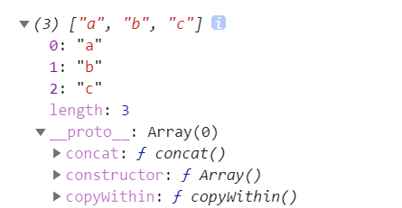

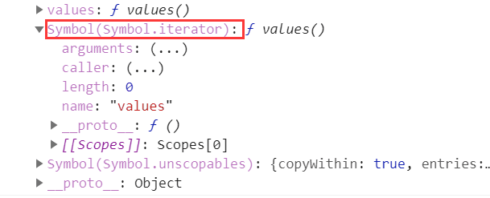

```js
let arr = ['a','b','c'];
let it = arr[Symbol.iterator]();
console.log(it.next());
console.log(it.next());
console.log(it.next());
console.log(it.next());
```


如何让结构变成可迭代的？

```js
//让其变成一个可遍历的机构
let courses = {
  allCourse:{
    frontend:['ES','小程序','Vue','React'],
    backend:['Java','Python','SpringBoot'],
    webapp:['Android','IOS']
  }
}

//1.可迭代协议 
//当前对象是否有Symbol.iterator协议
//2.迭代器协议
//当前的迭代器格式：return {next(){return value,done}}
courses[Symbol.iterator] = function(){
  let allCourse = this.allCourse;
  let keys = Reflect.ownKeys(allCourse);
  let values = [];
  return{
    next(){
      if(!values.length){
        if(keys.length){
          values = allCourse[keys[0]];
          keys.shift()
        }
      }
      return {
        done:!values.length,
        value:values.shift()
      }
    }
  }
}

for(let c of courses){
  console.log(c);
}
```


用这种方法可以把一个数据定义成可迭代的，不同的模块使用该结构会很方便 

**也可以使用generator使其可遍历**

```js
//让其变成一个可遍历的机构
let courses = {
  allCourse:{
    frontend:['ES','小程序','Vue','React'],
    backend:['Java','Python','SpringBoot'],
    webapp:['Android','IOS']
  }
}

//generator
courses[Symbol.iterator] = function* (){
  let allCourse = this.allCourse;
  let keys = Reflect.ownKeys(allCourse);
  let values = [];
  while(1){
    if(!values.length){
      if(keys.length){
        values = allCourse[keys[0]]
        keys.shift();
        yield values.shift()
      }else{
        return false
      }
    }else{
      yield values.shift()
    }
  }
}

for(let c of courses){
  console.log(c);
}
```

##  4-6 模块化Module


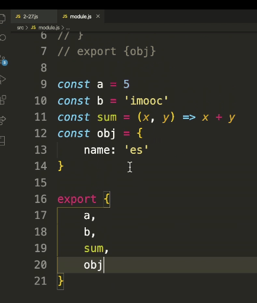

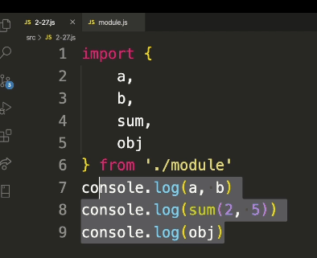

```js
import{
	a as aa,//起一个别名
}
```

导出

```js
export default{

}
import的名字可以随便取
```

# ------------------------------------------------

> 后面是ES7-11解释+应用
>
> 写于2020.10.31

##### 第5章 ECMAScript2016（ES7）之数组&数值拓展

ES7相当于ES6.1版，相较ES6新增了数组实例的includes方法和幂运算符。

-  5-1 数组扩展：Array.prototype.includes()
-  5-2 数值扩展：幂运算符


##### 第6章 ECMAScript2017（ES8）之异步编程&对象拓展

ES8扩展了更加优雅的异步编程解决方案，同时在Object、String等方面做了进一步的功能补充，让代码编写更加优雅。

-  6-1 异步编程解决方案Async Await
-  6-2 对象扩展：Object.values()，Object.entries()
-  6-3 对象属性描述：Object.getOwnPropertyDescriptors()
-  6-4 字符串扩展：String.prototype.padStart()，String.prototype.padEnd()
-  6-5 尾逗号Trailing commas


##### 第7章 ECMAScript2018（ES9）之异步迭代&对象操作升级

ES9为异步迭代提供了更好的解决方案，同时对正则表达式、Object、String进行了功能扩展，并且更加丰富了Promise对象的方法。

-  7-1 异步迭代：for await of
-  7-2 正则表达式扩展：dotAll，具名组匹配，后行断言
-  7-3 对象扩展：Rest & Spread
-  7-4 Promise扩展：Promise.prototype.finally()
-  7-5 字符串扩展：放松模板字符串文字限制


##### 第8章 ECMAScript2019（ES10）之效率再提升

ES10中对Object、String、Array进行了进一步的功能扩展，并且对原有一些能力进行了增强，让代码编写更加高效。

-  8-1 对象扩展：Object.fromEntries()
-  8-2 字符串扩展：String.prototype.trimStart() ，String.prototype.trimEnd()-
-  8-3 数组扩展：Array.prototype.flat()，Array.prototype.flatMap()
-  8-4 修订Function.prototype.toString()-
-  8-5 可选的Catch Binding
-  8-6 JSON扩展：JSON superset，JSON.stringify()增强能力
-  8-7 Symbol扩展：Symbol.prototype.description


##### 第9章 ECMAScript2020（ES11）之新特性初探

ES11正式版将在2020年6月份正式发布，本章中对已通过定案阶段的语法进行讲解。这个版本扩充了原型数据类型BigInt，并扩展了多个实用的新功能。

-  9-1 全局模式捕获：String.prototype.matchAll()
-  9-2 动态导入：Dynamic import()
-  9-3 新的原始数据类型：BigInt
-  9-4 Promise扩展：Promise.allSettled()
-  9-5 全局对象：globalThis
-  9-6 可选链：Optional chaining
-  9-7 空值合并运算符：Nullish coalescing Operator


##### 第10章 ES新特性在Vue实战中的应用

Vue是很多前端同学必用的框架，如何把原生语法在Vue项目里运用的活灵活现至关重要，在本章中，将带领大家通过Vue CLI构建Vue开发环境，并通过实际需求讲解ES新特性在实战项目中的应用，着重讲解异步操作的使用，学的懂，更要用的活，才是真正的掌握。...

-  10-1 初始化环境
-  10-2 获取用户信息列表
-  10-3 使用Proxy代理用户信息
-  10-4 图片上传逻辑与阿里云OSS使用
-  10-5 异步操作多张图片上传云存储
-  10-6 更加优雅的异步操作
-  10-7 组件按需加载


##### 第11章 Webpack构建环境

针对当前浏览器中无法全部兼容新语法的问题，我们需要通过构建的方式把代码转换成浏览器可兼容的代码，而Webpack的使用已经成为前端开发工程师的必备技能之一！本章将通过Webpack完成开发环境构建，最终帮助浏览器能够准确的识别ES的语法。 ...

-  11-1 Webpack核心概念
-  11-2 Webpack配置
-  11-3 Webpack配置优化
-  11-4 Babel配置


##### 第12章 课程回顾

本章对整体课程进行回顾与总结，并给出大家学习建议。

-  12-1 课程总结