# Fiddler工具使用

# 1.Fiddler介绍

## 1-1 Fiddler工作环境

Fiddler的功能

* 监控HTTP/HTTPS的流量
* 查看截获请求的内容
* 伪造请求，不仅可以伪造服务器返回的请求，也可以伪造请求发送给服务器
* 测试网站的性能
* 解密HTTPS的web会话

## 1-2 Fiddler工作原理

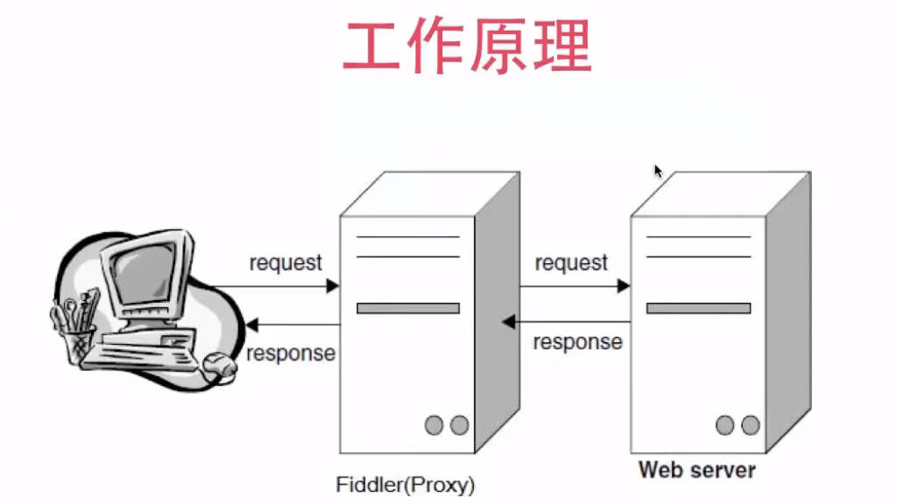

客户端和服务期间创建了一个代理服务器

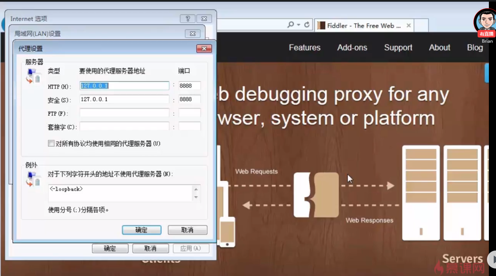

通过修改浏览器的代理服务器的地址，fiddler就可以截获浏览器发送的所有请求

当使用Fiddler时，有两种模式可以选择 

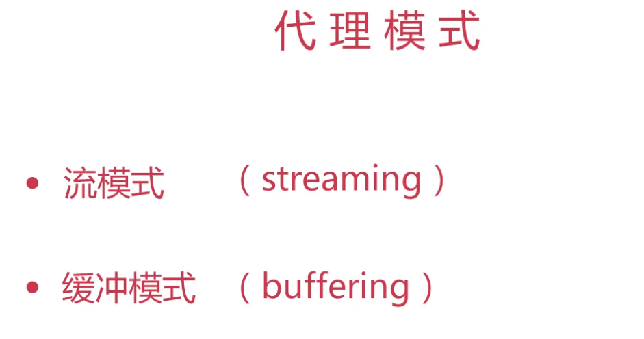

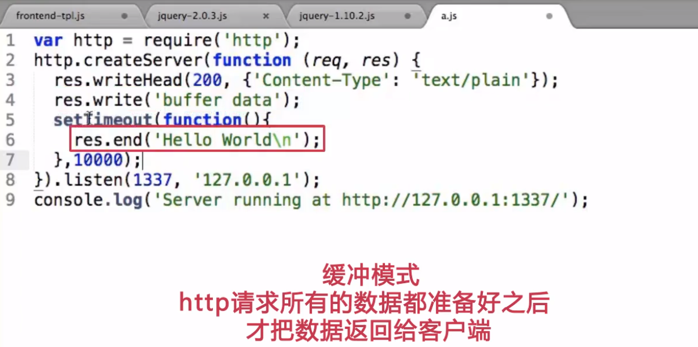

> **缓冲模式，可控制最后的服务器响应**

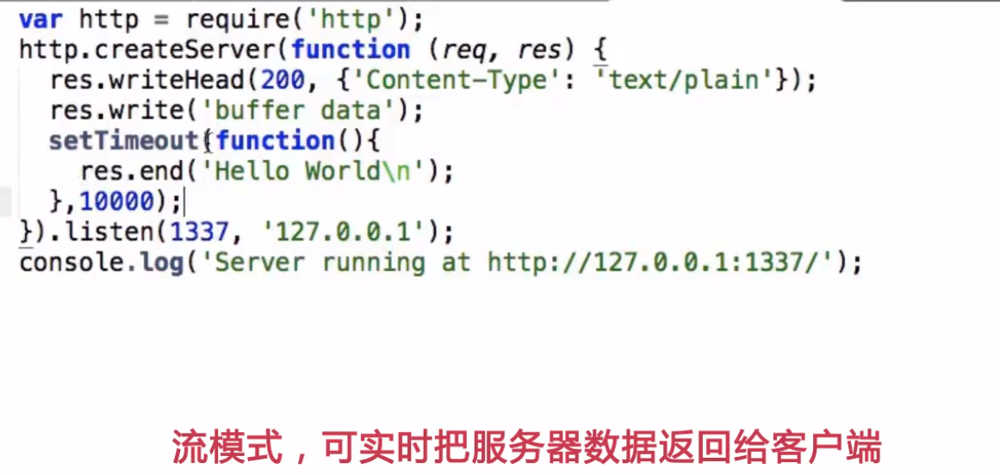

> **流模式，更接近于浏览器本身真实的行为**

## 1-3 Fiddler常见使用场景

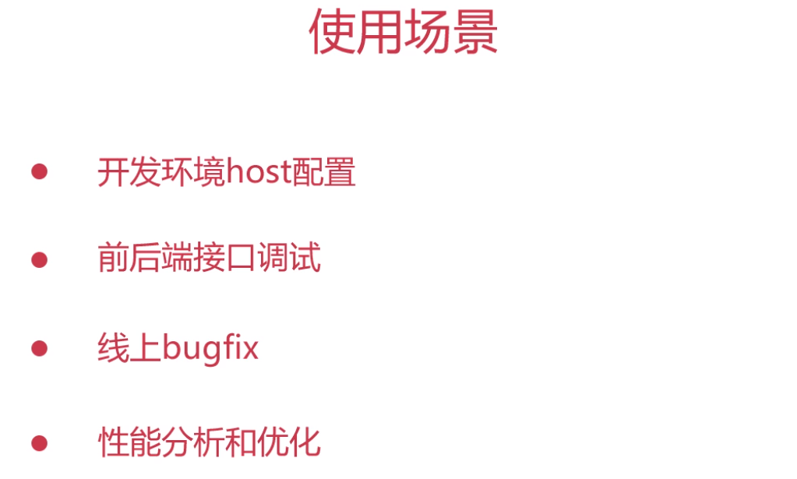

**开发环境host配置**

通常情况下，配置host需改系统文件很不方便；在多个开发环境下切换很低效。

Fiddler提供了相对高效的host配置方法。

**前后端接口调试**

通常情况下，调试前后端接口需要真实的环境，一大堆假数据，写Javascript代码。

Fiddler只需一个UI界面进行配置即可

**线上bugfix**

Fiddler可将发布文件代理到本地，快速定位线上bug

**性能分析和优化**

Fiddler会提供请求的实际图，清晰明了网站需优化的部分。

# 2. Fiddler界面操作介绍

## 2-1 Fiddler工具条常用功能

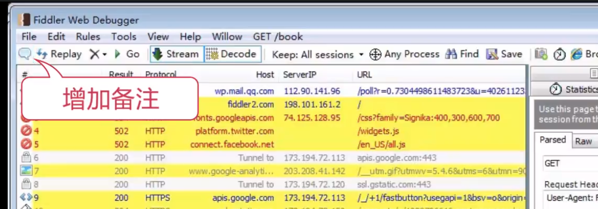

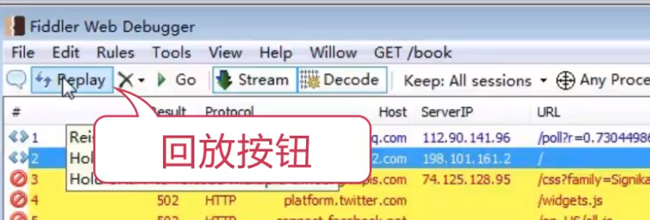

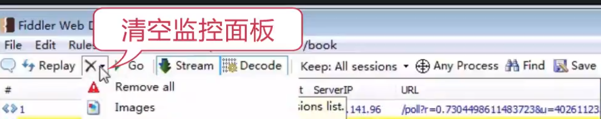

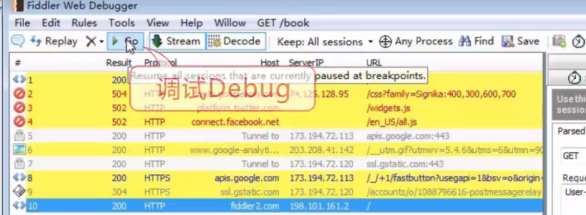

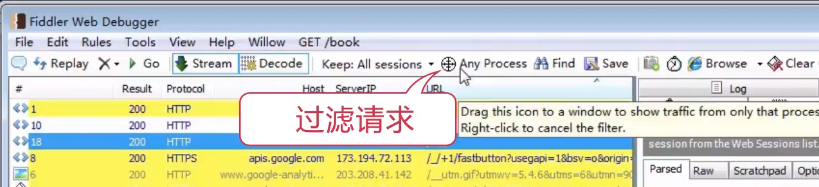

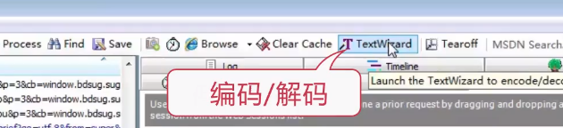

## 2-2 Fiddler状态栏操作

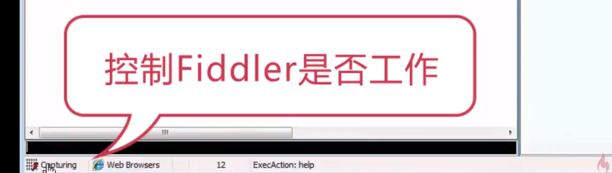

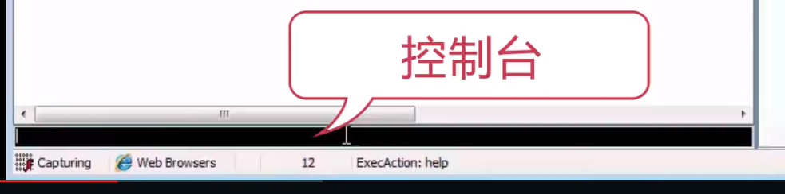

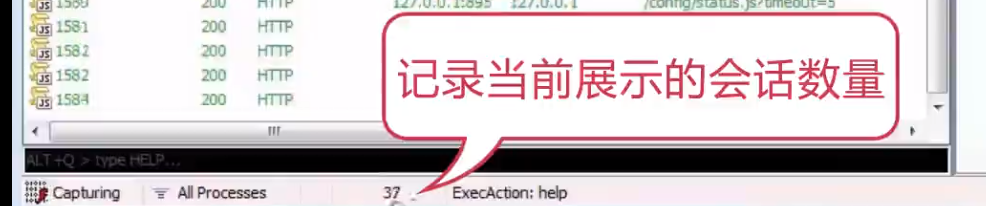

## 2-3 Fiddler监控面板的使用

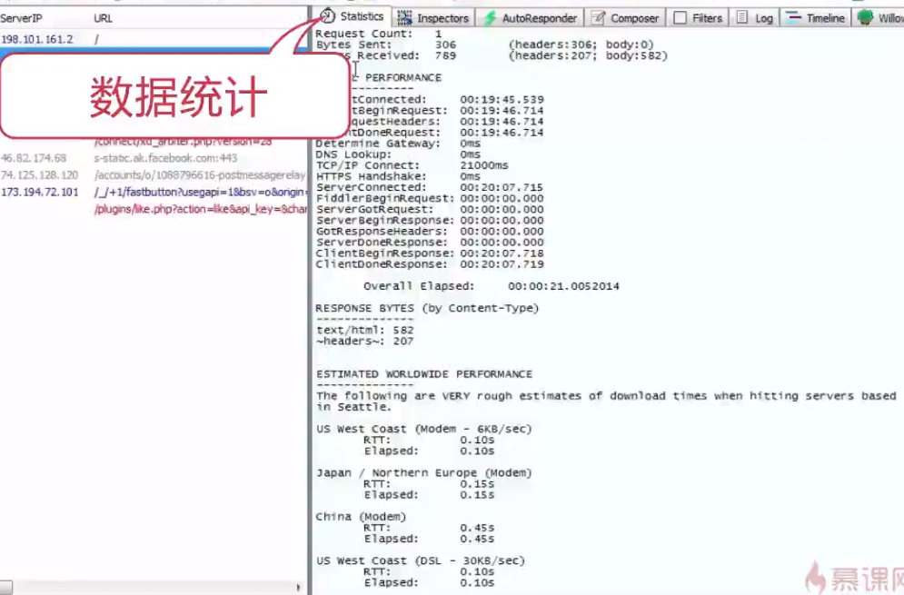

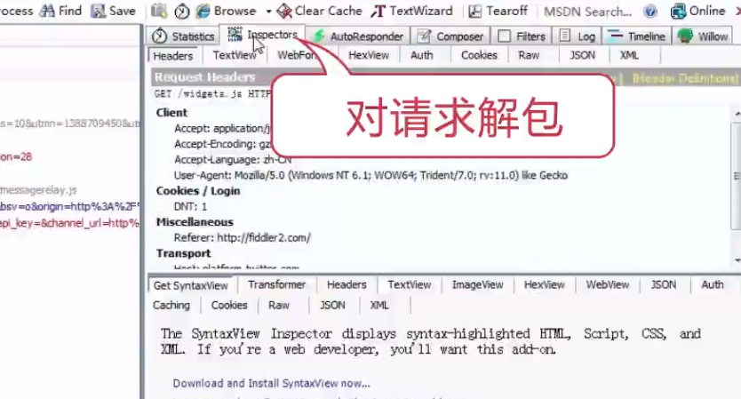

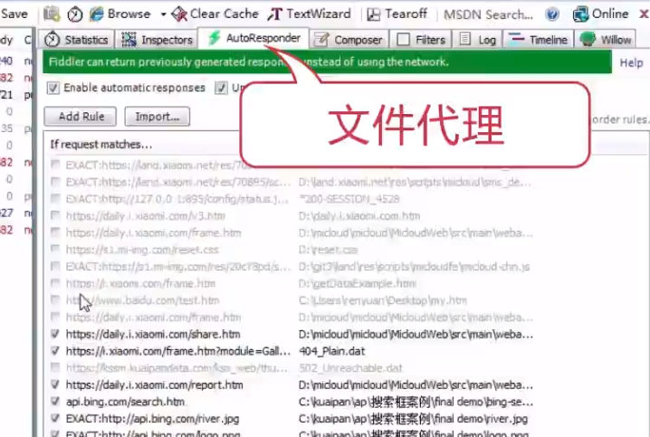

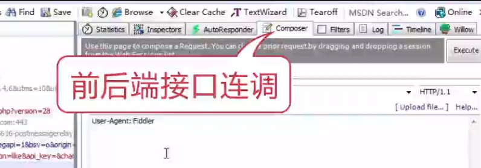

有点复杂，后续继续看