# HTTP协议、存储、Ajax

# ch1 前后端通信

**一些概念：**

前端：浏览器

客户端：只要能和服务端通信的就叫客户端

命令行工具：curl https:www.imooc.com


## **1.1 前后端的通信方式**

1. 使用浏览器访问网页

2. HTML的标签

   ```html
   //浏览器在解析HTML标签的时候，遇到一些特殊的标签，会再次向服务器发送请求
   link img script iframe
   ```

   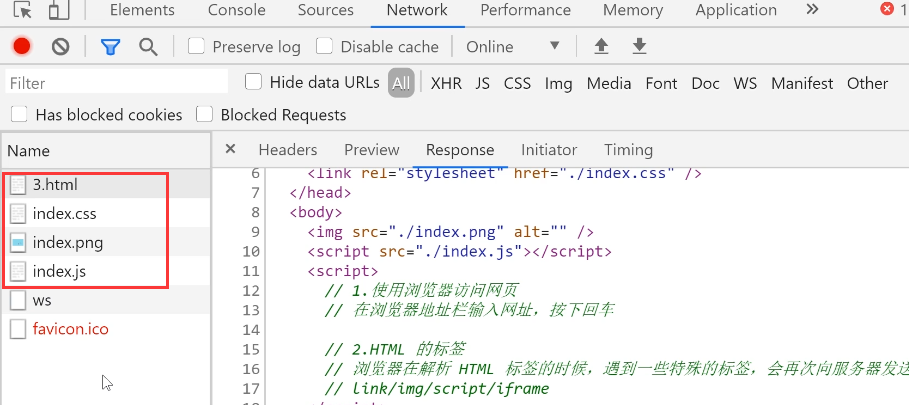

   后面两个：sw favicon.icon与vscode编译器有关，可以忽略。

   ```
   //还有一些标签，浏览器解析的时候，不会向服务器发送请求，但是用户可以使用他们向服务器发送请求
   a form
   ```

3. Ajax和Fetch

   

# ch2 HTTP

**一些概念：**

* HTML：超文本标记语言（超文本：原先一个个单一的文本，通过超链接将其联系起来。由原先的单一的文本变成了可无线延申、扩展的超级文本，立体文本）
* HTML，JS，css，图片，音频，视频等文件，都是通过HTTP在服务器和浏览器之间传输

## 2.1 HTTP报文：


请求：请求头（起始行+首部）+ 请求体

响应：响应头（起始行+首部）+ 响应体

GET请求：没有请求体，数据通过请求头写代

POST请求：有请求体，数据通过请求体携带

## **2.2 HTTP方法：**

1. 常用HTTP方法：GET POST PUT DELETE，用来定义对于资源采取什么样的操作，有各自的予以

2. RESTful接口设计：一种接口设计风格，充分利用HTTP方法的语义，例如：

   

   

## **2.3 GET & POST方法的对比**

* 语义：GET是获取数据，POST是创建数据
* 发送数据：
  * GET通过地址在请求头中携带数据，能携带的数据量和地址的长度有关系，一般最多就几k
  * POST既可以通过地址在请求头中携带数据，也可以通过请求体携带数据，能携带的数据量理论上是无限的
  * 携带少量数据，可以使用GET请求，大量的数据可以使用POST请求
* 缓存：
  * GET可以被缓存，POST不会被缓存
* 安全性：
  * GET和POST都不安全
  * 发送密码或其他敏感信息时不要使用GET，主要是避免被他人窥屏或通过历史记录找到你的密码

## **2.4 HTTP状态码**

* 100-199：代表请求已被接受，需要继续处理
  * websock中会用到
* 200~299：成功
* 300~399：重定向
  * 301：永久移动（会被缓存）
  * 302：临时移动（不被缓存）
  * 304：没有修改
* 400~499 请求错误
  * 404 not found
* 500~599 服务器错误
  * 500 Internal Server Error

# ch3 本地存储

## 3.1 Cookie

### **Cookie的基本用法**

```js
//写入cookie
document.cookie = 'username=za';
document.cookie = 'age=18';
//读取cookie
console.log(document.cookie)
```

### **Cookie的属性**

* **Cookie的名称（Name）和值（Value）**

  * Cookie的名称或值如果包含非英文字母，则写入时需要使用encodeURIComponent()编码，读取时使用decodeURIComponent()解码

* **失效（到期）时间**

  * 对于失效的Cookie，会被浏览器清除

  * 如果没有设置失效（到期）时间，这样的cookie称为绘画Cookie，它存在内存中，当会话结束，也就是浏览器关闭时，Cookie消失

  * 如果想长时间存在，设置Expires或Max-Age

    ```js
    //expires值为Date类型
    document.cookie = 'username=alex;expires=${new Date('2100-1-01 00:00:00')}'
    //max-age 值为数字，表示当前时间+多少秒后过期，单位是秒
    document.cookie = 'username=alex;max-age=5'
    document.cookie = 'username1=xc;max-age=${24*3600*30}'
    //如果max-age的值是0或者负数，则Cookie会被删除
    ```

* **Domain域**：限定了访问Cookie的范围（不同域名）

  ```js
  //使用JS只能读写当前域或父域的Cookie，无法读写其他域的Cookie
  document.cookie = 'username=alex;domain=www.imooc.com'
  //对于www.imooc.com，m.imooc.com的父域是imooc.com
  ```

* **Path 路径**：限制了访问Cookie的范围（同一域名下）

  ```js
  //使JS只能读写当前路径和上级路径的Cookie，无法读写夏季路径的Cookie
  document.cookie = 'username=alex;path=/course/list';
  ```

  注：当Name，Domain，Path这3个字段都相同的时候，才是同一个Cookie

* **http only**：设置Http only属性的Cookie不能通过JS去访问

* **Secure：**安全标志，限定了只有在使用了https而不是http的情况下才可以发送给服务端

### **Cookie的封装**

封装Cookie，使用封装好的Cookie实现网站语言的切换

cookie.js

```js
//写入cookie
const set = (name,value,{maxAge,domain,path,secure}={}) =>{
  let cookieText = `${encodeURIComponent(name)}=${encodeURIComponent(value)}`;
  document.cookie = cookieText;

  if(typeof maxAge === 'number'){
    cookieText += ';max-age=${maxAge}';
  }

  if(domain){
    cookieText += ';domain=${domain}';
  }
  if(path){
    cookieText += ';path=${path}';
  }
  if(secure){
    cookieText += ';secure';
  }
};

//通过name获取cookie的值
const get = name =>{
  name = `${encodeURIComponent(name)}`;
  const cookies = document.cookie.split('; ');

  for(const item of cookies){
    const [cookieName,cookieValue] = item.split('=');

    if(cookieName === name){
      return decodeURIComponent(cookieValue);
    }
  }
  return;
}

//根据name,domain,path删除Cookie
const remove = (name,{domain,path}={})=>{
  set(name,'',{domain,path,maxAge:-1});
}
export {set,get,remove};
```

index.html

```html
<!DOCTYPE html>
<html lang="en">
<head>
  <meta charset="UTF-8">
  <meta http-equiv="X-UA-Compatible" content="IE=edge">
  <meta name="viewport" content="width=device-width, initial-scale=1.0">
  <title>Document</title>
</head>
<body>
  <button id="cn">中文</button>
  <button id="en">英文</button>
  <script type="module">
    import {set,get,remove} from './cookie.js'
    //test set
    set('username','Lisa');
    set('age',18),
    set('name','张三')
    set('sex','male',{
      maxAge:30*24*3600,
    })
    //test get
    console.log(get('username'));
    //test remove
    remove('username');
    console.log(get('username'));
  </script>
</body>
</html>
```

一个应用：

```js

//使用封装好的cookie来切换网站语言
    const cnBtn = document.getElementById('cn');
    const enBtn = document.getElementById('en')
    cnBtn.addEventListener('click',()=>{
      set('language','cn',{maxAge:30*24*3600});
      location.reload();
    },false);
    enBtn.addEventListener('click',()=>{
      set('language','en',{maxAge:30*24*3600});
      location.reload();
    },false);
```

**Cookie的注意事项**

* 前后端都可以写入和获取Cookie
* Cookie有数量限制
  * 每个域名下的Cookie数量有限 
  * 当超过单个域名限制之后，再设置Cookie，浏览器就会清除以前设置的Cookie
* Cookie有大小限制
  * 每个Cookie的存储容量很小，最多只有4KB左右

## 3.2 localStoarge

1. localStorage：
   * 是一种浏览器存储数据的方式（本地存储），它知识存储在本地，不会发送到服务端
   * 是持久化存储，除非手动清除（例如通过js删除，或者删除浏览器缓存），否则数据是永远不会过期的
   * sessionStorage：当会话结束（比如关闭浏览器）的时候，sessionStotage中的数据会被清空
2. 方法：setItem，getItem，removeItem。属性length
3. 键和值的类型：都只能是字符串类型，不是字符串类型，也会先转换成字符串类型再存进去
4. IE8之后才可以兼容
5. 单个域名下的大小有限制，一般是5M

应用：使用localStorage做**自动填充**


登录后下次再进入页面可以实现用户名自动填充

```html
<!DOCTYPE html>
<html lang="en">
<head>
  <meta charset="UTF-8">
  <meta http-equiv="X-UA-Compatible" content="IE=edge">
  <meta name="viewport" content="width=device-width, initial-scale=1.0">
  <title>Document</title>
</head>
<body>
  <form action="https://www.imooc.com" id="login">
    用户：<input type="text" name="username" id=""><br>
    密码：<input type="password" name="password" id=""><br>
    <input type="submit" value="登录" id="btn">
  </form>
  <script>
    //使用localStorage实现自动填充
    const loginForm = document.getElementById('login');
    const btn = document.getElementById('btn');

    const username = localStorage.getItem('username');
    if(username){
      loginForm.username.value = username;
    }

    btn.addEventListener('click',e=>{
      e.preventDefault();
      //数据验证
      console.log(loginForm.username.value);
      localStorage.setItem('username',loginForm.username.value);
      loginForm.submit();
    },false)
  </script>
</body>
</html>
```

# ch4 Ajax & Fetch与跨域请求

## 4.1 Ajax

### 什么是Ajax?

* Ajax = Asynchronous JavaScript and XML（即**异步的JavaScript和XML**），它并不是一种新的编程语言，而是几种原有技术的结合体
* ajax是一种在**无需重新加载整个网页的情况下，能够更新部分网页**的技术
* Ajax中的异步：可以异步地向服务器发送请求，在等待响应的过程中，不会阻塞当前页面，浏览器可以做自己的事情，直到成功获取响应后，浏览器才开始处理响应数据
* Ajax其实就是**浏览器与服务器之间的一种异步通信方式**

注：提供 服务器环境的有：Live Server(Vscode插件)，phpStudy(windows)，MAMP(Mac)

### Ajax的优缺点

**Ajax的优点：**

1. 通过**异步模式**，提升了用户体验
2. 优化了浏览器与服务器之间的传输，减少不必要的数据往返，**减少了带宽占用**
3. **Ajax引擎在客户端运行**，承担了一部分本来由服务器承担的工作，从而减少了大用户量下的服务器负载

**Ajax的缺点**

1. **不支持浏览器back**按钮
2. 安全问题AJAX**暴露了与服务器交互的细节**
3. **对搜索引擎的支持比较弱**

### **AJAX基本用法**

* Ajax想要实现异步通信，需要依靠XMLHttpRequest，它是一个构造函数

## 4.2 XMLHttpRequest对象

### 什么是XMLHttpRequest?

* 是一种**支持异步请求的技术**，它是Ajax的核心

### XMLHttpRequest的作用

* 可以**向浏览器提出请求并处理响应**，而不阻塞用户
* 可以在页面加载以后进行页面的**局部更新**

## 4.3 如何使用Ajax？

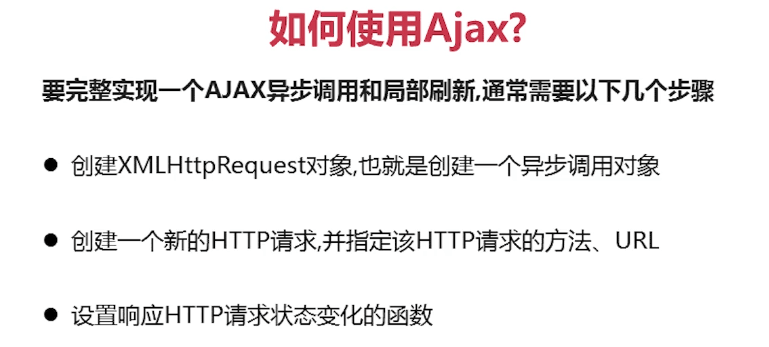


### 1. 创建XMLHttpRequest对象

#### 【Step1】 创建XMLHttpRequest对象

> 要完整的实现一个AJAX异步调用和局部刷新，通常需要以下几个步骤：
>
> 1. **创建XMLHttpRequest对象，也就是创建一个异步调用对象**

因为ajax要与服务器进行通信，所以需要有服务器的支持，我们使用MAMP来创建一个webserver的服务器，当apche server 和mysql server都启动成功，表示启动成功，访问http://localhost就可以访问主目录了。


完整代码

```html
<!DOCTYPE html>
<head>
  <meta charset="UTF-8">
  <title>AJX</title>
</head>
<body>
  <script type="text/javascript">
    //封装通用的xhr对象，兼容各个版本
    function createXHR(){
      //判断浏览器是否将XMLHttpRequest作为本地对象实现，针对IE7，firefox，opera等
      if(typeof XMLHttpRequest != "undefined"){
        return new XMLHttpRequest();
      }else if(typeof ActiveXObject != "undefined"){
        //将所有可能出现的ActiveObject版本放在一个数组种
        var xhrArr = ['Microsoft.XMLHTTP','MSXML2.XMLHTTP.6.0','MSXML2.XMLHTTP.5.0','MSXML2.XMLHTTP.4.0','MSXML2.XMLHTTP.3.0','MSXML2.XMLHTTP.2.0'];
        //遍历创建XMLHttpRequest对象
        var len = xhrArr.length，xhr;
        for(var i=0;i<len;i++){
          try{
            //创建XMLHttpRequest对象
            xhr = new ActiveXObject(xhrArr[i]);
            break;
          }
          catch(ex){
          }
        }
        return xhr;
      }else{
        throw new Error('No XHR object available!')
      }
    }
    //测试XMLHttpRequest对象
    var xhr = createXHR();
    console.log(xhr);
  </script>
</body>
</html>
```

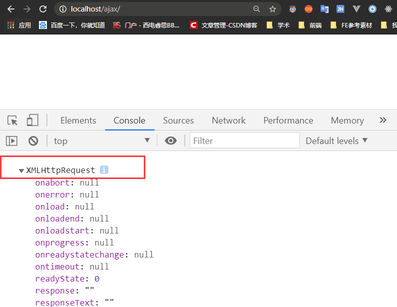

可以看到我们成功创建XMLHttpRequest对象，即创建ajax的第一步完成了！

### 2. 创建新的HTTP请求：open方法

#### 【step2】 使用open创建新的HTTP请求

> 要完整的实现一个AJAX异步调用和局部刷新，通常需要以下几个步骤：
>
> 1. 创建XMLHttpRequest对象，也就是创建一个异步调用对象
> 2. **创建一个新的HTTP请求，并指定该HTTP请求的方法，URL**

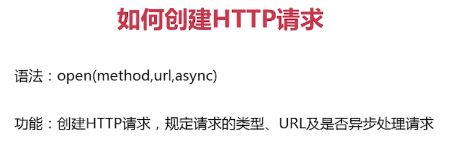

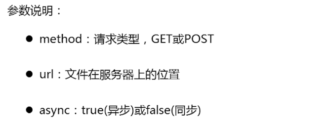


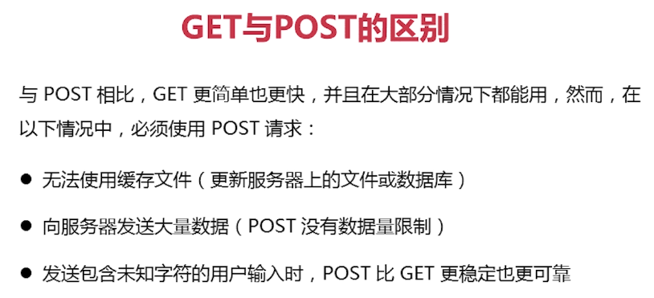


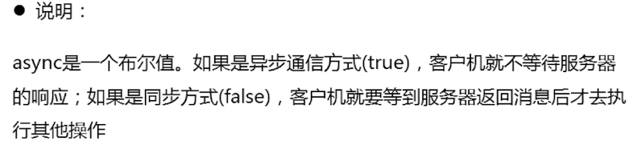

本文的例子：

在index.html中想去请求server下的slider.json本地文件


```js
    //创建XMLHttpRequest对象
    var xhr = createXHR();
    //创建请求
    xhr.open("get","./server/slider.json",true);
```


### 3. 设置状态请求变化函数

>  要完整的实现一个AJAX异步调用和局部刷新，通常需要以下几个步骤：
>
>  1. 创建XMLHttpRequest对象，也就是创建一个异步调用对象
>  2. 创建一个新的HTTP请求，并指定该HTTP请求的方法，URL
>  3. **设置响应HTTP请求状态变化的函数**
>  4. **使用send发送请求**

#### 【step3】 设置响应HTTP请求状态变化的函数


| readyState | 状态     |                                        |
| ---------- | -------- | -------------------------------------- |
| 0          | 初始化   | XMLHttpRequest对象还没有完成初始化     |
| 1          | 载入     | XMLHttpRequest对象开始发送请求         |
| 2          | 载入完成 | XMLHttpRequest对象的请求发送完成       |
| 3          | 解析     | XMLHttpRequest对象开始读取服务器的响应 |
| 4          | 完成     | XMLHttpRequest对象读取服务器响应结束   |

### 4. send发送请求

#### 【step4】 使用send发送请求

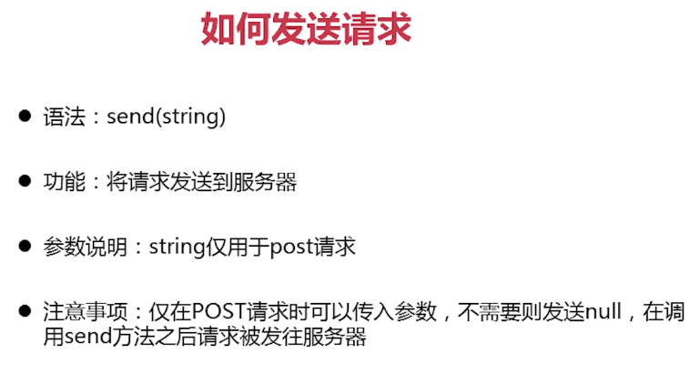


今天的例子不需要传参，代码如下

```js
    //创建XMLHttpRequest对象
    var xhr = createXHR();
    //响应XMLHttpRequest对象状态变化的函数,onreadyStateChange在readyStatechange属性发生改变时触发
    xhr.onreadystatechange = function(){
      //异步调用成功,响应内容解析完成,可以在客户端调用
      if(xhr.readyState === 4){
        if((xhr.status >=200 && xhr.status<300)||xhr.status===304){
          //获得服务器返回的数据
        }
      }
    }
    //创建请求
    xhr.open("get","./server/slider.json",true);
    //发送请求
    xhr.send(null);
```

这里注意：如果发送请求时需要传参

* 对于get请求，参数直接写在url里

```js
xhr.open("get","./server/slider.json?user=zhangsan",true);
//如果是中文记得编码
//xhr.open("get","https://www.imooc.com/api/http/search/suggest?words=${encodeURIComponent('前端')}")
xhr.send(null);
```

* 如果是post请求，需要把参数放在send中

```js
//发送数据一般是字符串
xhr.open("post","./server/slider.json?",true);
xhr.send("username=1234324&pwd=12345");
//还需要设置http头部信息
xhr.setRequestHeader("Content-type","application/x-www-form-urlencoded");
```

### 5 获取服务器端返回的数据

#### 【step5】 获取异步调用返回的数据

这里常用responseText(注意是字符串形式)


```js
    //创建XMLHttpRequest对象
    var xhr = createXHR();
    //响应XMLHttpRequest对象状态变化的函数,onreadyStateChange在readyStatechange属性发生改变时触发
    xhr.onreadystatechange = function(){
      //异步调用成功,响应内容解析完成,可以在客户端调用
      if(xhr.readyState === 4){
        if((xhr.status >=200 && xhr.status<300)||xhr.status===304){
          // 获得服务器返回的数据
          console.log(xhr.responseText);
        }
      }
    }
    //创建请求
    xhr.open("get","./server/slider.json",true);
    //发送请求
    xhr.send(null);
```

在这里我们只是将获取的数据打印：

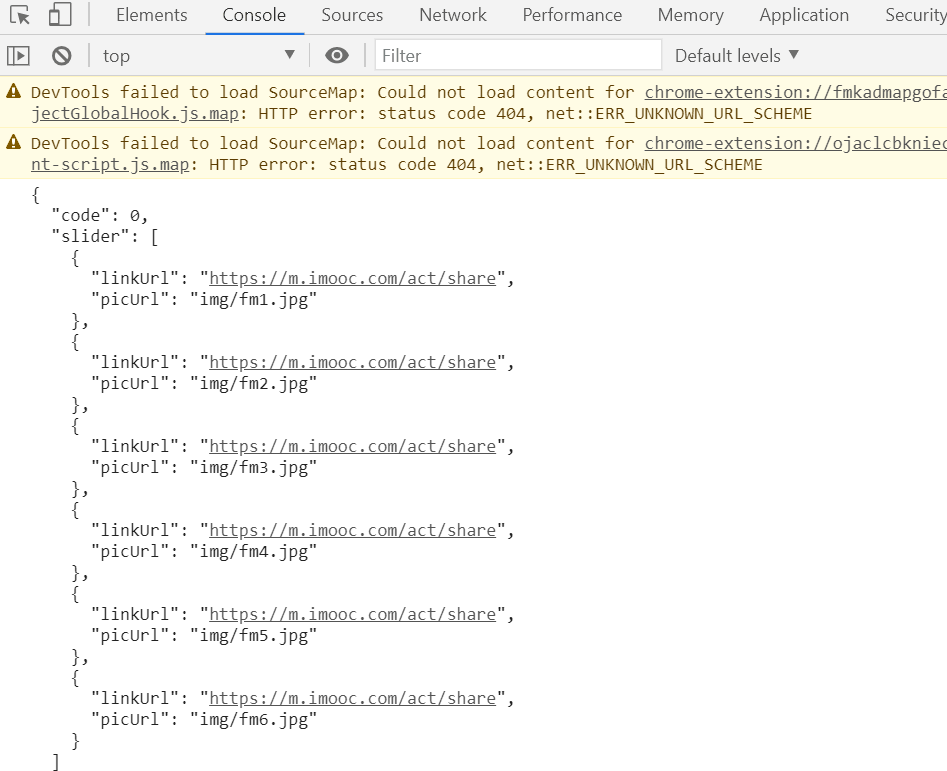

### 6. 渲染数据到DOM中

#### 【step6】 使用JavaScript和DOM实现局部刷新

现在我们要把这段数据渲染到DOM里面

```js
    //创建XMLHttpRequest对象
    var xhr = createXHR(),
        data = null;
    //响应XMLHttpRequest对象状态变化的函数,onreadyStateChange在readyStatechange属性发生改变时触发
    xhr.onreadystatechange = function(){
      //异步调用成功,响应内容解析完成,可以在客户端调用
      if(xhr.readyState === 4){
        if((xhr.status >=200 && xhr.status<300)||xhr.status===304){
          //获得服务器返回的数据
          //console.log(typeof xhr.responseText);//string类型
          data = eval("("+xhr.responseText+")");
           //  data = JSON.parse(xhr.responseText)
          console.log(data);
           //渲染数据到页面中
          renderDataToDom();
        }
      }
    }
    //创建请求
    xhr.open("get","./server/slider.json",true);
    //发送请求
    xhr.send(null);
```

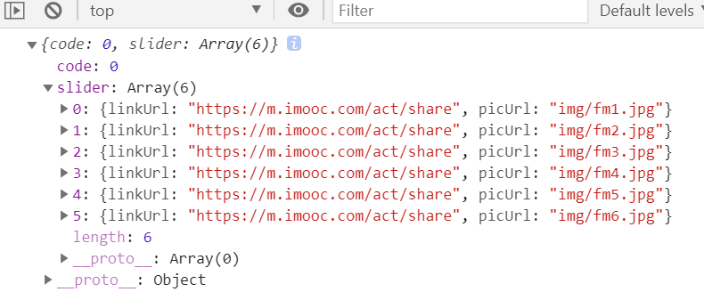

```html
    <div class="banner" id="banner">
    </div>
```

```js
    //渲染数据的函数
    function renderDataToDom(){
      var img = data.slider,i,
          len = img.length,str="",
          banner = document.getElementById("banner");
      for(i=0;i<len;i++){
        str += '<a href="'+img[i].linkUrl+'"></a>';
      }
      banner.innerHTML = str;
    }
```


获取到数据后，可以进行页面的渲染

**一个完成的使用AJAX的例子**

```html
<!DOCTYPE html>
<html lang="en">
<head>
    <meta charset="UTF-8">
    <title>Document</title>
    <link rel="stylesheet" href="css/style.css" />
</head>
<body>
    <div class="banner" id="banner">
    </div>
    <script type="text/javascript">
    // 封装通用的xhr,兼容各个版本
    function createXHR() {
        //判断浏览器是否将XMLHttpRequest作为本地对象实现，针对IE7，Firefox，Opera等浏览器
        if (typeof XMLHttpRequest != "undefined") {
            return new XMLHttpRequest();
        } else if (typeof ActiveXObject != "undefined") {
            //将所有可能出现的ActiveXObject版本放在一个数组中
            var xhrArr = ['Microsoft.XMLHTTP', 'MSXML2.XMLHTTP.6.0', 'MSXML2.XMLHTTP.5.0', 'MSXML2.XMLHTTP.4.0', 'MSXML2.XMLHTTP.3.0', 'MSXML2.XMLHTTP'];
            //遍历创建XMLHttpRequest对象
            var len = xhrArr.length;
            for (var i = 0; i < len; i++) {
                try {
                    //创建XMLHttpRequest对象
                    xhr = new ActiveXObject(xhrArr[i]);
                    //如果创建XMLHttpRequest对象成功，则跳出循环
                    break;
                } catch (ex) {}
            }
        } else {
            throw new Error("No XHR object available.");
        }
    }

    //创建XMLHttpRequest对象
    var xhr = createXHR(),
        data = null;
    //响应XMLHttpRequest对象状态变化的函数,onreadyStateChange在readyStatechange属性发生改变时触发
    xhr.onreadystatechange = function(){
      //异步调用成功,响应内容解析完成,可以在客户端调用
      if(xhr.readyState === 4){
        if((xhr.status >=200 && xhr.status<300)||xhr.status===304){
          //获得服务器返回的数据
          //console.log(typeof xhr.responseText);//string类型
          data = JSON.parse(xhr.responseText)
          //console.log(data);
          //渲染数据到页面中
          renderDataToDom();
        }
      }
    }
    //创建请求
    xhr.open("get","./server/slider.json",true);
    //发送请求
    xhr.send(null);
    
    //渲染数据(局部更新)
    function renderDataToDom(){
      var img = data.slider,i,
          len = img.length,str="",
          banner = document.getElementById("banner");
      for(i=0;i<len;i++){
        str += '<a href="'+img[i].linkUrl+'"></a>';
      }
      banner.innerHTML = str;
    }
    </script>
</body>
</html>
```

## 4.4 JSON

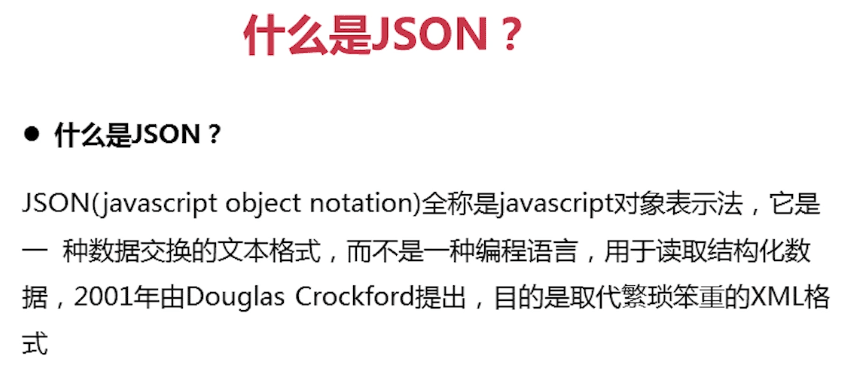


jso对象也提供了两个方法：

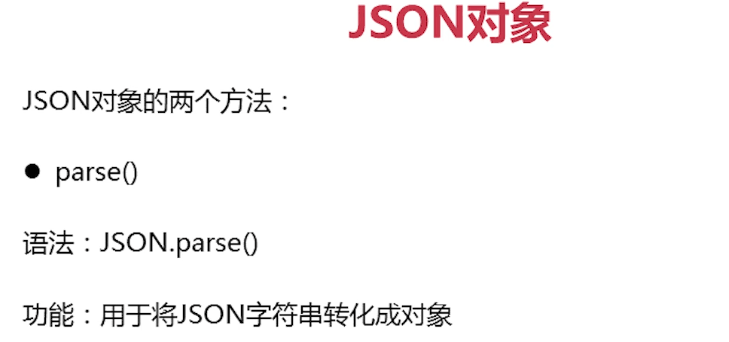

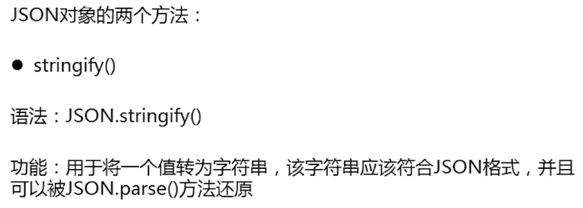


```js
          //data = eval("("+xhr.responseText+")");
          data = JSON.parse(xhr.responseText)
```

### 补充： jquery的ajax方法

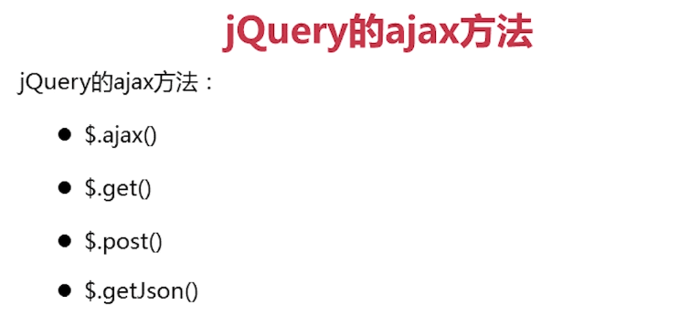

```html
<body>
    <div class="banner" id="banner_jq"></div>
    <script src="js/jquery-1.7.1.js"></script>
</body>
```

```js
    //jquery的$.ajax()
    $.ajax({
      url:"./server/slider.json",//请求地址
      type:"post",//请求方式
      async:true,//同步请求
      dataType:"json",//数据格式
      success:function(imgData){//请求成功的回调
        jQrenderDataToDom(imgData.slider);
      }
    })

    //渲染数据
    function jQrenderDataToDom(data){
      var str = "";
      $.each(data,function(index,obj){
        str += '<a href="'+obj.linkUrl+'"></a>';
      })
      $("#banner_jq").html(str);
    }
```


## 4.5 跨域

### 什么是跨域


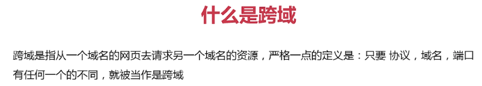


### 使用JSONP解决跨域


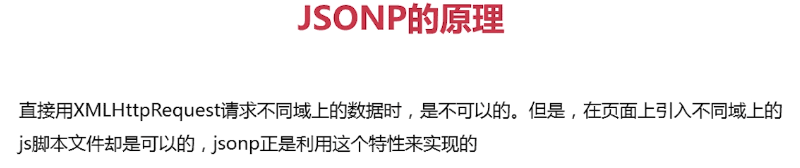

理解：script标签不会被浏览器组织，JSONP主要是利用script标签，加载跨域文件。

**使用JSONP实现跨域**

callback的函数名字可以前端自己操控


代码示例：

```html
<html lang="en">
<body>
  <script>
    //使用JSONP实现跨域
    //服务端准备好JSONP接口
    //https://www.imooc.com/api/http/jsonp?callback=handleResponse

    //手动加载JSONP接口或动态加载
    const script = document.createElement('script');
    script.src = 'https://www.imooc.com/api/http/jsonp?callback=handleResponse';
    document.body.appendChild(script);

    //声明函数
    const handleResponse = data =>{
      console.log(data);
    };
  </script>
  <!--手动加载-->
  <!-- <script src="https://www.imooc.com/api/http/jsonp?callback=handleResponse"> -->
  </script>
</body>
</html> 
```


### CORS

**CROS是什么?**

后端配置的。后端在响应中设置这个字段，下面的*表示允许所有的域名来跨域请求它，` * `是通配符，没有任何限制，`Access-Control-Allow-Origin:http://127.0.0.1:5500` 表示只允许指定域名的跨域请求。


**使用CROS跨域的过程**

1. 浏览器发送请求
2. 后端在响应头中添加Access-Control-Allow-Origin头信息
3. 浏览器接收到响应
4. 如果是同域下的请求，浏览器不会额外做什么，这次前后端通信就圆满完成了
5. 如果是跨域请求，浏览器会从响应头中查找是否允许跨域访问
6. 如果允许跨域，通信圆满完成
7. 如果没找到或不包含想要跨域的域名，就丢弃响应结果

**CORS的兼容性**

IE10及已上版本的浏览器可以正常使用CROS

## 3.2 JSONP跨域封装

利用script的src可以跨域的属性来动态创建标签

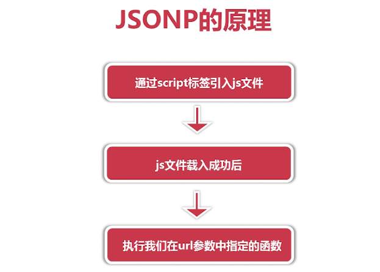

```js
    //封装JSONP
	//eg:url http://www.baidu.com?jsonp=getJSONP.getJSONPgdf
    function getJSONP(url,callback){
      if(!url){
        return;
      }
      //声明数组用来随机生成函数名(防止与现有的函数名冲突)
      var a= ['a','b','c','d','e','f','g','h','i','j'],
          r1 = Math.floor(Math.random()*a.length),
          r2 = Math.floor(Math.random()*a.length),
          r3 = Math.floor(Math.random()*a.length),
          name = 'getJSONP'+a[r1]+a[r2]+a[r3],
          cbname = 'getJSONP.'+name;//这里必须是 getJSONP.（与函数名对应，这里是作为getJSONP的一个属性）
      //判断url地址中是否含有？问号
      if(url.indexOf('?') === -1){          
        url += '?jsonp='+cbname;
      }else{
        url += '&jsonp=' + cbname;
      }
      //动态创建script标签
      var script = document.createElement('script');
      //定义被脚本执行的回调函数
      getJSONP[name] = function(data){
        try {
          if(callback) callback(data);
        } catch (e) {
          //捕获到错误
        }finally{
          //最后删除该函数及script
          delete getJSONP[name];
          script.parentNode.removeChild(script);
        }
      }
      //定义script的src
      script.src = url;
      document.getElementsByTagName("head")[0].appendChild(script);
    }
```

## 3.3 JSONP跨域调用

这里请求一个不同源的地址，看能不能返回数据：

```js
//测试跨域请求是否成功
 getJSONP("http://class.imooc.com/api/jsonp",function(data){
      console.log(data);
    });
```

可以看到成功打印出数据


其他示例：


* 访问地址时，服务端返回的函数是abc（data）。注意：data是json数据
* JSONP的接口是一个函数，里面有对象
* 作为js，它的理解是要调用一个叫abc的函数，服务端返回的data数据就被接受了，这样就可以访问不同源的文件下的数据。

## 4.4 XHR

### XHR的属性

* responseType和response属性
  * `responseType =''`或`responseType = 'text'`或`responseType = 'json'`
  * response和responseText类似，但responseText只能在没有设置responseType或者`responseType = 'text'`的时候才能使用
* timeout属性：设置请求的超时时间（单位ms）eg. `xhr.timeout = 10`
* widthCredentials属性：指定使用Ajax发送请求时是否携带Cookie
  * 使用Ajax发送请求，默认情况下，同域时，会携带Cookie；跨域时，不会
  * `xhr.withCredentials = true`
  * 最终能否成功携带Cookie，还要看服务器同不同意
  * 

### **XHR的方法**

* abort(): 终止当前请求，一般配合abort事件一起使用

  ```js
  //...
  xhr.open('GET',url,true);
  xhr.send(null);
  xhr.abort();
  ```

* setRequestHeader()：设置请求头信息，`xhr.setRequestHeader(头部字段的名称，头部字段的值)`

  ```JS
  //...
  xhr.open('GET',url,true);
  //请求头中的Content-type字段用来告诉服务器，浏览器发送的数据是什么格式的
  
  //eg1 
  xhr.setRequestHeaader('Content-Type','application/x-www-form-urlencoded')
  xhr.send('username=alex&age=18');
  
  //eg2
  xhr.setRequestHeaader('Content-Type','application/json')
  xhr.send(JSON.stringify({
      username:'alex',
      age:18
  }));
  ```

### XHR的事件

* load事件：响应数据可用时触发

  ```js
  //1.load
    const url = 'https://www.imooc.com/api/http/search/suggest?words=js';
    const xhr = new XMLHttpRequest();
  
    //IE 6-8不支持load
    xhr.onload = ()=>{
      if((xhr.status >= 200 && xhr.status<300) || xhr.status === 304){
        console.log(xhr.response);
      }
    }
  
    // xhr.addEventListener('load',()=>{
    //   if((xhr.status >= 200 && xhr.status<300) || xhr.status === 304){
    //     console.log(xhr.response);
    //   }
    // },false);
  
    xhr.open('GET',url,true);
    xhr.send(null);
  ```

* error事件:请求发生错误时触发

  ```js
    const url = 'https://www.iimooc.com/api/http/search/suggest?words=js';
    const xhr = new XMLHttpRequest();
  
    xhr.addEventListener('load',()=>{
      if((xhr.status >= 200 && xhr.status<300) || xhr.status === 304){
        console.log(xhr.response);
      }
    },false);
  
    //IE10开始支持
    xhr.addEventListener('error',()=>{
      console.log('error');
    },false)
  
    xhr.open('GET',url,true);
    xhr.send(null);
  ```

* abort事件

  ```js
    const url = 'https://www.iimooc.com/api/http/search/suggest?words=js';
    const xhr = new XMLHttpRequest();
  
    xhr.addEventListener('load',()=>{
      if((xhr.status >= 200 && xhr.status<300) || xhr.status === 304){
        console.log(xhr.response);
      }
    },false);
  
    xhr.addEventListener('abort',()=>{
      console.log("abort!");
    },false)
  
    xhr.open('GET',url,true);
    xhr.send(null);
    //IE10开始支持
    xhr.abort();
  ```

  

* timeout事件：请求超时后触发

  ```js
  const url = 'https://www.iimooc.com/api/http/search/suggest?words=js';
    const xhr = new XMLHttpRequest();
  
    xhr.addEventListener('load',()=>{
      if((xhr.status >= 200 && xhr.status<300) || xhr.status === 304){
        console.log(xhr.response);
      }
    },false);
  
    xhr.addEventListener('timeout',()=>{
      console.log("timeout！!");
    },false)
  
    xhr.open('GET',url,true);
    xhr.timeout = 10;
    xhr.send(null);
  ```

## 4.5 FormData

### 使用Ajax提交表单

```html
 <form action="https://www.imooc.com/api/http/search/suggest?words=js" id="login" method="POST">
    用户：<input type="text" name="username" id=""><br>
    密码：<input type="password" name="password" id=""><br>
    <input type="submit" value="登录" id="submit">
  </form>
```


```js
   const url = 'https://www.imooc.com/api/http/search/suggest?words=js';
    //1.使用Ajax提交表单
    const login = document.getElementById('login');
    const [username,password] = login;
    const btn = document.getElementById('submit');

    btn.addEventListener('click',(e)=>{
      //组织表单的默认提交
      e.preventDefault();

      //表单的数据验证（略）
      //发送ajax请求
      const xhr = new XMLHttpRequest();
      xhr.addEventListener('load',()=>{
        if((xhr.status>=200 && xhr.status<300)||xhr.status===304){
          console.log(xhr.response);
        }
      },false);

      xhr.open('POST',url,true); 
      //组装数据
      const data = `username=${username.value}&password=${password.value}`;
      xhr.setRequestHeader('Content-Type','application/x-www-form-urlencoded')
      xhr.send(data);

    },false)
```


```js

btn.addEventListener('click',(e)=>{
      e.preventDefault();
      const xhr = new XMLHttpRequest();
      xhr.addEventListener('load',()=>{
        if((xhr.status>=200 && xhr.status<300)||xhr.status===304){
          console.log(xhr.response);
        }
      },false);

      xhr.open('POST',url,true); 

      //使用FormData替代上面的,这种多用
      const data = new FormData(login);
      for(const item of data){
        console.log(item);
      }
      xhr.send(data);

    },false)
```


### FormData的基本用法

* 通过HTML表单元素创建FormData对象

  ```js
  const fd = new FormDate(表单元素)
  xhr.send(fd)
  ```

* 可以使用append方法添加数据

  ```js
  const fd = new FormDate()
  fd.append('age',18);
  fd.append('sex',male);
  ```

## 4.5 封装Ajax

### 基本封装

写在前面：挺难的，思路比较好，多看看吧。


#### constant.js

```js
// 常量
export const HTTP_GET = "GET";
export const CONTENT_TYPE_FORM_URLENCODED = "application/x-www-form-urlencoded";
export const CONTENT_TYPE_JSON = "application/json";

```

#### defaults.js

```js
// 常量
import { HTTP_GET, CONTENT_TYPE_FORM_URLENCODED } from "./constants.js";

// 默认参数
const DEFAULTS = {
	method: HTTP_GET,
	// 请求头携带的数据
	params: null,
	// params: {
	//   username: 'alex',
	//   age: 18
	// }
	// username=alex&age=18
	// 请求体携带的数据
	data: null,
	// data: {
	//   username: 'alex',
	//   age: 18
	// }
	// data: FormData 数据

	contentType: CONTENT_TYPE_FORM_URLENCODED,
	responseType: "",
	timeoutTime: 0,
	withCredentials: false,

	// 方法
	success() {},
	httpCodeError() {},
	error() {},
	abort() {},
	timeout() {},
};

export default DEFAULTS;

```

#### util.js

```js
// 工具函数

// 数据序列化成 urlencoded 格式的字符串
const serialize = param => {
  const results = [];

  for (const [key, value] of Object.entries(param)) {
    results.push(`${encodeURIComponent(key)}=${encodeURIComponent(value)}`);
  }

  // ['username=alex', 'age=18'];

  return results.join('&');
};

// 数据序列化成 JSON 格式的字符串
const serializeJSON = param => {
  return JSON.stringify(param);
};

// 给 URL 添加参数
// www.imooc.com?words=js&
const addURLData = (url, data) => {
  if (!data) return '';

  const mark = url.includes('?') ? '&' : '?';

  return `${mark}${data}`;
};

export { serialize, addURLData, serializeJSON };

```


#### ajax.js

```js
// 常量
import {
	HTTP_GET,
	CONTENT_TYPE_FORM_URLENCODED,
	CONTENT_TYPE_JSON,
} from "./constants.js";

// 工具函数
import { serialize, addURLData, serializeJSON } from "./utils.js";

// 默认参数
import DEFAULTS from "./defaults.js";

// Ajax 类
class Ajax {
	constructor(url, options) {
		this.url = url;
		this.options = Object.assign({}, DEFAULTS, options);

		// 初始化
		this.init();
	}

	// 初始化
	init() {
		const xhr = new XMLHttpRequest();

		this.xhr = xhr;

		// 绑定响应事件处理程序
		this.bindEvents();

		xhr.open(this.options.method, this.url + this.addParam(), true);

		// 设置 responseType
		this.setResponseType();

		// 设置跨域是否携带 cookie
		this.setCookie();

		// 设置超时
		this.setTimeout();

		// 发送请求
		this.sendData();
	}

	// 绑定响应事件处理程序
	bindEvents() {
		const xhr = this.xhr;

		const { success, httpCodeError, error, abort, timeout } = this.options;

		// load
		xhr.addEventListener(
			"load",
			() => {
				if (this.ok()) {
					success(xhr.response, xhr);
				} else {
					httpCodeError(xhr.status, xhr);
				}
			},
			false
		);

		// error
		// 当请求遇到错误时，将触发 error 事件
		xhr.addEventListener(
			"error",
			() => {
				error(xhr);
			},
			false
		);

		// abort
		xhr.addEventListener(
			"abort",
			() => {
				abort(xhr);
			},
			false
		);

		// timeout
		xhr.addEventListener(
			"timeout",
			() => {
				timeout(xhr);
			},
			false
		);
	}

	// 检测响应的 HTTP 状态码是否正常
	ok() {
		const xhr = this.xhr;
		return (xhr.status >= 200 && xhr.status < 300) || xhr.status === 304;
	}

	// 在地址上添加数据
	addParam() {
		const { params } = this.options;

		if (!params) return "";

		return addURLData(this.url, serialize(params));
	}

	// 设置 responseType
	setResponseType() {
		this.xhr.responseType = this.options.responseType;
	}

	// 设置跨域是否携带 cookie
	setCookie() {
		if (this.options.withCredentials) {
			this.xhr.withCredentials = true;
		}
	}

	// 设置超时
	setTimeout() {
		const { timeoutTime } = this.options;

		if (timeoutTime > 0) {
			this.xhr.timeout = timeoutTime;
		}
	}

	// 发送请求
	sendData() {
		const xhr = this.xhr;

		if (!this.isSendData()) {
			return xhr.send(null);
		}

		let resultData = null;
		const { data } = this.options;

		// 发送 FormData 格式的数据
		if (this.isFormData()) {
			resultData = data;
		} else if (this.isFormURLEncodedData()) {
			// 发送 application/x-www-form-urlencoded 格式的数据

			this.setContentType(CONTENT_TYPE_FORM_URLENCODED);
			resultData = serialize(data);
		} else if (this.isJSONData()) {
			// 发送 application/json 格式的数据

			this.setContentType(CONTENT_TYPE_JSON);
			resultData = serializeJSON(data);
		} else {
			// 发送其他格式的数据

			this.setContentType();
			resultData = data;
		}

		xhr.send(resultData);
	}

	// 是否需要使用 send 发送数据
	isSendData() {
		const { data, method } = this.options;

		if (!data) return false;

		if (method.toLowerCase() === HTTP_GET.toLowerCase()) return false;

		return true;
	}

	// 是否发送 FormData 格式的数据
	isFormData() {
		return this.options.data instanceof FormData;
	}

	// 是否发送 application/x-www-form-urlencoded 格式的数据
	isFormURLEncodedData() {
		return this.options.contentType
			.toLowerCase()
			.includes(CONTENT_TYPE_FORM_URLENCODED);
	}

	// 是否发送 application/json 格式的数据
	isJSONData() {
		return this.options.contentType.toLowerCase().includes(CONTENT_TYPE_JSON);
	}

	// 设置 Content-Type
	setContentType(contentType = this.options.contentType) {
		if (!contentType) return;

		this.xhr.setRequestHeader("Content-Type", contentType);
	}

	// 获取 XHR 对象
	getXHR() {
		return this.xhr;
	}
}

export default Ajax;

```

#### index.js

```js
// 工具函数

// 数据序列化成 urlencoded 格式的字符串
const serialize = param => {
  const results = [];

  for (const [key, value] of Object.entries(param)) {
    results.push(`${encodeURIComponent(key)}=${encodeURIComponent(value)}`);
  }

  // ['username=alex', 'age=18'];

  return results.join('&');
};

// 数据序列化成 JSON 格式的字符串
const serializeJSON = param => {
  return JSON.stringify(param);
};

// 给 URL 添加参数
// www.imooc.com?words=js&
const addURLData = (url, data) => {
  if (!data) return '';

  const mark = url.includes('?') ? '&' : '?';

  return `${mark}${data}`;
};

export { serialize, addURLData, serializeJSON };

```

#### index.html

```js
<!DOCTYPE html>
<html lang="en">
	<head>
		<meta charset="UTF-8" />
		<title>封装 Ajax</title>
	</head>
	<body>
		<script type="module">
			// const url = 'https://www.imooc.com/api/http/search/suggest?words=js';
			// const xhr = new XMLHttpRequest();
			// xhr.addEventListener(
			//   'load',
			//   () => {
			//     if ((xhr.status >= 200 && xhr.status < 300) || xhr.status === 304) {
			//       console.log(xhr.responseText);
			//     }
			//   },
			//   false
			// );
			// xhr.open('GET', url, true);
			// xhr.send(null);

			import { ajax, get, getJSON, post } from "./ajax/index.js";

			const url = "https://www.imooc.com/api/http/search/suggest?words=js";
			// const url = 'https://www.iimooc.com/api/http/search/suggest?words=js';

			// const url = './414.html';

			const xhr = ajax(url, {
				method: "GET",
				params: { username: "alex" },
				data: {
					age: 18,
				},
				responseType: "json",
				// timeoutTime: 10,

				success(response) {
					console.log(response);
				},
				httpCodeError(err) {
					console.log("http code error", err);
				},
				error(xhr) {
					console.log("error", xhr);
				},
				abort(xhr) {
					console.log("abort", xhr);
				},
				timeout(xhr) {
					console.log("timeout", xhr);
				},
			});

			// xhr.abort();
		</script>
	</body>
</html>

```


### 使用Promise封装改造好的Ajax

#### constants.js

```js
// 常量
export const HTTP_GET = 'GET';
export const CONTENT_TYPE_FORM_URLENCODED = 'application/x-www-form-urlencoded';
export const CONTENT_TYPE_JSON = 'application/json';

export const ERROR_HTTP_CODE = 1;
export const ERROR_HTTP_CODE_TEXT = 'HTTP 状态码异常';
export const ERROR_REQUEST = 2;
export const ERROR_REQUEST_TEXT = '请求被阻止';
export const ERROR_TIMEOUT = 3;
export const ERROR_TIMEOUT_TEXT = '请求超时';
export const ERROR_ABORT = 4;
export const ERROR_ABORT_TEXT = '请求终止';

```

#### index.js

```js
import Ajax from './ajax.js';
// 常量
import {
  ERROR_HTTP_CODE,
  ERROR_REQUEST,
  ERROR_TIMEOUT,
  ERROR_ABORT,
  ERROR_HTTP_CODE_TEXT,
  ERROR_REQUEST_TEXT,
  ERROR_TIMEOUT_TEXT,
  ERROR_ABORT_TEXT
} from './constants.js';

const ajax = (url, options) => {
  // return new Ajax(url, options).getXHR();
  let xhr;
  const p = new Promise((resolve, reject) => {
    xhr = new Ajax(url, {
      ...options,
      ...{
        success(response) {
          resolve(response);
        },
        httpCodeError(status) {
          reject({
            type: ERROR_HTTP_CODE,
            text: `${ERROR_HTTP_CODE_TEXT}: ${status}`
          });
        },
        error() {
          reject({
            type: ERROR_REQUEST,
            text: ERROR_REQUEST_TEXT
          });
        },
        abort() {
          reject({
            type: ERROR_ABORT,
            text: ERROR_ABORT_TEXT
          });
        },
        timeout() {
          reject({
            type: ERROR_TIMEOUT,
            text: ERROR_TIMEOUT_TEXT
          });
        }
      }
    }).getXHR();
  });

  p.xhr = xhr;
  p.ERROR_HTTP_CODE = ERROR_HTTP_CODE;
  p.ERROR_REQUEST = ERROR_REQUEST;
  p.ERROR_TIMEOUT = ERROR_TIMEOUT;
  p.ERROR_ABORT = ERROR_ABORT;

  return p;
};

const get = (url, options) => {
  return ajax(url, { ...options, method: 'GET' });
};

const getJSON = (url, options) => {
  return ajax(url, { ...options, method: 'GET', responseType: 'json' });
};

const post = (url, options) => {
  return ajax(url, { ...options, method: 'POST' });
};

export { ajax, get, getJSON, post };

```

#### index.js

```js
<!DOCTYPE html>
<html lang="en">
  <head>
    <meta charset="UTF-8" />
    <title>使用 Promise 改造封装好的 Ajax</title>
  </head>
  <body>
    <script type="module">
      import { ajax, get, getJSON, post } from './ajax/index.js';

      const url = 'https://www.imooc.com/api/http/search/suggest?words=js';
      // const url = 'https://www.iimooc.com/api/http/search/suggest?words=js';

      const p = getJSON(url, {
        params: { username: 'alex' },
        data: { age: 18 }
        // timeoutTime: 10
        // success(){},error(){}
      });
      p.xhr.abort();

      const { ERROR_HTTP_CODE, ERROR_REQUEST, ERROR_TIMEOUT, ERROR_ABORT } = p;

      p.then(repsonse => {
        console.log(repsonse);
      }).catch(err => {
        // console.log(err);
        switch (err.type) {
          case ERROR_HTTP_CODE:
            console.log(err.text);
            break;
          case ERROR_REQUEST:
            console.log(err.text);
            break;
          case ERROR_TIMEOUT:
            console.log(err.text);
            break;
          case ERROR_ABORT:
            console.log(err.text);
            break;
        }
     });
    </script>
  </body>
</html>

```

## 4.6 Ajax的应用

### 搜索提示


```html
<!DOCTYPE html>
<html lang="en">
<head>
  <meta charset="UTF-8">
  <meta http-equiv="X-UA-Compatible" content="IE=edge">
  <meta name="viewport" content="width=device-width, initial-scale=1.0">
  <title>搜索提示</title>
</head>
<body>
  <input type="text" id="search">
  <ul id="result"></ul>

  <script type="module">
    import {getJSON} from './index.js';

    const searchInput = document.getElementById('search');
    const resultList = document.getElementById('result');

    const url = 'https://www.imooc.com/api/http/search/suggest?words=';

    const handleInputEvent = ()=>{
      if(searchInput.value.trim()!==''){
        getJSON(`${url}${searchInput.value}`)
        .then(response=>{
          console.log(response.data);
          let html = '';
          for(const item of response.data){
            html += `<li>${item.word}</li>`
          }

          resultList.innerHTML = html;
          resultList.style.display = '';
        })
        .catch(err=>{
          console.log(err);
        });
        // console.log('as');
      }else{
        resultList.innerHTML = '';
        resultList.style.display = 'none';
      }
    }

    let timer = null;

    searchInput.addEventListener('input',()=>{
      handleInputEvent();
      if(timer){
        clearTimeout(timer);
      }
      //jsa
      timer = setTimeout(handleInputEvent,500);
    },false);
  </script>
</body>
</html>
```

### 二级菜单

```html
<!DOCTYPE html>
<html lang="en">
  <head>
    <meta charset="UTF-8" />
    <title>二级菜单</title>
    <style>
      /* css reset */
      * {
        padding: 0;
        margin: 0;
      }
      li {
        list-style: none;
      }

      /* menu */
      .menu {
        width: 100px;
        background-color: rgba(0, 0, 0, 0.1);
        margin: 10px;
      }
      .menu-item {
        position: relative;
        padding: 5px;
        cursor: pointer;
      }
      .menu-content {
        display: none;
        position: absolute;
        left: 100%;
        top: 0;
        width: 200px;
        height: 100px;
        padding: 0 5px;
        background-color: rgba(0, 0, 0, 0.1);
      }
      .menu-item:hover {
        background-color: rgba(0, 0, 0, 0.4);
      }
      .menu-item:hover .menu-content {
        display: block;
      }
      .menu-loading {
        margin: 45px 0 0 92px;
      }
    </style>
  </head>
  <body>
    <ul id="menu" class="menu">
      <!-- <li class="menu-item" data-key="hot" data-done="done">
        <span>热门</span>
        <div class="menu-content">
          <p></p>
        </div>
      </li> -->
    </ul>

    <script type="module">
      // https://www.imooc.com/api/mall-PC/index/menu/hot
      // https://www.imooc.com/api/mall-PC/index/menu

      import { getJSON } from './ajax/index.js';
      const menuURL = 'https://www.imooc.com/api/mall-PC/index/menu';
      const menuEl = document.getElementById('menu');

      getJSON(menuURL)
        .then(repsonse => {
          // console.log(repsonse);

          let html = '';

          for (const item of repsonse.data) {
            html += `
              <li class="menu-item" data-key="${item.key}">
                <span>${item.title}</span>
                <div class="menu-content">
                  <p></p>
                </div>
              </li>
            `;
          }

          menuEl.innerHTML = html;

          // [{key: "hot", title: "热门出发地", subTitles: Array(5)}]

          // ...
        })
        .then(() => {
          const items = menuEl.querySelectorAll('.menu-item');

          for (const item of items) {
            item.addEventListener(
              'mouseenter',
              () => {
                // console.log(item.getAttribute('data-key'));

                // IE11 开始支持
                // console.log(item.dataset.key);

                if (item.dataset.done === 'done') return;

                getJSON(
                  `https://www.imooc.com/api/mall-PC/index/menu/${item.dataset.key}`
                )
                  .then(repsonse => {
                    // console.log(repsonse);

                    // [{title: "内地热门城市", cities: Array(27)}]

                    item.dataset.done = 'done';

                    let html = '';

                    for (const item of repsonse.data) {
                      html += `<p>${item.title}</p>`;
                    }

                    item.querySelector('.menu-content').innerHTML = html;
                  })
                  .catch(err => {
                    console.log(err);
                  });
              },
              false
            );
          }
        })
        .catch(err => {
          console.log(err);
        });
    </script>
  </body>
</html>

```

### 多个Ajax请求的并发执行


```html
<!DOCTYPE html>
<html lang="en">
	<head>
		<meta charset="UTF-8" />
		<title>多个 Ajax 请求的并发执行</title>
		<style>
			/* css reset */
			* {
				padding: 0;
				margin: 0;
			}
			li {
				list-style: none;
			}

			/* menu */
			.menu {
				width: 100px;
				background-color: rgba(0, 0, 0, 0.1);
				margin: 10px;
			}
			.menu-item {
				position: relative;
				padding: 5px;
				cursor: pointer;
			}
			.menu-content {
				display: none;
				position: absolute;
				left: 100%;
				top: 0;
				width: 200px;
				height: 100px;
				padding: 0 5px;
				background-color: rgba(0, 0, 0, 0.1);
			}
			.menu-item:hover {
				background-color: rgba(0, 0, 0, 0.4);
			}
			.menu-item:hover .menu-content {
				display: block;
			}
			.menu-loading {
				margin: 45px 0 0 92px;
			}

			/* loading-page */
			.loading-page {
				position: absolute;
				top: 0;
				right: 0;
				bottom: 0;
				left: 0;
				z-index: 1000;
				background-color: #eee;
				text-align: center;
			}
			.loading-img {
				position: absolute;
				top: 50%;
			}
			.ad img {
				display: inline-block;
				width: 25%;
			}
			.none {
				display: none;
			}
		</style>
	</head>
	<body>
		<div id="loading-page" class="loading-page">
			
		</div>

		<div id="ad" class="ad"></div>

		<ul id="menu" class="menu">
			<!-- <li class="menu-item" data-key="hot" data-done="done">
        <span>热门</span>
        <div class="menu-content">
          <p></p>
        </div>
      </li> -->
		</ul>
		<script type="module">
			import { getJSON } from "./ajax/index.js";

			const menuURL = "https://www.imooc.com/api/mall-PC/index/menu";
			const adURL = "https://www.imooc.com/api/mall-PC/index/ad";

			const loadingPageEl = document.getElementById("loading-page");
			const adEl = document.getElementById("ad");
			const menuEl = document.getElementById("menu");

			const p1 = getJSON(menuURL)
				.then((repsonse) => {
					// console.log(repsonse);

					let html = "";
					for (const item of repsonse.data) {
						html += `
              <li class="menu-item" data-key="${item.key}">
                <span>${item.title}</span>
                <div class="menu-content">
                  <p></p>
                </div>
              </li>
            `;
					}

					menuEl.innerHTML = html;
					// [{key: "hot", title: "热门出发地", subTitles: Array(5)}]

					// ...
				})
				.then(() => {
					const items = menuEl.querySelectorAll(".menu-item");

					for (const item of items) {
						item.addEventListener(
							"mouseenter",
							() => {
								// console.log(item.getAttribute('data-key'));
								// IE11 开始支持
								// console.log(item.dataset.key);
								if (item.dataset.done === "done") return;
								getJSON(
									`https://www.imooc.com/api/mall-PC/index/menu/${item.dataset.key}`
								)
									.then((repsonse) => {
										// console.log(repsonse);

										// [{title: "内地热门城市", cities: Array(27)}]
										item.dataset.done = "done";
										let html = "";
										for (const item of repsonse.data) {
											html += `<p>${item.title}</p>`;
										}
										item.querySelector(".menu-content").innerHTML = html;
									})
									.catch((err) => {
										console.log(err);
									});
							},
							false
						);
					}
				})
				.catch((err) => {
					console.log(err);
				});

			const p2 = getJSON(adURL)
				.then((response) => {
					// console.log(response);
					// [{ url: 'http://alimc.img.imooc.com/class/' }];
					let html = "";
					for (const item of response.data) {
						html += ``;
					}
					adEl.innerHTML = html;
				})
				.catch((err) => {
					console.log(err);
				});

			Promise.all([p1, p2]).then(() => {
				// loadingPageEl.style.display = 'none';

				// IE10 开始支持
				loadingPageEl.classList.add("none");
				// loadingPageEl.classList.remove('none');
			});
		</script>
	</body>
</html>

```


## 4.7 Ajax扩展

### axios

* 是什么？一个基于Promise的HTTP库，可以用在浏览器和node.js中;是一个第三方Ajax库

  `http://www.axios-js.com/zh-ch/docs`

**基本用法**

```html
<!DOCTYPE html>
<html lang="en">
  <body>
    <!-- <script src="https://unpkg.com/axios/dist/axios.min.js"></script> -->
    <script src="https://unpkg.com/axios@0.19.2/dist/axios.min.js"></script>

    <script>

      // 2.axios 的基本用法
      // 引入 axios
      // console.log(axios);

      const url = 'https://www.imooc.com/api/http/search/suggest?words=js';
      // axios(url, {
      //   method: 'post',

      //   // 请求时的头信息
      //   headers: {
      //     'Content-Type': 'application/x-www-form-urlencoded'
      //     // 'Content-Type': 'application/json'
      //   },

      //   // 通过请求头携带的数据
      //   params: {
      //     username: 'alex'
      //   },

      //   // 通过请求体携带的数据
      //   // application/json
      //   // data: {
      //   //   age: 18,
      //   //   sex: 'male'
      //   // }

      //   // application/x-www-form-urlencoded
      //   data: 'age=18&sex=male'

      //   // timeout: 10

      //   // withCredentials: true
      // })
      //   .then(response => {
      //     console.log(response);
      //     console.log(response.data.data);
      //   })
      //   .catch(err => {
      //     console.log(err);
      //   });

      // axios
      //   .get(url, {
      //     params: {
      //       username: 'alex'
      //     }
      //   })
      //   .then(response => {
      //     console.log(response);
      //   });

      // axios
      //   .post(url, 'username=alex&age=18')
      //   .then(response => {
      //     console.log(response);
      //   })
      //   .catch(err => {
      //     console.log(err);
      //   });

      axios
        .post('https://www.imooc.com/api/http/json/search/suggest?words=js', {
          username: 'alex'
        })
        .then(response => {
          console.log(response);
        })
        .catch(err => {
          console.log(err);
        });

      // axios.put()
      // axios.delete()
    </script>
  </body>
</html>

```

### Fetch

**是什么？**

Fetch也是前后端通信的一种方式，是Ajax(XMLHttpRequest)的一种替代方案，它是基于Promise的

ajax兼容性比fetch好

fetch没有提供abort timeout等方法

```html
<html lang="en">
  <body>
    <script>
      // 2.Fetch 的基本用法
      // console.log(fetch);
      // console.log(ajax);

      // fetch() 调用后返回 Promise 对象
      const url = 'https://www.imooc.com/api/http/search/suggest?words=js';

      // body: (...)
      // bodyUsed: false
      // ok: true
      // status: 200
      // statusText: "OK"
      // type: "cors"
      // url: "https://www.im

      // 第二个参数是对象，用来配置 fetch
      const fd = new FormData();
      fd.append('username', 'alex');
      fetch(url, {
        method: 'post',
        // body: null
        // body: 'username=alex&age=18',
        // body: JSON.stringify({ username: 'alex' })
        body: fd,
        // headers: {
        //   // 'Content-Type': 'application/x-www-form-urlencoded'
        //   'Content-Type': 'application/json'
        // }
        mode: 'cors'
        // credentials:'include'
      })
        .then(response => {
          console.log(response);

          // body/bodyUsed
          // body 只能读一次，读过之后就不让再读了

          // ok
          // 如果为 true，表示可以读取数据，不用再去判断 HTTP 状态码了

          if (response.ok) {
            // console.log(response.json());

            return response.json();
            // return response.text();
          } else {
            throw new Error(`HTTP CODE 异常 ${response.status}`);
          }
        })
        .then(data => {
          console.log(data);
        })
        .catch(err => {
          console.log(err);
        });
    </script>
  </body>
</html>

```

