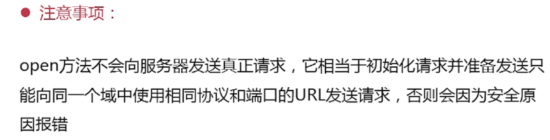
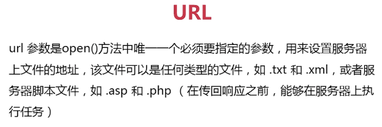
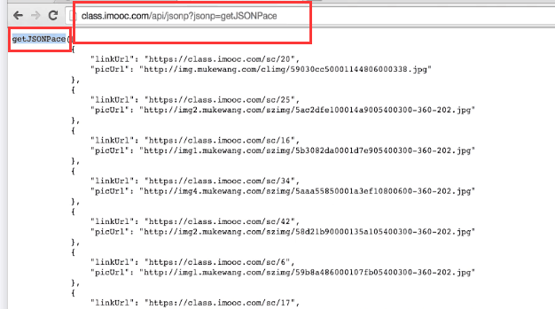

# JSON与AJAX

# ch1 简介

## 1.1 什么是ajax及为什么要使用ajax

### **什么是Ajax?**

* Ajax = Asynchronous JavaScript and XML（即**异步的JavaScript和XML**），它并不是一种新的编程语言，而是几种原有技术的结合体
* ajax是一种在**无需重新加载整个网页的情况下，能够更新部分网页**的技术

### Ajax的优缺点

**Ajax的优点：**

1. 通过**异步模式**，提升了用户体验
2. 优化了浏览器与服务器之间的传输，减少不必要的数据往返，**减少了带宽占用**
3. **Ajax引擎在客户端运行**，承担了一部分本来由服务器承担的工作，从而减少了大用户量下的服务器负载

**Ajax的缺点**

1. **不支持浏览器back**按钮
2. 安全问题AJAX**暴露了与服务器交互的细节**
3. **对搜索引擎的支持比较弱**

# ch2 Ajax与JSON

## 2.1 XMLHttpRequest对象

### **什么是XMLHttpRequest?**

* 是一种**支持异步请求的技术**，它是Ajax的核心

### **XMLHttpRequest的作用**

* 可以**向浏览器提出请求并处理响应**，而不阻塞用户
* 可以在页面加载以后进行页面的**局部更新**

### **如何使用Ajax？**


## 2.2 创建XMLHttpRequest对象

### 【Step1】 创建XMLHttpRequest对象

> 要完整的实现一个AJAX异步调用和局部刷新，通常需要以下几个步骤：
>
> 1. **创建XMLHttpRequest对象，也就是创建一个异步调用对象**

因为ajax要与服务器进行通信，所以需要有服务器的支持，我们使用MAMP来创建一个webserver的服务器，当apche server 和mysql server都启动成功，表示启动成功，访问http://localhost就可以访问主目录了。


完整代码

```html
<!DOCTYPE html>
<head>
  <meta charset="UTF-8">
  <title>AJX</title>
</head>
<body>
  <script type="text/javascript">
    //封装通用的xhr对象，兼容各个版本
    function createXHR(){
      //判断浏览器是否将XMLHttpRequest作为本地对象实现，针对IE7，firefox，opera等
      if(typeof XMLHttpRequest != "undefined"){
        return new XMLHttpRequest();
      }else if(typeof ActiveXObject != "undefined"){
        //将所有可能出现的ActiveObject版本放在一个数组种
        var xhrArr = ['Microsoft.XMLHTTP','MSXML2.XMLHTTP.6.0','MSXML2.XMLHTTP.5.0','MSXML2.XMLHTTP.4.0','MSXML2.XMLHTTP.3.0','MSXML2.XMLHTTP.2.0'];
        //遍历创建XMLHttpRequest对象
        var len = xhrArr.length，xhr;
        for(var i=0;i<len;i++){
          try{
            //创建XMLHttpRequest对象
            xhr = new ActiveXObject(xhrArr[i]);
            break;
          }
          catch(ex){
          }
        }
        return xhr;
      }else{
        throw new Error('No XHR object available!')
      }
    }
    //测试XMLHttpRequest对象
    var xhr = createXHR();
    console.log(xhr);
  </script>
</body>
</html>
```


可以看到我们成功创建XMLHttpRequest对象，即创建ajax的第一步完成了！

## 2.3 创建新的HTTP请求：open方法

### 【step2】 使用open创建新的HTTP请求

> 要完整的实现一个AJAX异步调用和局部刷新，通常需要以下几个步骤：
>
> 1. 创建XMLHttpRequest对象，也就是创建一个异步调用对象
> 2. **创建一个新的HTTP请求，并指定该HTTP请求的方法，URL**







本文的例子：

在index.html中想去请求server下的slider.json本地文件


```js
    //创建XMLHttpRequest对象
    var xhr = createXHR();
    //创建请求
    xhr.open("get","./server/slider.json",true);
```


## 2.4 设置状态请求变化函数与send

>  要完整的实现一个AJAX异步调用和局部刷新，通常需要以下几个步骤：
>
> 1. 创建XMLHttpRequest对象，也就是创建一个异步调用对象
> 2. 创建一个新的HTTP请求，并指定该HTTP请求的方法，URL
> 3. **设置响应HTTP请求状态变化的函数**
> 4. **使用send发送请求**

### 【step3】 设置响应HTTP请求状态变化的函数


| readyState | 状态     |                                        |
| ---------- | -------- | -------------------------------------- |
| 0          | 初始化   | XMLHttpRequest对象还没有完成初始化     |
| 1          | 载入     | XMLHttpRequest对象开始发送请求         |
| 2          | 载入完成 | XMLHttpRequest对象的请求发送完成       |
| 3          | 解析     | XMLHttpRequest对象开始读取服务器的响应 |
| 4          | 完成     | XMLHttpRequest对象读取服务器响应结束   |

### 【step4】 使用send发送请求


今天的例子不需要传参，代码如下

```js
    //创建XMLHttpRequest对象
    var xhr = createXHR();
    //响应XMLHttpRequest对象状态变化的函数,onreadyStateChange在readyStatechange属性发生改变时触发
    xhr.onreadystatechange = function(){
      //异步调用成功,响应内容解析完成,可以在客户端调用
      if(xhr.readyState === 4){
        if((xhr.status >=200 && xhr.status<300)||xhr.status===304){
          //获得服务器返回的数据
        }
      }
    }
    //创建请求
    xhr.open("get","./server/slider.json",true);
    //发送请求
    xhr.send(null);
```

这里注意：如果发送请求时需要传参

* 对于get请求，参数直接写在url里

```js
xhr.open("get","./server/slider.json?user=zhangsan",true);
xhr.send(null);
```

* 如果是post请求，需要把参数放在send中

```js
xhr.open("post","./server/slider.json?",true);
xhr.send("username=1234324&pwd=12345");
//还需要设置http头部信息
xhr.setRequestHeader("Content-type","application/x-www-form-urlencoded");
```

## 2.5 获取服务器端返回的数据

### 【step5】 获取异步调用返回的数据

这里常用responseText(注意是字符串形式)


```js
    //创建XMLHttpRequest对象
    var xhr = createXHR();
    //响应XMLHttpRequest对象状态变化的函数,onreadyStateChange在readyStatechange属性发生改变时触发
    xhr.onreadystatechange = function(){
      //异步调用成功,响应内容解析完成,可以在客户端调用
      if(xhr.readyState === 4){
        if((xhr.status >=200 && xhr.status<300)||xhr.status===304){
          // 获得服务器返回的数据
          console.log(xhr.responseText);
        }
      }
    }
    //创建请求
    xhr.open("get","./server/slider.json",true);
    //发送请求
    xhr.send(null);
```

在这里我们只是将获取的数据打印：


## 2.6 json


### 【step6】 使用JavaScript和DOM实现局部刷新

现在我们要把这段数据渲染到DOM里面

```js
    //创建XMLHttpRequest对象
    var xhr = createXHR(),
        data = null;
    //响应XMLHttpRequest对象状态变化的函数,onreadyStateChange在readyStatechange属性发生改变时触发
    xhr.onreadystatechange = function(){
      //异步调用成功,响应内容解析完成,可以在客户端调用
      if(xhr.readyState === 4){
        if((xhr.status >=200 && xhr.status<300)||xhr.status===304){
          //获得服务器返回的数据
          //console.log(typeof xhr.responseText);//string类型
          data = eval("("+xhr.responseText+")");
           //  data = JSON.parse(xhr.responseText)
          console.log(data);
           //渲染数据到页面中
          renderDataToDom();
        }
      }
    }
    //创建请求
    xhr.open("get","./server/slider.json",true);
    //发送请求
    xhr.send(null);
```


jso对象也提供了两个方法：


```js
          //data = eval("("+xhr.responseText+")");
          data = JSON.parse(xhr.responseText)
```

获取到数据后，可以进行页面的渲染

## 2.7 渲染数据

```html
    <div class="banner" id="banner">
    </div>
```

```js
    //渲染数据的函数
    function renderDataToDom(){
      var img = data.slider,i,
          len = img.length,str="",
          banner = document.getElementById("banner");
      for(i=0;i<len;i++){
        str += '<a href="'+img[i].linkUrl+'"></a>';
      }
      banner.innerHTML = str;
    }
```


**一个完成的使用AJAX的例子**

```html
<!DOCTYPE html>
<html lang="en">
<head>
    <meta charset="UTF-8">
    <title>Document</title>
    <link rel="stylesheet" href="css/style.css" />
</head>
<body>
    <div class="banner" id="banner">
    </div>
    <script type="text/javascript">
    // 封装通用的xhr,兼容各个版本
    function createXHR() {
        //判断浏览器是否将XMLHttpRequest作为本地对象实现，针对IE7，Firefox，Opera等浏览器
        if (typeof XMLHttpRequest != "undefined") {
            return new XMLHttpRequest();
        } else if (typeof ActiveXObject != "undefined") {
            //将所有可能出现的ActiveXObject版本放在一个数组中
            var xhrArr = ['Microsoft.XMLHTTP', 'MSXML2.XMLHTTP.6.0', 'MSXML2.XMLHTTP.5.0', 'MSXML2.XMLHTTP.4.0', 'MSXML2.XMLHTTP.3.0', 'MSXML2.XMLHTTP'];
            //遍历创建XMLHttpRequest对象
            var len = xhrArr.length;
            for (var i = 0; i < len; i++) {
                try {
                    //创建XMLHttpRequest对象
                    xhr = new ActiveXObject(xhrArr[i]);
                    //如果创建XMLHttpRequest对象成功，则跳出循环
                    break;
                } catch (ex) {}
            }
        } else {
            throw new Error("No XHR object available.");
        }
    }

    //创建XMLHttpRequest对象
    var xhr = createXHR(),
        data = null;
    //响应XMLHttpRequest对象状态变化的函数,onreadyStateChange在readyStatechange属性发生改变时触发
    xhr.onreadystatechange = function(){
      //异步调用成功,响应内容解析完成,可以在客户端调用
      if(xhr.readyState === 4){
        if((xhr.status >=200 && xhr.status<300)||xhr.status===304){
          //获得服务器返回的数据
          //console.log(typeof xhr.responseText);//string类型
          data = JSON.parse(xhr.responseText)
          //console.log(data);
          //渲染数据到页面中
          renderDataToDom();
        }
      }
    }
    //创建请求
    xhr.open("get","./server/slider.json",true);
    //发送请求
    xhr.send(null);
    
    //渲染数据(局部更新)
    function renderDataToDom(){
      var img = data.slider,i,
          len = img.length,str="",
          banner = document.getElementById("banner");
      for(i=0;i<len;i++){
        str += '<a href="'+img[i].linkUrl+'"></a>';
      }
      banner.innerHTML = str;
    }
    </script>
</body>
</html>
```

## 2.8 jquery的ajax方法


```html
<body>
    <div class="banner" id="banner_jq"></div>
    <script src="js/jquery-1.7.1.js"></script>
</body>
```

```js
    //jquery的$.ajax()
    $.ajax({
      url:"./server/slider.json",//请求地址
      type:"post",//请求方式
      async:true,//同步请求
      dataType:"json",//数据格式
      success:function(imgData){//请求成功的回调
        jQrenderDataToDom(imgData.slider);
      }
    })

    //渲染数据
    function jQrenderDataToDom(data){
      var str = "";
      $.each(data,function(index,obj){
        str += '<a href="'+obj.linkUrl+'"></a>';
      })
      $("#banner_jq").html(str);
    }
```


# ch3 跨域

## 3.1 什么是跨域


### 使用JSONP解决跨域


## 3.2 跨域封装

利用script的src可以跨域的属性来动态创建标签


```js
    //封装JSONP
	//eg:url http://www.baidu.com?jsonp=getJSONP.getJSONPgdf
    function getJSONP(url,callback){
      if(!url){
        return;
      }
      //声明数组用来随机生成函数名(防止与现有的函数名冲突)
      var a= ['a','b','c','d','e','f','g','h','i','j'],
          r1 = Math.floor(Math.random()*a.length),
          r2 = Math.floor(Math.random()*a.length),
          r3 = Math.floor(Math.random()*a.length),
          name = 'getJSONP'+a[r1]+a[r2]+a[r3],
          cbname = 'getJSONP.'+name;//这里必须是 getJSONP.（与函数名对应，这里是作为getJSONP的一个属性）
      //判断url地址中是否含有？问号
      if(url.indexOf('?') === -1){          
        url += '?jsonp='+cbname;
      }else{
        url += '&jsonp=' + cbname;
      }
      //动态创建script标签
      var script = document.createElement('script');
      //定义被脚本执行的回调函数
      getJSONP[name] = function(data){
        try {
          if(callback) callback(data);
        } catch (e) {
          //捕获到错误
        }finally{
          //最后删除该函数及script
          delete getJSONP[name];
          script.parentNode.removeChild(script);
        }
      }
      //定义script的src
      script.src = url;
      document.getElementsByTagName("head")[0].appendChild(script);
    }
```

## 3.3 跨域调用

这里请求一个不同源的地址，看能不能返回数据：

```js
//测试跨域请求是否成功
 getJSONP("http://class.imooc.com/api/jsonp",function(data){
      console.log(data);
    });
```

可以看到成功打印出数据


其他示例：




* 访问地址时，服务端返回的函数是abc（data）。注意：data是json数据
* JSONP的接口是一个函数，里面有对象
* 作为js，它的理解是要调用一个叫abc的函数，服务端返回的data数据就被接受了，这样就可以访问不同源的文件下的数据。

