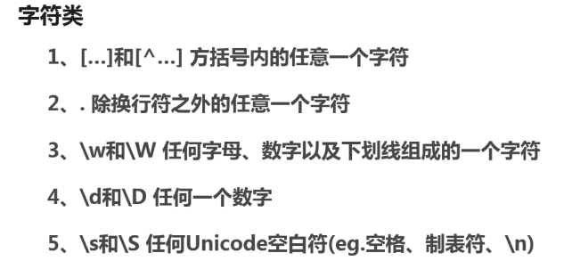

# 正则表达式

# 1. 介绍

正则表达式的模式匹配

正则表达式都是操作字符串的

# 2. 正则表达式

## 什么是正则表达式？

* 由普通字符和特殊字符组成的文字模式。
* 该模式描述在查找文字主体时待匹配的一个或多个字符串。正则表达式作为一个模板，将某个字符模式与所搜索的字符串进行匹配
* 作用是：
  * 查找
  * 替换
  * 数据有效性验证

## 创建正则表达式

```js
//创建正则表达式的两种方式
//字面量或直接量（简洁多用）
var str = "I love js";
var pattern = /js/;
console.log(pattern.test(str));//true
console.log(pattern.exec(str));//[ 'js', index: 7, input: 'I love js', groups: undefined ]

//构造函数（略麻烦，但'js'可以使用变量传入）
var str = "I love Js";
var pattern = new RegExp('js','i');
console.log(pattern.test(str));
console.log(pattern.exec(str));
```

如何它忽略大小写?使用正则表达式的**模式修饰符**

* i ignoreCase

  ```js
  var str = "I love Js";
  var pattern = /js/i;
  console.log(pattern.test(str));//true
  ```

* g global

* m multiline

## 制作一个正则表达式测试工具


# 3. 常用字符类

## 简单的转义字符

`\`作为转义字符

## 字符类

注：中文的unicode编码为`\u4e00-\u9fa5`，可以用来匹配汉字

其他常用字符类

```js
/[^\n]/ = /./
/[a-zA-Z0-9_]/ = /\w/ 
/[^a-zA-Z0-9_]/ = /\W/ 
/[0-9]/ = /\d/
/[^0-9]/ = /\D
/[\n\r\f\t\v]=/\s/
/[^\r\f\t\v]=/\S/
```

## 重复


* 正则默认情况下都是 **贪婪的**
* 正则总是寻找**第一个**可能匹配上的位置（从左到右）
* 如果只想按最小匹配（非贪婪尽可能少），可以在两次后面加一个`?`

举一个应用例子：

```js
var str = '<td><p>a</p></td><td><p>b</p></td>'

//贪婪匹配
var pattern = /<td>.*<\/td>/;
console.log(pattern.exec(str));//<td><p>a</p></td><td><p>b</p></td>'

//非贪婪匹配
var pattern = /<td>.*?<\/td>/;
console.log(pattern.exec(str));//<td><p>a</p></td>
```

## 选择

利用 | 表示或

```js
var str = 'css html js';
var pattern = /html|css|js/;//从字符串左侧开始匹配
console.log(pattern.exec(str));//css  
```

```js
var str = 'ab';
var pattern = /a|ab/;//先匹配a，再匹配ab
console.log(pattern.exec(str));//a

```

## 分组和引用

（） 表示分组

```js
var str = 'abab';
var pattern = /ab+/;//+指b有1个或多个
console.log(pattern.exec(str));//ab
```

```js
var str = 'abab';
var pattern = /(ab)+/;
console.log(pattern.exec(str));//abab
```

默认捕获分组

```js
var str = 'abc';
var pattern = /(ab)c/;
console.log(pattern.exec(str));//abc,ab

var str = 'abc';
var pattern = /(?:ab)c/; //不让它捕获分组
console.log(pattern.exec(str));//abc

var str = 'abc';
var pattern = /(ab)(c)/; //多个分组
console.log(pattern.exec(str));//abc,ab,c

var str = 'abc';
var pattern = /(a(b(c)))/; //嵌套分组
console.log(pattern.exec(str));//abc,abc,bc,c

```

**引用：** `\1`代表第一个分组

```js
var str = 'ab cd ab';
var pattern = /(ab) cd \1/;// \1代表第一个分组
console.log(pattern.exec(str));//ab cd ab
```

实际应用：

```js
var str = '<p><a>这是一段文字</a></p>';
var pattern = /<([a-zA-Z+])>(.*?)<\/\1>/;
console.log(pattern.exec(str));//['<p><a>这是一段文字</a></p>','p','<a>这是一段文字</a>']
```

# 4 . 位置匹配

## 首尾匹配

首匹配 ^

```js
var str = 'js';
var pattern = /^js/;//j必须是字符串的开头
console.log(pattern.exec(str));//js

var str = 'html js';
var pattern = /^js/;//
console.log(pattern.exec(str));//null
```

尾匹配 $

```js
var str = 'js';
var pattern = /js$/;//j必须是字符串的结尾
console.log(pattern.exec(str));//js

var str = 'jscss';
var pattern = /js$/;
console.log(pattern.exec(str));//null
```

应用：检测一串都是数字

1. 思路1：字符串全是数字(开头是，结尾是，中间也是)

   ```js
   var str = '110119120';
   var pattern = /^\d+$/;//保证字符串全是数字(开头和结尾直接都是数字)
   if(pattern.test(str)){
     console.log("全是数字");
   }else{
     console.log("不全是数字");
   }
   ```

2. 思路2：字符串里面没有不是数字的字符

   ```js
   var str = '110aa119120';
   var pattern = /\D/;//保证字符串全是数字(开头和结尾直接都是数字)
   if(pattern.test(str)){
     console.log("不全是数字");
   }else{
     console.log("全是数字");
   }
   ```

## 单词边界

\b 匹配边界

```js
var str = 'js';
var pattern = /\bjs\b/;
console.log(pattern.test(str));//true

var str = 'js html';
var pattern = /js\b/;
console.log(pattern.test(str));//true

var str = '@@js@@';
var pattern = /\bjs\b/;
console.log(pattern.test(str));//true

```

应用：根据类名获取DOM节点

```html
<!DOCTYPE html>
<html lang=zh-CHS>
<html>
<head>
  <title>指定匹配位置</title>
  <script type="text/javascript" src="index.js"></script>
</head>

<body>
<p class="odd">1</p>
<p class="even">2</p>
<p class="odd">3</p>
<p class="even">4</p>
</body>

</html>
```

```js

//通过class名字找元素的兼容版本
function getByClassName(className, parentNode) {
  if (document.getElementsByClassName) {
    return document.getElementsByClassName(className);
  } else {
    console.log(1);
    parentNode = parentNode || document;
    var nodeList = [];
    var allNodes = document.getElementsByTagName('*');
    var pattern = new RegExp('\\b' + className + '\\b');

    for (var i = 0; i < allNodes.length; i++) {
      if (pattern.test(allNodes[i].className)) {
        nodeList.push(allNodes[i]);
      }
    }
  }
}

    var oddP = getByClassName('odd');
    console.log(oddP);
    var evenP = getByClassName('even');
    for (var i = 0; i < oddP.length; i++) {
      oddP[i].style.backgroundColor = 'red';
    }
    for (var i = 0; i < evenP.length; i++) {
      evenP[i].style.backgroundColor = 'yellow';
    }
```


### 单词前瞻性匹配 

```js
var str = 'javascriptfs';
var pattern = /java(?=script)/; //只有java后面跟着scirpt才匹配java
console.log(pattern.exec(str));//java
```

### 负向前瞻性匹配

```js
var str = 'javasda';
var pattern = /java(?!script)/; //java后面如果是script就不匹配java，只有不是的时候才匹配
console.log(pattern.exec(str));//java
```

# 5. RegExp对象

## RegExp对象的实例方法

注意：

```js
//注意 \要转义
console.log(new RegExp('\\b'));//     /\b/
console.log(new RegExp('\\\\')); //   /\\/
```

### exec

实例方法：exec总是匹配第一个

```js
//RegExp的实例方法
var str = 'js js js';
var pattern = new RegExp('js');//var pattern = /js/;
console.log(pattern.exec(str));//[ 'js', index: 0, input: 'js', groups: undefined ]
```

**全局匹配**

exec仍返回单个匹配结果，但是每次执行返回的索引不同

```js
//RegExp的实例方法
var str = 'js js js';
var pattern = new RegExp('js','g');
console.log(pattern.exec(str));//[ 'js', index: 0, input: 'js js js', groups: undefined ]
console.log(pattern.exec(str));//[ 'js', index: 3, input: 'js js js', groups: undefined ]
console.log(pattern.exec(str));//[ 'js', index: 6, input: 'js js js', groups: undefined ]
console.log(pattern.exec(str));//null
console.log(pattern.exec(str));//[ 'js', index: 0, input: 'js js js', groups: undefined ]
```

为什么会有这样的结果？ 因为 **pattern.lastIndex**属性

非全局匹配是lastIndex是0；全局匹配时，lastIndex会变化，是匹配到的值的下一个位置。一旦找完，得到null，lastIndex又会重置为零

应用：一个例子：找出全部js

```js
var str = '1.js 2.js 3.js';
var pattern = /js/g;
var total = 0;
var match = "";
var result;
while((result=pattern.exec(str))!=null){
  total ++;
  match += "第"+total+"个匹配到的是:"+ result[0]+'，它的位置是:'+result.index+'\n';
}
match += '共找到' +total +"处匹配";
console.log(match);
//第1个匹配到的是:js，它的位置是:2
// 第2个匹配到的是:js，它的位置是:7
// 第3个匹配到的是:js，它的位置是:12
// 共找到3处匹配
```

### test

原理与exec一样，只是返回结果不同

```js
//RegExp的实例方法
var str = 'js js js';
var pattern = new RegExp('js','g');
console.log(pattern.test(str));//true
console.log(pattern.test(str));//true
console.log(pattern.test(str));//false
console.log(pattern.test(str));//true
```

### 从Object继承来的方法

**toString()**

```js
var pattern = new RegExp('a\\nb');
console.log(pattern.toString());//正则的字面量表示串 /a\nb/
```

**valueOf()**

返回正则本身

## RegExp的实例属性和构造函数属性

```js
//RegExp实例属性
var str = 'js js js';
var pattern = new RegExp('\\b','g');
console.log(pattern.ignoreCase);//true
console.log(pattern.global);//true
console.log(pattern.multiline);//false
console.log(pattern.source);// \b
console.log(pattern.lastIndex);//0
```

```js
//构造函数属性
var str = 'js js js';
var pattern = /(j)s/;
pattern.exec(str);
console.log(RegExp.input);//js js js 
console.log(RegExp.$_);//js js js 
console.log(RegExp['$_']);//js js js 
console.log(RegExp.lastMatch);//js
console.log(RegExp.leftContext);// ' '
console.log(RegExp.rightContent);
console.log(RegExp.$1);//j
```


# 6. String中与正则相关的方法

String对象中与正则表达式相关的方法有：

## search

```js
//search
var str = 'html js';
var pattern = /js/;
console.log(str.search(pattern));//5 第五个位置找到了这个模式匹配的字符串,没找到返回-1
```

```js
//search
var str = 'html js js';
console.log(str.search('js'));//也可以传入字符串，但仍是内部转化为正则进行匹配

```

因为search只是为了找有没有这个字符，所有有没有全局匹配没关系

## match

**g 全局匹配**对match有影响

```js
search
var str = 'html js js js';
var pattern = /js/;
console.log(str.match(pattern));//[ 'js', index: 5, input: 'html js js', groups: undefined ]

var str = 'html js js js';
var pattern = /(j)s/;
console.log(str.match(pattern));//[ 'js', 'j', index: 5, input: 'html js js js', groups: undefined ]


var str = 'html js js js';
var pattern = /(j)s/g;
console.log(str.match(pattern));//[ 'js', 'js', 'js' ] 
```


**m 多行匹配**

要让m起作用，有两个条件

* 使用全局 g
* 使用首匹配和尾匹配 $

```js
var str = '1.js\n2.2js\n3.3js\n';
var pattern = /js$/mg;
console.log(str);
//1.js
//2.js
//3.js
console.log(str.match(pattern));//[ 'js', 'js', 'js' ]
```

## split

```js
var str = 'html ,  css,   js';
var pattern = /\s*,\s*/;
console.log(str.split(pattern));//[ 'html', 'css', 'js' ]
```

## replace

用于替换

```js
var str = 'I love js js ';
console.log(str.replace('js','css'));//I love css js 用字符串只能替换一个

var str = 'I love js js ';
var pattern = /js/g
console.log(str.replace(pattern,'css'));//I love css css 全局替换

var str = '1111-11-11';
var pattern = /-/g;
console.log(str.replace(pattern,'.'));//1111.11.11
```

### 应用1：加粗文本

```html
<!DOCTYPE html>
<html lang=zh-CHS>
<html>
<head>
  <title>通过正则加粗内容</title>
  <script type="text/javascript">
  var str = 'I love js js ';
  var pattern = /(js)/g;
  //$1加粗 表示分组加粗
  document.write(str.replace(pattern,'<strong style="color:red">$1</strong>'));
  </script>
</head>

<body>
</body>
</html>
```


### 应用2：敏感词过滤

```js
var str = '中国军队和阿扁一起办证 ';
var pattern = /国军|阿扁|办证/g;
//$0 匹配上的内容 $1分组1
console.log(str.replace(pattern,function($0){
  //console.log($0);
  var result = "";
  for(var i=0;i<$0.length;i++){
    result += '*';
  }
  return result;
}));

//打印出：中**队和**一起** 


```

# 7. 常用的正则表达式

## QQ，昵称，密码的正则

| 条目 | 正则表达式                                                   | 规则                           |
| ---- | ------------------------------------------------------------ | ------------------------------ |
| QQ号 | `/^[1-9]\d/{4,}$`                                            | 数字，最少五位                 |
| 昵称 | `/^[\u4e00-\u9fa5a-zA-z0-9]{2,18}$/`或 `/^[\u4e00-\u9fa5\w]{2,18}$/` | 2-18位，包含中英文，数字下划线 |
| 密码 | `/^\S{6,16}$/`                                               | 6-16位，不能用空白字符         |
| 邮箱 | `/(?:\w+\.)*(\w+)@(?:\w+\.)+([a-z])/i`                       |                                |
| url  | 略复杂，看你想匹配哪些内容                                   | 协议/主机名（：端口号）路径    |

## **去除字符串首尾的空白字符**

多个简单正则处理效果有时候可能更好

```js
var str = '  Alex   ';
var pattern = /^\s+|\s+$/g;//首匹配或尾匹配
console.log('|'+str.replace(pattern,'')+"|");//|Alex|

var str = '   AMY  ';
var pattern1= /^\s+/;//首匹配
var pattern2 = /\s+$/;//尾匹配
console.log('|'+str.replace(pattern1,'').replace(pattern2,'')+"|");//|AMY|
```

封装字符串两边空白字符的一个方法，一个常用的工具函数！

```js
function trim(str){
  return str.replace(/^\s+/,'').replace(/\s+$/,'');
}

console.log(trim(" Lucy  "));
```

【补充】：去除字符串中间的所有空白字符

```js
str = str.replace(/\s*/g,'');
```


## 转驼峰

* `css：background-color:red`
* ``js: elem.style.backgroundColor = 'red';`
* jquery:`$(elem).css('background-color','red')`

总结一个工具函数

```js
var str = 'background-color';
var pattern = /-([a-z])/gi;
console.log(str.replace(pattern,function(all,letter){
  return letter.toUpperCase();//backgroundColor
}));


function toCamelCase(str){
  return str.replace(pattern,function(all,letter){
    return letter.toUpperCase();
  })
}
```

## 匹配HTML标签

```js
var str = '<p class="odd" id="odd">123</p>';
var pattern = /<\/?[a-zA-Z]+(\s+[a-zA-Z]+=".*")*>/g;
console.log(str.match(pattern));//[ '<p class="odd" id="odd">', '</p>' ]

var pattern2 = /<[^>]+>/g;
console.log(str.match(pattern2));//[ '<p class="odd" id="odd">', '</p>' ]

//一个例外
var strEx = '<input type="text" value=">" name="username"/>';
console.log(strEx.match(pattern));//[ '<input type="text" value=">' ]
var patternCommon =/<(?:[^"'>]|"[^"]*"|'[^']*')*>/g;
var patternCommon2 = /<(?:[^"'>]|(["'])[^"']*\1)*>/g;
console.log(strEx.match(patternCommon));//[ '<input type="text" value=">" name="username"/>' ]
```

# 8. 总结





