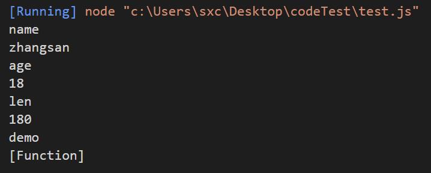
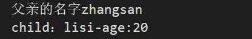
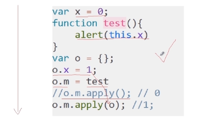

# JS面向对象

# 1.课程介绍

**JavaScript中的面向对象（oop）**

* 声明对象
  - 字面式声明
  - New
  - 构造方法声明
  - 工厂方法声明
  - 原型模式声明
  - 混合模式声明
* 遍历属性和方法
* 封装，原型，原型链
* 继承
  * 原型继承
  * 构造函数继承
  * call()
  * apply()
* 对象冒充

# 2.面向对象的概述

## 2.1 面向对象概述


```js
function F() {
  //自定义函数
}

console.log(F.prototype);//对象 F.proptotype指向一个内存地址，这个地址存储一个对象
console.log(F.prototype instanceof Object);//Object是js父对象
```


示例：

```js
var obj = new Function("a","b","return a+b");
var s = obj(2,3);

console.log(s);//5
```

对象分为两类

* 函数对象 （用new Function创建的对象）
* 普通对象 （其他的都是普通对象）

## 2.2 闭包


要理解闭包，首先要知道js中的变量作用域分两种：全局变量，局部变量。

在js中，函数内部可以读取全局变量。


有时候我们需要访问函数中的局部变量，js提供的解决办法是在f1里面再定义一个函数


分析：程序执行到c()其实就是访问b(),i在b外面定义，b可以访问到i

**特点：**

* 函数b 是在a内嵌套的
* 函数a需要返回函数b

**闭包有哪些作用？**

1. 读取函数内部变量
2. 让i变量的值保存在内存中  

来看下面的例子


**闭包的优缺点**

* 优点
  * 有利于封装
  * 可以访问局部变量
* 缺点
  * 内存占用浪费严重（i一直存在内存中）
  * 容易产生内存泄漏

# 3.对象声明方式

## 3.1 字面式


```js
//字面式声明对象
var person = {
  name:"zhangsan",
  age:26,
  sex:"man",
  eat:function(fds){
    console.log("我在吃"+fds);
  },
  play:function(game){
    console.log("我在玩"+game);
  }
}
```

## 3.2 new操作符后跟Object构造函数


```js
var box = new Object();
box.name = "zhangsan";
box.age = 50;
box.infos = function(str){
  return this.name+"--"+this.age+"---"+str;//this指向当前对象
}

var con = box.infos("eat eat!")
console.log(con);
```

## 3.3 构造方式声明对象


```js
//构造函数
function person(name,sex,age){
  this.name = name;//this.name属性 name是参数
  this.sex = sex;
  this.age = age;
  this.show = function(){
    console.log(this.name+"--"+this.sex+"-"+this.age);
  }
}

var person1 = new person("zhansgan","man",18);
person1.show();
```

## 3.4 工厂方式声明对象


**构造模式和工厂模式有什么不同？**

1. 构造方式不会显示创建对象，将属性赋值给this，不需要return对象
2. 工厂模式在方法内部创建object对象，并且返回object对象，属性和方法都是赋给object'对象的

## 3.5 原型模式声明对象


```js
//原型模式1
function test(){
}
test.prototype.color = "red";
test.prototype.heights="1.7";
test.prototype.width="1.2";
test.prototype.showInfo = function(){
  console.log(this.color+"--"+this.heights+"--"+this.width);
}
test.prototype.getinfo = function(){
  console.log("aaa");
}

//console.log(test.prototype instanceof Object);//propotype是每个函数，prototype是Object子对象

var car1 = new test();
console.log(car1.color);
car1.showInfo();
```

```js
//第二种用原型模式的方法
//原型模式2
function test(){
}
test.prototype={
  color:"red",
  heights:"1.7",
  width:"1.2",
  showInfo:function(){
    console.log(this.color+"--"+this.heights+"--"+this.width);
  },
  getinfo:function(){
    console.log("aaa");
  }
}

var car1 = new test();
console.log(car1.color);
car1.showInfo();
```

## 3.6 混合模式声明对象


```js
//混合模式：构造+原型
function blog(name,url,friend){
  this.name = name;
  this.url = url;
  this.friend = friend;
}

blog.prototype = {
  test:"awt",
  showinfo:function(){
    console.log(this.name+"-"+this.url+"-"+this.test);
  },
  gets:function(){
    console.log(this.friend);
  }
}

var peo = new blog("张三","www.baidu.com","李四");
console.log(peo.name);
peo.showinfo();
```

在开发项目时，用到的混合模式可能比较多

# 4.对象遍历与存储

## 4.1 对象的遍历


```js
//遍历对象属性,对象可以当作数组来处理 for in
var ren = {};
ren.name = "zhangsan";
ren.age = "18";
ren.len = "180";
ren.demo = function(){
  console.log(this.name);
}

for(var i in ren){
  console.log(i);//i是属性或方法名称
  console.log(ren[i]);//取得的是属性的值，或者是方法的定义代码
}
```




## 4.2 对象的存储


# 5.封装


```js
//封装
// function demo(){
//   var n = 1;//局部变量，在方法外部访问不到
//   function test(){
//     n++;
//   }
//   test();
//   return n;
// }
// console.log(demo());//2

function demo(){
  var n = 1;
  function test(){//特权方法
    return ++n;
  }
  return test;
}
var at = demo();
console.log(at());//2
```

# 6 继承

## 6.1 原型继承


```js
//js 继承
//原型：prototype对象来添加属性和方法
var person = function(){};
var p = new person();//三个阶段
```

这三个阶段分别是

1. `var p = { };`创建对象
2. `p.__proto__ = preson.prototype` 其中`__proto_`-是对象自带的一个属性
3. 创建对象（初始化对象）p --> person.call(p)

```js
console.log(person.prototype instanceof Object);//true
console.log(p.__proto__ instanceof Object);//true
console.log(p.__proto__ == person.prototype);//true
```

原型链：

```
var person = function(){
  __proto__
};
var p = new person();//三个阶段

console.log(p.name);//undeinfed
```

`p.name`不存在  --》 `__proto__`去查找`p.__proto__`对象 --》'p. --proto--.--proto--.... 

```js
var person = function(){}
person.prototype.say = function(){
  console.log("good wether");
}

var p = new person();
p.say();//p没有p方法
//p.__proto__ = person.prototype -->person有say方法
```

下面在举一个例子

```js
var person = function(){}
person.prototype.say = function(){
  console.log("good wether");
}
person.prototype.salary = 500;

var programmer = function(){};
programmer.prototype = new person();
programmer.prototype.wcd = function(){
  console.log("Tommore!");
}
programmer.prototype.salary = 1000;

var p = new programmer();
//var p = new programmer(); p.__proto__ = programmer.prototype = new person()
//上面也可以拆开有两部 var p1 = new person() ;programmer.prototype = p1
p.say();//p.__proto__ --> programmer.prototype == p1 -->p1.__proto__ == preson.prototype.say();
p.wcd();
console.log(p.salary);

//原型链实现过程
```

下面来讲**原型链继承**

```js
//js继承
//原型继承:用到原型链的概念
//父
function person(name,age){
  this.name = name;
  this.age = age;
}
person.prototype.sayHello = function(){
  console.log("属性name的值"+this.name);
}

//子
function student(){};
student.prototype = new person("lisi",18);//原型继承
student.prototype.grade=3;
student.prototype.test = function(){
  console.log(this.grade);
}

var stu = new student();
stu.sayHello();
console.log(stu.grade);

//过程分析
//首先找s.___proto__ = student.prototype = p1 然后找p1.__proto__ = person.prototype.sayHello()
```

## 6.2 构造继承


```js
//js继承
//构造函数继承
function parents(name){
  this.name = name;
  this.say = function(){
    console.log("父亲的名字"+this.name);
  }
}
function child(name,age){//继承parents
  this.pObj = parents;//用父对象来创建子对象
  this.pObj(name);//子对象的参数name传递到父对象中
  this.age = age;
  this.sayC = function(){
    console.log("child："+this.name+"-age:"+this.age);
  }
}

var p = new parents("zhangsan");
p.say();
var c = new child("lisi",20);
c.sayC();
//父对象被子对象继承，所有属性和方法都被传递到子对象中
```




## 4.3 call和apply继承


```js
//call apply
//call --> obj.call(方法,var1,var2,var3...)
//apply --> obj.apply(方法,[var1,var2,var3]);
function person(name,age,len){
  this.name = name;
  this.age = age;
  this.len = len;
  this.say = function(){
    console.log(this.name+"-"+this.age+"-"+this.len);
  }
}
//call继承
function student(name,age){
  person.call(this,name,age);
}
//apply继承
function teacher(name,age,len){
  person.apply(this,[name,age,len]);
}

var per = new person("zhangsan",25,172);
per.say();
var stu = new student("lisi",18);
stu.say();
var tea = new teacher("wangwu",45,180);
tea.say();
```


# 7 关键词


## 7.1 instanceof

```js
//关键词
//instanceof 检测变量是否是对象的实例
var arr = new Array();
console.log(arr instanceof Array);//true
console.log(arr instanceof Object);//true

function test(){}
var obj = new test();
console.log(obj instanceof test);//true
console.log(obj instanceof Object);//true 所有对象本质上都是继承Object

```

## 7.2 delete

1. delete可以删除对象中的属性和方法

   ```js
   function fun(){
     this.name = "zhangsan";
     this.say = function(){
       console.log(this.name);
     }
   }
   var obj = new fun();
   
   delete obj.name;//删除name属性
   delete obj.say;
   console.log(obj.name);//undefined
   obj.say();//obj.say is not a function
   ```

2. delete不可以删除变量

   ```js
   var demo = "lisi";
   delete demo;//删除不了变量
   console.log(demo);//仍然输出lisi
   ```

3. delete不可以删除原型链上的属性和方法

   ```js
   function Fun(){
   
   }
   
   Fun.prototype.greeting = function(){
     console.log("Hello!");
   }
   
   var obj = new Fun();
   delete obj.greeting;
   obj.greeting();//仍输出hello
   ```

   在Fun原型上定义了一个方法greeting，delete是不能删除它的，所以最后调用成功。

## 7.3 call & apply

* 通过call调用方法

```js
//关键词
//call apply
function add(a,b){
  console.log(a+b);
}
function subs(a,b){
  console.log(a-b);
}

add.call(subs,5,3);//8,把subs替换成了add 其实调用的是add(5,3),subs只能引用一个存在的对象
add.apply(subs,[5,3]);//8

```

* 通过call/apply把一个实例的方法传递给另外一个实例

```js
function animal(){
  this.name="ani";
  this.showName = function(){
    console.log(this.name);
  }
}

function cat(){
  this.name = "cat";
}

var an = new animal();
var c = new cat();
an.showName.call(c,",");//cat 通过call方法，将showName方法传递给了cat使用
an.showName.apply(c,[]);
```

## 7.5 arguments

* 每个函数都有一个Arguments对象的实例arguments，引用函数的参数（实参）
* 可以用数组下标方式引用arguments对象
* arguments.length 代表参数个人
* arguments.callee 代表引用函数自身

```js
function test(a,b,c){
  console.log(arguments.length);
  console.log(arguments[0]);//arguments如果是表示参数，可以遍历
  console.log(arguments.callee);
}
test(1,2,3);
```


## 7.6 callee

* **callee是arguments的一个属性**
* **callee就是指代函数本身**

```js
//callee:返回正在执行的functions对象，也就是指向function对象的内容
//arguments.callee 这个属性的默认值就是:正在执行的function对象

function demo(){
  console.log(11);
  console.log(arguments.callee);//把callee当作属性，弹出的就是函数的内容
//   console.log(arguments.callee());//会陷入死循环导致"Maxinum call statck size exceeded
}

demo();
```


因为arguments.callee()会不断地循环，所以有时候可以用其实现递归

```js
// var sum = function(n){
//   if(n<1){
//     return 0;
//   }else{
//     return n+ sum(n-1);
//   }
// }

var sum = function(n){
  if(n<=1){//注意一定终止条件，不然死循环了
    return 1;
  }else{
    return n+arguments.callee(n-1);//callee()当作方法处理，相当于在函数内部调用了本函数
  }
}

console.log(sum(10));//55
```

## 7.7 this

1. this函数调用，在函数内部定义属性/变量

   ```js
   // function test(){
   //   this.x = 1;//this全局变量，就是global
   //   console.log(this.x);
   // }
   // test();
   
   //多为下面的写法
   var x = 1;
   function test(){
     this.x = 0;//改变了全局变量x值
   }
   test();
   console.log(x);
   ```

2. this作为方法调用，主要存在与构造函数内，this指当前对象

   ```js
   
   function test(){
     this.name = "zhangsan";//this表示当前对象 t
     this.age = 18;
   }
   var t = new test();
   console.log(t.name);
   ```

3. 在apply call里面，this是第一个参数（这里存疑！！！）

   

# 8 对象冒充


```js
//对象冒充
function person(name,age){
  this.name = name;//特权属性
  this.age = age;
  this.sayHi = function(){//特权方法
    console.log("hi");
  }
}
person.prototype.walk = function(){
  console.log("walk...");//不属于person，属于person.prototype
}

function student(name,age,grade){
  this.newMethod = person;//冒充person对象,传递特权属性和特权方法给子类
  this.newMethod(name,age);
  this.grade = grade;
}

var s1 = new student("zhangsan",15,5);//s1是student对象，继承person，拥有person所有属性和方法
console.log(s1.name);
console.log(s1.age);
console.log(s1.grade);
s1.sayHi();//hi
s1.walk();//undefined
//注意：s1继承了person中的特权方法和属性，没有继承共有方法和属性
```


