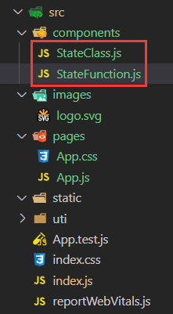
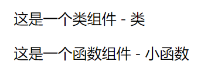
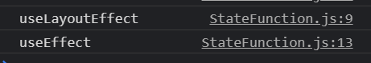

# React Hooks快速入门

# ch1 概述

## 1.1 React

**三大框架对比**

| Angular                | Vue            | React                      |
| ---------------------- | -------------- | -------------------------- |
| 双向数据绑定           | 双向数据绑定   | 自由度很高                 |
| 强大的、丰富的模板指令 | 轻量、简洁易用 | 一切都是JavaScript         |
| 模板能力非常强大       | 模板能力较强   | 可以与第三方类库很好的配合 |
| 静态路由               | 动态路由       | 单向数据流                 |
| 代码自由度较低         | 插件化         |                            |

**React新版本解读**

* render支持返回数组和字符串
* 错误边界
* 提升SSR渲染速度，支持流式渲染
* 减少文件体积
* 生命周期函数更新：由于异步渲染的改动，可能会导致`componentWillMount，componentWillReceiveProps，componentWillUpdate`，所以抛弃三个生命周期函数
* `createContext`：不必一层层传递，可使用此方法指定生效范围
* `createRef`：同上
* hooks：开发方式大更新

## 1.2 Hooks

**Hooks出现的意义**

* hooks之间的状态是独立的，有自己独立的上下文，不会出现混淆状态的情况
* 让函数组件有了状态管理
* 解决了组件树不直观、类组件难维护、逻辑不易复用的问题
* 由于函数每次渲染都会执行hook，所以React多了一个状态控制，传入第二个参数，这样就可以避免函数重复执行的副作用

**为什么要学习Hooks**

* 高效开发
* 提高组件复用性
* 提高逻辑复用性
* 提升性能
* 实现更复杂的功能

**Hooks的具体使用场景**

* 利用hooks取代生命周期函数
* 让函数组件加上状态
* 使用hooks实现组件辅助函数
* 处理发送请求
* 存储数据
* 做好行能优化
* ...

# Ch2 项目必备——Hooks基础

> 直接用create-react-app创建项目即可

## 2-1 拥抱函数式编程——useState

**UseState**

* 作用：
  * 给函数组件添加状态
* 注意事项：
  * 初始化以及更新state
  * 用来声明状态变量

代码示例：



StateClass.js

```js
// 类组件
import React from 'react';

class StateClass extends React.Component{
  constructor(){
    super();
    this.state = {
      name:'类'
    }
  }

  render(){
    return(
      <div>
        这是一个类组件 - {this.state.name}
      </div>
    )
  }
}

export default StateClass;
```

StateFunction.js

```js
// 函数组件
import React,{useState} from 'react';

// 使用useState创建状态
// 1. 引入useState
// 2. 接收一个参数作为初始值
// 3. 返回一个数组，第一个值为状态，第二个为改变状态的函数
function StateFunction(){
  const [name,setName] = useState('函数');
  return (
    <div onClick={()=>{setName('小函数')}}>
      这是一个函数组件 - {name}
    </div>
  )
}

export default StateFunction;
```

App.js

```js
import StateClass from '../components/StateClass';
import StateFunction from '../components/StateFunction';
import './App.css';

function App() {
  return (
    <div className="App">
      <StateClass></StateClass>
      <StateFunction></StateFunction>
    </div>
  );
}

export default App;

```



## 2-2 解决副作⽤——useEffect

**useEffect**

* 作用：
  * 给没有生命周期的组件，添加结束渲染的信号
* 注意事项：
  * 在render之后执行

**举例1：**

函数组件中的useEffect相当于类组件里的 componentDidMount()，例如对下面这段代码，接受一个函数作为参数，在结束渲染时执行

```jsx
function StateFunction(){
  const [name,setName] = useState('函数');

  useEffect(()=>{
    console.log("函数组件结束渲染");
  })

  return (
    <div onClick={()=>{setName('小函数')}}>
      这是一个函数组件 - {name}
    </div>
  )
}
```

当进入页面时打印一次"函数组件结束渲染"，点击div时重新渲染后，又打印一次"函数组件结束渲染"

**举例2：**

useEffect接受第二个参数：依赖列表，只有依赖更新时，才会执行函数

```jsx
// 函数组件
import React,{useState,useEffect} from 'react';

// 接受一个函数作为参数
// 接受第二个参数：依赖列表，只有依赖更新时，才会执行函数
// 返回一个函数，先执行返回函数，再执行参数函数
function StateFunction(){
  const [num,setNum] = useState(1);

  useEffect(()=>{
    console.log("函数组件结束渲染");
  },[num])

  return (
    <div onClick={()=>{setNum(num => num+1)}}>
      这是一个函数组件 - {num}
    </div>
  )
}

export default StateFunction;
```

备注：``更新函数setNum，可以接收一个修改值setNum(1)，或是一个修改函数setNum(num => num + 1)。

每次点击div时，num+1，就会打印一次"函数组件结束渲染"

```jsx
  useEffect(()=>{
    console.log("函数组件结束渲染");
  },[])
  // 如果不依赖于任何状态，那么只会在进入页面时执行一次函数 console.log("函数组件结束渲染");
```

**举例3：**

useEffect可以返回一个函数，先执行返回函数，再执行参数函数。eg 可以在返回函数中做事件解绑，在参数函数中绑定事件，这样就能保证body上只绑定了一个事件

```jsx
// 函数组件
import React,{useState,useEffect} from 'react';

// 接受一个函数作为参数
// 接受第二个参数：依赖列表，只有依赖更新时，才会执行函数
// 返回一个函数，先执行返回函数，再执行参数函数
function StateFunction(){
  const [num,setNum] = useState(1);

  useEffect(()=>{
    console.log("函数组件结束渲染");
    document.body.addEventListener('ooo',()=>{});
    return ()=>{
      document.body.removeEventListener('ooo',()=>{})
      console.log('销毁');
    }
  },[num])

  return (
    <div onClick={()=>{setNum(num => num+1)}}>
      这是一个函数组件 - {num}
    </div>
  )
}

export default StateFunction;
```

## 2-3 监测DOM——useLayoutEffect

**useLayoutEffect**

* 作用：
  * dom更新完成后执行某个操作
* 注意事项：
  * 有dom操作的副作用hooks
  * 在dom更新之后执行

**举例1：**

useLayoutEffect类似于类组件中的componentWillMount（已废弃），但执行时机永远在useEffect之前

```jsx
// 函数组件
import React,{useState,useEffect,useLayoutEffect} from 'react';

// useEffect和useLayoutEffect相似的用法：
// 接受一个函数作为参数
// 接受第二个参数：依赖列表，只有依赖更新时，才会执行函数
// 返回一个函数，先执行返回函数，再执行参数函数

// 不同点：
// useEffect 执行时机在render之后
// useLayoutEffect 执行时机在DOM更新之后
function StateFunction(){
  const [num,setNum] = useState(1);

  useLayoutEffect(()=>{
    console.log("useLayoutEffect");
    document.body.addEventListener('a',()=>{})
    return ()=>{
      document.body.removeEventListener('a',()=>{})
    }
  },[num])

  useEffect(()=>{
    console.log("useEffect");
  },[num])

  return (
    <div onClick={()=>{setNum(num => num+1)}}>
      这是一个函数组件 - {num}
    </div>
  )
}

export default StateFunction;
```



## 2-4 组件跟随状态更新— useMemo

**useMemo**

* 作用：
  * 让组件中的函数跟随状态更新
* 注意事项：
  * 优化函数组件中的功能函数

```jsx
// 函数组件
import React,{useState,useMemo} from 'react';

function StateFunction(){
  const [num,setNum] = useState(1);

  // 让函数组件中的功能函数根据它的状态去做更新
  // useMemo使用方法
  // 1.接口一个函数作为参数
  // 2.第二个参数为依赖列表，与useEffe，useLayoutEffet类似
  // 3.返回的是一个值
  const getDoubleNum = useMemo(()=>{
    console.log("获取双倍number")
    return 2*num;
  },[num])

  return (
    <div onClick={()=>{setNum(num => num+1)}}>
      这是一个函数组件 - {getDoubleNum}
    </div>
  )
}

export default StateFunction;
```

## 2-5 组件跟随状态更新— useCallback

**useCallback**

* 作用：
  * 跟随状态更新执行
* 注意事项：
  * 只有依赖项改变的时候才会执行
  * `useMemo(()=>fn,deps)`相当于`useCallback(fn,deps)`

**举例1：**

 在使用方法上，useCallback与useMemo相同

 不同点1：useMemo返回的是一个值，useCallback返回的是一个函数

```jsx
// 函数组件
import React,{useState,useCallback} from 'react';

function StateFunction(){
  const [num,setNum] = useState(1);
  const [age,setAge] = useState(18);

  // 在使用方法上，useCallback与useMemo相同
  // 不同点1：useMemo返回的是一个值，useCallback返回的是一个函数
  const getDoubleNum = useCallback(()=>{
    console.log("获取双倍number")
    return 2*num;
  },[num])

  return (
    <div onClick={()=>{setNum(num => num+1)}}>
      这是一个函数组件 - {getDoubleNum()} age的值为--  {age}
       {/*注意这里的getDoubleNum是一个函数*/}
    </div>
  )
}

export default StateFunction;
```

**举例2：**

在使用方法上，useCallback与useMemo相同
不同点2：useMemo缓存的是一个值，useCallback缓存的是一个函数

```jsx
// 函数组件
import React,{useState,useCallback,useEffect} from 'react';

const set = new Set();

function StateFunction(){
  const [num,setNum] = useState(1);
    
  // 在使用方法上，useCallback与useMemo相同
  // 不同点2：useMemo缓存的是一个值，useCallback缓存的是一个函数
  const getDoubleNum = useCallback(()=>{
    console.log("获取双倍number")
    return 2*num;
  },[num])

  set.add(getDoubleNum);
  console.log("set size:",set.size);

  return (
    <div onClick={()=>{setNum(num => num+1)}}>
      这是一个函数组件 - {getDoubleNum()} 
      <Child callback={getDoubleNum}></Child>
    </div>
  )
}

export default StateFunction;
```

每次点击div时（即更新num时），打印出的size值不断+1，即打印出`set size:1`，`set size:2`，`set size:3`，`set size:4`.....

**举例3**

当前函数更新会触发子组件的重新渲染

如果当前需要给子组件传递props数据，`<Child callback={getDoubleNum}></Child>`，这个时候如果getDoubleNum这个函数没有更新，就不会触发child子组件的渲染，也这是一个性能优化。

```jsx
import React,{useState,useCallback,useEffect} from 'react';

function StateFunction(){
  const [num,setNum] = useState(1);

  const getDoubleNum = useCallback(()=>{
    console.log("获取双倍number")
    return 2*num;
  },[num])

  function Child(props){
    console.log(props.callback);
 
    useEffect(() => {
      console.log("callback更新了");
    }, [props.callback])

    return <div>Child</div>
  }

  return (
    <div onClick={()=>{setNum(num => num+1)}}>
      这是一个函数组件 - {getDoubleNum()}
      <Child callback={getDoubleNum}></Child>
    </div>
  )
}

export default StateFunction;
```


## 2-6 长久保存数据—— useRef

**useRef**

* 作用：
  * 长久保存数据
* 注意事项
  * 返回一个子元素索引，此索引在整个生命周期中保持不变
  * 对象发生改变，不通知。属性变更不重新渲染。

**示例1**

在整个生命周期中保存一个数据不变，在之后的生命周期中都可以使用

```jsx
// 函数组件
import React,{useState,useEffect,useRef} from 'react';

const set = new Set();

function StateFunction(){
  const [num,setNum] = useState(1);

  const ref = useRef();
  // 1. 保存一个值，在整个生命周期中保持不变
  useEffect(()=>{
    ref.current = setInterval(()=>{
      setNum(num=>num+1)
    },500)
  },[])


  useEffect(()=>{
    if(num>10){
      console.log('超过10了',ref.current)
      clearInterval(ref.current);
    }
  },[num])

  return (
    <div>
      这是一个函数组件 - {num}
    </div>
  )
}

export default StateFunction;
```


**举例2：**

ref的更新不会触发事件的操作

```jsx
// 函数组件
import React,{useState,useEffect,useRef} from 'react';

function StateFunction(){
  const [num,setNum] = useState(1);

  const ref = useRef();
  useEffect(()=>{
    // 2. 重新赋值ref.current 不会触发重新渲染
    ref.current = '111';
  },[])

  return (
    <div>
      这是一个函数组件 - {ref.current}
    </div>
  )
}

export default StateFunction;
```

改变ref.cuurent但是并不会触发整个试图的重新渲染


## 2-7 组件之间共享状态—

## 2-8 复杂逻辑简单化——


## 2-9 个性化解决方案——


# ch3 项目实践——购物车功能

- [视频：4-1 购物车实现-1(06:17)](https://www.imooc.com/video/22724)
- [视频：4-2 购物车实现-2(21:29)](https://www.imooc.com/video/22725)


# ch4 总结

- [视频：5-1 课程总结(06:13)](https://www.imooc.com/video/22726)