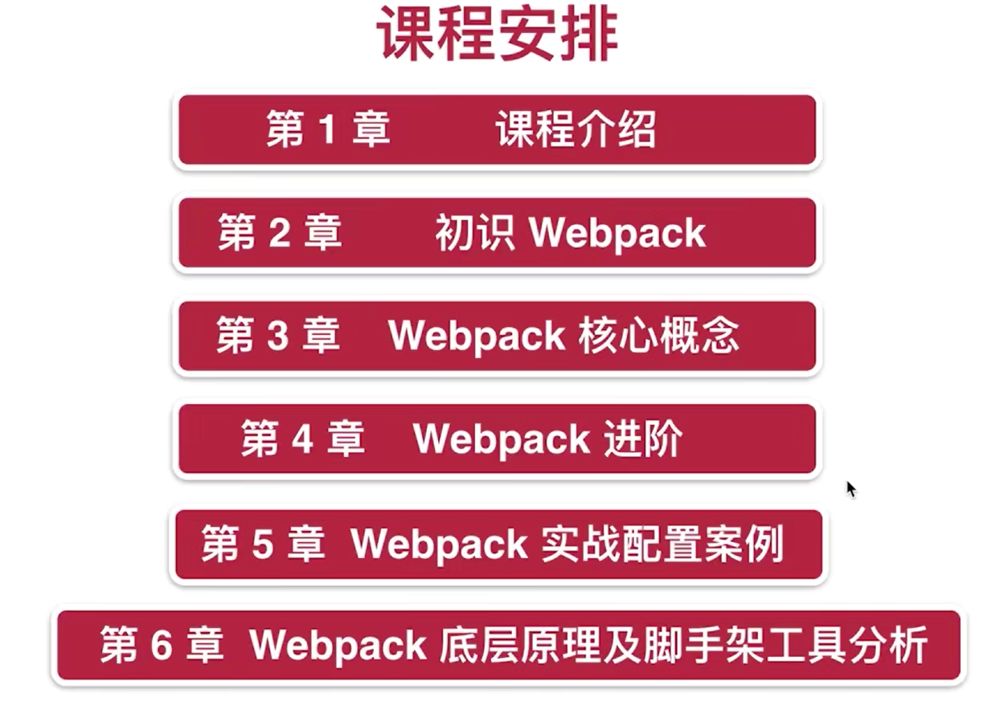
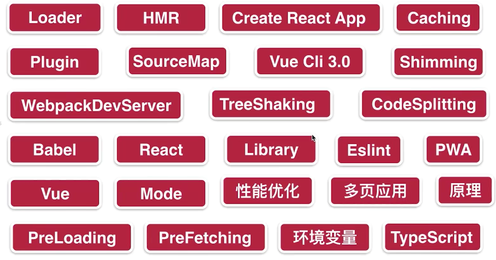
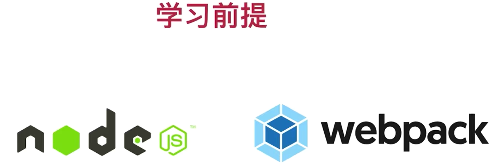
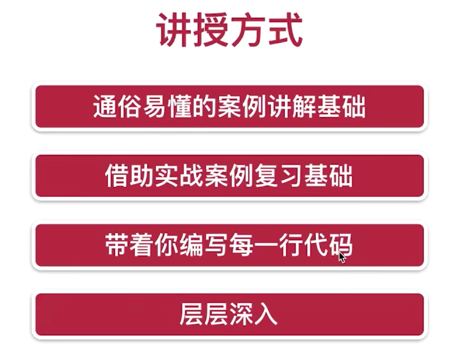
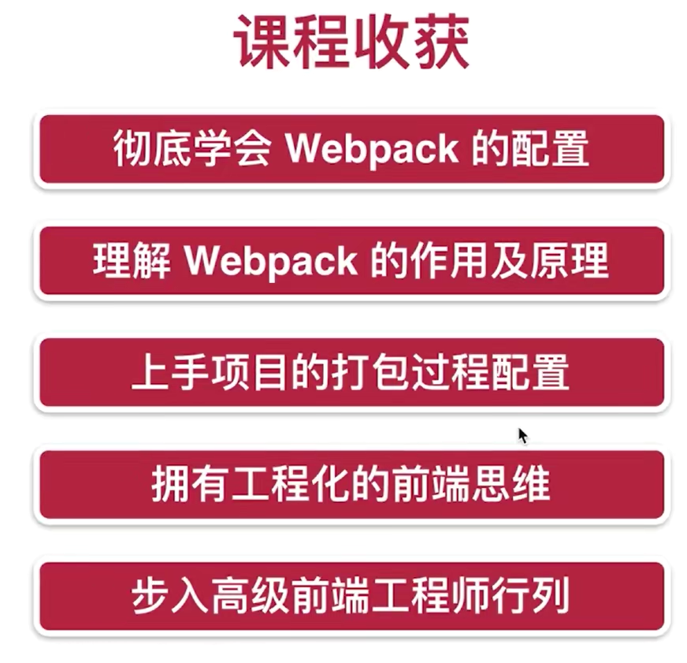

# WebPack4

# ch1 课程导学

# ch2 Webpack 初探

2-1 webpack 究竟是什么？

2-2 什么是模块打包工具？

2-3 Webpack的正确安装方式

2-4 使用Webpack的配置文件

2-5 浅析 Webpack 打包输出内容

# ch3Webpack 的核心概念

3-1 什么是 loader

3-2 使用 Loader 打包静态资源（图片篇）

3-3 使用 Loader 打包静态资源（样式篇 - 上）

3-4 使用 Loader 打包静态资源（样式篇 - 下）

3-5 使用 plugins 让打包更便捷

3-6 Entry 与 Output 的基础配置

3-7 SourceMap 的配置

3-8 使用 WebpackDevServer 提升开发效率

3-9 Hot Module Replacement 热模块更新（1）

3-10 Hot Module Replacement 热模块更新（2）

3-11 使用 Babel 处理 ES6 语法（1）

3-12 使用 Babel 处理 ES6 语法（2）

3-13 Webpack 实现对React框架代码的打包

# ch4 Webpack 的高级概念

4-1 Tree Shaking 概念详解

4-2 Develoment 和 Production 模式的区分打包

4-3 Webpack 和 Code Splitting（1）

4-4 Webpack 和 Code Splitting（2）

4-5 SplitChunksPlugin 配置参数详解（1）

 4-6 SplitChunksPlugin 配置参数详解（2）

4-7 Lazy Loading 懒加载，Chunk 是什么？

4-8 打包分析，Preloading, Prefetching

4-9 CSS 文件的代码分割

4-10 Webpack 与浏览器缓存( Caching )

4-11 Shimming 的作用

4-12 环境变量的使用方法

# ch5 Webpack 实战配置案例讲解

5-1 Library 的打包

 5-2 PWA 的打包配置

5-3 TypeScript 的打包配置

5-4 使用 WebpackDevServer 实现请求转发

5-5 WebpackDevServer 解决单页面应用路由问题

5-6 EsLint 在 Webpack 中的配置（1）

5-7 EsLint 在 Webpack 中的配置（2）

 5-8 webpack 性能优化(1)

5-9 webpack 性能优化(2)

5-10 Webpack 性能优化(3)

5-11 Webpack 性能优化(4)

 5-12 webpack性能优化(5)

5-13 多页面打包配置

# ch6 Webpack 底层原理及脚手架工具分析

6-1 如何编写一个 Loader（1）

6-2 如何编写一个 Loader（2）

6-3 如何编写一个 Plugin

6-4 Bundler 源码编写（模块分析 1）

6-5 Bundler 源码编写（模块分析 2）

6-6 Bundler 源码编写（ Dependencies Graph ）

 6-7 Bundler 源码编写（ 生成代码 ）

# ch7 Create-React-App 和 Vue-Cli 3.0脚手架工具配置分析

7-1 通过 CreateReactApp 深入学习 Webpack 配置（1）

7-2 通过 CreateReactApp 深入学习 Webpack 配置（2）

7-3 Vue CLI 3 的配置方法及课程总结（1）

7-4 Vue CLI 3 的配置方法及课程总结（2）