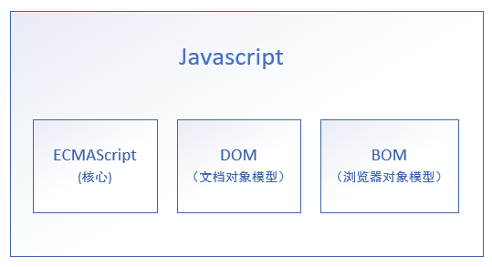

《Javascript高级程序设计》笔记

# ch1 Javascript介绍

## 1.2 Javascript实现

一个完整的Javascript实现应该由以下三个不同的部分组成



* **ECMAScript，提供核心语言功能**
* **文档对象模型（DOM），提供访问和操作网页内容的方法和接口**
* **浏览器对象模型（BOM），提供与浏览器交互的方法和接口**

### 1.2.2 ECMAScript

 ECMAScript就是对实现该标准规定的各个方面内容的语言的描述

### 1.2.2 DOM

**DOM**是针对XML但经过扩展用于HTML的应用程序编程接口（API）。

DOM把整个页面映射为一个**多层节点结构**，HTML或XML页面中的每个组成部分都是某种类型的节点，这些节点又包含着不同类型的数据

### 1.2.3 BOM

BOM处理浏览器窗口和框架

# ch2 在HTML中使用Javascript

## 2.1 `<scipt>`

| 属性    | 值                    | 描述                                             |      |
| ------- | --------------------- | ------------------------------------------------ | ---- |
| async   |                       | 表示应该立即下载脚本，但不应妨碍页面中的其他操作 |      |
| charset |                       |                                                  | 忽略 |
| defer   |                       |                                                  |      |
| src     |                       | 表示要执行代码的外部文件                         |      |
| type    | text/javascript(默认) |                                                  |      |

使用`<script>`元素的方式

1. 页面中嵌入js代码
   * 包含在`<script>`内的js代码将被从上至下依次解释
   * 在解释器对`<script>`元素内的所有代码求值完毕以前，页面中的其余内容都不会被浏览器加载或显示
2. 包含外部js文件
   * 在解析外部js文件（包括下载该文件）时，页面的处理也会暂时停止

### 2.1.1 标签的位置

把Js引用放在body中页面内容的后面，可以避免加载js时出现的页面的延迟空白。

```html
<body>
   <!--这里放内容-->
    <script type="text/javascript" src="example.js"></script>
</body>
```

### 2.1.2 延迟脚本

script的**defer**属性，表明**脚本在执行时不会影响页面的构造，即脚本会被延迟到页面都解析完毕后运行。**

在scipt中设置defer属性，相当于告诉浏览器立即下载，但延迟执行

> 把延迟脚本放在页面底部是最佳选择！！

### 2.1.3 异步脚本

**async**属性，告诉浏览器立即下载文件，**但是标记为async的脚本并不保证按照指定它们的先后顺序执行**

> 小结：
>
> * 使用defer属性可以让脚本在文档完全呈现之后再再执行。延迟脚本总是按照指定它们的顺序执行
> * 使用async属性可以表示当前脚本不必等待其他脚本，也不必阻塞文档呈现。不能保证异步脚本按照他们在页面中出现的顺序执行
> * 基于可维护性，浏览器可缓存的原因，尽可能使用外部文件来包含js代码。

# ch3 基本概念

## 3.1 语法

### 3.1.4 严格模式

ES5引入了 **严格模式（strict mode）**的概念。严格模式是为js定义了一种不同的解析与执行模型

```js
"use strict"
```

## 3.3 变量

ECMAscipt的变量是松散类型—— 就是可以用来保存任何类型的数据，即每个变量仅仅是一个用于保存值的占位符而已

## 3.4 数据类型

5种简单数据类型：Undefined Null Boolean Number String

1种复杂数据类型：Object（本质上是一组无序的名值对组成）

### 3.4.1 typeOf

是一个操作符而不是函数，所以（）不是必需

```
typeOf 95 //ok
typeOf(95) //ok
typeof null //Object,特殊值null被认为是一个空的对象引用
```

### 3.4.2 Undefined

### 3.4.3 Null类型

null值表示一个空对象指针，而这也正是使用typeof检测null会返回“object”的原因

```js
var car = null;
alert(typeof car);//"object"

alert(null == undefined);//true
```

### 3.4.4 Boolean类型

调用`Boolean()函数`，会返回一个Boolean值

### 3.4.5 Number

1. **浮点数值**

> 关于浮点数值计算会产生舍入误差的问题，有一点需要明确：这是使用基于IEEE754数值的浮点计算的通病，其他使用相同数值格式的语言也存在这个问题

2. **数值范围**

   ECMAScipt能表示的最小数值范围Number.MIN_VALUE ~ Number.MAX_VALUE

   如果某次计算的结果超出js数值范围，该数值会被自动转换成特殊的Infinity。要确定一个数值是不是有穷的，可以使用`isFinite()`函数。

   ```
   var result = Number.MAX_VALUE + Number.MAX_VALUE;
   console.log(isFinite(result));//false
   ```

3. **NaN**

   (Not a number)是一个特殊的数值，用于表示一个本来要返回数值的操作数未返回数值的情况（这样就不会抛出错误了）

   > 注意：在ECMAScript中，任何数值除以非数值会返回NaN，因此不会影响其他代码的执行。

   **Nan有两个特点**

   * 任何设计NaN的操作都会返回Nan
   * NaN与任何值都不相等，包括NaN本身

   > **isNan()**函数接受一个参数，该函数帮我们确定这个参数是否“不是数值”，它接受一个值后，会尝试将这个值转换为数值。某些不是数值的值会直接转换为数值，例如“10”或Boolean值，而任何不能被转换为数值的值都会导致这个函数返回true
   >
   > ```js
   > console.log(isNaN(NaN));//true
   > console.log(isNaN(10));//false
   > console.log(isNaN("10"));//false
   > console.log(isNaN("blue"));//true不能转换为数值
   > console.log(isNaN(true));//flase 可以被转换成整数1
   > ```

4. 数值转换

   3个函数可以把非数值转换为数值：

   * `Number()` 用于任何数据类型,
   * `parseInt() parseFloat()`用于把字符串转换成数值
     * `parseInt()`的第二参数：转换时使用的基数（即多少进制），多数情况下解析的都是十进制，可以始终将10作为第二个参数
     * `parseFloat()`从第一个字符开始解析每个字符，知道字符串末尾或者解析到遇见一个无效的浮点数字符位置。例如22.34.5会被转换为22.34
     * `parseFloat()`始终会忽略前导的零

### 3.4.6 String

String类型用于表示由零或多个16位Unicode字符组成的字符序列，即字符串 

1. 字符字面量

   转义序列时一些特殊的字符字面量，例如`\n,\t,\b`

2. 字符串的特点

   ECMAScript中的字符串是不可变的，也就是说，字符串一旦创建，它们的值就不能改变，要改变某个变量保存的字符串，首先要销毁原来的字符串，然后再用另一个包含新值的字符串填充该变量。

3. 转换为字符串 `toString()`

### 3.4.7 Object类型

> 在ECMAScript中，Object类型是所有它的实例的基础。换句话说，Object类型所具有的任何属性和方法也同样存在于更具体地对象中

Object的属性和方法

|                              |                                                              |      |
| ---------------------------- | ------------------------------------------------------------ | ---- |
| constructor                  | 保存用于创建当前对象的函数                                   |      |
| hasOwnProperty(propertyName) | 检查给定的属性在当前对象实例中（而不是在实例的原型中）是否存在 |      |
| isPrototypeOf(object)        | 检查传入的对象是否是当前对象的原型                           |      |
| toLocaleString()             | 返回对象的字符串表示，该字符串与执行环境的地区对应           |      |
| toString()                   | 返回对象的字符串表示                                         |      |
| valueOf()                    | 返回对象的字符串，数值或布尔值表示，通常与toString()方法的返回值相同 |      |
|                              |                                                              |      |

因为在ECMAScript中Object是所有对象的基础，因此所有对象都具有这些基本的属性和方法

## 3.5 操作符

### 3.5.1 一元操作符

### 3.5.2 位操作符

ECMAScript中所有数值都以IEDD-754 64位存储，但位操作符并不直接操作64位的值，而是先将64位的值转换成32位的整数，然后执行操作，最后再将结果转换为64位。

对于有符号的整数。正数以纯二进制格式存储，负数使用二进制补码

1. 按位非NOT
2. 按位与 AND
3. 按位或 OR
4. 按位异或 XOR
5. 左移
6. 有符号的右移
7. 无符号右移

### 3.5.3 布尔操作符

1. 逻辑非
2. 逻辑与
3. 逻辑或

### 3.5.4 乘性操作符

ECMAScript定义了3个乘性操作符：乘法，除法和求模

1. 乘法

   ```js
   //特殊情况
   Infinite × 0 = NaN
   Infinite × 非零数值 = Infinite 或 -Infinite
   ```

2. 除法

   ```js
   0/0 = NaN
   ```

3. 求模

   ```
   
   ```

### 3.5.5 加性操作符

1. 加法

   ```js
   //特殊情况
   NaN + 2 = NaN
   +0 + +0 = +0
   -0 + -0 = -0
   +0 + -0 = +0
   ```

   * 如果两个操作数都是字符串，进行字符串拼接
   * 只有一个操作数是字符串，将另一个操作符转换成字符串后再进行拼接
   * 有一个操作数是对象，数值或布尔值，则调用toString()取得相应的字符串，再按上述处理（undefied和null调用String()分别得到"undefined"和"null"）

2. 减法

   ```js
   //特殊情况
   NaN - 2 = NaN
   +0 - +0 = +0
   -0 - -0 = +0
   +0 - -0 =-0
   ```

   * 如果有一个操作数是对象。则调用对象的valueOf()取得表示该对象的数值。如果对象没有valueOf()方法，则调用其toString()方法并将得到的字符串转换成数值

### 3.5.6 关系操作符

`<  > <= >=`

注意：两个操作数都是字符串，则比较两个字符串字符编码值，实际是比较两个字符串中对应位置的每个字符的字符编码（大写字母的编码全部小于小写字母的字符编码）

```
toLowerCase()//转化为小写
```

注意：任何操作数与NaN进行关系比较，结果都是false

### 3.5.7 相等操作符

两组操作符

* **相等和不相等** —— 先转换再比较
* **全等和不全等** —— 仅比较而不转换

1. 相等和不相等 == 

   这个操作符会先转换操作数（通常称为 **强制转型**），然后再比较它们的相等性

   | 表达式            | 值    |      |
   | ----------------- | ----- | ---- |
   | null == undefined | true  |      |
   | 5 == NaN          | false |      |
   | NaN == NaN        | false |      |
   | false == 0        | true  |      |

2. 全等和不全等 ===

   比较之前不转换操作数

   ```js
   null == undefined //true,类似的值
   null === undefined //false，不同类型的值
   ```

### 3.5.8 条件操作符

```
var max = (num1>num2) ? num1 : num2;
```

### 3.5.9 赋值操作符

= 

### 2.5.10 都好操作符

```js
var num1=1,num2=2,num3=3;
```

## 3.6 语句

### 3.6.4 for

### 3.6.5 for-in语句

for-in可以用来枚举对象的属性

```js
for(var propName in windows){
	document.write(propName);
}
```

注意：ECMAScript对象的属性没有顺序，上述所有属性都会被返回一次，但返回的先后次序因浏览器而异

### 3.6.6 label语句

使用label语句可以在代码中添加标签

```
label:statement
```

### 3.6.7 break和continue语句

break立即退出循环，强制执行循环后面的语句

continue退出循环后会从循环的顶部继续执行

注：break和continue都可以与label语句联合使用，从而返回代码中特定的位置

### 3.6.8 with语句

with语句的作用是将代码的作用域设置到一个特定的对象中

`with(expression) statement`

定义width语句的目的主要是为了简化多次编码同一个对象的工作，例如

```js
var qs = location.search.substring(1);
var hostName = location.hostname;
var url = location.href;
```

上面几行代码都包含location对象。使用with改写如下:

```js
with(location){
  var qs = search.substring(1);
  var hostName = hostname;
  var url = href;
}
```

> with会导致性能下降，给代码调试带来困难那，所以开发大型应用程序时，不建议使用with

## 3.7 函数

### 3.7.1 理解参数

ECMAScript中的参数在内部是用一个数组来表示的。函数接收到的始终都是这个数组，而不关心数组中包含哪些参数。**实际上，在函数体内可以通过arguments对象来访问这个参数数组，从而获取传递给函数的每一个参数**

通过访问arguments对象的length属性可以获知有多少个参数传递给了函数，开发人员可以利用这一先让函数能够接受任意个参数并分别实现适当的功能

```js
function doAdd(){
  if(arguments.length == 1){
    console.log(arguments[0]+10);
  }else if(arguments.length =2 ){
    console.log(arguments[0]+arguments[1]);
  }
}

doAdd(10);
doAdd(30,20);
```

### 3.7.2 没有重载

对于连个同名的函数，后定义的函数会覆盖先定义的函数

## 3.8 小结

* ECMAScript中的基本数据类型包括 Undefined Null Boolean Number String
* 不区分整数和浮点数，Number类型可用于表示所有数值
* 一种复杂的数据类型 Object，该类型是这门语言中所有对象的基础类型
* 严格模式位这门语言中容易出错的地方施加了限制
* 无须指定函数的返回值，因为任何ECMAScript函数都可以在任何时候返回任何值
* 实际上，未指定返回值的函数返回的是一个特殊的undefined值
* ECMAScript中也没有函数签名的概念，因为其函数参数是以一个包含0或多个值的数组的形式传递的
* 可以向ECMAScirpt函数传递任意数量的参数，并且可以通过arguments对象来访问这些参数
* 由于不存在函数签名的特性，ECMAScript函数不能重载


