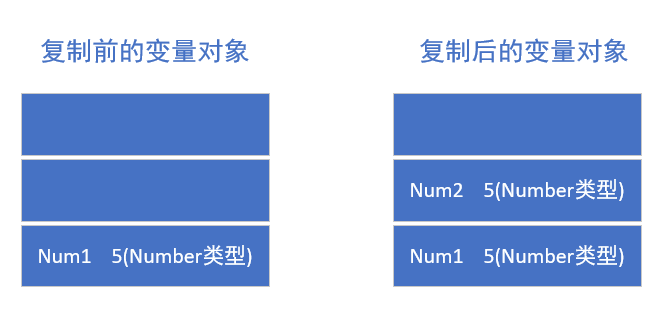
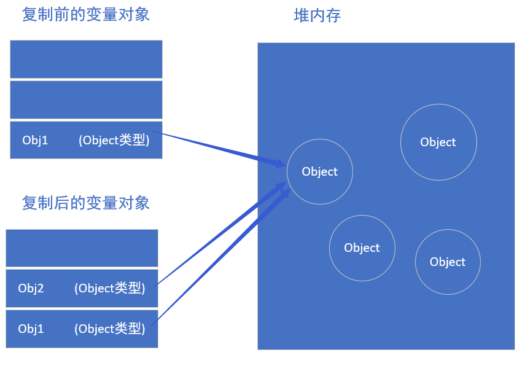
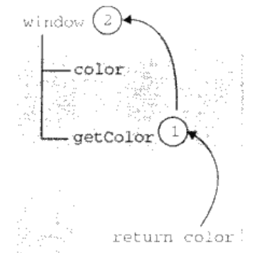
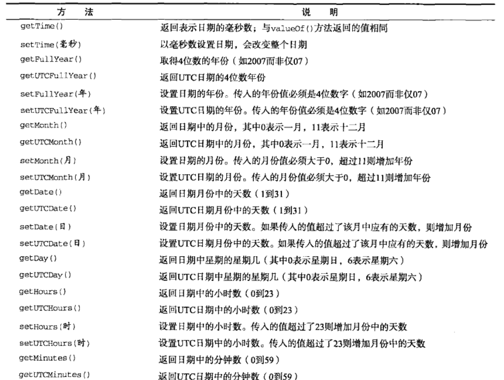
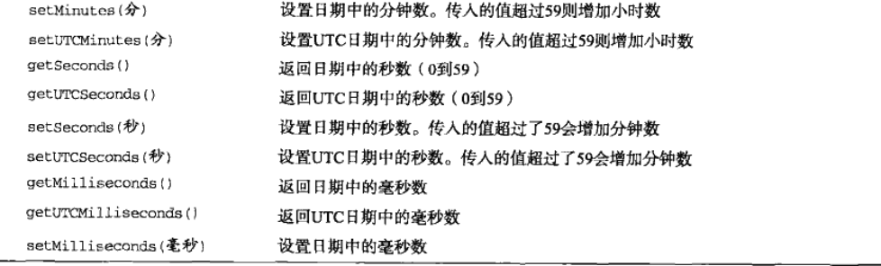
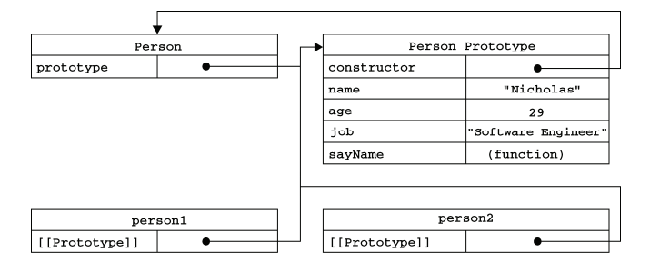
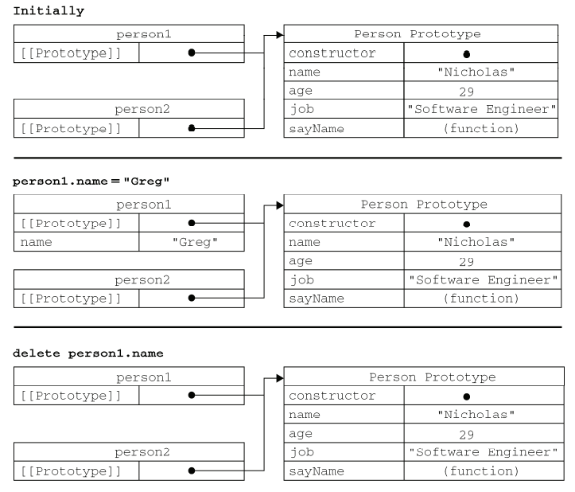
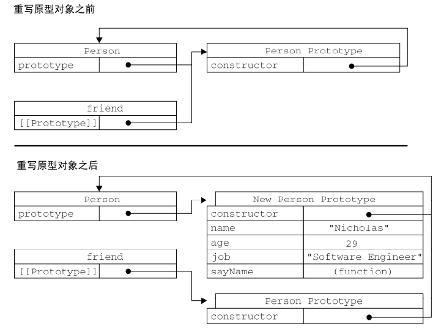

《Javascript高级程序设计》笔记

# ch1 Javascript介绍

## 1.2 Javascript实现

一个完整的Javascript实现应该由以下三个不同的部分组成


* **ECMAScript，提供核心语言功能**
* **文档对象模型（DOM），提供访问和操作网页内容的方法和接口**
* **浏览器对象模型（BOM），提供与浏览器交互的方法和接口**

### 1.2.2 ECMAScript

 ECMAScript就是对实现该标准规定的各个方面内容的语言的描述

### 1.2.2 DOM

**DOM**是针对XML但经过扩展用于HTML的应用程序编程接口（API）。

DOM把整个页面映射为一个**多层节点结构**，HTML或XML页面中的每个组成部分都是某种类型的节点，这些节点又包含着不同类型的数据

### 1.2.3 BOM

BOM处理浏览器窗口和框架

# ch2 在HTML中使用Javascript

## 2.1 `<scipt>`

| 属性    | 值                    | 描述                                             |      |
| ------- | --------------------- | ------------------------------------------------ | ---- |
| async   |                       | 表示应该立即下载脚本，但不应妨碍页面中的其他操作 |      |
| charset |                       |                                                  | 忽略 |
| defer   |                       |                                                  |      |
| src     |                       | 表示要执行代码的外部文件                         |      |
| type    | text/javascript(默认) |                                                  |      |

使用`<script>`元素的方式

1. 页面中嵌入js代码
   * 包含在`<script>`内的js代码将被从上至下依次解释
   * 在解释器对`<script>`元素内的所有代码求值完毕以前，页面中的其余内容都不会被浏览器加载或显示
2. 包含外部js文件
   * 在解析外部js文件（包括下载该文件）时，页面的处理也会暂时停止

### 2.1.1 标签的位置

把Js引用放在body中页面内容的后面，可以避免加载js时出现的页面的延迟空白。

```html
<body>
   <!--这里放内容-->
    <script type="text/javascript" src="example.js"></script>
</body>
```

### 2.1.2 延迟脚本

script的**defer**属性，表明**脚本在执行时不会影响页面的构造，即脚本会被延迟到页面都解析完毕后运行。**

在scipt中设置defer属性，相当于告诉浏览器立即下载，但延迟执行

> 把延迟脚本放在页面底部是最佳选择！！

### 2.1.3 异步脚本

**async**属性，告诉浏览器立即下载文件，**但是标记为async的脚本并不保证按照指定它们的先后顺序执行**

> 小结：
>
> * 使用defer属性可以让脚本在文档完全呈现之后再再执行。延迟脚本总是按照指定它们的顺序执行
> * 使用async属性可以表示当前脚本不必等待其他脚本，也不必阻塞文档呈现。不能保证异步脚本按照他们在页面中出现的顺序执行
> * 基于可维护性，浏览器可缓存的原因，尽可能使用外部文件来包含js代码。

# ch3 基本概念

## 3.1 语法

### 3.1.4 严格模式

ES5引入了 **严格模式（strict mode）**的概念。严格模式是为js定义了一种不同的解析与执行模型

```js
"use strict"
```

## 3.3 变量

ECMAscipt的变量是松散类型—— 就是可以用来保存任何类型的数据，即每个变量仅仅是一个用于保存值的占位符而已

## 3.4 数据类型

5种简单数据类型：Undefined Null Boolean Number String

1种复杂数据类型：Object（本质上是一组无序的名值对组成）

### 3.4.1 typeOf

是一个操作符而不是函数，所以（）不是必需

```
typeOf 95 //ok
typeOf(95) //ok
typeof null //Object,特殊值null被认为是一个空的对象引用
```

### 3.4.2 Undefined

### 3.4.3 Null类型

null值表示一个空对象指针，而这也正是使用typeof检测null会返回“object”的原因

```js
var car = null;
alert(typeof car);//"object"

alert(null == undefined);//true
```

### 3.4.4 Boolean类型

调用`Boolean()函数`，会返回一个Boolean值

### 3.4.5 Number

1. **浮点数值**

> 关于浮点数值计算会产生舍入误差的问题，有一点需要明确：这是使用基于IEEE754数值的浮点计算的通病，其他使用相同数值格式的语言也存在这个问题

2. **数值范围**

   ECMAScipt能表示的最小数值范围Number.MIN_VALUE ~ Number.MAX_VALUE

   如果某次计算的结果超出js数值范围，该数值会被自动转换成特殊的Infinity。要确定一个数值是不是有穷的，可以使用`isFinite()`函数。

   ```
   var result = Number.MAX_VALUE + Number.MAX_VALUE;
   console.log(isFinite(result));//false
   ```

3. **NaN**

   (Not a number)是一个特殊的数值，用于表示一个本来要返回数值的操作数未返回数值的情况（这样就不会抛出错误了）

   > 注意：在ECMAScript中，任何数值除以非数值会返回NaN，因此不会影响其他代码的执行。

   **Nan有两个特点**

   * 任何设计NaN的操作都会返回Nan
   * NaN与任何值都不相等，包括NaN本身

   > **isNan()**函数接受一个参数，该函数帮我们确定这个参数是否“不是数值”，它接受一个值后，会尝试将这个值转换为数值。某些不是数值的值会直接转换为数值，例如“10”或Boolean值，而任何不能被转换为数值的值都会导致这个函数返回true
   >
   > ```js
   > console.log(isNaN(NaN));//true
   > console.log(isNaN(10));//false
   > console.log(isNaN("10"));//false
   > console.log(isNaN("blue"));//true不能转换为数值
   > console.log(isNaN(true));//flase 可以被转换成整数1
   > ```

4. 数值转换

   3个函数可以把非数值转换为数值：

   * `Number()` 用于任何数据类型,
   * `parseInt() parseFloat()`用于把字符串转换成数值
     * `parseInt()`的第二参数：转换时使用的基数（即多少进制），多数情况下解析的都是十进制，可以始终将10作为第二个参数
     * `parseFloat()`从第一个字符开始解析每个字符，知道字符串末尾或者解析到遇见一个无效的浮点数字符位置。例如22.34.5会被转换为22.34
     * `parseFloat()`始终会忽略前导的零

### 3.4.6 String

String类型用于表示由零或多个16位Unicode字符组成的字符序列，即字符串 

1. 字符字面量

   转义序列时一些特殊的字符字面量，例如`\n,\t,\b`

2. 字符串的特点

   ECMAScript中的字符串是不可变的，也就是说，字符串一旦创建，它们的值就不能改变，要改变某个变量保存的字符串，首先要销毁原来的字符串，然后再用另一个包含新值的字符串填充该变量。

3. 转换为字符串 `toString()`

### 3.4.7 Object类型

> 在ECMAScript中，Object类型是所有它的实例的基础。换句话说，Object类型所具有的任何属性和方法也同样存在于更具体地对象中

Object的属性和方法

|                              |                                                              |      |
| ---------------------------- | ------------------------------------------------------------ | ---- |
| constructor                  | 保存用于创建当前对象的函数                                   |      |
| hasOwnProperty(propertyName) | 检查给定的属性在当前对象实例中（而不是在实例的原型中）是否存在 |      |
| isPrototypeOf(object)        | 检查传入的对象是否是当前对象的原型                           |      |
| toLocaleString()             | 返回对象的字符串表示，该字符串与执行环境的地区对应           |      |
| toString()                   | 返回对象的字符串表示                                         |      |
| valueOf()                    | 返回对象的字符串，数值或布尔值表示，通常与toString()方法的返回值相同 |      |
|                              |                                                              |      |

因为在ECMAScript中Object是所有对象的基础，因此所有对象都具有这些基本的属性和方法

## 3.5 操作符

### 3.5.1 一元操作符

### 3.5.2 位操作符

ECMAScript中所有数值都以IEDD-754 64位存储，但位操作符并不直接操作64位的值，而是先将64位的值转换成32位的整数，然后执行操作，最后再将结果转换为64位。

对于有符号的整数。正数以纯二进制格式存储，负数使用二进制补码

1. 按位非NOT
2. 按位与 AND
3. 按位或 OR
4. 按位异或 XOR
5. 左移
6. 有符号的右移
7. 无符号右移

### 3.5.3 布尔操作符

1. 逻辑非
2. 逻辑与
3. 逻辑或

### 3.5.4 乘性操作符

ECMAScript定义了3个乘性操作符：乘法，除法和求模

1. 乘法

   ```js
   //特殊情况
   Infinite × 0 = NaN
   Infinite × 非零数值 = Infinite 或 -Infinite
   ```

2. 除法

   ```js
   0/0 = NaN
   ```

3. 求模

   ```
   
   ```

### 3.5.5 加性操作符

1. 加法

   ```js
   //特殊情况
   NaN + 2 = NaN
   +0 + +0 = +0
   -0 + -0 = -0
   +0 + -0 = +0
   ```

   * 如果两个操作数都是字符串，进行字符串拼接
   * 只有一个操作数是字符串，将另一个操作符转换成字符串后再进行拼接
   * 有一个操作数是对象，数值或布尔值，则调用toString()取得相应的字符串，再按上述处理（undefied和null调用String()分别得到"undefined"和"null"）

2. 减法

   ```js
   //特殊情况
   NaN - 2 = NaN
   +0 - +0 = +0
   -0 - -0 = +0
   +0 - -0 =-0
   ```

   * 如果有一个操作数是对象。则调用对象的valueOf()取得表示该对象的数值。如果对象没有valueOf()方法，则调用其toString()方法并将得到的字符串转换成数值

### 3.5.6 关系操作符

`<  > <= >=`

注意：两个操作数都是字符串，则比较两个字符串字符编码值，实际是比较两个字符串中对应位置的每个字符的字符编码（大写字母的编码全部小于小写字母的字符编码）

```
toLowerCase()//转化为小写
```

注意：任何操作数与NaN进行关系比较，结果都是false

### 3.5.7 相等操作符

两组操作符

* **相等和不相等** —— 先转换再比较
* **全等和不全等** —— 仅比较而不转换

1. 相等和不相等 == 

   这个操作符会先转换操作数（通常称为 **强制转型**），然后再比较它们的相等性

   | 表达式            | 值    |      |
   | ----------------- | ----- | ---- |
   | null == undefined | true  |      |
   | 5 == NaN          | false |      |
   | NaN == NaN        | false |      |
   | false == 0        | true  |      |

2. 全等和不全等 ===

   比较之前不转换操作数

   ```js
   null == undefined //true,类似的值
   null === undefined //false，不同类型的值
   ```

### 3.5.8 条件操作符

```
var max = (num1>num2) ? num1 : num2;
```

### 3.5.9 赋值操作符

= 

### 2.5.10 都好操作符

```js
var num1=1,num2=2,num3=3;
```

## 3.6 语句

### 3.6.4 for

### 3.6.5 for-in语句

for-in可以用来枚举对象的属性

```js
for(var propName in windows){
	document.write(propName);
}
```

注意：ECMAScript对象的属性没有顺序，上述所有属性都会被返回一次，但返回的先后次序因浏览器而异

### 3.6.6 label语句

使用label语句可以在代码中添加标签

```
label:statement
```

### 3.6.7 break和continue语句

break立即退出循环，强制执行循环后面的语句

continue退出循环后会从循环的顶部继续执行

注：break和continue都可以与label语句联合使用，从而返回代码中特定的位置

### 3.6.8 with语句

with语句的作用是将代码的作用域设置到一个特定的对象中

`with(expression) statement`

定义width语句的目的主要是为了简化多次编码同一个对象的工作，例如

```js
var qs = location.search.substring(1);
var hostName = location.hostname;
var url = location.href;
```

上面几行代码都包含location对象。使用with改写如下:

```js
with(location){
  var qs = search.substring(1);
  var hostName = hostname;
  var url = href;
}
```

> with会导致性能下降，给代码调试带来困难那，所以开发大型应用程序时，不建议使用with

## 3.7 函数

### 3.7.1 理解参数

ECMAScript中的参数在内部是用一个数组来表示的。函数接收到的始终都是这个数组，而不关心数组中包含哪些参数。**实际上，在函数体内可以通过arguments对象来访问这个参数数组，从而获取传递给函数的每一个参数**

通过访问arguments对象的length属性可以获知有多少个参数传递给了函数，开发人员可以利用这一先让函数能够接受任意个参数并分别实现适当的功能

```js
function doAdd(){
  if(arguments.length == 1){
    console.log(arguments[0]+10);
  }else if(arguments.length =2 ){
    console.log(arguments[0]+arguments[1]);
  }
}

doAdd(10);
doAdd(30,20);
```

### 3.7.2 没有重载

对于连个同名的函数，后定义的函数会覆盖先定义的函数

## 3.8 小结

* ECMAScript中的基本数据类型包括 Undefined Null Boolean Number String
* 不区分整数和浮点数，Number类型可用于表示所有数值
* 一种复杂的数据类型 Object，该类型是这门语言中所有对象的基础类型
* 严格模式位这门语言中容易出错的地方施加了限制
* 无须指定函数的返回值，因为任何ECMAScript函数都可以在任何时候返回任何值
* 实际上，未指定返回值的函数返回的是一个特殊的undefined值
* ECMAScript中也没有函数签名的概念，因为其函数参数是以一个包含0或多个值的数组的形式传递的
* 可以向ECMAScirpt函数传递任意数量的参数，并且可以通过arguments对象来访问这些参数
* 由于不存在函数签名的特性，ECMAScript函数不能重载

# ch4 变量，作用域和内存问题

Js变量松散类型的本质，决定了它只是在特定时间用于保存特定值的一个名字而已。

## 4.1 基本类型和引用类型的值

**基本类型**指的是简单的数据段，**引用类型**指那些可能由多个值构成的对象

5种基本数据类型：Undefined，NULL，Boolean，Number和String是按值访问的，因为可以操作保存在变量中的实际的值

**引用类型的值是保存在内存中的对象**。JS不允许直接访问内存中的位置，也就是说不能直接操作对象的内存空间。**在操作对象时，实际上是在操作对象的引用而不是实际的对象，为此，引用类型的值是按引用访问的**

### 4.1.1 动态的属性

定义基本类型和引用类型值的方式是类似的：创建一个变量并为该变量赋值。但是，当这个值保存在变量中以后，对不同类型值可以执行的操作则大相径庭。

**1. 对于引用类型的值，我们可以为其添加属性和方法，也可以改变和删除其属性和方法**

```js
var person = new Object();
person.name = "Nike";
console.log(person.name);
```

如果对象不被销毁或这个属性不被删除，则这个属性将一直存在

**2. 但是，不能给基本类型的值添加属性**

```js
var name = "NIke";
name.age =27;
console.log(name.age);//undefined
```

> 这说明只能给引用类型值动态地添加属性

### 4.1.2 复制变量值

**1. 复制基本类型。如果从一个变量向另一个变量赋值基本类型的值，会在变量对象上创建一个新值，然后把该值复制到新变量分配的位置上**

```
var num1 = 5;
var num2 = num1;
```



**2. 复制引用类型。当从一个变量向另一个变量复制引用类型的值时，同样也会将存储在变量对象中的值赋值一份放到新分配的空间中。不同的事，这个值的副本实际上是一个指针，而这个指针指向存储在堆中的一个对象。**

**复制操作结束后，两个变量实际上将引用同一个对象。**因此，改变其中一个变量，就会影响另一个变量。

```js
var obj1 = new Object();
var obj2 = obj1;
obj1.name = "Nike";
console.log(obj2.name);//Nike
```



### 4.1.3 传递参数

**ECMAScript中所有函数的参数都是按值传递的**（注：访问变量有按值和按引用两种方式，而参数只能按值传递）

**1. 在向参数传递基本类型的值是，被传递的值会被赋值给一个局部变量（即命名参数，或者是arguments对象的一个元素）**

```js
function addTen(num){
  num+=10;
  return num;
}

var count = 20;
var res = addTen(count);
console.log(res);//30
```

**2. 在向参数传递引用类型的值是，会把这个值在内存中的地址复制给一个局部变量，因此这个局部变量的变化会反映在函数的外部**

```js
function setName(obj){
  obj.name = "Nike";
}

var person = new Object();
setName(person);
console.log(person.name);//Nike

```

再次使用例子证明对象是按值传递的

```js
function setName(obj){
  obj.name = "Nike";
  obj = new Object();
  obj.name ="Greg";
}

var person = new Object();
setName(person);
console.log(person.name);//Nike，这说明，即使在函数内部修改了参数的值，但原始的引用仍然保持未变，实际上，当在函数内部重写obj时，这个变量引用的就是一个局部对象了。而这个局部对象会在函数执行完毕后立即被销毁。
```

> 可以把ECMAScipt函数的参数想象成局部变量

### 4.1.4 检测类型

**typeOf 检测基本类型**，对于null或对象，typeof都会返回”Object"

**instanceOf 检测引用类型，帮助我们知道它时什么类型的对象。**语法：result = variable instanceof constructor

如果变量是给定引用过类型的实例，那么instanceof操作符就会返回true

```js
console.log(person instanceof Object);
```

注意：根据规定，所有引用类型的值都是Object的实例。因此，在检测一个引用类型值和Object构造函数时，instanceof都会返回true。

当然，使用instanceof检测基本类型的值，则该操作符始终会返回false。**因为基本类型不是对象**

## 4.2 执行环境及作用域

执行环境（也称环境）定义了变量或函数有权访问的其他数据，决定了它们各自的行为。每个执行环境都有一个与之关联的 **变量对象（variable object）**，环境中定义的所有变量和函数都保存在这个对象中。

全局执行环境是最外围的一个执行环境。**在web浏览器中，全局执行环境被认为是window对象，因此所有全局变量和函数都是作为window对象的属性和方法创建的。**

每个函数都有自己的**执行环境**，当执行流进入一个函数时，函数的环境就会被推入一个环境栈中。而在函数执行之后，栈将其环境弹出，把控制权返回给之前的执行环境。

当代码在一个环境中执行时，会创建变量对象的一个**作用域链（scope chain）**。作用域链的用途，是保证对执行环境有权访问的所有变量和函数的有序访问。

### 4.2.1 延长作用域链

没咋明白

### 4.2.2 没有块级作用域

在js中，**if**语句的变量声明会将变量添加到当前的执行环境（在这里是全局环境中）

```js
if(true){
  var color = "blue";
}
console.log(color);//"blue"
```

在使用**for**语句时尤其牢记这一差异：

```js
for(var i=0;i<10;i++){
  console.log(i);
}
console.log(i);//10
```

对于js，由for创建的变量i即使是在for循环执行结束后，也依旧会存在于循环外部的执行环境中

【这里自己补充一点】

```js
for(let i=0;i<10;i++){
  console.log(i);
}
console.log(i);//会报错：i is not defined
```

**1. 声明变量**

使用var声明的变量会自动被添加到最接近的环境中。

> 建议：初始化变量前先声明。

**2. 查询标识符**

当在某个环境中为了读取或写入而引用一个标识符时，必须通过搜索来确定该标识符实际代表什么。**搜素过程从作用域链的前端开始，向上逐级查询与给定名字匹配的标识符。**

```js
var color = "blue";

function getColor(){
  return color;
}
console.log(getColor());//"blue"
```



上面是向上搜索的过程，在这个搜索过程中，如果存在一个局部的变量的定义，则搜索会自动停止，不再进行另一个变量对象。换句话说，如果局部环境中存在着同名标识符，就不会使用位于父环境中的标识符。

例如下面：

```js
var color = "blue";

function getColor(){
  var color = "red";
  return color;
}
console.log(getColor());//"red"
```

## 4.3 垃圾收集

js有自动垃圾收集机制，也就是说，执行环境会负责管理代码执行过程中使用的内存。

垃圾收集机制的原理：找出那些不再继续使用的变量，然后释放其占用的内存，为此，垃圾收集器会按照固定的时间间隔周期性地执行这一操作。

垃圾收集器必须跟踪哪个变量有用那个变量没用，对于不再有用地变量打上标记，以备将来收回其占用的内存。用于表示无用变量的策略可能会因实现而异，但具体到浏览器中的实现，则通常有两个策略。

### 4.3.1 标记清除

**标记清除(mark-and-sweep)**策略

### 4.3.2 引用计数

引用计数的含义是跟踪记录每个值被引用的次数。（但存在循环引用的问题）

### 4.3.3 性能问题

### 4.3.4 管理内存

出于安全方面的考虑，分配给Web浏览器的可用内存数量通常要比分配给桌面应用程序的少。

因此，确保占用最少的内存可以让页面获得更好的性能。而优化内存占用的最佳方式，就是为执行中的代码只保存必要的数据。一旦数据不再有用，最好通过将其值设置为null来释放其引用——这个做法叫做 **解除引用（dereferencing）**。这一做法适用于大多数全局变量和全局变量的属性。局部变量会在他们离开执行环境时自动被接触引用。

```js
function createPerson(name){
  var localPerson = new Object();
  localPerson.name = name;
  return localPerson;
}

var globalPerson = createPerson("Nike");

//手工接触globalPerson的引用
globalPerson = null;
```

解决一个值得引用时让值脱离执行环境，以便垃圾收集器下次运行时将其回收。

## 4.4 小结

Js变量可以用来保存两种类型的值：基本类型值和引用类型值，

* **基本类型值**在内存中占据固定大小的空间，因此被保存在**栈内存**中
* 从一个变量向另一个变量赋值基本类型的值，会创建这个值的一个副本
* **引用类型**的值是对象，保存在 **堆内存**中。
* 包含引用类型值的变量实际上包含的并不是对象本身，而是一个指向该对象的指针。
* 从一个对象向另一个对象复制引用类型的值，复制的其实是指针，因此两个变量最终都指向同一个对象
* 确定一个值时那种基本类型使用typeof，时哪种引用类型使用instanceof

所有变量都存在于一个**执行环境（也称作用域）**当中，这个执行环境决定了变量的生命周期，以及那一部分代码可以访问其中的变量。

* 执行环境有全局执行环境（也成为全局环境）和函数执行环境之分。
* 每次进入一个新执行环境，都会创建一个用于搜索变量和函数的**作用域链。**
* **函数的局部环境**不仅有权访问函数作用域中的变量，而且有权访问其包含（父）环境，乃至全局环境
* **全局环境**只能访问在全局环境中定义的变量和函数，而不能直接访问局部环境中的任何数据
* 变量的执行环境有助于确定应该何时释放内存。

Js是一门具有**自动垃圾收集机制**的编程语言。

* 离开作用域的值被自动标记为可回收，因此在垃圾收集期间被删除
* **“标记清除”**是目前主流的垃圾收集算法
* “引用计数”在IE中访问非原生js对象时仍存在问题，并且当存在循环引用，也会出现问题
* 解除变量的引用不但有助于消除循环引用现象，对垃圾收集也有好处。


# ch5 引用类型


* 在ECMAScript中，**引用类型**是一种数据结构，用于将数据和功能组织在一起（也常被称为类）。
* 引用类型有时候也被称为**对象定义**，因为它们描述的时一类对象所具有的属性和方法。
* 对象是某个特定引用类型的**实例**。新对象是使用new后跟一个构造函数来创建的。

## 5.1 Object类型

**创建Object实例的方法**

1. new Object()

   ```js
   var person = new Object();
   person.name = "Nike";
   person.age = 29;
   ```

2. **对象字面量表示法**

   ```js
   var person = {
     name:"nike",
     age:29
   };
   ```

   ```js
   var person = {};
   person.name = "Nike";
   person.age = 29;
   ```

   实际上，对象字面量也是向函数传递大量可选参数的首选方式，例如、

   ```js
   function displayInfo(args){
     var output = "";
   
     if(typeof args.name == "string"){ //同故宫typeof来检测每个属性是否存在
       output += "Name:"+args.name+"\n";
     }
     if(typeof args.age == "number"){
       output += "Age:"+args.age+"\n";
     }
     console.log(output);
   }
   
   displayInfo({
     name:"Nike",
     age:29
   });
   
   displayInfo({
     name:"Gree"
   });
   ```

**访问对象属性**

```js
console.log(person.name);//点表示法
console.log(person["name"]);//方括号语法
```

方括号语法的主要优点是可以通过变量来访问属性，eg

```js
var propertyName = "name";
console.log(person[propertyName]);
```


## 5.2 Array类型

* ECMAscript数组的每一项可以保存任何类型的数据
* 数组大小是动态调整的

**创建数组**

1. 使用Array构造函数

   ```js
   var colors = new Array(20);
   var colors2 = new Array("red","blue","green");
   ```

2. 使用数组字面量表示法

   ```js
   var colors = ["red","blue","green"];
   var names = [];
   ```

**读取和设置数组中的值**

* ```js
  var colors = ["red","blue","green"];
  console.log(colors[0]);
  colors[1]="darkBlue";
  ```

* 利用length属性可以从数组末尾移除或添加新项

### 5.2.1 检测数组

```js
if (Array.isArray(value)){
  //确定其值到底是不是数组
}
```

### 5.2.2 转换方法

* 所有对象都具有 **toLocaleString()** **toString()** 和**valueOf()**方法

```js
var colors = ["red","blue","green"];
console.log(colors.toString());//red,blue,green
console.log(colors.valueOf());//[ 'red', 'blue', 'green' ]
console.log(colors.toLocaleString());//red,blue,green
```

* 注意：当调用数组的toLocaleString 方法时，为了取得每一项的值，调用的是每一项的toLocale-String()方法
* join()方法

### 5.2.3 栈方法

ECMAScript为数组专门提供了**push()**和**pop()**方法，以便实现类似栈LIFO的行为

* **push()**接受任意数量的参数，添加到数组末尾，并返回数组长度

  ```js
  var colors = new Array();
  var count = colors.push( "red","green");
  console.log(count);//2
  
  count = colors.push("black");
  console.log(count);
  ```

* **pop()**从数组末尾移除一项，返回移除的项

  ```js
  var item = colors.pop();
  console.log(item);//black
  ```

* **模拟栈**

  * push() 数组末端添加项，pop()数组末端移除项

### 5.2.4 队列方法

队列FIFO，队列在列表末端添加项，从列表前端移除项

* **shift()**移除数组第一项并返回该项

  ```js
  var colors = new Array();
  var count = colors.push( "red","green");
  console.log(count);//2
  
  count = colors.push("black");
  console.log(count);//3
  
  var item = colors.shift();//取得第一项
  console.log(item);//red
  ```

* **unshifit()** 在数组前端添加任意个项并返回数组的长度

  ```js
  var colors = new Array();
  var count = colors.unshift( "red","green");
  console.log(count);//2
  ```

* **模拟队列**

  * push() 数组末端添加项，shift() 数组前端移除项
  * unshift() 数组前端添加项，pop()数组末端移除项（从相反的方向来模拟队列）

### 5.2.3 重排序方法

* **reverse()**反转数组项顺序

* **sort()**默认升序排列数组项（按照每个数组项toString()得到的字符串来排序）

  ```js
  var values = [0,1,5,10,15];
  console.log(values.sort());//[ 0, 1, 10, 15, 5 ]
  ```

  sort()接受一个比较函数作为参数

  ```js
  //比较函数接受两个参数
  //* 如果第一个参数位于第二个之前，返回附属
  //* 两个参数相等，返回0
  //* 第一个参数位于第二个之后，返回正数
  function compare(value1,value2){
    if(value1<value2){
      return -1;
    }else if(value1>value2){
      return 1;
    }else{
      return 0;
    }
  }
  
  //对于数组类型或者其valueOf()方法会返回数组类型的对象类型，上述可以简化为
  function compare(value1,value2){
      return value1-value2;
  }
  ```

### 5.2.6 操作方法

* **concat()**基于当前数组中的所有项创建一个新数组

  ```js
  var colors = ["red","blue","green"];
  var colors2 = colors.concat("yellow",["black","brown"]);
  
  console.log(colors);//[ 'red', 'blue', 'green' ]
  console.log(colors2);//[ 'red', 'blue', 'green', 'yellow', 'black', 'brown' ]
  ```

* **slice()**基于当前数组中的一个或多个项创建一个新数组，接受一或两个参数，即要返回项的其实和结束位置（不包括结束位置的项）

  ```js
  var colors = ["red","blue","green","black","brown"];
  var colors2 = colors.slice(1);
  var colors3 = colors.slice(1,4);//同slice(-2,-1)
  
  console.log(colors2);//[ 'blue', 'green', 'black', 'brown' ]
  console.log(colors3);//[ 'blue', 'green', 'black' ]
  ```

  * 注意：slice()不会影响原数组

* **splice()**

  |      | 含义                                             | 参数                                                | 举例                           |
  | ---- | ------------------------------------------------ | --------------------------------------------------- | ------------------------------ |
  | 删除 | 删除任意数量的项                                 | 2参数：要删除的第一项的位置，要删除的项数           | `splice(0,2) 删除数组中前两项` |
  | 插入 | 任意位置插入任意数量的项                         | 3参数：起始位置，要删除的项数，要插入的项。。       | `splice(2,0,"red","green")`    |
  | 替换 | 指定位置插入任意数量的项，且同时删除任意数量的项 | 3参数：起始位置，要删除的项数，要插入的任意数量的项 | `splice(2,1,"red","green")`    |

  * 返回被删除的项

### 5.2.7 位置方法

2参数：要查找的项和表示查找起点位置的索引

* **indexOf()**
* **lastIndexOf()**

### 5.2.8 迭代方法

5个迭代方法，每个方法都接受两个参数：要在每一项上运行的函数（可选）和运行该函数的作用域对象———影响this的值。传入这些方法中的函数会接受三个参数：数组项的值，该项在数组中的位置和数组对象本身

| 迭代方法  | 返回值                                   |      |
| --------- | ---------------------------------------- | ---- |
| every()   | 如果该函数对每一项都返回true，则返回true |      |
| filter()  | 返回该函数会返回true的项组成的数组       |      |
| forEach() | 无                                       |      |
| map()     | 返回每次函数调用结果组成的数组           |      |
| some()    | 如果该函数任一项返回true，则返回true     |      |

```js
var numbers = [1,2,3,4,5,4,3,2,1];

//every
var everyRes = numbers.every(function(item,index,array){
  return (item>2);
});
console.log(everyRes);//false

//some
var someRes = numbers.every(function(item,index,array){
  return (item>2);
});
console.log(someRes);//true

//filter
var filterRes = numbers.filter(function(item,index,array){
  return (item>2);
});
console.log(filterRes);//[ 3, 4, 5, 4, 3 ]

//map
var mapRes = numbers.map(function(item,index,array){
  return item*2;
});
console.log(mapRes);//[2, 4, 6, 8, 10,8, 6, 4, 2]

```

### 5.3.9 归并方法

reduce和reduceRight，都会迭代数组的所有项。然后构建一个最终返回的值（他俩差别在于从哪头开始遍历数组）

2个参数：一个在每一项上调用的函数和（可选的）作为归并基础的初始值

该函数4个参数：前一个值，当前值，项的索引和数组对象

```js
var values = [1,2,3,4,5];
var sum = values.reduce(function(prev,cur,index,array){
  return prev+cur;
});
console.log(sum);
```

## 5.3 Date类型

```js
var now = new Date();
var someDate = new Date(Date.parse("May 25 2004"));
var y2k = new Date(Date.UTC(2000,0));

//Date.now()
var start = Date.now();
doSomething();
var stop = Date.now(),
	result = stop-start;//可以用+获得时间戳
```

### 5.3.1 继承的方法

Date类型的

* toLacaleStrin() 会按照与浏览器设置的地区相适应的格式返回日期和时间
* toString()返回带有失去时区信息的日期和实践
* valueOf() 返回日期的毫秒表示

### 5.3.2 日期格式化方法

Date有一些专门用于将日期格式化为字符串的方法

### 5.3.3 日期/时间组件方法






## 5.4 RegExp类型

### 5.4.1 RegExp实例属性

* global
* ingonreCase
* lastIndex
* multiline
* source

### 5.4.2 RegExp实例方法

**exec()**

即使在模式中设置了全局标志(g),它每次也只会返回一个匹配项

* 不设置全局标志，在同一个字符串是多次调用exec()将始终返回第一个匹配项的信息
* 设置全局标志，每次调用会在字符串中继续查找新匹配项

**test()**

返回true/false

### 5.4.3 RegEXp构造函数属性

* input
* lastMatch
* lastParen
* multiline
* rightContext

## 5.5 Function类型

**函数**是**对象**，**函数名**实际上是一个指向函数对象的**指针**

```js
function sum(num1,num2){
  return num1+num2;
}

var anotherSum = sum;//anotherSum和sum都指向了同一个函数
```

### 5.5.1 没有重载（深入理解）

同名函数，后面的覆盖前面的

### 5.5.2 函数声明与函数表达式

解析器会率先读取函数声明；对于函数表达式，必须等到解析器执行到它所在的代码行，才会被真正解析执行

```js
console.log(sum(10,10));//20
function sum(num1,num2){
  return num1+num2;
}
```

可以正确运行，因为在代码开始执行前，解析器就已经通过一个名为函数声明提升的过程，读取并将函数声明添加到执行环境中。

```js
console.log(sum(10,10));//sum is not a function
var sum = function(num1,num2){
  return num1+num2;
}
```

报错，因为函数位于一个初始化语句中，而不是一个函数声明

### 5.5.3 作为值的函数

因为ECMAScript中的函数名本身就是变量，所以函数也可以作为值来使用。

例子：根据传入的属性名创建一个比较函数

```js
function createComparisonFunction(propertyName){

  return function(object1,object2){
    var value1 = object1[propertyName];
    var value2 = object1[propertyName];
    if(value1<value2){
      return -1;
    }else if(value1>value2){
      return 1;
    }else{
      return 0;
    }
  }
}
```

### 5.5.4 函数内部属性

在函数内部，有两个特殊的对象：arguments和this

**arguments**

是一个类对象数组，保存函数参数。

有一个属性：callee，该属性事一个指针，执行拥有这个arguments对象得函数

```js
function factorial(num){
  if(num<=1){
    return 1;
  }else{
    return num*factorial(num-1);
  }
}

//用于解除函数体内的代码与函数名的耦和状态
function factorial(num){
  if(num<=1){
    return 1;
  }else{
    return num*arguments.callee(num-1);
  }
}
```

**this**

this引用的是函数据以执行的环境对象——或者也可以说是this值（当在网页的全局作用域中调用函数时，this引用的就是window)

```js
window.color = "red";
var o = {color:"blue"};

function sayColor(){
  console.log(this.color);
}

sayColor();//red 即输出window.color

o.sayColor = sayColor;
o.sayColor();//blue this引用的时对象o
```

> **函数的名字仅仅是一个包含指针的变量而异！**因此即使是在不同的环境中执行，全局的sayColor()与o.sayColor()指向的仍然是同一个函数

**caller**

这个属性保存着调用当前函数的函数的引用

**严格模式下的限制与错误**

当函数在严格模式下运行时，访问arguments.callee会导致错误 & 不能为函数的caller属性赋值

### 5.5. 函数属性和方法

每个函数都包含2个属性：length和prototype

**属性1.length**

函数希望接受的命名参数的个数

**属性2. prototype**

对于ECMAScript中的引用类型而言，prototype是保存它们所有实例方法的真正所在，欢聚说话，诸如toString()和valueOf()等方法实际上都保存在prototype名下，只不过是通过各自对象的实例访问罢了。

> ES5中，prototype属性是不可枚举的，因此使用for-in无法发现

**方法1 apply() **

**都是在特定的作用域中调用函数，实际上等于设置函数体内this对象的值**

接受2个参数 1 在其中运行函数的作用域；2 参数数组（数组或arguments对象）

```js
function sum(num1,num2){
  return num1+num2;
}

function callSum1(num1,num2){
  return sum.apply(this,arguments);//传入arguments对象
}

console.log(callSum1(10,10));//20

function callSum2(num1,num2){
  return sum.apply(this,[num1,num2]);//传入数组
}

console.log(callSum2(10,10));//20
```


**方法2 call() **

跟allpy一样，差别在于其余参数都直接传递给函数

```js
function sum(num1,num2){
  return num1+num2;
}

function callSum1(num1,num2){
  return sum.apply(this,num1,num2);//明确传入每一个参数
}
```

**apply & call 扩充函数赖以运行的作用域**

```js
window.color = "red";
var o = {color:"blue"};

function sayColor(){
  console.log(this.color);
}

sayColor();//red 即输出window.color
sayColor.call(this)//red
sayColor.call(window)//red

sayColor.call(o)//blue 函数的执行环境变了，函数体内部的this指向了o
```

**bind()**创建一个函数的实例，其this值会被绑定到传给bind()函数的值

```js
window.color = "red";
var o = {color:"blue"};

function sayColor(){
  console.log(this.color);
}

var objectSayColor = sayColor.bind(o);
objectSayColor();//blue
```

## 5.6 基本包装类型

3个特殊的引用类型：Boolean Number String

对**基本包装类型的实例调用typeOf会返回“Object”**，而且所有基本包装类型的对象都会被转换为布尔值true

### 5.6.1 Boolean类型

尽量别用

### 5.6.2 Number类型

* toFixed() 指定小数位
* toExponential() 指数表示法表示的字符串
* toPrecision() 根据数值自己判断调用上面两个其中的哪一个

### 5.6.3 String类型

1. 字符方法
   * charAt() charCodeAt()
   * string[1]
2. 字符串操作方法
   * concat()
   * slice() substring()
   * substr()
3. 字符串位置方法
   * indexOf()
   * lastIndexOf()
4. trim()
5. 字符串大小写转换
   * toLowerCase
   * toUpperCase
6. 字符串的模式匹配方法
   * match()
   * search() 返回字符串第一个匹配项的索引
   * replace()
   * split
7. localeCompare（）
8. fromCharCode()

## 5.7 单体内置对象

> 由ECMAScropt实现提供的，不依赖于宿主环境的对象，这些对象在ECMAScrippt程序之前就已经存在了

JS的内置对象：Object Array String Global Math

### 5.7.1 Global对象

“兜底对象"：不属于任何其他对象的属性和方法，最终都是它的属性和方法

eg isNan() isFinite() parseInt() parseFloat() 以及其他一些方法

**1. URI编码方法**

URI 通用资源标识符

* encodeURIComponent() decodeURIComponent()
* encodeURI() decodeURI

**2. eval()**

就行一个完整的ECMAScirpt解析器，只接受一个参数，即要是总的js字符串

> 严格模式下，外部访问不到eval中创建的任何变量或函数
>
> 小心 **代码注入**

**3. Global对象属性**

除了特殊值 undefined Nan 以及Infinirt都是Global对象的属性，此外，所有原生引用类型的构造函数，eg Object Function 都是Global对象的属性

**4. window对象**

Web浏览器都是将这个全局对象作为window对象的一部分加以实现的。因此，**在全局作用域中声明的所有变量和函数，就都成为了window对象的属性**

### 5.7.2 Math对象

1. Math对象的属性

   Math.E  Math.PI Math.LOG2E....

2. **min() & max()**

   ```js
   //找到最大值
   var max = Math.max(3,54,32,16);
   console.log(max);
   
   //把Math对象作为apply的第一个参数，从而正确的设置this值
   var values =[1,2,3,7,5];
   var max = Math.max.apply(Math,values);
   console.log(max);
   ```

3. **舍入方法**

   * Math.ceil()
   * Math.floor()
   * Math.round()

4. **random()**

   ```js
   //从某个整数范围内随机选择一个值
   值 = Math.floor(Math.random()*可能值得总数+第一个可能的值)
   ```

   ```js
   //随机选择一项
   function selectFrom(lowerValue,upperValue){
     var choices = upperValue - lowerValue+1;
     return Math.floor(Math.random()*choices+lowerValue);
   }
   
   var num = selectFrom(2,10);
   console.log(num);
   
   var colors= ["red","green","blue","yellow"];
   var color = colors[selectFrom(0,colors.length-1)];
   console.log(color);
   ```

5. **其他方法**

   完成计算相关的方法

## 5.8 小结

对象在JS中被称为引用类型的值，而且有一些内置的引用类型可以用来创建特定的对象

* Object是一个基础类型，其他所有类型都从Object继承了基本的行为
* Array类型
* Date类型
* RegExp类型

函数实际上是Function类型的实例，因此函数也是对象，所以函数也拥有方法，可以用来增强其行为

因为有了基本包装类型，送一js中的基本类型值可以被当作对象类方法，三种基本包装类型：Boolean Number String

作用域里早已存在的两个内置对象：Global和Math

# ch6 面向对象的程序设计

## 6.1 理解对象

创建自定义对象

* 创建一个Object的实例

  ```js
  var person = new Object();
  person.name = "Nike";
  person.age = 29;
  person.sayName = function(){
    console.log(this.name);
  }
  ```

* 使用创建字面量的形式

  ```js
  var person = {
    name:"nike",
    age:29，
    sayName:function(){
      alert(this.name)
    }
  };
  ```

### 6.1.1 属性类型

ECMAScirpt有两种属性：数据属性和访问器属性

**1. 数据属性**

数据属性包含一个数据值的位置。在这个位置可以读取和写入值。数据属性有4个描述其行为的特性

* `[[Configurable]]` 能否通过delete删除属性从而重新定义属性
* `[[Enumerable]]` 能否通过for-in循环返回属性
* `[[Writable]]`能否修改属性的值
* `[[Value]]`包含这个属性的数据值

要修改默认属性的特征，必须使用ECMAScript5的**Object.defineProperty()**方法。

```js
var person = {};
Object.defineProperty(person,"name",{
  writable:false,
  value:"Nike"
});
```

**2. 访问器属性**

访问器属性不包含数据值，包含一对getter和setter函数，

访问器属性有如下4个特征

* `[[Configurable]]`
* `[[Enumerable]]`
* `[[Get]]` 读取属性时调用的函数
* `[[Set]]`写入属性时调用的函数

访问器属性不能直接定义，必须使用**Object。defineProperty()**来定义

```js
var book = {
  _year:2004,
  edition:1
};

Object.defineProperty(book,"year",{
  get:function () {
    return this._year;
  },
  set:function(newValue){
    if(newValue>2004){
      this._year = newValue;
      this.edition += newValue-2004;
    }
  }
});

book.year = 2005;
console.log(book.edition);
```

把year的值改为2005回导致_year变成2005，而edition变成2.

这是使用访问器属性的常见方式，即设置一个属性的值会导致其他属性发生变化。

### 6.1.2 定义多个属性

**Object.defineProperties()**可以通过描述符一次定义多个属性

```js
var book = {};
Object.defineProperties(book,{
  _year:{
    writable:true,
    value2004
  },
  edition:{
    writable:true,
    value:1
  },
  year:{
    get:function () {
      return this._year;
    },
    set:function(newValue){
      if(newValue>2004){
        this._year = newValue;
        this.edition += newValue-2004;
      }
    }
  }
});
```

### 6.1.3 读取属性的特征

**Object.getOwnPropertyDescriptor()**可以取得给定属性的描述符

## 6.2 创建对象

为避免代码重复，使用工程模式

### 6.2.1 工厂模式

用函数来封装以特定接口创建对象的细节

```js
function createPerson(name,age,job){
  var o = new Object();
  o.name= name;
  o.age = age;
  o.sayName = function(){
    console.log(this.name);
  };
  return 0;
}

var person1 = createPerson("Nike",29);
var person2 = createPerson("Greg",27);
```

### 6.2.2 构造函数模式

可创建自定义的构造函数，从而定义自定义对象类型的属性和方法

```js
function Person(name,age){
  this.name = name;
  this.age = age;
  this.sayName = function(){
    console.log(this.name);
  }
}
var person1 = new Person("Nike",29);
var person2 = new Person("Greg",27);
```

构造函数本身也是函数，只不过可以用来创建对象而已

创建Person的新实例，必须使用new操作符

```js
alert(person1 instanceof Object);//true
alert(person1 instanceof Person);//true
```

**创建自定义的构造函数意味着将来可以将它的实例标识为一种特定的类型；而这正是构造函数模式胜过工厂模式的地方**

### 6.2.3 原型模式

我们创建的每个函数都有一个prototype（原型）属性，这个属性是一个指针，指向一个对象，而这个对象的用途是包含可以由特定类型的所有实例共享的属性和方法。

```js
function Person(){
}
Person.prototype.name = "Nike";
Person.prototype.age = 29;
Person.prototype.sayName = function(){
  console.log(this.name);
}

var person1 = new Person();
person1.sayName();

var person2 = new Person();
person2.sayName();
console.log(person1.sayName == person2.sayName);//true
```

**1. 理解原型对象**



* `Person.prototype`指向了原型对象
* `Person.prototype.constructor`又值回了Person
* person1和person2都包含一个内部属性，该属性仅指向`Person.prototype`

**isPrototype()**

```js
console.log(Person.prototype.isPrototypeOf(person1));//true
console.log(Person.prototype.isPrototypeOf(person2));//true
```

**Object.getPrototypeOf()**

```js
console.log(Object.getPrototypeOf(person1)==Person.prototype);//true
console.log(Object.getPrototypeOf(person1).name);//nike
```

**hasOwnProperty()**

检测一个属性是存在于实例中，还是原型中

```js
function Person(){
}
Person.prototype.name = "Nike";
Person.prototype.age = 29;
Person.prototype.sayName = function(){
  console.log(this.name);
}

var person1 = new Person();
var person2 = new Person();

console.log(person1.hasOwnProperty("name"));//false

person1.name = "Greg";
console.log(person1.name);//"Greg"--来自实例
console.log(person1.hasOwnProperty("name"));//true

console.log(person2.name);//"Nike"--来自原型
console.log(person1.hasOwnProperty("name"));//false

delete person1.name;
console.log(person1.name);//"Nike"--来自原型
console.log(person1.hasOwnProperty("name"));//false

```



**2.原型与in操作符**

**in**

**for-in**

原型中不可枚举的属性（即Enumerable标记为false的）实例属性也会返回

```js
var o = {
  toString:function(){
    return "My Object";
  }
};
for(var prop in o){
  if(prop == "toString"){
    console.log("Found toString");
  }
}
//打印出Found toString
```

**Object.keys**

取得对象上所有可枚举的实例属性

**Object.getOwnPropertyNames()**

取得所有实例属性，无论是否可美剧

**3. 更简单的原型语法**

```js
function Person(){
}

Person.prototype ={
  name:"Nike",
  age:29,
  sayName:function(){
    console.log(this.name);
  }
}
```

与之前相同，但constructor属性不再指向person

```js
var friend = new Person();
console.log(friend instanceof object);//true
console.log(friend instanceof Person);//true
console.log(friend.constructor == Person);//false;
console.log(friend.constructor == Object);//true;
```

**4. 原型的动态性**

实例与原型之间是松散链接关系

```js
function Person(){
}

var friend = new Person();

Person.prototype ={
  name:"Nike",
  age:29,
  sayName:function(){
    console.log(this.name);
  }
}

friend.sayName();//error
```



**5. 原生对象的原型**

可以修改原生对象的原型，因此可以随时添加方法

（不推荐，有可能意外的重写原生方法）

```js
String.prototype.startsWith = function(text){
  return this.indexOf(text) == 0;
};

var msg = "Hello world";
console.log(msg.startsWith("Hello"));//true
```

**6. 原型对象的问题**

包含基本只的属性共享ok，对于包含引用类型值的属性不ok

```js
function Person(){
}

var friend = new Person();

Person.prototype ={
  name:"Nike",
  age:29,
  /*注意这是一个包含引用类型值的属性*/
  friends:["sun","amy"],
  sayName:function(){
    console.log(this.name);
  }
}

var person1 = new Person();
var person2 = new Person();

person1.friends.push("Van");

console.log(person1.friends);//[ 'sun', 'amy', 'Van' ]
console.log(person2.friends);//[ 'sun', 'amy', 'Van' ]
console.log(person1.friends === person2.friends);//true

```

### 6.2.4 组合使用构造函数和原型模式

```js
//构造函数用于定义实例属性
function Person(name,age){
  this.name = name;
  this.age = age;
  this.friends = ["she","conu"];
}
//原型方法定义方法和共享的属性
Person.prototype ={
  constructor:Person,
  sayName:function(){
    console.log(this.name);
  }
}

var person1 = new Person("Nike",29);
var person2 = new Person("Greg",27);

person1.friends.push("Van");

console.log(person1.friends);//[ 'sun', 'amy', 'Van' ]
console.log(person2.friends);//[ 'sun', 'amy']
console.log(person1.friends === person2.friends);//false
console.log(person1.sayName === person2.sayName);//true
```

## 6.3 继承

### 6.3.1 原型链

基本思想：利用原型让一个引用类型继承另一个引用类型的属性和方法

### 6.3.2 借用构造函数

### 6.3.3 组合继承

```js
function SuperType(name){
  this.name = name;
  this.colors = ["red","blue","green"];
}
SuperType.prototype.sayName = function(){
  console.log(this.name);
};

function SubType(name,age){
  //继承属性
  SuperType.call(this,name);
  
  this.age = age;
}
//继承方法
SubType.prototype = new SuperType();
SubType.prototype.constructor = SubType;
SubType.prototype.sayAge = function(){
  console.log(this.age);
};

//两个不同的SubType实例
var instance1 = new SubType("Nike",29);
instance1.colors.push("black");
console.log(instance1.colors);//[ 'red', 'blue', 'green', 'black' ]
instance1.sayName();//Nike
instance1.sayAge();//29

var instance2 = new SubType("Greg",17);
console.log(instance2.colors);//[ 'red', 'blue', 'green' ]
instance2.sayName();//greg
instance2.sayAge();//17
```


## 6.4 小结

ECMAScript支持OO变成，但不使用类或接口。对象可以在代码执行过程中创建和增强，因此具有动态性而非严格定义的实体。

在没有类的情况下，可以采用下列模式创建对象

* **工厂模式**
* **构造函数模式**
* **原型模式** 使用构造函数的propotype属性来指定那些应该共享的属性和方法
* 组合使用构造函数和原型模式时。使用构造函数定义实例属性，使用原型定义共享的属性和方法

JS主要通过原型链实现继承，**原型链的构建是通过将一个类型的实例赋值给另一个构造函数的原型实现的**，这样，子类型就能够访问超类型的所有属性和方法。

* 问题：对象实例共享所有继承的属性和方法，因此不适宜单独使用
* 解决：借用构造函数，即在子类型构造函数的内部调用超类型构造函数，这样，每个实例都具有自己的属性，同时还能保证只使用构造函数模式来定义类型。
* **使用最多：组合继承**，使用原型链继承共享的属性和方法，而通过借用构造函数继承实例属性

# ch7 函数表达式

函数提升

## 7.1 递归

编写递归时，用`argumnents.callee`代替函数名

```js
function factorail(num){
  if(num<=1){
    return 1;
  }else{
    return num*arguments.callee(num-1);
  }
}
```

## 7.2 闭包

**闭包**是指有权访问另一个函数作用域中的变量的函数。

创建闭包最常见的方式：就是在一个函数内部创建另外一个函数

```js
function createComparisonFunction(propertyName){

  return function(object1,object2){
    var value1 = object1[propertyName];
    var value2 = object1[propertyName];
    if(value1<value2){
      return -1;
    }else if(value1>value2){
      return 1;
    }else{
      return 0;
    }
  }
}
```

### 7.2.1 闭包与变量

**作用域链的副作用：闭包只能取得包含函数中任何变量的最后一个值。即闭包所保存的是整个变量对象，而不是某个特殊的变量**

```js
function createFunctions(){
  var result = new Array();
  for(var i=0;i<10;i++){
    result[i] = function () {
      return i;
    }
  }
  return result;
}

var res = createFunctions();
for(var i=0;i<10;i++){
  console.log(res[i]());//全打印出10
}
```

通过创建一个匿名函数强制让闭包的行为符合预期

```js
function createFunctions(){
  var result = new Array();
  for(var i=0;i<10;i++){
    result[i] = function (num) {
      return function(){
        return num;
      };
    }(i);
  }
  return result;
}

var res = createFunctions();
for(var i=0;i<10;i++){
  console.log(res[i]());//1,2,3,4,5,6,7,8,9
}
```

### 7.2.2 关于this对象

**this对象是在运行时基于函数的执行环境绑定的：**

* 在全局函数中，this等于window
* 而当函数被作为某个对象的方法调用时，this等于那个对象

**不过，匿名函数的执行环境具有全局性，因此其this对象通常指向window**

```js
var name ="the window";

var object = {
  name:"my object",

  getNameFunc : function(){
    return function(){
      return this.name;
    };
  }
};

console.log(object.getNameFunc()());//the window
```

定义匿名函数之前，把this对象赋值给了一个名叫that的变量

```js
var name ="the window";

var object = {
  name:"my object",

  getNameFunc : function(){
    var that = this;
    return function(){
      return that.name;
    };
  }
};

console.log(object.getNameFunc()());//my object
```


## 7.2.3 内存泄漏

## 7.3 模仿块级作用域

用户块级作用域（私有作用域）的匿名函数的语法：

```js
(function(){
  //这里是块级作用域
})();
```

## 7.4 私有变量

**特权方法:**有权访问私有变量和私有函数的公有方法

在对象上创建特权方法的方式

**1.在构造函数中定义特权方法**

```js
function MyObject(){
  //私有变量和私有函数
  var privateVariable = 10;
  function privateFunction(){
    return false;
  }
  //特权方法
  this.publicMethod = function(){
    privateVariable++;
    return privateFunction();
  }
}
```

### 7.4.1 静态私有变量

**2. 通过在私有作用域中定义私有变量或函数，同样也可以创建特权方法**

```js
(function(){
  //私有变量和私有函数
  var privateVariable = 10;
  function privateFunction(){
    return false;
  }
  //构造函数
  MyObject= function(){};

  //公有/特权方法
  MyObject.prototype.publicMethod = function(){
    privateVariable++;
    return privateFunction();
  }
})();
```

### 7.4.2 模块模式

### 7.4.3 增强的模块模式

## 7.5 小结

函数表达式可以无需对函数命名，从而实现动态编程。

* 函数声明要求要有名字，但函数表达式不需要。没有名字的函数表达式叫做匿名函数
* 递归函数应使用argument.callee来递归的调用自身，不要使用函数名—— 函数名可能会发生变化

当在函数内部定义了其他函数时，就创建了**闭包**。闭**包有权访问函数内部的所有变量，**原理如下

* 在后台执行环境中，闭包的作用域链包含着它自己的作用域，包含函数的作用域和全局作用域
* 通常，函数的作用域及其所有变量都会在函数执行结束时销毁
* 但当函数返回了一个闭包，这个函数的作用域会一直在内存中保存直到闭包不存在

**使用闭包可以在js中模仿块级作用域。**

**闭包还可以用在对象中创建私有变量**


