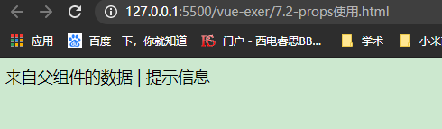
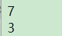
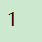
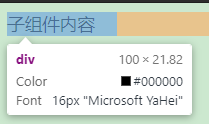
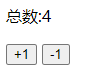
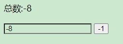
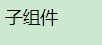
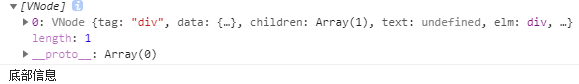
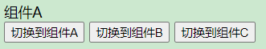

# Vue.js 实战

***

# ch2 数据绑定

## 2.1 Vue实例与数据绑定

```html
<!DOCTYPE html>
<html lang="en">
<head>
  <meta charset="UTF-8">
  <meta name="viewport" content="width=device-width, initial-scale=1.0">
  <title>示例</title>
</head>
<body>
  <div id="app">
    <input type="text" v-model="name" placeholder="用户名">
    <h1>你好，{{name}}</h1>
  </div>
  <script src="https://cdn.jsdelivr.net/npm/vue/dist/vue.js"></script>
  <script>
    var app = new Vue({
      el:'#app',
      data:{
        name:'',
      }
    })
  </script>
</body>
</html>
```

### 2.1.1. 实例与数据

上面，el用于指定一个页面中已存在的DOM元素来挂载Vue实例。

### 2.1.2 生命周期

每个Vu实例创建时，都会经历一系列的初始化过程，同时也会调用相应的生命周期钩子。

vue常用的生命周期钩子有

* created：实例创建完成后调用，此阶段完成了数据的观测等，但尚未怪哉，$el还不可用，需要初始化处理一些数据时会比较有用
* mounted ：el挂载到实例上后调用，一般我们的第一个业务逻辑会在这里
* beforeDestroy：实例销毁之前调用。主要解绑一些使用addEventListener监听的事件。

### 2.1.4 过滤器

在`{{}}`插值的尾部添加一个管道符`(|)`对数据进行过滤，常用于格式化文本

Vue实例—— 实时显示当前的时间

# ch3 计算属性

1. 实现简单文本插值。                                                                                                                               
2. 动态设置元素的样式名称class和内联样式style

>  计算属性是基于它的以来缓存的，一个计算属性所依赖的数据发生变化时，它才会重新取值，所以当遍历大数组和做大量计算时，应当使用计算属性

# ch4 v-bind 及class与style绑定

## 4.2 绑定class的几种方式

### 4.2.1 对象语法

```html
<div id="app">
    <div :class="classes">
      绑定class的几种方式
    </div>
  </div>
  <script src="https://cdn.jsdelivr.net/npm/vue/dist/vue.js"></script>
  <script> 
    var app = new Vue({
      el:'#app',
      data:{
        isActive:true,
        error:null
      },
      computed:{
        classes:function(){
          return {
            active:this.isActive && !this.error,
            'text-fail':this.error && this.error.type === 'fail'
          }
        }
      }
    })
  </script>
```

### 4.2.2 数组语法

给class绑定一个数组

```html
<div id="app">
    <div :class="[activeCls,errorCls]">
      需要多个class
    </div>
  </div>
  <script src="https://cdn.jsdelivr.net/npm/vue/dist/vue.js"></script>
  <script> 
    var app = new Vue({
      el:'#app',
      data:{
        activeCls:'active',
        errorCls:'error',
      }
    })
```

可以使用计算属性给元素动态设置类名

```html
 <div id="app">
    <div :class="classes">
      动态设置类名
    </div>
  </div>
  <script src="https://cdn.jsdelivr.net/npm/vue/dist/vue.js"></script>
  <script> 
    var app = new Vue({
      el:'#app',
      data:{
        size:'large',
        disabled:true,
      },
      computed:{
        classes:function(){
          return [
            'btn',
            {
              ['btn-'+this.size]:this.size!== '',
              ['btn-disabled']:this.disabled
            }
          ]
        }
      }
    })
  </script>
```

## ch5 内置指令

## 5.1 基本指令

### 5.1.1. v-cloak

对于简单项目可以解决初始化慢导致页面闪。

工程化项目里通过路由去挂载不同组件，不需要v-cloak

### 5.1.2 v-once

定义它的元素或组件只渲染一次，包括元素或组件的所有子节点。首次渲染后，不再随数据的变化重新渲染，将被视为静态内容。（少用。进一步优化性能时可能用到

## 5.2 v-if v-show的选择

v-if若表达式初值为false，则一开始元素就不会被渲染，条件为真才渲染。

v-show只是简单的CSS属性切换，无论条件真或否，都会被编译。

**v-if更适合条件不经常改变的场景，因为其切换开销相对较大，v-show适用于频繁切换条件**

## 5.3 v-for

### 5.3.1 基本用法

v-for可以遍历

* 数据
* 对象的属性（没用过！？
* 还可以迭代整数

### 5.3.2 数组更新

例如，给示例的数组books添加一项

**改变原数组的情况**

使用push为数组添加一项

**不改变原数组的情况**

有些方法不会改变原数组，例如 `filter()`,`concat()`,`slice()，他们返回一个新数组。

### 5.3.3 过滤与排序

不想改变原数组，想通过一个数组的副本来做过滤或排序的显示时，可以使用计算属性来返回过滤或排序后的数组

https://blog.csdn.net/sinat_38368658/article/details/107997407

## 5.4 方法与事件

Vue提供了一个特殊变量`$event`，用于访问原生DOM事件。例如下面的实例可以阻止链接打开

```vue
  <div id="app">
    <a href="www.baidu.com" @click="handleClick('禁止打开',$event)">打开链接</a>
  </div>
  <script>
    var app = new Vue({
      el:'#app',
      methods:{
        handleClick:function(message,event){
          event.preventDefault();
          window.alert(message);
        }
      }
    });
  </script>
```

上述使用的` event.preventDefault()`也可以用Vue事件的修饰符实现。

Vue支持一下修饰符

* .stop
* .prevent
* .capture
* .self
* .once

练习题 购物车https://blog.csdn.net/Clara_G/article/details/89840364

# ch6 表单与v-model

***

##  6.3 修饰符

.number 将输入转换为Number类型，否则虽然你输入的是数字，但它的类型其实是string，用于数字输入框

.trim 过滤首尾空格

# ch7 组件

***

## 7.1 组件与复用

注意，Vue组件的模板在某些情况下会受到HTML的限制，比如`<table>`内规定只允许是`<tr>,<td><th>`等这些表格元素，所以在`<table>`内直接使用组件是无效的。在这种情况下，可以使用**is**属性来挂载组件

```js
  <div id="app">
    <table>
      <tbody is="my-component"></tbody>
    </table>
  </div>
  <script src="https://cdn.jsdelivr.net/npm/vue/dist/vue.js"></script>
  <script>
    Vue.component('my-component',{
      template:'<div>这里是我自定义组件的内容</div>'
    })

    var app = new Vue({
      el:'#app',
    });
    
  </script>
```

常见的限制元素还有ul ol select

【注】如果使用的是字符串模板，是不受限制的，比如vue单文件用法

## 7.2 使用props传递数据

### 7.2.1 基本用法

父组件中包含子组件，父组件要正向地向子组件传递数据或参数，这个过程就是通过props实现。

在组件中，使用选项props声明需要从父级接受的数据，props的值可以是两种，字符串数组或对象。

以数组用法为例，构造一个数组，接受一个来自父级的数据mesage，并把它在组件模板中渲染。

```html
  <div id="app">
    <my-component message="来自父组件的数据" warning-text="提示信息"></my-component>
  </div>
  <script src="https://cdn.jsdelivr.net/npm/vue/dist/vue.js"></script>
  <script>
    Vue.component('my-component',{
      props:['message','warningText'],
      template:'<div>{{message}} | {{warningText}}</div>'
    })
    var app = new Vue({
      el:'#app',
    });
  </script>
```



当传递的数据不是写死，而是来自父级的动态数据，可以使用v-bind来动态绑定props的值，当父组件的数据发生变化时，也会传递给子组件

```html
  <div id="app">
    <input type="text" v-model="parentMessage">
    <my-component :message="parentMessage"></my-component>
  </div>
  <script src="https://cdn.jsdelivr.net/npm/vue/dist/vue.js"></script>
  <script>
    Vue.component('my-component',{
      props:['message'],
      template:'<div>来自父组件的消息:{{message}}</div>'
    })
    var app = new Vue({
      el:'#app',
      data:{
        parentMessage:''
      }
    });
  </script>
```

【注意】：如果要传递数字，布尔值，数组，对象。如果不使用v-bind，传递的仅仅是字符串

```html
  <div id="app">
    <!--未使用v-bind 传递的时字符串-->
    <my-component message="[1,2,3]"></my-component>
    <!--使用v-bind 传递的才是数组-->
    <my-component :message="[1,2,3]"></my-component>
  </div>
  <script src="https://cdn.jsdelivr.net/npm/vue/dist/vue.js"></script>
  <script>
    Vue.component('my-component',{
      props:['message'],
      template:'<div>{{message.length}}</div>'
    })
    var app = new Vue({
      el:'#app',
    });
  </script>
```



### 7.2.2 单向数据流

props传递数据是单向，对于需要改变props的情况

**第一种是父组件传初始值，子组件将其作为初始值保存起来，在自己的作用域下可以随意修改和使用**

这种情况可以在组件data内再声明一个数据，引用父组件的prop

```html
  <div id="app">
    <my-component :init-count="1"></my-component>
  </div>
  <script src="https://cdn.jsdelivr.net/npm/vue/dist/vue.js"></script>
  <script>
    Vue.component('my-component',{
      props:['initCount'],
      template:'<div>{{count}}</div>',
      data(){
        return{
          count:this.initCount
        }
      }
    })
    var app = new Vue({
      el:'#app',
    });
  </script>
```



组件中声明了数据count，它在组件初始化事会获取来自父组件的initCount，之后就与之无关了，指用维护count。这样就可以避免直接操作initCount

**另一种情况是prop作为需要被转变的原始值传入，这种情况使用计算属性就可以**

```html
  <div id="app">
    <my-component :width="100"></my-component>
  </div>
  <script src="https://cdn.jsdelivr.net/npm/vue/dist/vue.js"></script>
  <script>
    Vue.component('my-component',{
      props:['width'],
      template:'<div :style="style">子组件内容</div>',
      computed:{
        style:function(){
          return {
            width:this.width+'px'
          }
        }
      }
    })
    var app = new Vue({
      el:'#app',
    });
  </script>
```



【注意】JS中对象和数组是引用类型，指向同一个内存空间，所以props是对象和数组时，在子组件内改变是会影响父组件的。

### 7.2.3 数据验证

上面的例子props的值都是数组，除了数组外，可以是对象，当prop需要验证时，就需要对象写法

一般当你的组件提供给别人使用时，推荐都进行数据验证。比如某个数据必须是数字类型，如果传入字符串，就会在控制台弹出警告

```js
Vue.component('my-component',{
      props:{
        //必须是数字类型
        propA:Number,
        //必须是字符串或数字类型
        propB:[String,Number],
        //布尔值,如果没有定义,默认值就是true
        propC:{
          type:Boolean,
          default:true
        },
        //数字，而且是必传
        propD:{
          type:Number,
          required:true
        },
        //如果是数组或对象，默认值必须是一个函数来返回
        propE:{
          type:Array,
          default:function(){
            return [];
          }
        },
        //自定义一个验证函数
        propF:{
          validator:function(value){
            return val>10;
          }
        }
      }
    });
```

当prop验证失败时，开发版本下会在控制台抛出一条警告

## 7.3 组件通信

### 7.3.1 自定义事件

子组件`$emit()`触发事件，父组件`$on()`监听子组件

父组件也可以直接在子组件的自定义标签上使用`v-on`来监听子组件出发的自定义事件

```html
  <div id="app">
    <p>总数:{{total}}</p>
    <!--语法糖写法：v-on:increase-->
    <my-component
      @increase="handleGetTotal"
      @reduce="handleGetTotal"></my-component>
  </div>
  <script src="https://cdn.jsdelivr.net/npm/vue/dist/vue.js"></script>
  <script>
    Vue.component('my-component',{
      template:'\
      <div>\
        <button @click="handleIncrease">+1</button>\
        <button @click="handleReduce">-1</button>\
      </div>',
      data:function(){
        return {
          counter:0
        }
      },
      methods:{
        handleIncrease:function(){
          this.counter++;
          this.$emit('increase',this.counter);
        },
        handleReduce:function(){
          this.counter--;
          this.$emit('reduce',this.counter);
        }
      }
    })

    var app = new Vue({
      el:'#app',
      data:{
        total:0,
      },
      methods:{
        handleGetTotal:function(total){
          this.total = total;
        }
      }
    });
    
  </script>
</body>
</html>
```



### 7.3.2 使用v-model

一个语法糖，直接使用V-model绑定数据total，这里组件$emit()的事件名时特殊的input。

```html
<div id="app">
    <p>总数:{{total}}</p>
    <!--语法糖写法：v-on:increase-->
    <my-component v-model="total"></my-component>
  </div>
  <script src="https://cdn.jsdelivr.net/npm/vue/dist/vue.js"></script>
  <script>
    Vue.component('my-component',{
      template:'\
      <div>\
        <button @click="handleReduce">-1</button>\
      </div>',
      data:function(){
        return {
          counter:0
        }
      },
      methods:{
        handleReduce:function(){
          this.counter--;
          this.$emit('input',this.counter);
        }
      }
    })

    var app = new Vue({
      el:'#app',
      data:{
        total:0,
      },
    });
    
  </script>
</body>
</html>
```

v-model还可以用来创建自定义的表单输入组件，进行数据双向绑定

```html
  <div id="app">
    <p>总数:{{total}}</p>
    <my-component  v-model="total"></my-component>
    <button @click="handleReduce">-1</button>
  </div>
  <script src="https://cdn.jsdelivr.net/npm/vue/dist/vue.js"></script>
  <script>
    Vue.component('my-component',{
      template:'<input :value="value" @input="updateValue">',
      methods:{
        updateValue:function(event){
          this.$emit('input',event.target.value);
        }
      }
    })

    var app = new Vue({
      el:'#app',
      data:{
        total:0,
      },
      methods:{
        handleReduce:function(){
          this.total--;
        }
      }
    });
    
  </script>
```




实现这样一个具有双向绑定的v-model组件要满足下面两个要求

* 接受一个value属性
* 在有新的value时触发input事件

### 7.3.3 非父子组件通信

非父子组件一般有两种，兄弟组件和跨多级组件。

在Vue2.x中**，推荐使用一个空的Vue实例作为中央事件总线，也就是一个中介。**这种方法巧妙而轻量地实现了任何组件间的通信，包括父子，兄弟，跨级。

```html
 <div id="app">
    {{message}}
    <component-a></component-a>
  </div>
  <script src="https://cdn.jsdelivr.net/npm/vue/dist/vue.js"></script>
  <script>
    var bus = new Vue();

    Vue.component('component-a',{
      template:'<button @click="handleEvent">传递事件</button>',
      methods:{
        handleEvent:function(){
          bus.$emit('on-message','来自组件component-a的内容');
        }
      }
    })

    var app = new Vue({
      el:'#app',
      data:{
        message:'',
      },
      mounted:function(){
        var _this = this;
        //在实例初始化时，监听来自bus实例的事件
        bus.$on('on-message',function(msg){
          _this.message = msg;
        })
      }
    });  
  </script>
```


点击后


## 7.4 使用slot分发内容

#### 7.4.1 slot

props传递数据，events触发事件和slot内容分发就构成了Vue组件的3个API来源，再复杂的组件也是由这三部分组成的。

### 7.4.2 作用域

父组件模板的内容是在父组件作用域内编译，子组件模板的内容实在子组件作用域内编译

showChild绑定父组件的数据

```html
  <div id="app">
    <child-component v-show="showChild"></child-component>
  </div>
  <script src="https://cdn.jsdelivr.net/npm/vue/dist/vue.js"></script>
  <script>
    var bus = new Vue();

    Vue.component('child-component',{
      template:'<div>子组件</div>',
    });

    var app = new Vue({
      el:'#app',
      data:{
        showChild:true
      }
    });
    
  </script>
```

showChild绑定子组件

```html
<!DOCTYPE html>
<html lang="en">
<head>
  <meta charset="UTF-8">
  <meta name="viewport" content="width=device-width, initial-scale=1.0">
  <title>示例</title>
</head>
<body>
  <div id="app">
    <child-component></child-component>
  </div>
  <script src="https://cdn.jsdelivr.net/npm/vue/dist/vue.js"></script>
  <script>
    var bus = new Vue();

    Vue.component('child-component',{
      template:'<div v-show="showChild">子组件</div>',
      data:function(){
        return {
          showChild:true
        }
      }
    });

    var app = new Vue({
      el:'#app',
    });
    
  </script>
</body>
</html>
```



slot分发的内容，作用域实在父组件上的

### 7.4.3 slot用法

**单个slot**

```html
  <div id="app">
    <child-component>
      <p>分发内容</p>
      <p>分发更多的内容</p>
    </child-component>
  </div>
  <script src="https://cdn.jsdelivr.net/npm/vue/dist/vue.js"></script>
  <script>
    var bus = new Vue();

    Vue.component('child-component',{
      template:'\
      <div>\
        <slot>\
            <p>如果父件没有插入内容，我将默认出现</p>\
        </slot>\
      </div>',
    });

    var app = new Vue({
      el:'#app',
    });
    
  </script>
```

**具名slot**

给`<slot>`指定name后可以分发多个内容，具名slot可以和单个slot共存

```html
  <div id="app">
    <child-component>
      <h2 slot="header">标题</h2>
      <p>内容</p>
      <p>更多正文内容</p>
      <div slot="footer">底部信息</div>
      <p>试试</p>
    </child-component>
  </div>
  <script src="https://cdn.jsdelivr.net/npm/vue/dist/vue.js"></script>
  <script>
    Vue.component('child-component',{
      template:'\
      <div class="container">\
        <div class="header">\
          <slot name="header"></slot>\
        </div>\
        <div class="main">\
          <slot></slot>\
        </div>\
        <div class="footer">\
          <slot name="footer"></slot>\
        </div>\
      </div>'
    });

    var app = new Vue({
      el:'#app',
    });   
  </script>
```

### 7.4.4 作用域插槽

作用域插槽是一种特殊的slot，使用一个可以复用的模板替换已渲染元素

```html
 <div id="app">
    <child-component>
      <template scope="props">
        <p>来自父组件的内容</p>
        <p>{{props.msg}}</p>
      </template>
    </child-component>
  </div>
  <script src="https://cdn.jsdelivr.net/npm/vue/dist/vue.js"></script>
  <script>
    var bus = new Vue();

    Vue.component('child-component',{
      template:'\
      <div class="container">\
        <slot msg="来自子组件的内容"></slot>\
      </div>'
    });

    var app = new Vue({
      el:'#app',
    });
    
  </script>
```


` <template scope="props">`，template内可以通过临时变量props访问来自子组件插槽的数据msg

### 7.4.5 访问slot

`$slots`用来访问被slot分发的内容的方法。

```html
  <div id="app">
    <child-component>
      <h2 slot="header">标题</h2>
      <p>内容</p>
      <p>更多正文内容</p>
      <div slot="footer">底部信息</div>
    </child-component>
  </div>
  <script src="https://cdn.jsdelivr.net/npm/vue/dist/vue.js"></script>
  <script>
    Vue.component('child-component',{
      template:'\
      <div class="container">\
        <div class="header">\
          <slot name="header"></slot>\
        </div>\
        <div class="main">\
          <slot></slot>\
        </div>\
        <div class="footer">\
          <slot name="footer"></slot>\
        </div>\
      </div>',
      mounted:function(){
        var header = this.$slots.header;
        var main = this.$slots.default;
        var footer = this.$slots.footer;
        console.log(footer);
        console.log(footer[0].elm.innerHTML);
      }
    });

    var app = new Vue({
      el:'#app',
    });   
  </script>
```



## 7.5 组件高级用法

### 7.5.1 递归组件

组件在它的模板内可以递归的调用自己，只要给组件设置name就可以了。

组件递归使用可以用来开发一些具有未知层级关系的独立组件，比如级联选择器和属性控件等

### 7.5.2  内联模板

给组件标签使用`inline-template`特性，组件就会把它的内容当作模板，而不是当作内容分发。不建议使用

### 7.5.3 动态组件

元素`<component>`来动态挂载不同的组件，使用is来选择要挂载的组件。

```html
  <div id="app">
    <component :is="currentView"></component>
    <button @click="handleChangeView('A')">切换到组件A</button>
    <button @click="handleChangeView('B')">切换到组件B</button>
    <button @click="handleChangeView('C')">切换到组件C</button>
  </div>
  <script src="https://cdn.jsdelivr.net/npm/vue/dist/vue.js"></script>
  <script>
    var app = new Vue({
      el:'#app',
      components:{
        comA:{
          template:'<div>组件A</div>'
        },
        comB:{
          template:'<div>组件B</div>'
        },
        comC:{
          template:'<div>组件C</div>'
        },
      },
      data:{
        currentView:'comA',
      },
      methods:{
        handleChangeView:function(component){
          this.currentView = 'com'+component;
        }
      }
    });
  </script>
```



### 7.4.5 异步组件

Vue.js允许将组件定义为一个工厂函数，动态地解析组件。Vue.js只在组件需要渲染时触发工厂函数，并把结果缓存起来，用于后面的再次渲染

```html
  <div id="app">
    <child-component></child-component>
  </div>
  <script src="https://cdn.jsdelivr.net/npm/vue/dist/vue.js"></script>
  <script>
    Vue.component('child-component',function(resolve,reject){
      window.setTimeout(function(){
        resolve({
          template:'<div>我是异步渲染的</div>'
        })
      })
    });

    var app = new Vue({
      el:'#app',
    });
  </script>
```

后面使用webpack更优雅地实现异步组件

## 7.6 其他

### 7.6.1 $nextTick

**一个重要概念：异步更新队列**：Vue在观察到数据变化时并不直接更新DOM，而是开启一个队列，并缓冲在同一事件循环中发生的所有数据改变，在缓冲时会去除重复数据，从而避免比不要的计算和DOM操作。然后，在下一个事件循环tick中，Vue刷新队列并执行实际（已去重的）工作。 

```html
  <div id="app">
    <div id="div" v-if="showDiv">这是一段文本</div>
    <button @click="getText">获取div内容</button>
  </div>
  <script src="https://cdn.jsdelivr.net/npm/vue/dist/vue.js"></script>
  <script>
    var app = new Vue({
      el:'#app',
      data:{
        showDiv:false
      },
      methods:{
        getText:function(){
          this.showDiv = true;
          this.$nextTick(function(){
            var text = document.getElementById('div').innerHTML;
          console.log(text);
          });
        }
      }
    })
  </script>
```

### ## 7.7 实例

