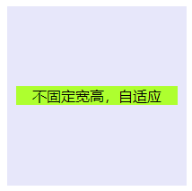

# 使用CSS让元素垂直水平居中

效果图都为这个


hrml结构

```html
  <div class="box">
    <div class="inner">
    </div>
  </div>
```


# 1. position + margin （拔河效应）

理解: 拔河效应依我理解就是相当于一个物体受到在相反方向两个大小相同的力,再加上设置`margin:auto`;就相当于物体受到两个拉力很难受(╯﹏╰），只有当它老老实实呆着任两个力的摆布时，它才好受些QAQ,也就是自适应居中

兼容性：主流浏览器均支持，IE6不支持

```css
  .box{
    background-color: grey;
    width: 200px;
    height: 200px;
    position: relative;
  }
  .inner{
    background-color: lavender;
    width: 100px;
    height: 100px;
    position: absolute;
     /*相对于两个力*/
    left: 0;
    right: 0;
    top: 0;
    bottom: 0;
    /*自适应*/
    margin: auto auto;
  }
```

# 2. display:table-cell(父元素)

 兼容性：由于display:table-cell的原因，IE6\7不兼容

```css
  .box{
    background-color: grey;
    width: 200px;
    height: 200px;
    display: table-cell;
    vertical-align: middle;
    text-align: center;
  }
  .inner{
    background-color: lavender;
    width: 100px;
    height: 100px;
    display: inline-block;
  }
```

# 3. position+transform

兼容性：ie9以下不支持 transform，手机端表现的比较好。

```css
  .box{
    background-color: grey;
    width: 200px;
    height: 200px;
    position: relative;
  }
  .inner{
    background-color: lavender;
    width: 100px;
    height: 100px;
    position: absolute;
    top:50%;
    left:50%;
    transform: translate(-50%,-50%);
  }
```

# 4. display:flex（父元素）align-items: center;
    justify-content: center;

移动端首选

```css
  .box{
    background-color: grey;
    width: 200px;
    height: 200px;
    display: flex;
    align-items: center;
    justify-content: center;
  }
  .inner{
    background-color: lavender;
    width: 100px;
    height: 100px;
  }
```

# 5. display:flex（父元素）center;margin:auto

移动端首选

```css
  .box{
    background-color: grey;
    width: 200px;
    height: 200px;
    display: flex;
  }
  .inner{
    background-color: lavender;
    width: 100px;
    height: 100px;
    margin: auto;
  }
```

# 6. 纯position

## 6.1 精确计算top和left

* 子元素（conter）的left值计算公式：left=(父元素的宽 - 子元素的宽 ) / 2=(200-100) / 2=50px;
* 子元素（conter）的top值计算公式：top=(父元素的高 - 子元素的高 ) / 2=(200-100) / 2=50px;

```css
  .box{
    background-color: grey;
    width: 200px;
    height: 200px;
    position: relative;
  }
  .inner{
    background-color: lavender;
    width: 100px;
    height: 100px;
    position: absolute;
    left:50px;
    top:50px;
  }
```

## 6.2  top/left和margin-left/margin-top结合

 兼容性：适用于所有浏览器

* left值固定为50%;子元素的margin-left= -（子元素的宽/2）=-100/2= -50px;
* top值也一样，固定为50%；子元素的margin-top= -（子元素的高/2）=-100/2= -50px;

```css
  .box{
    background-color: grey;
    width: 200px;
    height: 200px;
    position: relative;
  }
  .inner{
    background-color: lavender;
    width: 100px;
    height: 100px;
    position: absolute;
    left: 50%;
    top: 50%;
    margin-left: -50px;
    margin-top: -50px;
  }
```

# 7. 兼容低版本浏览器，不固定宽高



```html
  <div class="table">
    <div class="tableCell">
      <div class="content">不固定宽高，自适应</div>
    </div>
  </div>
```

```css
  <style type="text/css">
  .table{
    background-color: grey;
    width: 200px;/*宽度值不能少*/
    height: 200px;/*高度值不能少*/
    display: table;
    position: relative;
    float: left;
  }
  .tableCell{
    background-color: lavender;
    display: table-cell;
    vertical-align: middle;
    text-align: center;
    *position: absolute;
    *top:50%;
    *left:50%;
    padding: 10px;
  }
  .content{
    *position: relative;
    background: greenyellow;
    *top:-50%;
    *left: -50%;
  }
```

# 总结

## 移动端首选

如果是**移动端**，那么用方法四和方法五是比较方便的。而且支持不固定宽高的情况，快、准、狠

也就是用 

* flex**;** align-items: center; justify-content: center; 
* display:flex;margin:auto;

## PC端首选

考虑兼容性：方法六使用纯position

如果PC端的中间的元素**高度不固定**，那么就用方法七即可，代码就不复制了


