# 第1章 前言

<!-- @import "[TOC]" {cmd="toc" depthFrom=1 depthTo=6 orderedList=false} -->

<!-- code_chunk_output -->

- [第1章 前言](#第1章-前言)
- [第2章 HTML](#第2章-html)
  - [2.1 HTML](#21-html)
    - [•  如何理解HTML语义化](#如何理解html语义化)
    - [• 块级元素&内联元素](#块级元素内联元素)
- [第3章 CSS 面试题](#第3章-css-面试题)
  - [3-1 布局](#3-1-布局)
    - [• 盒子模型](#盒子模型)
    - [• margin纵向重叠](#margin纵向重叠)
    - [• margin负值问题](#margin负值问题)
    - [• BFC](#bfc)
    - [• float布局](#float布局)
    - [• flex布局](#flex布局)
  - [2-3 定位](#2-3-定位)
    - [• relative分别依据什么定位？](#relative分别依据什么定位)
    - [• 居中对齐的实现方式](#居中对齐的实现方式)
  - [3-5  图文样式](#3-5-图文样式)
    - [• line-height](#line-height)
  - [3-6 响应式](#3-6-响应式)
    - [• rem](#rem)
    - [• 响应式布局的常见方案](#响应式布局的常见方案)
    - [• vw-wh](#vw-wh)
  - [3-7 CSS3](#3-7-css3)
- [第4章 JS基础-变量类型和计算](#第4章-js基础-变量类型和计算)
  - [4-1 值类型和引用类型](#4-1-值类型和引用类型)
    - [• 值类型和引用类型的区别](#值类型和引用类型的区别)
    - [• typeof能判断哪种类型](#typeof能判断哪种类型)
    - [• 何时使用 === 何时使用 ==](#何时使用-何时使用)
  - [4-2 深拷贝](#4-2-深拷贝)
    - [• 手写深拷贝](#手写深拷贝)
    - [• 手写深度比较，模拟lodash.isEqual](#手写深度比较模拟lodashisequal)
  - [4-3 变量计算 - 注意某些类型转换的坑](#4-3-变量计算-注意某些类型转换的坑)
    - [• 列举强制类型转换和隐式类型转换](#列举强制类型转换和隐式类型转换)
- [第5章 JS基础-原型和原型链](#第5章-js基础-原型和原型链)
  - [5-1 执行上下文与调用栈](#5-1-执行上下文与调用栈)
    - [•  何为变量提升？](#何为变量提升)
    - [• var 和let const的区别](#var-和let-const的区别)
    - [•  函数声明和函数表达式的区别](#函数声明和函数表达式的区别)
  - [5-1 如何用 class 实现继承](#5-1-如何用-class-实现继承)
    - [ES6中的classs](#es6中的classs)
    - [**用class实现继承**](#用class实现继承)
    - [•  如何用JS实现继承](#如何用js实现继承)
    - [• new做了哪些事情？](#new做了哪些事情)
    - [• new Object()和Object.create()的区别](#new-object和objectcreate的区别)
  - [5-3 如何理解 JS 原型（隐式原型和显示原型）](#5-3-如何理解-js-原型隐式原型和显示原型)
  - [5-4 instanceof 是基于原型链实现的](#5-4-instanceof-是基于原型链实现的)
    - [•  手写instance](#手写instance)
    - [**原型链**](#原型链)
  - [5-5 JS 原型相关面试题](#5-5-js-原型相关面试题)
    - [•  如何准确判断一个变量是不是数组](#如何准确判断一个变量是不是数组)
    - [• class的原型本质如何理解？](#class的原型本质如何理解)
    - [• 手写一个简易的jQuery，考虑插件和扩展性](#手写一个简易的jquery考虑插件和扩展性)
- [第6章 JS基础-作用域和闭包](#第6章-js基础-作用域和闭包)
  - [6-1 作用域？自由变量？](#6-1-作用域自由变量)
  - [6-2 闭包？闭包会用在哪里？](#6-2-闭包闭包会用在哪里)
    - [复杂作用域：代码输出结果](#复杂作用域代码输出结果)
    - [闭包应用1：模拟私有变量](#闭包应用1模拟私有变量)
    - [闭包应用2：柯里化与偏函数](#闭包应用2柯里化与偏函数)
    - [闭包与内存泄漏](#闭包与内存泄漏)
    - [内存泄漏成因分析](#内存泄漏成因分析)
  - [6-3 this 有几种赋值情况](#6-3-this-有几种赋值情况)
    - [this指向原则](#this指向原则)
      - [**一、this会100%指向window的三种特殊情况**](#一-this会100指向window的三种特殊情况)
      - [二、**严格模式下的this指向**](#二-严格模式下的this指向)
      - [**三、箭头函数的this**](#三-箭头函数的this)
    - [this指向的改变机制](#this指向的改变机制)
      - [一、使用箭头函数](#一-使用箭头函数)
      - [二、使用call apply bind](#二-使用call-apply-bind)
  - [6-4 作用域相关面试题](#6-4-作用域相关面试题)
    - [• call和apply区别](#call和apply区别)
    - [• call/apply/bind实现](#callapplybind实现)
    - [• 实际开发中闭包的应用场景，举例说明](#实际开发中闭包的应用场景举例说明)
    - [• 创建10个`<a>`,点击弹出序号](#创建10个a点击弹出序号)
    - [• 关于this的场景题](#关于this的场景题)
    - [•  关于作用域和自由变量的场景题](#关于作用域和自由变量的场景题)
- [第7章 JS基础-异步](#第7章-js基础-异步)
  - [7-1 同步和异步有何不同](#7-1-同步和异步有何不同)
  - [7-2 前端异步的应用场景有哪些](#7-2-前端异步的应用场景有哪些)
  - [7-4 for-of的应用场景](#7-4-for-of的应用场景)
  - [7-3 promise用法](#7-3-promise用法)
    - [• 使用Promise异步请求数据示例](#使用promise异步请求数据示例)
    - [• 用Promise改造网络请求](#用promise改造网络请求)
    - [• 手写用Promise加载一张图片](#手写用promise加载一张图片)
  - [7-4 Promise三种状态](#7-4-promise三种状态)
  - [7-5 Promise状态切换机制](#7-5-promise状态切换机制)
  - [7-6 Promise的then和catch的连接](#7-6-promise的then和catch的连接)
  - [7-7 Promise命题](#7-7-promise命题)
      - [命题1：Primoise特性类](#命题1primoise特性类)
      - [命题2：看代码说答案类](#命题2看代码说答案类)
      - [命题3：Promise底层原理（实现Promise）](#命题3promise底层原理实现promise)
  - [7-8 async-await语法介绍](#7-8-async-await语法介绍)
  - [7-0 async-await和Promise有什么关系](#7-0-async-await和promise有什么关系)
  - [7-10 async-await是语法糖，异步的本质还是回调函数](#7-10-async-await是语法糖异步的本质还是回调函数)
  - [7-11 Generator](#7-11-generator)
- [第8章 JS 异步进阶](#第8章-js-异步进阶)
  - [8-1 什么是event loop](#8-1-什么是event-loop)
  - [8-4 event loop 的执行过程](#8-4-event-loop-的执行过程)
  - [8-5 DOM事件和event loop的关系](#8-5-dom事件和event-loop的关系)
  - [8-13 宏任务和微任务](#8-13-宏任务和微任务)
  - [8-14 event-loop和DOM渲染的关系](#8-14-event-loop和dom渲染的关系)
  - [8-15 为什么微任务比宏任务执行更早](#8-15-为什么微任务比宏任务执行更早)
  - [8-16 微任务和宏任务的根本区别](#8-16-微任务和宏任务的根本区别)
  - [8-17 解答JS异步的面试题](#8-17-解答js异步的面试题)
    - [• 描述 event loop 运行机制（可画图）](#描述-event-loop-运行机制可画图)
    - [• 场景题：async/await语法](#场景题asyncawait语法)
  - [8-18 Node事件循环](#8-18-node事件循环)
    - [Node中的Event loop和浏览器的有啥区别？](#node中的event-loop和浏览器的有啥区别)
    - [nextTick和Promise.then的关系](#nexttick和promisethen的关系)
    - [setTimeout和setImmediate](#settimeout和setimmediate)
- [第9章 DOM](#第9章-dom)
  - [9-1 从JS基础到JS-Web-API](#9-1-从js基础到js-web-api)
  - [9-2 DOM的本质是什么](#9-2-dom的本质是什么)
  - [9-3 DOM节点操作](#9-3-dom节点操作)
    - [• attr和property的区别](#attr和property的区别)
  - [9-4 DOM结构操作](#9-4-dom结构操作)
    - [• DOM操作常用API](#dom操作常用api)
  - [9-5 DOM性能](#9-5-dom性能)
- [第10章  BOM](#第10章-bom)
    - [•  如何识别浏览器的类型](#如何识别浏览器的类型)
    - [•  分析拆解url各个部分](#分析拆解url各个部分)
    - [• 将url参数解析为JS对象](#将url参数解析为js对象)
    - [• 获取当前页面url参数](#获取当前页面url参数)
- [第11章 事件](#第11章-事件)
  - [11-1 DOM事件流](#11-1-dom事件流)
  - [11-1 事件绑定和事件冒泡](#11-1-事件绑定和事件冒泡)
    - [**事件绑定**](#事件绑定)
    - [**事件冒泡**](#事件冒泡)
  - [11-2 自定义事件](#11-2-自定义事件)
  - [11-2 事件代理](#11-2-事件代理)
    - [• 下拉的图片列表，如何监听每个图片的点击？](#下拉的图片列表如何监听每个图片的点击)
  - [11-3 编写通用的事件监听函数](#11-3-编写通用的事件监听函数)
- [第12章 Ajax](#第12章-ajax)
  - [12-1 ajax 的核心API -XMLHttpRequest](#12-1-ajax-的核心api-xmlhttprequest)
    - [• 手写一个简易的ajax](#手写一个简易的ajax)
    - [•  ajax请求get和post的区别](#ajax请求get和post的区别)
  - [12-2 浏览器的同源策略](#12-2-浏览器的同源策略)
  - [12-3 实现跨域的常见方式 - jsonp 和 CORS](#12-3-实现跨域的常见方式-jsonp-和-cors)
    - [• 解释jsonp的原理，为何它不是真正的ajax？](#解释jsonp的原理为何它不是真正的ajax)
    - [• CROS](#cros)
  - [12-4 实际项目中 ajax 的常用插件](#12-4-实际项目中-ajax-的常用插件)
- [第13章 存储](#第13章-存储)
  - [13-1 如何理解 cookie](#13-1-如何理解-cookie)
  - [13-2 localStorage SessionStorage 和 cookie](#13-2-localstorage-sessionstorage-和-cookie)
  - [13-3 三者的区别](#13-3-三者的区别)
- [第14章 HTTP协议](#第14章-http协议)
  - [14-1 HTTPS](#14-1-https)
  - [14-2 http状态码](#14-2-http状态码)
  - [14-3 Restful-API](#14-3-restful-api)
  - [14-4 Http header](#14-4-http-header)
  - [14-5 缓存介绍](#14-5-缓存介绍)
  - [14-6 强制缓存](#14-6-强制缓存)
    - [• cache-control是什么意思](#cache-control是什么意思)
  - [14-7 协商缓存/对比缓存](#14-7-协商缓存对比缓存)
    - [• Etag和Last-Modified是什么意思](#etag和last-modified是什么意思)
  - [14-8 http的缓存机制（重要）](#14-8-http的缓存机制重要)
  - [14-9 刷新页面对http缓存的影响](#14-9-刷新页面对http缓存的影响)
- [第15章 开发环境](#第15章-开发环境)
  - [15-1 前端开发常用的开发工具](#15-1-前端开发常用的开发工具)
  - [15-2 什么是 git](#15-2-什么是-git)
  - [15-3 git 的常用命令](#15-3-git-的常用命令)
  - [15-5 如何用chrome调试 js代码](#15-5-如何用chrome调试-js代码)
  - [15-6 移动端 h5 如何抓包网络请求](#15-6-移动端-h5-如何抓包网络请求)
  - [15-7 如何配置 webpack](#15-7-如何配置-webpack)
  - [15-8 如何配置 babel](#15-8-如何配置-babel)
  - [15-9 ES6 模块化规范是什么](#15-9-es6-模块化规范是什么)
  - [15-10 如何配置 webpack 生产环境](#15-10-如何配置-webpack-生产环境)
  - [15-11 前端用到的 linux 常用命令有哪些](#15-11-前端用到的-linux-常用命令有哪些)
- [第16章 运行环境](#第16章-运行环境)
  - [16-1 JS 上线之后在什么哪里运行？](#16-1-js-上线之后在什么哪里运行)
  - [16-2 网页是如何加载并渲染出来的](#16-2-网页是如何加载并渲染出来的)
    - [**加载过程**](#加载过程)
    - [**渲染过程**](#渲染过程)
  - [16-3 网页加载和渲染的示例](#16-3-网页加载和渲染的示例)
  - [16-4 面试题](#16-4-面试题)
    - [• 从输入url到渲染出页面的整个过程](#从输入url到渲染出页面的整个过程)
    - [• window.onload和DOMContentLoaded的区别](#windowonload和domcontentloaded的区别)
    - [• 重绘和重排](#重绘和重排)
  - [16-5 前端性能优化有哪些方式](#16-5-前端性能优化有哪些方式)
  - [16-6 前端性能优化的示例](#16-6-前端性能优化的示例)
  - [16-7 手写防抖 debounce](#16-7-手写防抖-debounce)
  - [16-8 手写节流 throttle](#16-8-手写节流-throttle)
  - [16-9 如何预防 xss 攻击](#16-9-如何预防-xss-攻击)
  - [16-10 如何预防 xsrf 攻击](#16-10-如何预防-xsrf-攻击)
- [第18章 其他真题](#第18章-其他真题)
  - [6 split()和join()的区别](#6-split和join的区别)
  - [7 数组的pop push unshift shift分别做什么](#7-数组的pop-push-unshift-shift分别做什么)
  - [8 数组slice和splice的区别](#8-数组slice和splice的区别)
  - [9 [10,20,30].map(parseInt)返回结果是什么？](#9-102030mapparseint返回结果是什么)
  - [32 手写数组flatern，考虑多层级](#32-手写数组flatern考虑多层级)
  - [类数组读写转为数组对象](#类数组读写转为数组对象)
  - [33 数组去重](#33-数组去重)
  - [26 如何获取多个数字中的最大值](#26-如何获取多个数字中的最大值)
  - [13 闭包是什么，有什么特性？有什么负面影响？](#13-闭包是什么有什么特性有什么负面影响)
  - [24 判断字符串以字母开头，后面字母数字下划线，长度6-30](#24-判断字符串以字母开头后面字母数字下划线长度6-30)
  - [25 手写字符串trim方法，保证浏览器兼容性](#25-手写字符串trim方法保证浏览器兼容性)
  - [28 如何捕获js程序中的异常](#28-如何捕获js程序中的异常)
  - [29 什么是JSON？](#29-什么是json)
  - [35 介绍一下 RAF（requestAnimationFrame）](#35-介绍一下-rafrequestanimationframe)

<!-- /code_chunk_output -->


**知识点介绍**


**面试流程**

* 一面：以基础知识为主
* 二面（交叉面试）：从基础知识开始，考察原理，终于项目经验（要有实践经验辅助）
* 三面：不是纯技术，项目leader讲角色定位，产品的想法，未来技术规划
* hr面试：阿里hr有一票否决权；如实回答，阳光积极大方

**校招和社招的区别**

* 校招看中基础知识和能力，主要在一面
* 社招看中经验，主要在二面（基础知识要过关）
* 社招，工作时间越长，越偏重经验

* 关于简历
  * 简洁明了，突出个人技能和项目经验
  * 可以把个人博客，开源作品放在简历中（但博客要有内容）
  * 不要造假，保证能力上的真实性（斟酌用词，如精通xxx）
* 面试过程中注意事项
  * 如何看待加班：像借钱，救急不救穷
  * 千万不要挑战面试官，反考面试官
  * 学会给面试官惊喜，证明你能想到更多，做的更好，但不要太多
  * 遇到不会的问题，说出你知道的部分即可，但别岔开话题
  * 谈谈你的缺点：说一下你最近在学什么即可

# 第2章 HTML

## 2.1 HTML

###  •  如何理解HTML语义化


HTML5语义化标签是指正确的标签包含了正确的内容，结构良好，便于阅读，比如nav表示导航条，类似的还有article、header、footer等等标签。

* 让人更容易读懂（增加代码可读性）
* 让搜索引擎更容易读懂（利于SEO即搜索引擎优化）

### • 块级元素&内联元素

* `display: block/table`：div h1 h2 table ul ol p
* `display:inline/inline-block` : span img input button
* **inline-block、inline和block的区别**
  * *Block*是块级元素，独占一行，能设置宽度，高度，margin/padding水平垂直方向都有效。
  * *Inline*：设置width和height无效，行内元素不形成新内容块，即在其左右可以有其他元素。
  * *Inline-block*：能设置宽度高度，margin/padding水平垂直方向 都有效，左后又可以有其他元素

# 第3章 CSS 面试题

## 3-1 布局

### • 盒子模型

CSS盒模型就是用来装页面上的元素的矩形区域。CSS中的盒子模型包括IE盒子模型和标准的W3C盒子模型。


区别：从图中我们可以看出，这两种盒子模型最主要的区别就是width的包含范围，在标准的盒子模型中，**width**指content部分的宽度，在IE盒子模型中，**width**表示content+padding+border这三个部分的宽度，故这使得在计算整个盒子的宽度时存在着差异：

* 标准盒子模型的**盒子宽度**：左右border+左右padding+width
* IE盒子模型的**盒子宽度**：width

在CSS3中引入了box-sizing属性

* `box-sizing:content-box`;表示标准的盒子模型，
* `box-sizing:border-box`表示的是IE盒子模型
* `inherit`：继承父元素的box-sizing

【注】也很好理解性记忆，包含什么，width就从什么开始算起。


* offsetWidth = (内容宽度+内边距+边框)，无外边距
* 答案：122px
* 补充：如果让offetWidth等于100px，该如何做？设置`box-sizing:border-box，`document.getElementById('div1').offset` 就等于100px了

### • margin纵向重叠


* 相邻元素的margin-top和margin-bottom会发生重叠
* 空白内容的`<p></p>`也会重叠
* 答案：15px

### • margin负值问题


* margin-top和margin-left负值，元素向上，向左移动
* margin-right负值，右侧元素左移，自身不受影响
* margin-bottom负值，下方元素上移，自身不受影响

### • BFC


* Block format context，块级格式化上下文
* BFC是一块独立渲染区域，内部元素的渲染不会影响边界以外的元素
* 形成BFC的常见条件
  1. float不是none
  2. position是absolute或fixed
  3. overflow不是visible
  4. display是flex inline-block等
* BFC的常见应用

  * 清除浮动

  * 原理：要讲清楚这个解决方案的原理，首先需要了解BFC，BFC是CSS可视化渲染的一部分，它是一块区域，规定了内部块盒的渲染方式，以及浮动相互之间的影响关系

    当元素设置了*overflow样式且值不为visible时，该元素就构建了一个BFC，BFC在计算高度时，内部浮动元素的高度也要计算在内，也就是说技术BFC区域内只有一个浮动元素时，BFC的高度也不会发生塌缩，所以达到了清除浮动的目的，*

**BFC清除浮动代码示例**

不清楚浮动：


清除浮动：

```html
    <style type="text/css">
        .container {
            background-color: #f1f1f1;
        }
        .left {
            float: left;
        }
        .bfc {
            overflow: hidden; /* 触发元素 BFC */
        } 
    </style>
</head>
<body>
    <div class="container bfc">
        
        <p class="bfc">某一段文字……</p>
    </div>
</body>
```


### • float布局


**圣杯布局和双飞翼布局的目的**

* 三栏布局，中间一栏最先加载和渲染（内容最重要）
* 两侧内容固定，中间内容随着宽度自适应
* 一般用于PC网页


**圣杯布局和双飞翼布局的技术总结**

* 使用float布局
* 两侧使用margin负值，以便和中间内容横向重叠
* 防止中间内容被两侧覆盖，一个用padding（圣杯布局）一个用margin（双飞翼布局）

**圣杯布局代码**


```html
<body>
    <div id="header">this is header</div>
    <div id="container">
        <div id="center" class="column">this is center</div>
        <div id="left" class="column">this is left</div>
        <div id="right" class="column">this is right</div>
    </div>
    <div id="footer">this is footer</div>
</body>
```

```css
<style type="text/css">
        body {
            min-width: 550px;
        }
        #header {
            text-align: center;
            background-color: #f1f1f1;
        }
        #container{
          padding-left: 200px;
          padding-right: 150px;/*1.留出中间的内容*/
        }
        #container .column{
          float: left;/*2.设置float布局*/
        }
        #center {
            background-color: #ccc;
            width: 100%;
        }
        #left {
            background-color: yellow;
            width: 200px;
            margin-left: -100%;/*3.left的父元素的宽度值，设置负值，以便和中间内容横向重叠*/
            position: relative;
            right: 200px;/*position为relative就是相对自身移动元素*/
        }
        #right {
            background-color: red;
            width: 150px;
            margin-right: -150px;/*4.margin负值*/
        }
        #footer {
          clear: both;/*清除浮动*/
          text-align: center;
          background-color: #f1f1f1;
        }
    </style>
```

**双飞翼代码**（推荐，更简单）


```html
<body>
  <div id="header">this is header</div>
  <div id="container">
      <div id="center" class="column">
        <!--注意这里加了个center-wrap-->
        <div id="center-wrap">
          this is center
        </div>
      </div>
      <div id="left" class="column">this is left</div>
      <div id="right" class="column">this is right</div>
  </div>
  <div id="footer">this is footer</div>
</body>
```

```css
  <style type="text/css">
  #header{
    text-align: center;
    background-color: #f1f1f1;
  }
  .column{
    float: left;
  }
  #center{
    background-color: #ccc;
    width: 100%;
  }
  #center-wrap{
    margin: 0 150px 0 200px;
  }
  #left{
    width: 200px;
    margin-left: -100%;/*margin-left负值100%*/
    background-color: yellow;
  }
  #right{
    width: 150px;
    margin-left: -150px;/*margin-left负值自身宽度*/
    background-color: red;
  }
  #footer{
    clear: both;
    text-align: center;
    background-color: #f1f1f1;
  }
  </style>
```

**清除浮动代码**

```html
    <div id="container" class="clearfix">
        <div id="center" class="column">this is center</div>
        <div id="left" class="column">this is left</div>
        <div id="right" class="column">this is right</div>
    </div>
```

```js
        /* 手写 clearfix */
        .clearfix:after {
            content: '';
            display: table;
            clear: both;
        }
```


### • flex布局

> http://www.ruanyifeng.com/blog/2015/07/flex-grammar.html?utm_source=tuicool（语法篇）
> http://www.ruanyifeng.com/blog/2015/07/flex-examples.html（实例篇）

Flex是Flexible Box的缩写，意为"弹性布局"，用来为盒状模型提供最大的灵活性。

**常用语法回顾：**

* `flex-direction`属性决定主轴的方向
* `flex-wrap`属性定义，如果一条轴线排不下，如何换行。
* `justify-content`属性定义了项目在主轴上的对齐方式。
* `align-items`属性定义项目在交叉轴上如何对齐
* `align-self`属性允许单个项目有与其他项目不一样的对齐方式，可覆盖


代码：


```html
<!DOCTYPE html>
<html lang="en">
	<head>
		<style type="text/css">
			*{
        padding: 0px;
        margin: 0px;
      }
      .box{
        margin: 0 auto;
        width: 200px;
        height: 200px;
        border: 5px solid lightcoral;
        padding: 10px;
        border-radius: 50px;
        /*flex布局*/
        display: flex;
        justify-content: space-between;

      }
      .item{
        width: 50px;
        height: 50px;
        background-color: lightcoral;
        border-radius: 25px;
      }
      .item:nth-child(2){
        align-self: center;/*设置align-self*/
      }
      .item:nth-child(3){
        align-self: flex-end;/*设置align-self*/
      }
		</style>
	</head>
	<body>
		<div class="box">
      <div class="item"></div>
      <div class="item"></div>
      <div class="item"></div>
    </div>
  </body>
</html>

```

## 2-3 定位

### • relative分别依据什么定位？


```html
<body>
    <p>absolute 和 relative 定位问题</p>
    <div class="relative">
        <div class="absolute">
            this is absolute
        </div>
    </div>
</body>
```

```css
 <style type="text/css">
        body {
            margin: 20px;
        }
        .relative {
            position: relative;
            width: 400px;
            height: 200px;
            border: 1px solid #ccc;
        }
        .absolute {
            position: absolute;
            width: 200px;
            height: 100px;
            border: 1px solid blue;
            top: 20px;/*依据relative的元素定位*/
            left: 50px;
        }
    </style>
```


```css
 <style type="text/css">
        body {
            margin: 20px;
        }
        .relative {
            position: relative;
            width: 400px;
            height: 200px;
            border: 1px solid #ccc;
            top: 20px;/*依据自身定位*/
            left: 50px;
        }
        .absolute {
            position: absolute;
            width: 200px;
            height: 100px;
            border: 1px solid blue;
            top: 20px;
            left: 50px;
        }
    </style>
```


```css
    <style type="text/css">
        body {
            margin: 20px;
        }
        .relative {
            width: 400px;
            height: 200px;
            border: 1px solid #ccc;
        }
        .absolute {
            position: absolute;
            width: 200px;
            height: 100px;
            border: 1px solid blue;
            top: 20px;/*依据body定位*/
            left: 50px;
        }
    </style>
```


问题：两个嵌套的div，position都是absolute，子div设置top属性，那么这个top是相对于父元素的哪个位置定位的？

border的内边缘


​    

### • 居中对齐的实现方式

包括：水平居中 和 垂直居中

**水平居中**


* inline元素：`text-align:center`

  ```html
      <div class="container container-1">
          <span>一段文字</span>
      </div>
  ```

  ```css
          .container {
              border: 1px solid #ccc;
              margin: 10px;
              padding: 10px;
          }
  
          .container-1 {
              text-align: center;/*水平居中*/
          } 
  ```

  

* block元素：`margin:auto`

  ```html
      <div class="container container-2">
          <div class="item">
              this is block item
          </div>
      </div>
  ```

  ```css
  		.container {
              border: 1px solid #ccc;
              margin: 10px;
              padding: 10px;
          }
          .container-2 .item {
              background-color: #ccc;
              width: 500px;
              margin: auto;/*水平居中*/
          }
  ```

  

* absolute元素:`left:50% + margin-left负值`

  ```html
      <div class="container container-3">
          <div class="item">
              this is absolute item
          </div>
      </div>
  ```

  ```css
          .container {
              border: 1px solid #ccc;
              margin: 10px;
              padding: 10px;
          }
          .container-3 {
              position: relative;
              height: 100px;
          }
          .container-3 .item {
            	background-color: #ccc;
              width: 300px;
              height: 100px;
              position: absolute;
              left: 50%;
              margin-left: -150px;/*需要知道子元素宽度*/
          }
  ```
  


**垂直居中**


* inline元素：`line-height的值等于height值`

  ```html
      <div class="container container-1">
          <span>一段文字</span>
      </div>
  ```

  ```css
  .container {
              border: 1px solid #ccc;
              margin: 10px;
              padding: 10px;
              height: 200px;
          }
          .container-1{
              text-align: center;
              height: 200px;/*line-height的值等于height值*/
              line-height: 200px;
          }
  ```

  

* absolute元素：`top 50% + margin-top负值`

  ```html
      <div class="container container-2">
          <div class="item">
              this is item
          </div>
      </div>
  ```

  ```css
          .container-2 {
              position: relative;
          }
          .container-2 .item {
              background-color: #ccc;
              width: 300px;
              height: 100px;
              position: absolute;
              left: 50%;
              margin-left: -150px;
              top: 50%;
              margin-top: -50px;
          }
  ```

  

* absolute元素：`transform(-50%.-50%)`

  ```html
      <div class="container container-3">
          <div class="item">
              this is item
          </div>
      </div>
  ```

  ```css
          .container-3 {
              position: relative;
          }
          .container-3 .item {
              background-color: #ccc;
              width: 200px;
              height: 80px;
              position: absolute;
              left: 50%;
              top: 50%;
              transform: translate(-50%, -50%)
          }
  ```

  

* absolute元素：`top left bottom right = 0 + margin : auto`

  注意：这个不需要知道子元素的高宽

  ```html
      <div class="container container-4">
          <div class="item">
              this is item
          </div>
      </div>
  ```

  ```css
          .container-4 {
              position: relative;
          }
          .container-4 .item {
             background-color: #ccc;
              width: 100px;
              height: 50px;
              position: absolute;
              top: 0;
              left: 0;
              bottom: 0;
              right: 0;
              margin: auto;
          }
  ```

  
  
* 【补充一个】：小不固定的元素垂直居中：父元素设置：`display:table`; 子元素：`display:table-cell; vertical-align:middle;`

## 3-5  图文样式

### • line-height

`line-height`一般是指布局里面的一段文字上下行之间的高度


```html
<style type="text/css">
        body {
            font-size: 20px;
            line-height: 200%;
        }
        p {
            background-color: #ccc;
            font-size: 16px;
        }
    </style>
<body>
    <p>这是一行文字</p>
</body>

```

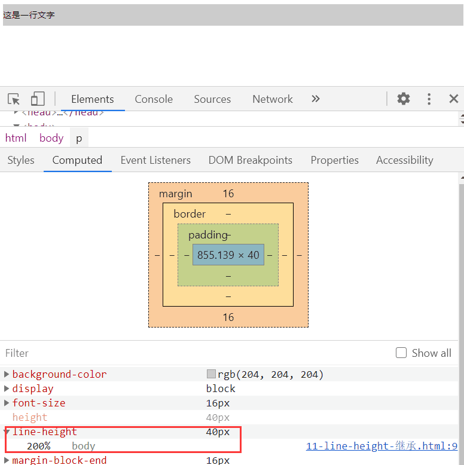

## 3-6 响应式

### • rem

**rem**是一个长度单位

* **px**，绝对长度单位，最常用
* **em**：相对长度单位，相对于父元素，不常用
* **rem**：相对长度单位，相对于根元素，常用于响应式布局

### • 响应式布局的常见方案

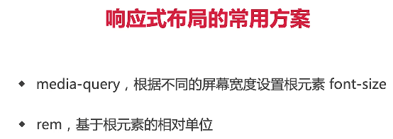

```html
<html>
<head>
    <title>响应式布局</title>
    <style type="text/css">
        @media only screen and (max-width: 374px) {
            /* iphone5 或者更小的尺寸，以 iphone5 的宽度（320px）比例设置 font-size */
            html {
                font-size: 86px;
            }
        }
        @media only screen and (min-width: 375px) and (max-width: 413px) {
            /* iphone6/7/8 和 iphone x */
            html {
                font-size: 100px;
            }
        }
        @media only screen and (min-width: 414px) {
            /* iphone6p 或者更大的尺寸，以 iphone6p 的宽度（414px）比例设置 font-size */
            html {
                font-size: 110px;
            }
        }
        body {
            font-size: 0.16rem;
        }
        #div1 {
            width: 1rem;
            background-color: #ccc;
        }
    </style>
</head>
<body>
    <div id="div1">
        this is div
    </div>
</body>
</html>
```

### • vw-wh

**rem的弊端**


**网页视口尺寸**


667 是screen.height 屏幕高度

553 innerHieght

**vw/vh**


## 3-7 CSS3

【备注】：CSS3动画并不是面试重点，除非是相关岗位

# 第4章 JS基础-变量类型和计算

## 4-1 值类型和引用类型


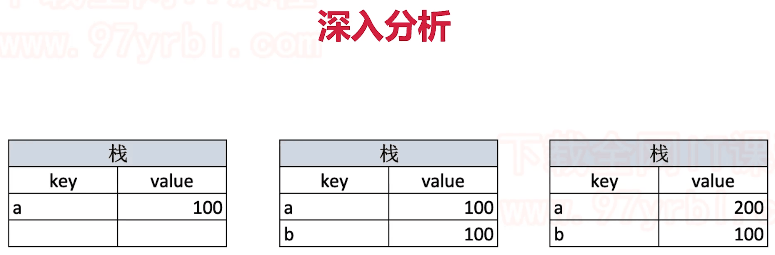


**值**类型在**栈**中存储。**引用**类型在**堆**中申请内存地址

栈是从上往下累加。堆是从下往上排列，一般情况不会重合。


### • 值类型和引用类型的区别

==基本数据类型== : undefined null number boolean string symbol

==引用数据类型== :Object Array Function

**区别**


* 存储方式：基本类型放在JS的**栈内存**里存储，引用类型放在**堆内存**。
* 访问机制：
  * 访问基本类型：从栈中直接获取该变量的值
  * 访问引用类型：1. 从栈中获取变量对应对象的引用（即它在堆内存中的资质）2.拿着1中获取的地址，再去堆内存空间查询，拿到我们想要的数据

### • typeof能判断哪种类型

* 识别所有值类型：undefined string number boolean symbol （值类型）
* 识别函数：function
* 判断是否是引用类型（不可再细分）：object（注意：typeof null === 'object'）（引用类型）


**补充：**

```js
console.log(typeof NaN);//number
console.log(typeof Function);//function
console.log(typeof Object);//function
console.log(typeof {});//object
console.log('a'+1);//a1
console.log('a'-1);//NaN
console.log(Function instanceof Object)//true
console.log(Object instanceof Function);//true
```


### • 何时使用 === 何时使用 == 


注：

* == 会尝试类型转换 === 严格相等
* `==` 存在强制类型转换，`null == undefined```
* ```Object.is` ： 主要的区别就是`+0！=-0` 而`NaN==NaN`
  (相对比`===`和`==`的改进)

## 4-2 深拷贝

**浅拷贝的例子：**

```js
const obj1 = {x:100,y:200}
const obj2 = obj2;
obj2.x = 101;
console.log(obj1) //{x:101}
```

### • 手写深拷贝

* 注意判断值类型还是引用类型
* 注意判断是数组还是对象
* 递归

如何实现引用类型（针对对象和数组）的深拷贝？

> 补充：
>
> * **Object.keys方法**
>   * 成员是参数对象自身的（不含继承的）所有可枚举（ enumerable ）属性的键名。
>   * 不可遍历原型链上的可枚举属性
> * for...in（深拷贝使用这种方法）
>   * 循环对象的所有枚举属性(包括原型上)，然后再使用hasOwnProperty()方法来忽略继承属性;

```js
/**
 * 深拷贝
 * @param {Object} obj 要拷贝的对象
 */
function deepClone(obj = {}) {
	if (typeof obj !== "object" || obj == null) {
		// obj 是 null ，或者不是对象和数组，直接返回
		return obj;
	}
	// 初始化返回结果
	let result;
	if (obj instanceof Array) {
		result = [];
	} else {
		result = {};
	}
	for (let key in obj) {
		// 保证 key 不是原型的属性
		if (obj.hasOwnProperty(key)) {
			// 递归调用！！！
			result[key] = deepClone(obj[key]);
		}
	}
	// 返回结果
	return result;
}
```

```js
/*eg*/
const obj1 = {
	age: 20,
	name: "xxx",
	address: {
		city: "beijing",
	},
	arr: ["a", "b", "c"],
};

const obj2 = deepClone(obj1);
obj2.address.city = "shanghai";
obj2.arr[0] = "a1";
console.log(obj1.address.city);//beijing
console.log(obj1.arr[0]);//a
```

【注意】`Object.assign(obj1,obj2)`可以实现对象的**浅拷贝**，用于将所有可枚举属性的值从一个或多个源对象复制到目标对象。

### • 手写深度比较，模拟lodash.isEqual


```js
//判断是否是对象或数组
function isObject(obj){
  return typeof obj === 'object' && obj!==null
}

function isEqual(obj1, obj2) {
  if(!isObject(obj1) || ! isObject(obj2)){
    //值类型（注意，参与equal的一般不会是函数）
    return obj1 === obj2;
  }
  if(obj1 === obj2){
    return true;//isEqual(obj1,obj1)的情况
  }
  //两个都是对象或数组，而且不相等
  //1.先取出obj1和obj2的keys，比较个数
  const obj1Keys = Object.keys(obj1);
  const obj2Keys = Object.keys(obj2);
  if(obj1Keys.length !== obj2Keys.length){
    return false;
  }
  //2.以obj1为基准，和obj2依次递归比较
  for(let key in obj1){
    //比较当前key的val -- 递归！
    const res = isEqual(obj1[key],obj2[key])
    if(!res){
      return false;
    }
  }
  //3. 全相等
  return true;
}

//测试
const obj1 = {
	a: 100,
	b: {
		x: 100,
		y: 200,
	},
};
const obj2 = {
	a: 100,
	b: {
		x: 100,
		y: 200,
  },
};
console.log(isEqual(obj1, obj2));
```

注意：

* 思路类似深拷贝

* 对数组使用Object.keys得到的是数组的索引；对对象使用则得到keys

  

## 4-3 变量计算 - 注意某些类型转换的坑

**变量计算 - 类型转换** 

知识点

* 字符串拼接
*  == 
* if语句和逻辑运算


注意：实际工作中，除了判断null和undefined，一般都用 === 


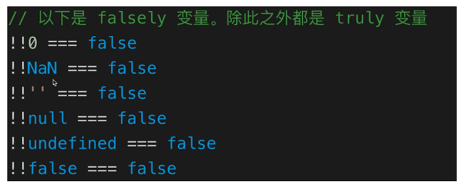


### • 列举强制类型转换和隐式类型转换

> * 强制：`parseInt` `parseFloat` `toString`等
> * 隐式：`if`、逻辑运算、==、+拼接字符串

# 第5章 JS基础-原型和原型链

前言：**原型是JS面向对象系统的根本**，在JAVA中，类才是它面向对象系统的根本。

## 5-1 执行上下文与调用栈

**执行上下文：**

* 是执行代码的环境

**执行上下文的分类**：

* 全局上下文
* 函数上下文
* Eval执行上下文

**全局上下文**

**函数上下文**

* 函数上下文在函数调用时被创建
* 函数上下文创建参数对象（arguments）和this对象（其指向取决于该函数如何被调用）

**调用栈**

也叫“执行上下文栈”。当调用一个函数时，把它的上下文推入调用栈里，执行完毕后出栈，随后再为新的函数进行入栈操作。

> 备注：调用栈是在执行的过程中形成的，而作用域链是在书写阶段就决定了。

**执行上下文的生命周期**

* 创建阶段 —— 执行上下文的初始化状态
* 执行阶段 —— 逐行执行脚本里的代码

###  •  何为变量提升？

* **变量提升**：非严格模式下，当我们在没有声明一个变量就去调用它，JS引擎会输出一个undeinfed
* **变量提升原理？**
  * JS也要经理编译和执行阶段，在**编译阶段里**，JS会搜集所有的变量声明，并且提前让声明生效。
  * 执行上下文在不同阶段完成的不同工作，才是“变量提升”的本质

```js
// 变量提升 ES5
console.log(a) // undefined
var a = 200

//上面两行等于下面三行
// var a
// console.log(a) // undefined
//a = 200
```

### • var 和let const的区别

> * var是ES5语法，let const是ES6语法；var有变量提升
> * var和let是变量，可修改；const是常量，不可修改；
> * let const有块级作用域，var没有
>
> 补充：
>
> * 使用const声明的变量必须同时初始化为某个值。一经声明，在其生命周期的任何时候都不能再重新赋予新值。
>
>   ```js
>   const a; //  SyntaxError: Missing initializer in const 
>   ```
>
> * let的一个特性是禁止在同一个作用域下重复声明
>
> * 在代码块内，使用let、const命令声明变量之前，该变量都是不可用的。这在语法上，称为==“暂时性死区”==

### •  函数声明和函数表达式的区别

> * 函数声明`function fn(){...}`
> * 函数表达式 `const fn = function(){...}`
> * **函数声明会在代码执行前预加载，而函数表达式不会**

```js
// 函数声明
const res = sum(10, 20)
console.log(res)
function sum(x, y) {
    return x + y
}
```

```js
// 函数表达式
var sum = function (x, y) {
    return x + y
}
var res = sum(10, 20)
console.log(res)
```


## 5-1 如何用 class 实现继承

### ES6中的classs

**ES6的类其实是原型继承的语法糖**

**class**包含三部分:constructor、属性、方法


```js
// 通过类 new 对象/实例
const xialuo = new Student("夏洛", 100);
console.log(xialuo.name);
console.log(xialuo.number);
xialuo.sayHi();
```

### **用class实现继承**

* extends
* super
* 扩展或重写方法

```js
// 父类
class People {
    constructor(name) {
        this.name = name
    }
    eat() {
        console.log(`${this.name} eat something`)
    }
}
// 子类
class Student extends People {
    constructor(name, number) {
        super(name)
        this.number = number
    }
    sayHi() {
        console.log(`姓名 ${this.name} 学号 ${this.number}`)
    }
}
// 子类
class Teacher extends People {
    constructor(name, major) {
        super(name)
        this.major = major
    }
    teach() {
        console.log(`${this.name} 教授 ${this.major}`)
    }
}
// 实例
const xialuo = new Student('夏洛', 100)
console.log(xialuo.name)
console.log(xialuo.number)
xialuo.sayHi()
xialuo.eat()
// 实例
const wanglaoshi = new Teacher('王老师', '语文')
console.log(wanglaoshi.name)
console.log(wanglaoshi.major)
wanglaoshi.teach()
wanglaoshi.eat()
```

### •  如何用JS实现继承

* class继承（推荐）
* prototype继承

### • new做了哪些事情？

```js
var A = function(){};
A.prototype.n = 1;
var b = new A();
console.log(b.n);//1
```

1. 为这个新对象b开辟一块属于它的内存空间，并把函数体的内的this指到刚开辟的内存空间去
2. 把新对象b的`__ptoto__`属性指向对应构造函数的prototype属性，把实例和原型对象关联起来
3. 执行函数体内的逻辑，最后即使没有手动return，构造函数也会帮你把创建的这个新对象return出来

### • new Object()和Object.create()的区别

* `{}`等同于`new Object()`,原型是Object.prototype
* `Object.create(null)`没有原型
* `Object.create({...})`可指定原型
* `Object.create()`创建了一个空对象，其原型指向了传入的对象

```js
const obj1 = {
    a: 10,
    b: 20,
    sum() {
        return this.a + this.b
    }
}

const obj2 = new Object({
    a: 10,
    b: 20,
    sum() {
        return this.a + this.b
    }
})

const obj21 = new Object(obj1) // obj1 === obj2 两个对象一样

const obj3 = Object.create(null)
const obj4 = new Object() // {}

const obj5 = Object.create({
    a: 10,
    b: 20,
    sum() {
        return this.a + this.b
    }
})

const obj6 = Object.create(obj1)
```

## 5-3 如何理解 JS 原型（隐式原型和显示原型）

> 原型编程范式的核心思想是**利用实例来描述对象，用实例作为定义对象和继承的基础**
>
> 在JS中，原型编程范式的体现就是**基于原型链的继承**

每个构造函数都有一个==prototype属性(显示原型)==，它指向构造函数的原型对象，这个原型对象中有一个==constructor属性==指回构造函数；

每个实例都有一个==_proto__（隐式原型）==属性，当我们使用构造函数去创建实例时，实例的`__proto__`属性就会指向构造函数的原型对象（隐式原型）

例如：


上述Student例子的原型


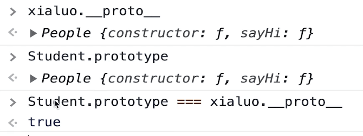


## 5-4 instanceof 是基于原型链实现的

**instance：**如果A沿着原型链能找到B.prototype，那么A instance B为true

### •  手写instance

```js
//判断A是否是B的实例
const instanceOf = (A,B) => {
    let p = A;
    while(p){
        if(p === B.prototype){
            return true;
        }
        p = p.__proto__;
    }
    return false;
};

//测试
instanceof([],Object)//true
instanceof(1,Number)//true
```


### **原型链**

==原型链==：当我试图访问一个JS实例的属性/方法时

* 它首先搜索这个实例本身；
* 当发现实例没有定义对应的属性/方法时，它会转而去搜索实例的原型对象
* 如果原型对象中也搜索不到，它就去搜索原型对象的原型对象
* 这个搜索的轨迹，就叫做**原型链**

那么`hasOwnPrototype`从哪里来？


instanceof**


* instanceof 可以判断引用类型
* Object是所有class的父类


**重要提示！！！**

* class是ES6语法规范，由ECMA委员会发布
* ECMA只规定语法规则，即我们代码的书写规范，不规定如何实现
* 以上实现方式都是v8引擎的实现方式，也是主流的

## 5-5 JS 原型相关面试题

### •  如何准确判断一个变量是不是数组

`a instance Array`

注意：结合原型链的本质理解

### • class的原型本质如何理解？

* 原型和原型链的图示
* 属性和方法的执行规则（沿着原型链搜索，一步一步往上寻找）

### • 手写一个简易的jQuery，考虑插件和扩展性

代码演示：

```js
class jQuery {
    constructor(selector) {
        const result = document.querySelectorAll(selector)
        const length = result.length
        for (let i = 0; i < length; i++) {
            this[i] = result[i]
        }
        this.length = length
        this.selector = selector
    }
    get(index) {
        return this[index]
    }
    each(fn) {
        for (let i = 0; i < this.length; i++) {
            const elem = this[i]
            fn(elem)
        }
    }
    on(type, fn) {
        return this.each(elem => {
            elem.addEventListener(type, fn, false)
        })
    }
    // 扩展很多 DOM API
}

// 插件机制
jQuery.prototype.dialog = function (info) {
    alert(info)
}

// “造轮子”（复写机制）
class myJQuery extends jQuery {
    constructor(selector) {
        super(selector)
    }
    // 扩展自己的方法
    addClass(className) {
    }
    style(data) {
    }
}

// const $p = new jQuery('p')
// $p.get(1)
// $p.each((elem) => console.log(elem.nodeName))
// $p.on('click', () => alert('clicked'))
```

# 第6章 JS基础-作用域和闭包

本章介绍作用域和闭包的知识点和题目。包括作用域，自由变量，闭包，this 等部分。作用域是“JS 三座大山”之二，不知道闭包的话，面试通过概率不大。

**知识点**

* 作用域和自由变量
* 闭包
* this

## 6-1 作用域？自由变量？

**作用域：**本质上是程序存储和访问变量的规则。


**JS中有三种作用域**

* 全局作用域
* 函数作用域
* 块作用域

**JS的作用域遵循的就是==词法作用域模型==**

词法作用域和动态作用域的区别在于**划分作用域的时机**

* **词法作用域：** 在代码**书写**的时候（声明时）完成划分，作用域链就沿着它定义的位置向外延伸。
* **动态作用域：**在代码**运行时**完成划分，作用域链沿着它的**调用栈**向外延伸

**如何欺骗词法作用域？**

其实就是改变词法作用域，使用**eval和with**


## 6-2 闭包？闭包会用在哪里？

MDN对==闭包==的定义是：闭包是指那些能够访问自由变量的函数，==自由变量==是指在函数中使用的，但既不是函数参数又不是函数的局部变量的变量

> 补充：
>
> LSH：`name = 'sxc'`变量赋值或写入内存
>
> RHS：``var myName = name;` 变量查找或从内存中读取


备注：两个打印的都是100

**总结：所有的自由变量的查找，是在函数定义的地方，向上级作用域查找！！！不是在执行的地方！！！！**

### 复杂作用域：代码输出结果

```js
var a = 1;
function test(){
    a = 2;
    return function(){
        console.log(a);
    }
    var a = 3;
}
test()();
```

注意两个知识点

1. var的变量提升
2. 作用域规则


打印结果：2

### 闭包应用1：模拟私有变量

私有变量：仅在对象内部生效，无法从外部触及。                                                   

思路：**把私有变量用函数作用域保护起来，形成一个闭包。**

```js
const returnUser = (function(){
  //定义私有变量
  let _password;

  class User{
    constructor(username,password){
      _password = password;
      this.username = username;
    }
    login(){
      console.log("发送登录请求",this.username,_password);
    }
  }
  return User;
})()

let user = new returnUser('sxc','sxc123456');
console.log(user.username);
console.log(user.password);
console.log(user._password);
user.login();
// sxc
// undefined
// undefined
// 发送登录请求 sxc undefined
```

**其他实现私有变量的问题**：

**如何实现一个私有变量，用getName方法可以访问，不能直接访问？**

1. 通过`Object.defineProperty`来实现

   ```js
   var person = {
       name:"Nike",
       getName:function(){
           return this.name
       }
   }
   Object.defineProperty(person,"name",{
       //不可枚举不可配置
       configurable:false,
       enumerable:false
   })
   ```

2. 将变量定义为函数中的局部变量，在函数中再定义一个函数用来访问该变量。**即利用闭包读取函数内部变量**

   ```js
   function Product(){
       var name = "Nike";//name是函数内部定义的变量，作用域仅限于函数内部，全局作用域和会计作用域都访问不到他们
       this.getName = function(){
           return name;
       }
   }
   
   var person = new Product();
   console.log(person.name);//undefined
   console.log(person.getName());//nike
   ```

   对比不封装私有变量的形式：

   ```js
   function Product(){
       //用构造函数生成的对象实例里包含name属性和getName方法
       this.name = "nike"
       this.getName = function(){
           return this.name;
       }
   }
   
   var person = new Product();
   console.log(person.name);//nike
   console.log(person.getName());//nike
   ```


### 闭包应用2：柯里化与偏函数

**柯里化：将一个n个参数的函数转换成n个单参数函数**

```js
function generateName(prefix){
    return function(type){
        return function(itemName){
            return prefix+type+itemName;
        }
    }
}
```

**偏函数：仅仅是把函数的入参拆解为两部分**

```js
function generateName(prefix){
    return function(type,itemName){
        return prefix+type+itemName;
    }
}
```

### 闭包与内存泄漏

**内存泄漏？**

该释放的变量（内存垃圾）没有被释放，仍然霸占着原先的内粗，导致内存占用攀高，带来性能恶化，系统崩溃等一系列问题

**闭包对内存的”威胁“？**

举个问题代码的例子：


知识点：***在V8引擎中，一旦不同的作用域位于同一个父级作用域下，那么它们会共享这个父级作用域***

在上面，unused是一个不会被使用的闭包，但他和共享同一个父级作用域的someMethod，则是一个”可抵达“，unused引用了originaThing，这导致和它共享作用域的someMethod也间接的引用了originalThing，结果就是originThing虽然没有任何意义和作用，却永远不会被回收。

### 内存泄漏成因分析

备注:还有闭包导致的内存泄漏的情况。

1. “手滑”导致的全局变量

   ```js
   function test(){
       me = 'xiuyan'
   }
   //非严格模式下的，写me而非var me这种写法会导致这个me被挂载到全局对象上，从而永远无法被清除
   ```

2. 忘记清除的`setInterval`和`setTimeout`

3. 清除不当的DOM：例如只清除了DOM元素，并未清除其他变量对该DOM的引用，导致该DOM元素仍然”可抵达"，从而无法被GC回收

## 6-3 this 有几种赋值情况

> ==this指向调用它所在方法的那个对象==，即**谁调的函数，this就归谁**
>
> **this取什么值，是在函数执行的时候（调用时）确定的！！！不是在函数定义（书写时）的时候确定的！！！**（注意和闭包相反）


备注：这里使用call和bind改变了this指向，不同的是call会立刻执行，bind返回一个函数

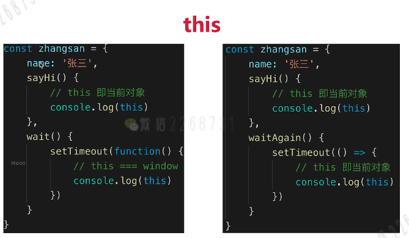

这里注意：右边箭头函数里的this取值取得是箭头函数的值(箭头函数中的this指向定义时)

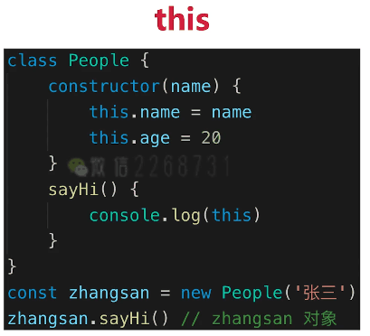

这里注意：this指的是当前创建的这个实例

### this指向原则

#### **一、this会100%指向window的三种特殊情况**

* 立即执行函数IIFE
* setTimeour中传入的函数
* setInterval中传入的函数

#### 二、**严格模式下的this指向**

**普通函数中的this**

在严格模式下，如果没有指定对象，this就是undefined


**全局代码中的this**

全局代码中的this，就是在全局作用域下执行的函数/代码段里的this


#### **三、箭头函数的this**

遵循“词法作用域”，*箭头函数中的this，和你如何调用它无关，由你书写它的位置决定（和普通函数的this指向相反）*

> 箭头函数中的this在**定义时绑定***

例子1：


例子2（有点不太懂QAQ）

```js
var a = 11;
function test2() {
	this.a = 22;
	let b = () => {
		console.log(this.a);
	};
	b();
}
var x = new test2();
//输出22
```

### this指向的改变机制

#### 一、使用箭头函数

**箭头函数的ths会在书写阶段（即声明位置）就绑定到它父作用域的this上**，无论后续我们如果调用它， 都无法再为它指定目标对象 —— 因为箭头函数的this指向是静态的，”一次即是一生“

#### 二、使用call apply bind

**用法**：改变this指向


## 6-4 作用域相关面试题 

### • call和apply区别

```js
fn.call(this,p1,p2,p3);
fn.apply(this,arguments)
```

### • call/apply/bind实现

```javascript
//手写call
Function.prototype.myCall = function(context,...args){
    //Step1:把函数挂载到目标对象上（这里的this就是我们要改造的那个函数）
    context = (context === udefined || context === null)?window:content;
    context.func = this
    //Step2：执行函数,利用扩展运算符将数组展开
    let result = context.func(...args);
    //Step3 删除step1中挂到目标对象上的函数，
    delete context.func;
    return result;
}
```

```javascript
//手写apply
Function.prototype.myApply = function(content){
 content = (content === undefined || content === null)?window:content;
 content.fn = this;
 let result = argumnets[1]? content.fn(...arguments[1]) : content.fn();
 delete content.fn;
 return result;
} 
```

先举个例子演示一下bind如何使用？

```js
function fn1(a,b,c){
  console.log('this',this);
  console.log(a,b,c);
  return 'this is fn1'
}

const fn2 = fn1.bind({x:100},10,20,30)
const res = fn2();
console.log(res);
//this是{x:100}
//打印结果：
//10 20 30
// this is fn1
```


由上图可以看到bind是function的原型里的方法

```js
//手写bind，思路:通过apply或call方法来实现
Function.prototype.myBind = function(){
    //将参数解析为数组
    const args = Array.prototype.slice.call(arguments);
    //获取this（取出数组第一项，数组剩余的就是传递的参数）
    const t = args.shift();
    const self = this //当前函数
    //返回一个函数
    return function(){
        //执行原函数。并返回结果
        return self.apply(t,args)
    }
}
```

备注：

* 以上为我们模拟bind编写的函数

* aguments是个列表，但不是个数组，所以要用`Array.prototype.slice.call(arguments)`将其变为数组（这是一个很常用的方式）
* `shift()`取出数组的第一个元素
* `const self=this`是fn1.bind(...)中的fn1

### • 实际开发中闭包的应用场景，举例说明

> 写在前面:
>
> **闭包**是指有权访问另一�������函数作用域中的变量的函数。**创建闭包**的常见方式，就是在一个函数内部创建另外一个函数
>
> 出自《js高程》


```js
//闭包隐藏数据，只提供API
function createCache(){
  const data = {} //闭包中的数据，被隐藏，不被外界访问
  return {
    set:function(key,val){
      data[key] = val;
    },
    get:function(key){
      return data[key]
    }
  }
}

const c = createCache();
c.set('a',100);
console.log(c.get('a'));
```

### • 创建10个`<a>`,点击弹出序号


备注：

* 如果i在for外声明。即 let a ,i（全全局作用域），点击任何一个i都弹出10,因为当点击后执行alert的时候，i早都循环完了，都为10
* **let i放到for循环里面**，每次for循环执行的时候，都会形成一个新的块，alert(i)的i就在该块级作用域里面寻找

### • 关于this的场景题


打印：

```js
1
undefined
```

### •  关于作用域和自由变量的场景题

**题目1**

```js
let i;
for(i=1;i<=3;i++){
  setTimeout(function(){
    console.log(i);
  },0)
}
//打印4 4 4 
```

```js
for(let i=1;i<=3;i++){
  setTimeout(function(){
    console.log(i);
  },0)
}
//打印1 2 3
```

**题目2**

```js
let a = 100

function test(){
  console.log(a);
  a = 10;
  console.log(a);
}

test();
console.log(a);
//打印 100 10 10
```

# 第7章 JS基础-异步

本章介绍异步的知识点和题目。包括异步和同步的区别，异步应用场景，以及 Promise 。异步是“JS 三座大山”之三，所有公司的 JS 面试，100% 会考察异步和 Promise 。

**知识点**

* 单线程和异步
* 应用场景
* callback hell 和 Promise

## 7-1 同步和异步有何不同

**单线程和异步**

* JS是单线程语言，只能同时做一件事儿
* 浏览器和nodejs已支持JS启动**进程**，如Web Worker
* JS和DOM渲染共用同一个线程，因为JS可修改DOM结构
* 遇到等待（网络请求，定时任务）不能卡住，所以需要异步
* JS异步基于回调callback函数形式：回调函数（callback）就是把任务的第二段单独写在一个函数里面，等到重新执行这个函数的时候，就直接调用这个函数。


> **异步和同步**
>
> * 基于JS是单线程语言
> * 同步：后一个任务必须严格等待前一个任务执行完再执行，任务的执行顺序和排列顺序是高度一致
> * 异步：任务的执行顺序不必像遵循排列顺序
> * 异步不会阻塞代码执行，同步会阻塞代码执行

## 7-2 前端异步的应用场景有哪些

* **网络请求**，如ajax请求
* **定时任务**，如setTimeout


**回调地狱**

当回调函数嵌套的层级变多，代码的可读性和可维护性被破坏，就会造成**回调地狱**


## 7-4 for-of的应用场景

**for...of**

* `for...in`（以及`forEach for`）是常规的同步遍历
* `for...of`常用于**异步的遍历**

**代码演示**

```js
function muti(num){
  return new Promise(resolve => {
    setTimeout(()=>{
      resolve(num*num)
    },1000)
  })
}

const nums = [1,2,3]

//同步遍历
// nums.forEach(async (i)=>{
//   const res = await muti(i);
//   console.log(res);
// })
// //1s后同时打印出1 4 9 

//异步遍历
!(async function(){
  for(let i of nums){
    const res = await muti(i);
    console.log(res);
  }
})();
//每隔1s 依次打印出1 4 9
//（先执行第一个，第一个有结果后再执行第二个。。。。（依次执行））
```


**如何解决异步回调地狱**

promise、generator、async/await

## 7-3 promise用法

异步解决方案Promise

### • 使用Promise异步请求数据示例


### • 用Promise改造网络请求

```js
const https = require('https')

function httpPromise(url){
    return new Promise(function(resolve,reject){
        https.get(url,(res)=>{
            resolve(data);
        }).on("error",(err)=>{
            reject(error);
        })
    })
}

httpPromise().then(function(data){})。catch(function(error){})
```

在进行大量异步链式调用时，回调地狱不存在，取而代之的是层级简单的Promise调用链

### • 手写用Promise加载一张图片

```js
function loadImg(src) {
    const p = new Promise(
        (resolve, reject) => {
            const img = document.createElement('img')
            img.onload = () => {
                resolve(img)
            }
            img.onerror = () => {
                const err = new Error(`图片加载失败 ${src}`)
                reject(err)
            }
            img.src = src
        }
    )
    return p
}
```

测试例子：

```js
// const url = 'https://img.mukewang.com/5a9fc8070001a82402060220-140-140.jpg'
// loadImg(url).then(img => {
//     console.log(img.width)
//     return img
// }).then(img => {
//     console.log(img.height)
// }).catch(ex => console.error(ex))

const url1 = 'https://img.mukewang.com/5a9fc8070001a82402060220-140-140.jpg'
const url2 = 'https://img3.mukewang.com/5a9fc8070001a82402060220-100-100.jpg'

loadImg(url1).then(img1 => {
    console.log(img1.width)
    return img1 // 普通对象
}).then(img1 => {
    console.log(img1.height)
    return loadImg(url2) // promise 实例
}).then(img2 => {
    console.log(img2.width)
    return img2
}).then(img2 => {
    console.log(img2.height)
}).catch(ex => console.error(ex))

```


## 7-4 Promise三种状态

**三种状态**

* pending resolved rejected
* pending --> resolved 或 pending -->rejected
* 变化不可逆

**代码演示 - 状态变化**


**状态的表现**

* pending状态，不会触发then和catch
* resolved状态，会触发后续的then回调函数
* rejected状态，会触发后续的catch回调函数

**代码演示 - 状态表现**

```js
const p1 = Promise.resolve(100); //resolved
//console.log('p1',p1);
p1.then(data => {
  console.log('data1',data);
}).catch(err =>{
  console.log('err1',err);
})

const p2 = Promise.reject('err') //rejected
//console.log('p2',p2);
p2.then(data => {
  console.log('data2',data);
}).catch(err =>{
  console.log('err2',err);
})
```

打印：

```
data1 100
err2 err
```

## 7-5 Promise状态切换机制

**then和catch改变状态**

* then 正常返回resolved，里面有报错则返回rejected
* catch正常返回resolved，里面有报错则返回rejected

**代码：then影响Promise状态**

```js
const p1 = Promise.resolve().then(()=>{
  return 100
})
//console.log('p1',p1);//resolved 会触发后续then回调
p1.then(()=>{
  console.log('123');
})

const p2 = Promise.resolve().then(()=>{
  throw new Error('then error')
})
//console.log('p2',p2);//rejected 会触发后续catch回调
p2.then(()=>{
  console.log('456');
}).catch(err =>{
  console.log('err100',err);
})
```

打印

```
123
err100 Error:then error
```

**代码2：catch影响Promise状态**

```js
const p3 = Promise.reject('my err').catch(err =>{
  console.log(err);
})
//console.log('p3',p3);//注意 是resolved！触发then回调！
p3.then(()=>{
  console.log(100);
})

const p4 = Promise.reject('my err').catch(err =>{
  throw new Error('catch console.error();')
})
//console.log('p4',p4);//是rejected状态的Promise ！触发catch回调
p4.then(()=>{
  console.log(200);
}).catch(()=>{
  console.log('some error');
}) 

```

打印

```
my err
100
some error
```

## 7-6 Promise的then和catch的连接


```js
// 第一题
Promise.resolve().then(() => {
    console.log(1)
}).catch(() => {
    console.log(2)
}).then(() => {
    console.log(3)
})
// 1 3
```

```js
// 第二题
Promise.resolve().then(() => {
    console.log(1)
    throw new Error('erro1')
}).catch(() => {
    console.log(2)
}).then(() => {
    console.log(3)
})
// 1 2 3
```

```js
// 第三题
Promise.resolve().then(() => {
    console.log(1)
    throw new Error('erro1')
}).catch(() => {
    console.log(2)
}).catch(() => { // 注意这里是 catch
    console.log(3)
})
// 1 2
```

**Promise总结**

* 三种状态，状态的变现和变化
* then和catch对状态的影响（重要）
* then和catch的链式调用（常考）

## 7-7 Promise命题

#### 命题1：Primoise特性类

1. **说说你理解的Promise**

   答题思路：代理对象/三个状态/状态切换机制

2. **Promise的出现是为了解决什么问题？**

   答：异步回调地狱

3. **Promise常见方法有哪些？干嘛的？**

   答：all race reject resolve

#### 命题2：看代码说答案类

注意：

1. Promise中的处理函数是异步任务（要等同步代码执行完之后再执行）
2. promise对象的状态只能改变一次
3. Promise的值穿透

例题：代码的执行顺序：

```js
setTimeout(function(){console.log(1)},0);
new Promise(function(resolve,reject){
	console.log(2);
	resolve();
}).then(function(){console.log(3)
}).then(function(){console.log(4)});
process.nextTick(function(){console.log(5)});
console.log(6);
//输出2,6,5,3,4,1
```

解析：`script(主程序代码)`——>``process.nextTick`——>`promise`——>`setTimeout`

#### 命题3：Promise底层原理（实现Promise）

手写一个简单的Promise，Promise A+标准/决议程序

```js
function myPromise(executor){
	//value记录异步任务成功的执行结果
	this.value = null;
	//reason记录异步任务失败的原因
	this.reason = null;
	//status记录当前状态，初始化是pending
	this.status = 'pending';

	//把this存下来，后面会用到
	var self = this;

	//定义resolve函数
	function resolve(value){
		//异步任务成功，把结果赋值给value
		self.value = value;
		//当前状态切换为resolved
		self.status = 'resolved';
	}
	
	//定义reject函数
	function reject(reason){
		//异步任务失败，把结果赋值给value
		self.reason = reason;
		//当前状态切换为rejected
		self.status = 'rejected';
	}
	
	//把resolve和reject能力赋予执行器
	executor(resolve,reject);
}

//then方法接受两个参数作为入参（可选）
myPromise.prototype.then = function(onResolved,onRejected){
	//注意：onResolved和onRejected必须是函数；如果不是，此处用一个透传来兜底
	if(typeof onResolved !== 'function'){
		onResolved = function(x) {return x};
	}
	if(typeof onRejected !== 'function'){
		onRejected = function(e) {throw e};
	}
	//依然是保存this
	var self = this;
	//判断是否是resolved状态
	if(self.status === 'resolved'){
		//如果是 执行对应的处理方法
		onResolved(self.value);
	}else if(self.status === 'rejected'){
		onRejected(self.reason);
	}
}


//测试自己编写的Promise
new myPromise(function(resolve,reject){
	resolve('成功啦！');
}).then(function(value){
	console.log(value);
},function(reason){
	console.log(reason);
});
```

上面的版本暂未实现链式调用

## 7-8 async-await语法介绍

**async/await**

* 异步回调 callback hell
* Promise then catch链式调用，但也是基于回调函数
* **async/await是同步语法，彻底消灭了回调函数**（备注：**async/await用同步的方式来编写异步代码**，不用再写回调函数）

代码演示

```js
function loadImg(src) {
    const promise = new Promise((resolve, reject) => {
        const img = document.createElement('img')
        img.onload = () => {
            resolve(img)
        }
        img.onerror = () => {
            reject(new Error(`图片加载失败 ${src}`))
        }
        img.src = src
    })
    return promise
}

async function loadImg1() {
    const src1 = 'http://www.imooc.com/static/img/index/logo_new.png'
    const img1 = await loadImg(src1)
    return img1
}

async function loadImg2() {
    const src2 = 'https://avatars3.githubusercontent.com/u/9583120'
    const img2 = await loadImg(src2)
    return img2
}

(async function () {
    // 注意：await 必须放在 async 函数中，否则会报错
    try {
        // 加载第一张图片
        const img1 = await loadImg1()
        console.log(img1)
        // 加载第二张图片
        const img2 = await loadImg2()
        console.log(img2)
    } catch (ex) {
        console.error(ex)
    }
})()
```

## 7-0 async-await和Promise有什么关系

 **async-await和Promise有什么关系**

* async/wait是消灭异步回调的终极武器
* 但async/wait和Promise并不互斥
* 反而，async/wait和Promise两者相辅相成


**代码演示**

* async 函数返回结果都是 Promise 对象（如果函数内没返回 Promise ，则自动封装一下）

  ```js
  async function fn1(){
    return 100;
    //return Promise.resolve(100)
  }
  
  const res1 = fn1();//执行async函数，返回的是一个Promise对象
  console.log('res1',res1);//Promise对象
  res1.then(data => {
    console.log('data',data);//100
  })
  ```


* await 后面跟 Promise 对象：会阻断后续代码，等待状态变为 resolved ，才获取结果并继续执行

  await 后续跟非 Promise 对象：会直接返回

  ```js
  (async function(){
    const p1 = Promise.resolve(300)
    const data = await p1;//await 相当于 Promise then
    console.log('data',data);//打印：data 300
  })();
  
  (async function(){
    const data1 = await 400;//await 后面不是promise，也会自动封装；相当于 await Promise.resolve(400)
    console.log('data1',data1);//打印：data1 400
  })();
  
  
  async function fn1(){
    return 200;
  }
  (async function(){
    const data2 = await fn1();
    console.log('data2',data2);//打印：data2 200
  })();
  ```

  【注意】一个小的点

  ```js
  !(async function(){
    const p4 = Promise.reject('err4');//rejected状态
    const res = await p4;//会报错，await相当于then，但这里是rejected状态，所以不会去执行
    console.log(res);
  })();
  ```

* try...catch捕获rejected状态

  ```js
  !(async function(){
    const p4 = Promise.reject('err4');//rejected状态
    try{
      const res = await p4;
      console.log(res);
    }catch(ex){
      console.log(ex);//try..catch相当于promise catch
    }
  })();
  
  //打印：err4
  ```

>  总结来看
>
>  * async 封装 Promise
>  * await 处理 Promise 成功
>  * try...catch 处理 Promise 失败

**三种异步解决方案 比较**

* Promise的错误需要通过回调函数捕获
* 而async/await 和 generator允许try/catch

## 7-10 async-await是语法糖，异步的本质还是回调函数

**异步的本质**

* async/await是消灭异步回调的终极武器
* JS还是单线程，还得是有异步，还得是基于event loop
* async/await只是一个语法糖，但这颗糖真香！

> await是同步写法，但本质还是异步调用

**代码演示1**

```js
async function async1 () {
  console.log('async1 start')//2 
  await async2() 
  //await的后面，都可以看作是callback里的内容，即异步
    //类似event loop setTimeout(cb1)
  console.log('async1 end') // 关键在这一步，它相当于放在 callback 中，最后执行
}

async function async2 () {
  console.log('async2')//3
}

console.log('script start')//1
async1()
console.log('script end')//4
//同步代码已经执行完(event loop)
```

> 即，只要遇到了`await`，后面的代码都相当于放在callback里

打印顺序：

1. script start
2. async1 start
3. async2
4. script end
5. async1 end

**代码演示2**

```js
async function async1 () {
  console.log('async1 start')//2
  await async2() 
  
  //下面三行都是异步回调 callback的内容
  console.log('async1 end') //5
  await async3();

   //下面一行是异步回调的内容
   console.log('async1 end 2');//7
}

async function async2 () {
  console.log('async2')//3
}

async function async3 () {
  console.log('async3') //6
}

console.log('script start')//1
async1()
console.log('script end')//4
//同步代码执行完 event loop
```

输出：

1. script start
2. async1 start
3. async2
4. script end
5. async1 end
6. async3
7. async1 end 2

## 7-11 Generator

> https://es6.ruanyifeng.com/#docs/generator

**Generator 函数是 ES6 提供的一种异步编程解决方案。把Generator看作是异步任务的容器，利用yield关键字，实现对异步任何的等待。**

Generator 函数有多种理解角度。语法上，首先可以把它理解成，**Generator 函数是一个状态机，封装了多个内部状态。**

执行 Generator 函数会返回一个遍历器对象，也就是说，**Generator** 函数除了状态机，**还是一个遍历器对象生成函数**。返回的遍历器对象，可以依次遍历 Generator 函数内部的每一个状态。

```js
function* helloWorldGenerator() {
  yield 'hello';
  yield 'world';
  return 'ending';
}

var hw = helloWorldGenerator();
```

# 第8章 JS 异步进阶

## 8-1 什么是event loop

**event loop（事件循环/事件轮询）**

* JS是单线程运行的
* 异步是基于回调来实现
* event loop就是异步回调的实现原理

**JS如何执行？**

* 从前到后，一行一行执行
* 如果某一行执行报错，则停止下面代码的执行
* 先把同步代码执行完，再执行异步

**示例：**

```js
console.log('Hi');

setTimeout(function cb1(){
  console.log('cb1');//cb 即callback
},5000)

console.log('bye');
//打印出：Hi bye cb1
```

**开始讲解event loop过程**

* 难理解
* 尽量深入浅出
* 不要扣细节，不要扩大范围，核心是event loop的过程

## 8-4 event loop 的执行过程

**再看一遍示例**

```js
console.log('Hi');

setTimeout(function cb1(){
  console.log('cb1');//cb 即callback
},5000)

console.log('bye');
//打印出：Hi bye cb1
```


> **总结event loop过程**
>
> * 同步代码，一行一行放在Call Stack执行
> * 遇到异步，会先“记录”下，等待时机（定时任务，网络请求等）
> * 时机到了，就移动到Callback Queue
> * 如 Call Stack为空（即同步代码执行完）Event Loop开始工作
> * 轮询查找Callback Queue，如有则移动到Call Stack执行
> * 然后继续轮询查找（永动机一样）

## 8-5 DOM事件和event loop的关系


**DOM事件和event loop**

* JS是单线程的
* 异步（setTimeout，ajax等）使用回调，基于event loop
* DOM事件也使用回调，基于event loop

## 8-13 宏任务和微任务

**代码**

```js
console.log(100)
setTimeout(() => {
    console.log(200)
})
Promise.resolve().then(() => {
    console.log(300)
})
console.log(400)
// 100 400 300 200
```


【备注】

* 以上宏任务和微任务其实就是前端所有的异步的情况
* scipt（整体代码）也是一个宏任务，此外，宏任务中的setImmediate、微任务中的process.nextTick这些都是Node独有的

## 8-14 event-loop和DOM渲染的关系

**event loop和DOM渲染**

* 再次复习一边event loop的过程
* JS是单线程的，而且和DOM渲染共用一个线程
* JS执行的时候，得留一些时机供DOM渲染


**回顾event loop过程（增加DOM渲染时机）**


**event loop和DOM渲染**

* 每次Call Stack清空（即每次轮询结束），即同步任务执行完
* 都是DOM重新渲染的机会，DOM结构如有改变则重新渲染
* 然后再去触发下一次Event Loop

**代码演示**

```js
const $p1 = $('<p>一段文字</p>')
const $p2 = $('<p>一段文字</p>')
const $p3 = $('<p>一段文字</p>')
$('#container')
            .append($p1)
            .append($p2)
            .append($p3)

console.log('length',  $('#container').children().length )
alert('本次 call stack 结束，DOM 结构已更新，但尚未触发渲染')
//(alert会阻断js执行，也会阻断DOM渲染，便于查看效果)
```


点击“确定”之后


## 8-15 为什么微任务比宏任务执行更早

**微任务和宏任务的区别**

* **宏任务：**DOM渲染**后**触发，如setTimeout
* **微任务：**DOM渲染**前**触发，如Promise
* 下面先演示现象，稍后追究原理

**代码演示**

```js
// 修改 DOM
const $p1 = $('<p>一段文字</p>')
const $p2 = $('<p>一段文字</p>')
const $p3 = $('<p>一段文字</p>')
$('#container')
    .append($p1)
    .append($p2)
    .append($p3)

// 微任务：渲染之前执行（DOM 结构已更新）
 Promise.resolve().then(() => {
     const length = $('#container').children().length
     alert(`micro task ${length}`)
})

// 宏任务：渲染之后执行（DOM 结构已更新）
setTimeout(() => {
    const length = $('#container').children().length
    alert(`macro task ${length}`)
})
```


点击确定后


## 8-16 微任务和宏任务的根本区别

**从event loop解释，为何微任务执行更早？**


可以看到setTimeout的执行是在DOM之后

如果是遇到Promise，会等待时机放到 micro task queue


**为什么有这样的区别？**

* **微任务**是**ES6**语法规定的
* **宏任务**是由**浏览器**规定的

所以，**Call Stack清空后，先执行微任务，在尝试DOM渲染，再触发event loop(执行宏任务)**


**微任务和宏任务 - 总结**

* 宏任务有哪些？微任务有哪些？微任务触发时机更早
* 微任务，宏任务和DOM渲染的关系
* 微任务，宏任务和DOM渲染，在event loop的过程

## 8-17 解答JS异步的面试题

### • 描述 event loop 运行机制（可画图）

* 自行回顾event loop的过程
* 和DOM渲染的关系
* 微任务和宏任务在event loop过程中的不同处理

### • 场景题：async/await语法


```js
//左边a和b的值是？
a是个promise
b是100

//右边打印
start
100
200
error //c reject会直接报错
```

 • 场景题：各类异步执行顺序问题


```js
async function async1(){
  console.log('async1 start');//2
  await async2();
  //await后面的都作为回调内容 —— 微任务
  console.log('async1 end');//6
}

async function async2(){
  console.log('async2');//3
}

console.log('script start');//1 

setTimeout(function(){ //宏任务 setTimeout
  console.log('setTimeout');//8
},0)

async1() 

//初始化Promise时，传入的函数会立刻被执行
new Promise (function(resolve){
  console.log('Promise1');//4 
  resolve()
}).then(function(){ //then是异步 —— 微任务
  console.log('Promise2');//7
})

console.log('script emd');//5

```

打印出：

```
script start
async1 start
async2
Promise1
script emd
async1 end
Promise2
setTimeout
```

【解释】

* 第5步之后 同步代码执行完毕(event loop里的call stack被清空)。
* 接下来执行微任务，按照顺序来说，微任务先执行async1 end，再执行promise2
* 执行微任务之后尝试触发DOM渲染（本例子没有DOM渲染）
* 然后触发event loop，执行宏任务，即setTimeout

## 8-18 Node事件循环

### Node中的Event loop和浏览器的有啥区别？

浏览器的EventLoop由各个浏览器自己实现

Node的Event loop由libuv来实现


### nextTick和Promise.then的关系


总结：不管是什么微任务，只要不是==`process.nextTick`==派发的，全部都要排在`process.nextTick`后面执行！

### setTimeout和setImmediate


# 第9章 DOM

## 9-1 从JS基础到JS-Web-API

**从JS基础到JS-Web-API**

* JS基础语法，规定语法（ECMA 262标准）
* JS Web API，网页操作的API（w3c标准）
  * 内容有：DOM，BOM，事件，Ajax，村粗
* 前者是后者的基础，两者结合才能真正实际应用

**JS Web API有哪些内容?**

* DOM
* BOM
* 事件绑定
* ajax
* 存储

**前言**

* vue和React框架应用广泛，封装了DOM(Document object Model)操作
* 但DOM操作一直都会是前端工程师的基础，必备知识
* 只会vue而不懂DOM操作的前端程序员，不会长久

**知识点**

* DOM本质
* DOM节点操作
* DOM结构操作
* DOM性能

## 9-2 DOM的本质是什么

**DOM本质**

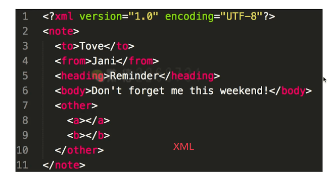


> **DOM的本质是从HTML文件解析出来的一棵树**

在DOM中，每一个元素都是一个节点，节点类型有很多，细数4种

* **Document** 这份文件，也是这份HTML的开端
* **Element** HTML中哥哥标签，例如`<div><span>`
* **Text** 被标签包起来的温总
* **Attribute** 元素的特性，也就是标签里的属性


## 9-3 DOM节点操作

**DOM节点操作**

* 获取DOM节点
* attribute
* property

**获取DOM节点**


```html
 <body>
        <div id="div1" class="container">
            <p id="p1">一段文字 1</p>
            <p>一段文字 2</p>
            <p>一段文字 3</p>
        </div>
        <div id="div2" class="container">
            
        </div>
    </body>
```

```js
//通过id  getElementById
console.log("通过id ");
const div1 = document.getElementById('div1')
console.log('div1', div1)

//通过标签名 getElementsByTagName(集合)
console.log("通过标签名");
const divList = document.getElementsByTagName('div') // 集合
console.log('divList.length', divList.length)
console.log('divList[1]', divList[1])

//通过类名 getElementsByClassName(集合)
console.log("通过类名");
const containerList = document.getElementsByClassName('container') // 集合
console.log('containerList.length', containerList.length)
console.log('containerList[1]', containerList[1])

//通过css选择器 querySelectorAll(集合)
console.log("通过css选择器");
const pList = document.querySelectorAll('p')
console.log('pList', pList)
```


**DOM节点的property**


```html
<head>
        <style>
            .container {
                border: 1px solid #ccc;
            }
            .red {
                color: red;
            }
        </style>
    </head>
    <body>
        <div id="div1" class="container">
            <p id="p1">一段文字 1</p>
            <p>一段文字 2</p>
            <p>一段文字 3</p>
        </div>
    </body>
```

```js
// property 形式
//可以设置属性
p1.style.width = '100px'
//获取属性
console.log( p1.style.width ) //100px
p1.className = 'red'
console.log( p1.className ) //red
console.log(p1.nodeName) //p
console.log(p1.nodeType) // 1
```


> property这种形式是通过修改或获取js的属性的方式来改变CSS样式/页面渲染结构

**DOM节点的attribute**


```js
const pList = document.querySelectorAll('p')
const p1 = pList[0]

// attribute
p1.setAttribute('data-name', 'imooc')
console.log( p1.getAttribute('data-name') )
p1.setAttribute('style', 'font-size: 50px;')
console.log( p1.getAttribute('style') )
```


> attribute通过`getAttribute`和`setAttribute`的形式来修改HTML结构

### • attr和property的区别

* property：修改对象属性，不会体现到HTML机构中
* attribute：修改html属性，会改变html结构
* 两者都有可能引起DOM重新渲染
*  尽量使用property

## 9-4 DOM结构操作

**DOM结构操作**

* 新增/插入节点
* 获取子元素列表，获取父元素
* 删除子元素

**新增/插入节点**


```html
<body>
        <div id="div1" class="container">
            <p id="p1">一段文字 1</p>
            <p>一段文字 2</p>
            <p>一段文字 3</p>
        </div>
        <div id="div2" class="container">
            
        </div>   
  </body>
```

```js
const div1 = document.getElementById('div1')
const div2 = document.getElementById('div2')
// 新建节点
const newP = document.createElement('p')
newP.innerHTML = 'this is newP'
// 插入节点
div1.appendChild(newP)
// 移动节点
const p1 = document.getElementById('p1')
div2.appendChild(p1)
```


**获取子元素列表，获取父元素**


```js
const div1 = document.getElementById('div1')
const div2 = document.getElementById('div2')
// 获取父元素
console.log( p1.parentNode )
// 获取子元素列表
const div1ChildNodes = div1.childNodes
console.log( div1.childNodes);//注意这里在p中间有text
const div1ChildNodesP = Array.prototype.slice.call(div1.childNodes).filter(child => {
    if (child.nodeType === 1) {
        return true
    }
    return false
})
console.log('div1ChildNodesP', div1ChildNodesP)
```

备注：

* 使用`Array.prototype.slice.call(div1.childNodes)`将其变为数组
* 使用`filter`排除掉那些text	


**删除节点**


```js
div1.removeChild( div1ChildNodesP[0] )
```

### • DOM操作常用API

| API             |                                                             |            |
| --------------- | ----------------------------------------------------------- | ---------- |
| **DOM节点操作** |                                                             |            |
| 1. 获取DOM元素  | `getElementById`                                            | 获取单元素 |
|                 | `getElementsByTagName`                                      | 获取集合   |
|                 | `getElementsByClassName`                                    | 获取集合   |
|                 | `querySelectorAll`                                          | 获取集合   |
| 2 property      | `p.style.width = 100`                                       | 修改样式   |
|                 | `p.className = 'p1'`                                        | 修改class  |
|                 | `p.nodeName`                                                |            |
|                 | `p.nodeType`                                                | 1          |
| 3. attribute    | `p.getAttribute('style')`                                   |            |
|                 | `p.setAttribute('data-name','imooc)`                        |            |
| **DOM结构操作** |                                                             |            |
| 1.新增/插入节点 | `docuemnt.createElement('p')`                               |            |
|                 | `div1.appendChild(p1)`                                      |            |
|                 | `div1.insertBrfore(content,title)`                          |            |
| 2 获取父元素    | `div1.parentNode`                                           |            |
| 3 获取子元素    | `div1.childodes`                                            |            |
| 4 删除节点      | `const child  = div1.childNodes;div1.removeChild(child[0])` |            |

## 9-5 DOM性能

**如何优化 DOM 操作的性能**

- DOM操作非常“昂贵”，所以要避免频繁的DOM操作。对于一次性插入多个DOM节点，考虑性能：
- 思路1：可以对DOM查询做缓存
- 思路2：将频繁操作改为一次性操作


```js
    <body>
        <ul id="list">
        </ul>
        <script src="./dom-3.js"></script>
    </body>
const list = document.getElementById('list')

// 创建一个文档片段，此时还没有插入到 DOM 结构中
const frag = document.createDocumentFragment()

for (let i  = 0; i < 20; i++) {
    const li = document.createElement('li')
    li.innerHTML = `List item ${i}`

    // 先插入文档片段中
    frag.appendChild(li)
}

// 都完成之后，再统一插入到 DOM 结构中
list.appendChild(frag)

console.log(list)
```

# 第10章  BOM

**知识点**

* navigator
* screen
* location
* history


### •  如何识别浏览器的类型

```js
const ua = navigator.userAgent
const isChrome = ua.indexOf('Chorme')
console.log(isChorme)
```

### •  分析拆解url各个部分

```js
//例子 https://coding.imooc.com/class/evaluation/415.html?user=abc#Anchor
location.href
"https://coding.imooc.com/class/evaluation/415.html?user=abc#Anchor"
location.protocol
"https:"
location.pathname
"/class/evaluation/415.html"
location.search
"?user=abc"
location.hash
"#Anchor
```

### • 将url参数解析为JS对象


### • 获取当前页面url参数


* 传统方式，查找`location.search`

  ```js
  // 传统方式
  function query(name) {
      const search = location.search.substr(1) // 类似 array.slice(1)
      // search: 'a=10&b=20&c=30'
      const reg = new RegExp(`(^|&)${name}=([^&]*)(&|$)`, 'i')
      const res = search.match(reg)
      if (res === null) {
          return null
      }
      return res[2]
  }
  console.log( query('a') )//10
  ```

  res匹配到的结果

  

* 新API `URLSearchParams`

  ```js
  // URLSearchParams
  function query(name) {
      const search = location.search
      const p = new URLSearchParams(search)
      return p.get(name)
  }
  console.log( query('b') )//20
  ```

# 第11章 事件

## 11-1 DOM事件流

**三个概念：**

* **事件流**：描述的是事件在页面中传播的顺序
* **事件**：描述的是发生在浏览器里的动作
* **事件监听函数**：事件发生后，浏览器如何响应，用来应答事件的函数，就是事件监听函数，也叫做事件处理程序

**DOM2事件流**

与拿来，Netscape只认捕获流，IE认冒泡流，W3C统一组织下，JS同时支持了冒泡流捕获流，并以此为确切的事件流标准，这个标准也叫做“**DOM 2级事件流”**

**事件的传播过程**


**事件对象**

1. currentTarget：事件正在经过哪个元素
2. target：触发事件的具体目标，是事件的真正来源
3. preventDefault：组织默认行为
4. preventDefault：不再派发事件

## 11-1 事件绑定和事件冒泡

### **事件绑定**


### **事件冒泡**

* 基于DOM树形结构
* 事件会顺着触发元素向上冒泡
* `event.stopPropagation()` 阻止事件冒泡
* `event.preventDefault()` 阻止默认行为
* 应用场景：代理


会先打印 激活，再打印 取消

## 11-2 自定义事件

点击A之后，B和C都能感知到A被点击了，并且做出相应的行为 —— 就像这个点击事件是点在B和C上一样

```js
//1.首先创建一个‘clickA’事件，表示A被点击了
var clickAEvent = new Event('clickA');

//2.完成事件的监听和派发

//获取divB元素
const divB = document.getElementById('divB');
//divB监听clickA事件
divB.addEventListener('clickA',function(e){
  console.log('我是B，我感受到了小A');
  console.log(e.target);
})

//获取divC元素
const divC = document.getElementById('divC');
//divC监听clickA事件
divC.addEventListener('clickA',function(e){
  console.log('我是C，我感受到了小A');
  console.log(e.target);
})

//A元素的监听函数也得改造
const divA = document.getElementById('divA');
divA.addEventListener('click',function(){
  console.log('我是A');
  //使用 dispatchEvent 派发事件！！！
  divB.dispatchEvent(clickAEvent);
  divC.dispatchEvent(clickAEvent);
})

```


## 11-2 事件代理

**利用事件的冒泡特性，把多个子元素的同一类型的监听逻辑，合并到父元素上通过一个监听函数来管理的行为，就是事件代理。**


```html
<body>
        <div id="div3">
            <a href="#">a1</a><br>
            <a href="#">a2</a><br>
            <a href="#">a3</a><br>
            <a href="#">a4</a><br>
        </div>
        <script src="./event.js"></script>
    </body>
```

```js
function bindEvent(elem,type,fn){
  elem.addEventListener(type,fn)
}

// 代理绑定（只在父元素上挂载事件，适用于瀑布流，结构复杂不适合每一个都绑定的情况下）
const div3 = document.getElementById('div3')
bindEvent(div3, 'click', event => {
  event.preventDefault()
  const target = event.target;
  if(target.nodeName === 'A'){
    alert(target.innerHTML)
  }
})
```

**事件代理**

* 代码简洁
* 减少浏览器内存占用
* 但是，不要滥

### • 下拉的图片列表，如何监听每个图片的点击？

* 事件代理
* 用`e.target`获取触发元素
* 用`matches`来判断是否是触发元素

## 11-3 编写通用的事件监听函数

**编写一个通用的事件绑定函数**：包含普通绑定和代理绑定

```js
//通用的事件绑定函数
function bindEvent(elem,type,selector,fn){
  if(fn == null){//传了三个函数
    fn = selector;
    selector = null;
  }
  elem.addEventListener(type,event=>{
    const target = event.target;
    if(selector){
      //代理绑定
      if(target.matches(selector)){
        fn.call(target,event)
      }
    }else{
      //普通绑定
      fn.call(target,event)
    }
  })
}
```

备注：如果元素被指定的选择器字符串选择，**`Element.matches()`** 方法返回true; 否则返回false。https://developer.mozilla.org/zh-CN/docs/Web/API/Element/matches

测试

```html
<body>
        <button id="btn1">一个按钮</button>

        <div id="div3">
            <a href="#">a1</a><br>
            <a href="#">a2</a><br>
            <a href="#">a3</a><br>
            <a href="#">a4</a><br>
            <button>加载更多...</button>
        </div>
        <script src="./event.js"></script>
    </body>
```

```js
// 普通绑定
const btn1 = document.getElementById('btn1')
bindEvent(btn1, 'click', function(event) {
  event.preventDefault()//这里不能用this是因为this必须是当前触发的元素(注意不能使用箭头函数！！那样this指的是上层作用域即window)
  alert(this.innerHTML)
})

// 代理绑定
const div3 = document.getElementById('div3')
bindEvent(div3, 'click', 'a', function(event) {
  event.preventDefault()
  alert(this.innerHTML)//this必须是当前触发的元素
})
```


# 第12章 Ajax

【备注】：

* 本章学习要使用MAMP开启服务
* 打开MAMP后，E:\softwareInstall\MAMP\htdocs是工作目录的默认路径
* 访问http://localhost/ajax-learn/ajax.html即可


## 12-1 ajax 的核心API -XMLHttpRequest

**Get请求**

```js
//get请求
const xhr = new XMLHttpRequest;
xhr.open('GET','./data/test.json',true)
xhr.onreadystatechange = function(){
  //这里的函数异步执行，可参考之前JS基础中的异步模块 true代表异步
  if(xhr.readyState === 4){
    if(xhr.status === 200){
      console.log(JSON.parse(xhr.responseText));
      alert(xhr.responseText)
    }else{
      console.log('其他出错情况');
    }
  }
}
xhr.send(null)
```

**Post请求**

```js
const xhr = new XMLHttpRequest;
xhr.open('POST','./login',true)
xhr.onreadystatechange = function(){
  if(xhr.readyState === 4){
    if(xhr.status === 200){
      alert(xhr.responseText)
    }else{
      console.log('其他出错情况');
    }
  }
}

const postData = {
  userName:'sxc',
  password:'123'
}
xhr.send(JSON.stringify(postData));//发送的是字符串注意
```


【备注】：301 永久重定向 302 临时重定向 304 资源未改变（服务器没有返回新的资源，浏览器用自己的缓存资源）

### • 手写一个简易的ajax

**基础版本**

```js
function ajax(url,successFn){
    const xhr = new XMLHttpRequest()
    xhr.open("GET",url,true)
    xhr.onreadystatechange = function(){
        if(xhr.readyState === 4){
            if(xhr.status === 200){
                successFn(xhr.responseText)
            }
        }
    }
    xhr.send(null)
}
```

**更好的版本（使用Promise封装Ajax操作）**

```js  
function ajax(url){
  const p = new Promise((resolve,reject)=>{
    const xhr = new XMLHttpRequest()
    xhr.open('GET',url,true)
    xhr.onreadystatechange = function(){
      if(xhr.readyState === 4){
        if(xhr.status === 200){
          resolve(
            JSON.parse(xhr.responseText)
          )
        }else if(xhr.status === 404){
          reject(new Error('404 not found'))
        }
      }
    }
    xhr.send(null)
  })
  return p
}

const url = './data/test.json';
ajax(url)
.then(res => console.log(res))
.catch(err => console.log(err))
```


### •  ajax请求get和post的区别

> * get一般用于查询操作，post一般用于用户提交操作
> * get参数拼接在url上，post放在请求体内（数据体积可更大）
> * 安全性：post易于预防CSRF

##  12-2 浏览器的同源策略

**跨域**

* 什么是跨域（同源策略）
* JSONP
* CORS（服务端支持）

**同源策略**

* ajax请求时，出于安全考虑，浏览器要求当前网页和server必须同源
* 同源：协议，域名，端口，三者必须一致
* 例如：前端：http://a.com:8080/ server:https://b.com/api/xx 这三个就完全不一样

> **加载图片 css js可无视同源策略**
>
> * ``
> * `<link href=跨域的CSS地址>`
> * `<script src=跨域的js地址></script>`
> * ``可用于统计打点，可使用第三方统计服务
> * `<link/><scirpt>`可使用CDN，CDN一般都是外域
> * `<script>`可实现JSONP
>
> **跨域**
>
> * 所有的跨域，都必须经过server端允许和配合
> * 未经server端允许就实现跨域，说明浏览器有漏洞，危险信息

## 12-3 实现跨域的常见方式 - jsonp 和 CORS

> **JSONP**
>
> * 访问`https://imooc.com`，服务端一定返回一个html文件吗？
> * 答：服务器可以任意动态拼接数据返回，只要符号html格式要求
> * 同理于`<script src="https://imooc.com/getData.js">`
> * `<script>`可绕过跨域限制
> * 服务器可以任意动态拼接数据返回
> * 所以，`<script>`就可以获得跨域的数据，只要服务端愿意返回


### • 解释jsonp的原理，为何它不是真正的ajax？

> * 浏览器的同源策略（服务端没有同源策略）和跨域
>
> * 哪些html标签能绕过跨域？ ` <script><iframe>`这些标签不受同源限制
>
> * jsonp的核心原理是**目标页面回调本地页面的方法，并带入参数**
>
>   
>
>   用通过跨域，必须经过服务器端的允许
>
> * JSONP的异常判断一般是onerror事件和超时timer来判断

### • CROS

> **CORS（http控制访问）**
>
> * 默认情况下，XHR对象只能访问与包含它的页面位于同一个域中的资源（备注：也就是同源限制：必须要相同的协议，域，端口才能访问）
>
> * **CROS定义了在必须访问跨域资源时，浏览器与服务器应该如何沟通。**
>
> * CROS背后的思想：**使用自定义的HTTP头部让浏览器与服务器进行沟通，从而决定请求或响应是应该成功，还是应该失败。**
>
>   


## 12-4 实际项目中 ajax 的常用插件

**1. JQuery**

```js
    $(function(){
        //请求参数
        var list = {};
        //
        $.ajax({
            //请求方式
            type : "POST",
            //请求的媒体类型
            contentType: "application/json;charset=UTF-8",
            //请求地址
            url : "http://127.0.0.1/admin/list/",
            //数据，json字符串
            data : JSON.stringify(list),
            //请求成功
            success : function(result) {
                console.log(result);
            },
            //请求失败，包含具体的错误信息
            error : function(e){
                console.log(e.status);
                console.log(e.responseText);
            }
        });
    });

```

**2. fetch**

https://developer.mozilla.org/zh-CN/docs/Web/API/Fetch_API/Using_Fetch

```js
fetch('http://example.com/movies.json')
  .then(function(response) {
    return response.json();
  })
  .then(function(myJson) {
    console.log(myJson);
  });
```

【注意】fetch只有当网络故障的时候才会进行reject

**3. axios**

对xhr的封装

http://axios-js.com/docs/

```js
const axios = require('axios');

// Make a request for a user with a given ID
axios.get('/user?ID=12345')
  .then(function (response) {
    // handle success
    console.log(response);
  })
  .catch(function (error) {
    // handle error
    console.log(error);
  })
  .then(function () {
    // always executed
  });

// Optionally the request above could also be done as
axios.get('/user', {
    params: {
      ID: 12345
    }
  })
  .then(function (response) {
    console.log(response);
  })
  .catch(function (error) {
    console.log(error);
  })
  .then(function () {
    // always executed
  });  

// Want to use async/await? Add the `async` keyword to your outer function/method.
async function getUser() {
  try {
    const response = await axios.get('/user?ID=12345');
    console.log(response);
  } catch (error) {
    console.error(error);
  }
}
```

# 第13章 存储

本章介绍存储的知识点和题目。包括 cookie、localStorage 和 sessionStorage 。本章内容虽然不多，但不可不会。

## 13-1 如何理解 cookie

> 摘自《图解http》
>
> HTTP是无状态协议，她不会对之前发生过的请求和相应的状态进行管理，也就是说，无法根据之前的状态进行本次的请求处理。
>
> 引入cookie，**Cookie技术通过在请求和响应报文中写入Cookie信息来控制客户端的状态。**
>
> * Cookie会根据从浏览器发送的响应报文内`Set-Cookie`的首部字段信息，通知客户端保存Cookie
> * 下次客户端再往服务器发送请求时，客户端会自动在请求报文中加入Cookie值后发送出去
> * 服务端发现客户端发送过来的Cookie后，会去检查究竟是从哪一个客户端发来的连接请求，然后对比服务器上的记录，最后得到之前的状态信息。

**cookie**

* 本身用于浏览器和server通讯
* 被“借用”到本地存储来（h5出现之前一直使用）
* 可用`docuemnt.cookie='...'`来修改


**cookie的缺点**

* 存储大小，最大4KB
* http请求时需要发送到服务端，增加请求数据量
* 只能用`document.cookie='...'`来修改，太过简陋

## 13-2 localStorage SessionStorage 和 cookie

**localStorage和sessionSTorage**

* 是HTML5专门为存储而设计的，最大可存5M
* API简单易用，`setItem` `getItem`
* 不会随着http请求被发送出去


**localStorage和sessionStorage的区别**

* `localStorage`数据会永久存储，除非代码或手动删除（补充：localStorage API不支持过期时间，因为`localStorage`一经存储除非手动删除是不会过期的。）
* `sessionStorage`数据只存在于当前会话，浏览器关闭则清空
* 一般用`localStorage`会更多一些

## 13-3 三者的区别

> * 容量
>   1. cookie最大4k
>   2. localStorage和sessionStorage最大5M
> * API易用性
>   1. cookie只能用`document.cookie='...'`来修改，太过简陋
>   2. localStorage和SessionStorage使用setItem和getItem来修改
> * 是否跟随http请求发送出去
>   1. cookie跟随请求发出
>   2. localStorage永久存储，sessionStorage只存在于当前会话，都不会随着请求发出

# 第14章 HTTP协议

## 14-1 HTTPS

> **http：超文本传输协议**
>
> * http用于客户端和服务器端之前的通信
> * http是不保存状态的协议
> * 在HTTP协议中有可能存在信息窃听或身份伪装等安全问题，例如
>   * 通信使用明文（不加密），内容可能会被窃听
>   * 不验证通信方的身份，因此有可能遭遇伪装
>   * 无法证明报文的完整性，所以有可能已遭篡改
>
> **https：Http Secure**
>
> * **HTTP+加密+认证+完整性保护 = HTTPS**
>   * 证书可证明服务器或客户端的身份
> * HTTPS是身披SSL外壳的Http
>   * HTTPS并非是应用层的一种新协议。只是HTTP通信接口部分用SSL(Secure Socket Layer)和TLS(Transport Layer Security)协议代替而已
>   * 通常，HTTP直接和TCP通信。当使用SSL，则演变成先和SSL通信，再由SSL和TCP通信了
> * HTTPS采用混合加密机制
>   * Https采用共享密钥加密和公共密钥加密两者并用的混合加密机制
>   * Https协议需要CA证书，费用较高

## 14-2 http状态码

**状态码分类**

| 状态码分类 |                |       |
| ---------- | -------------- | ----- |
| 1xx        | 服务器收到请求 |       |
| 2xx        | 请求成功       | 如200 |
| 3xx        | 重定向         | 如302 |
| 4xx        | 客户端错误     | 如404 |
| 5xx        | 服务端错误     | 如500 |

**常见状态码**

| 常见状态码 |              |                                                              |
| ---------- | ------------ | ------------------------------------------------------------ |
| 200        | 成功         |                                                              |
| 301        | 永久重定向   | 配合location，浏览器自动处理（eg 你的网站域名到期了，每次访问旧域名都要重新指向新的域名） |
| 302        | 临时重定向   | 配合location，浏览器自动处理（eg 浏览器访问一个地址，这个地址返回302，浏览器自动访问另一个地址（只是这次）） |
| 304        | 资源未被修改 | （eg 之前请求过资源，服务端资源未改变，可直接使用客户端未过期的缓存） |
| 400        | 错误请求     | 服务器不理解请求的语法                                       |
| 401        | 身份验证错误 | 此页要求授权，您可以不希望将此网页纳入索引                   |
| 403        | 拒绝执行     | 服务器已得到请求，但是拒绝执行                               |
| 404        | 资源未找到   | 服务器上无法找到请求的资源                                   |
| 403        | 没有权限     | 请求资源的访问被服务器拒绝了（eg 从未授权的发送源IP地址试图访问） |
| 404        | 未找到       | 例如：对于服务器上不存在的网页会返回此代码                   |
| 500        | 服务器错误   | 服务器端在执行请求时发生了错误                               |
| 503        | 服务不可用   | 服务器暂出于超负载或正在进行停机维护，现在无法处理请求       |
| 504        | 网关超时     | 充当网关或代理的服务器，未及时从远端服务器获取请求           |


**关于协议和规范**

* 就是一个约定
* 要求大家都跟着执行
* 不要违反规范，例如IE浏览器

## 14-3 Restful-API

**http methods**

* 先讲传统的methods
* 在讲现在的methods
* 最后讲一下Restful-API

**传统的methods**

* get获取服务器的数据
* post向服务器提交数据
* 简单的网页功能，就这两个操作

**现在的methods**

* get获取数据
* post新建数据
* patch/put更新数据
* delete删除数据

**一句话概括RESTFUL：把每个url当作一个唯一的资源，用method表示操作类型**

> **Restful API**
>
> * 一种新的API设计方法（早已推广使用）
> * 传统API设计：把每个url当作一个功能
> * Restful API设计：把每个url当作一个唯一的资源

> **如何设计成一个资源？**
>
> * 尽量不用url参数
> * 用method表示操作类型

1. 不使用url参数
   * 例如：传统的API设计：`/api/list?pageIndex=2 `
   * Restful API设计：`/api/list/2`
2. 用method表示操作类型
   * 传统API设计
     * post请求 `/api/create-blog`
     * post请求 `/api/update-blog?id=100`
     * get请求 `/api/get-blog?id=100`
   * Restful API设计
     * post请求 `/api/blog`
     * fetch请求 `/api/blog/100`
     * get请求 `/api/blog/100`

## 14-4 Http header

**http headers**

* 常见的Request Headers
* 常见的Response Headers

> **Request Headers**
>
> * `Accept` 浏览器可接受的数据格式
> * `Accept-Encoding` 浏览器可接受的内容编码压缩算法，如gzip
> * `Accept-Language` 浏览器可接受的语言，如 zh-CN 
> * `Connection:keep-alive` 一次TCP连接重复使用（因为HTTP1.1之前的HTTP版本默认连接都是非持久连接，为此，要想在旧版本地HTTP协议上维持持续连接，则需要指定Connection字段的值为keep-alive）
> * `cookie` 服务器接收到的Cookie信息
> * `Host`请求资源所在服务器
> * `User-Agent`（简称UA）浏览器信息
> * `Content-type` 发送数据的格式，如application/json
> * `If-Match` 条件请求，服务器接收到附带条件的请求后，只有判断条件为真，才会执行请求（例如If-Match If-Modified-Since If-None-Match If-Range）
>
> **Response Headers**
>
> * `Content-type` 返回数据的格式，如application/json
> * `Content-length` 返回数据的大小，多少字节
> * `Content-Encoding`返回数据的压缩算法，如gzip
> * `Set-Cookie` 开始状态管理所使用的Cookie信息
> * `ETag` ETag能后告诉客户端实体标识，服务器会为每份资源分配对应的ETag值

以www.baidu.com为例

Request Header


Response Header


**自定义header**


**缓存相关的headers**

* `Cache-Control` Expires
* `Last-Modified` IF-Modified-Since
* `Etag` If-None-Match

## 14-5 缓存介绍

**关于缓存**

* 什么是缓存？

  * 第一次访问完，第二次访问的时候不需要重新获取所有的资源，缓存就是可以将一些资源暂存下来不用重新获取

* 为什么需要缓存？

  * 使得页面加载更快：网络请求很慢，通过缓存可以有有效减少网络请求的数量和体积;
  * 网络请求是不稳定的：缓存可以优化用户请求数据的过程

* 哪些资源可以被缓存？

  * 静态资源(js css img)很容易被缓存（因为上线后不易修改）

  * webpack里根据文件内容生成了哈希值，一旦文件内容改变哈希值会改变，如下：

    

  * html和业务数据不应被缓存

## 14-6 强制缓存

### • cache-control是什么意思


> Cache-Control ： 控制缓存的行为

* 如果服务端感觉这个资源可以被缓存，它就加一个Cache-Control
* 如果服务端感觉这个资源没法被缓存或者不适合被缓存，就不加

**Cache-Control**

* 服务端控制，是控制强制缓存的逻辑

* Cache-Control在Response Headers中

* 例如:`Cache-Control:max-age=315360 (单位是秒)`

* 

* 如果有cache-control的情况：

  

  

* 如果缓存失效的情况下：需要重新请求资源，以使得下一次请求可以直接从本地缓存返回资源

  

**cache-control的值**

通过指定headers中Cache-Control的指令，就能操作缓存的工作机制

```
Cache-Control:private,max-age=0,no-cache
```

* `max-age` 做缓存
* `no-cache` 不用强制缓存，交给服务端处理（只是不用本地缓存）
* `no-store` 不用本地缓存，而且不用服务端的一些缓存措施（ 彻底）（不常见)
* `private`只能允许用户做缓存(仅向特定用户返回响应)
* `public`允许路由/中间代码做缓存（可向任意方提供响应的缓存）

**关于Expires**

* 同为Response Headers中
* 同为控制缓存过期
* 已被Cache-Control代替

## 14-7 协商缓存/对比缓存

**http缓存 - 协商缓存**

* 服务器端缓存策略（ 注意：服务端判断这个资源能不能用缓存的内容，而不是资源缓存到服务端）
* 服务端判断客户端资源，是否和服务端资源一样
* 一致返回304，否则返回200和最新的资源


**资源标识**

* 在Response Headers中，有两种
* `Last-Modified`资源的最后修改时间
* `Etag`资源的唯一标识（一个字符串，类似人类的指纹）

### • Etag和Last-Modified是什么意思

`Last-Modified`资源的最后修改时间


`Etag`资源的唯一标识（根据资源内容来计算的一个字符唯一标识字符串）


**例子**


**Last-Modified和Etag共存**

* 会优先使用Etag
* 因为Last-Modified只能精确到秒级
* 如果资源被重复生成，而内容不变，则Etag更精确

## 14-8 http的缓存机制（重要）


## 14-9 刷新页面对http缓存的影响

**三种刷新操作**

* 正常操作：地址栏输入url，跳转链接，前进后退等
* 手动刷新：F5，点击刷新按钮，右击菜单刷新
* 强制刷新：ctrl+f5

**不同刷新操作，不同的缓存策略**

* 正常操作：强制缓存有效，协商缓存有效
* 手动刷新：强制缓存失效，协商缓存有效
* 强制刷新：强制缓存失效，协商缓存失效

# 第15章 开发环境

本章介绍开发环境相关的知识点和题目。包括 git ，调试工具，抓包工具，webpack 和 babel ，以及 linux 常用命令。熟练使用开发环境的各个工具，才能证明你真的做过前端开发，真的有项目经验，否则只能被认定为菜鸟小白。

**关于开发环境**

* 面试官想通过开发环境了解候选人的实际工作情况
* 开发环境的工具，能体现出工作产出的效率
* 会以聊天形式为主，不会问具体的问题

## 15-1 前端开发常用的开发工具 

**开发环境**

* git
* 调试工具
* 抓包
* webpack babel
* linux常用命令

## 15-2 什么是 git

**git**

* 最常用的代码版本管理工具
* 大型项目需要多人协作开发，必须熟用git
* 如果你不知道或者之前不用git，不会通过面试
* Mac OS自带git命令，windows可去官网下载安装
* git服务端常见的有 Github coding.net等
* 大公司会搭建自己的内网git服务

## 15-3 git 的常用命令

**常用git命令**

* `git add .`
* `git diff`
* `git checkout xxx`
* `git commit -m "xxx"`
* `git push origin masyer`
* `git pull origin masyer`
* `git branch`
* `git checkout -b xxx/git checkout xxx`
* `git merge xxx`
* `git stash`（暂存，放到一边）

## 15-5 如何用chrome调试 js代码

**chorme调试工具**

* 一般不会面试时考察
* 但这是前端工程师必备的技能（不算知识）

**chorme**

* Elements
* Console
* debugger
* Network
* Application

## 15-6 移动端 h5 如何抓包网络请求

**抓包**

* 移动端h5页，查看网络请求，需要用工具抓包
* windows一般用fiddler
* Mac OS 一般用charles
* 抓包过程
  1. 手机和电脑连同一个局域网
  2. 将手机代理到电脑上
  3. 手机浏览网页，即可抓包
* 抓包的作用/功能：
  1. 查看网络请求 
  2. 网址代理
  3. 查看https的内容（https是一个加密请求）

**实例演示**

1. 查看网络请求


2. 进行网络代理

   

   

   3. https功能

      

      利用charles来解析这些https请求

      

      

      也可以查看一些引导来学习

      

      

## 15-7 如何配置 webpack

**webpack和babel**

* ES6模块化，浏览器暂不支持
* ES6语法，浏览器并不完全支持
* 压缩代码，整合代码，以让网页加载更快

**实例演示**

1. 初始npm环境 `npm init -y`，创建了package.json文件

   

2. 安装webpack `npm install webpack webpack-cli -D`

   

3. 开始写文件，建一个配置文件 `webpack.copnfig.js`(webpack默认的配置文件的名字)

   

   

4. 执行`npm run build`就可以进行打包

5. 编写一个文件

   

6. 安装插件 `npm install html-webpack-plugin`用来解析html； `npm install webpack-dev-server -D`这个插件用来启动服务

   在webpack.conmfig.js中引进并配置插件

   ```js
   const path = require('path')
   const HtmlWebpackPlugin = require('html-webpack-plugin')
   
   module.exports = {
       // mode 可选 development 或 production ，默认为后者
       // production 会默认压缩代码并进行其他优化（如 tree shaking）
       mode: 'development',
       entry: path.join(__dirname, 'src', 'index'),
       output: {
           filename: 'bundle.js',
           path: path.join(__dirname, 'dist')//当前目录
       },
       module: {
           rules: [
               {
                   test: /\.js$/,
                   loader: ['babel-loader'],
                   include:  path.join(__dirname, 'src'),
                   exclude: /node_modules/
               },
           ]
       },
       plugins: [
           new HtmlWebpackPlugin({
               template: path.join(__dirname, 'src', 'index.html'),
               filename: 'index.html'//访问时的文件名
           })
       ],
       devServer: {
           port: 3000,
           contentBase: path.join(__dirname, 'dist'),  // 根目录
           open: true,  // 自动打开浏览器
       }
   }
   
   ```

   在packjson中加入dev

   ```js
     "scripts": {
       "test": "echo \"Error: no test specified\" && exit 1",
       "build": "webpack --config webpack.prod.js",
       "dev": "webpack-dev-server" //新增加！！
     },
   ```

7. `npm run dev`直接运行，访问`local:3000/index.html`即可

## 15-8 如何配置 babel

如何把ES6的代码变为ES5的代码? 使用babel

1. 安装Babel `npm install @babel/core @babel/preset-env babel-loader-D`三个插件

   安装后

   

2. 在目录里新建`.babelrc`的配置文件，在里面写入

   ```js
   {
       "presets": ["@babel/preset-env"],
       "plugins": []
   }
   ```

   备注：preset-env是babel的很多配置的一个集合，直接用就可以

   

3. 在webpack.config.js里做module的配置

   ```js
   const path = require('path')
   const HtmlWebpackPlugin = require('html-webpack-plugin')
   
   module.exports = {
   	//...
       module: {
           rules: [
               {
                   test: /\.js$/,//以.js结尾的文件
                   loader: ['babel-loader'],//使用babel-loader的插件
                   include:  path.join(__dirname, 'src'),//包含哪些目录
                   exclude: /node_modules/
               },
           ]
       },
       //...
   }
   
   ```

4. 再次运行 npm run dev，查看bundle.js就可以看到ES6的代码都被转换为ES5

## 15-9 ES6 模块化规范是什么


## 15-10 如何配置 webpack 生产环境

怎么配置生产环境的webpack打包

1. 新建文件 webpack.prod.js(生产环境下的)

   ```js
   const path = require('path')
   const HtmlWebpackPlugin = require('html-webpack-plugin')
   
   module.exports = {
       mode: 'production',//修改1 生产环境
       entry: path.join(__dirname, 'src', 'index'),
       output: {
           filename: 'bundle.[contenthash].js',//修改2 根据代码内容算出一个hash的值
           path: path.join(__dirname, 'dist')
       },
       module: {
           rules: [
               {
                   test: /\.js$/,
                   loader: ['babel-loader'],
                   include:  path.join(__dirname, 'src'),
                   exclude: /node_modules/
               },
           ]
       },
       plugins: [
           new HtmlWebpackPlugin({
               template: path.join(__dirname, 'src', 'index.html'),
               filename: 'index.html'
           })
       ]
   }
   
   ```

   在package.json里改webpack配置的地址

   ```js
   {
     "scripts": {
       "test": "echo \"Error: no test specified\" && exit 1",
       "build": "webpack --config webpack.prod.js",//注意这里改了
       "dev": "webpack-dev-server"
     }
   }
   
   ```

2. 重新 npm run build 出来的代码（注意：文件名里面的乱码就是contenthash的内容，如果代码没有变，文件名就不会变）

   

   可以看到其中的代码已经压缩过

   

## 15-11 前端用到的 linux 常用命令有哪些

**linux命令**

* 公司的线上机器一般都是linux（参考阿里云）
* 测试机也需要保持一致，用linux
* 测试机或者线上机除了问题，本地又不能复现，需要去排查

**常用命令**

* 连接linux机器 `ssh work@192.168.10.21`(用户名@地址)
* 文件
  *  `ls`查看文件  `ls-a`查看隐藏文件 `ll`一列表形式查看
  * `mkdir abc`创建文件夹  `rm -rf abc` 删除文件夹(-r递归删除 -f强制删除)
  * `mv index.html index1.html`修改文件名
  * `mv bundle.745sfsfskw232er.js ../bundle.745sfsfskw232er.j`移动到上级目录
  * `cp a.js a1.js`拷贝复制
  * `rm a1.js`删文件
  * `touch d.js`新建文件
  * `vi d.js` 进入vim再wq
  * `cat d.js` / `head d.js` / `tail d.js`查看文件
  * `grep "bable" package.json`查看文件内容
* vim
  * `vimtutor`系统自带教程

# 第16章 运行环境

本章介绍运行环境相关的知识点和题目。包括浏览器加载和渲染机制，性能优化，web 安全。网页在浏览器加载和运行，这些内容必须掌握，也是面试常考。

**讲解知识点**

* 网页加载过程
* 性能优化 
* 安全

## 16-1 JS 上线之后在什么哪里运行？

**运行环境**

* 运行环境即浏览器（server端有node.js）
* 下载网页代码，渲染出页面，期间会执行若干js
* 要保证代码在浏览器中：稳定且高效

**浏览器**


## 16-2 网页是如何加载并渲染出来的

> **知识点**
>
> * 加载资源的形式
> * 加载资源的过程
> * 渲染页面的过程   

**资源的形式**

* html代码
* 媒体文件，如图片，视频等
* JavaScript css

### **加载过程**

* DNS解析：域名 -> IP地址
* 浏览器根据IP地址向服务器发起http请求
* 服务器处理http请求，并返回给浏览器

### **渲染过程**

1. 根据HTML代码生成DOM Tree
2. 根据css代码生成CSSOM
3. 将DOM Tree和CSSOM整合形成Render Tree
4. 浏览器根据Render Tree渲染页面
5. 如果遇到`<script>`则暂停渲染，优先加载并执行JS代码，完成再继续
6. 直至把Render Tree渲染完成

**渲染引擎工作流解析**


## 16-3 网页加载和渲染的示例

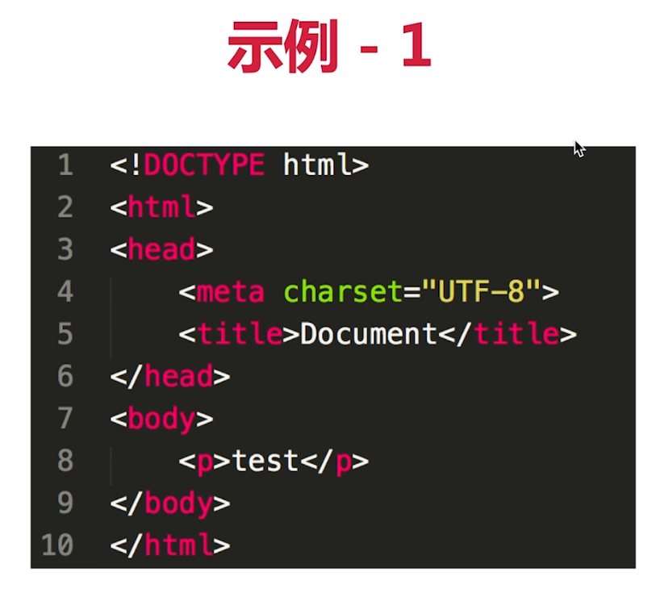


**思考**

为何建议把CSS放在head中？

* 在DOM树加载完之前就得到CSS的规则，DOM树生成后就与所有的CSS整合得到一个Render树，一步渲染完成，不用重复
* 如果网速慢或者浏览器很老，可能会出现DOM树加载中，字体变大变小（DOM生成后才加载css）这样的视觉错乱


**思考**

为何建议把js放在body最后

* 如果没有body最后，可能出现页面渲染一部分卡住了，加载完js后又继续渲染的情况（延长了页面渲染的时间）
* js放在最后，不阻碍页面的渲染，DOM渲染完之后再执行js


## 16-4 面试题

### • 从输入url到渲染出页面的整个过程

> 从输入url到渲染出页面的整个过程
>
> * 下载资源：各个资源类型，下载过程
> * 渲染页面：HTML解析 -> CSS解析 -> 渲染树构建 -> 布局->绘制

### • window.onload和DOMContentLoaded的区别


示例：

```html
<!DOCTYPE html>
<html lang="en">
    <head>
        <meta charset="UTF-8">
        <meta name="viewport" content="width=device-width, initial-scale=1.0">
        <meta http-equiv="X-UA-Compatible" content="ie=edge">
        <title>运行环境 演示</title>
    </head>
    <body>
        <p>一段文字 1</p>
        <p>一段文字 2</p>
        <p>一段文字 3</p>
        

        <script src="./index.js"></script>
    </body>
</html>
```

```js
const img1 = document.getElementById('img1')
img1.onload = function () {
    console.log('img loaded')
}

window.addEventListener('load', function () {
    console.log('window loaded')
})

document.addEventListener('DOMContentLoaded', function () {
    console.log('dom content loaded')
})
```


### • 重绘和重排

> 重绘和重拍可以用来盲答："针对页面渲染流程中的性能优化，你有什么思路？"

当浏览器渲染页面使得页面初始化完成后，我们可能会通过CSS，JS来对页面中的元素进行修改，这些修改会重新触发页面的一部分生命周期，进而带来性能上的开销。

重走页面生命周期这个过程，有两种主要的形式 —— 重排与重绘。

**重排：**当我们的操作引发了 DOM 几何尺寸的变化（比如修改元素的宽、高或隐藏元素等）时，浏览器需要重新计算元素 的几何属性（其他元素的几何属性和位置也会因此受到影响），然后再将计算的结果绘制出来。这个过程就是重排 （也叫回流）。

**触发重排的动作：**

* 改变DOM树的结构： 节点的增减，移动等
* 获取一些特定属性的值：如offsetWidth，clinetWidth,scrollWidth等(这些值是通过即时计算得到的)


**重绘：**当我们对 DOM 的修改导致了样式的变化、却并未影响其几何属性（比如修改了颜色或背景色）时，浏览器不需重 新计算元素的几何属性、直接为该元素绘制新的样式（跳过了上图所示的回流环节）。这个过程叫做重绘。 

**重绘是由对元素绘制属性的修改引发的**


## 16-5 前端性能优化有哪些方式

**性能优化**

* 是一个综合性问题，没有标准答案，但要求尽量全面
* 某些细节问题可能会单独提问：手写防抖、节流
* 只关注核心点，针对面试

**性能优化原则**

* 原则：多使用内存，缓存，减少计算，减少网络请求(适用于所有编程的性能优化 —— 空间换时间)

> **从何入手**(方向)
>
> * 让加载更快
> * 让渲染更快

**让加载更快**

* 减少资源体积：压缩代码(eg webpack里production模式下的代码压缩；服务端会进行gzip压缩只原来的1/3)
* 减少访问次数：
  * 合并代码(eg 图片合并：雪碧图)
  * SSR服务端渲染（eg 服务端渲染把页面和页面要显示的内容一起返回出来，前端渲染：页面发送ajax加载数据，下载资源，然后渲染到页面上去）
  * 缓存（eg 减少请求资源的次数）
* 使用更快的网络：CDN（eg CDN是根据区域来做服务器的处理，不同地址请求服务器的速度不一样）

**让渲染更快**

* CSS放在head，JS放在body最下面
* 尽早开始执行JS，用DOMContentLoaded触发
* 懒加载（图片懒加载，上滑加载更多）
* 对DOM查询进行缓存
* 频繁DOM操作，合并到一起插入DOM结构
* 节流 throttle 防抖 debounce（渲染更流程，用户体验的一个优化）

## 16-6 前端性能优化的示例

1. 资源合并

   

2. 缓存

   

   > **缓存：**
   >
   > * 静态资源加hash后缀，根据文件内容计算hash
   > * 文件内容不变，则hash不变，则url不变
   > * url和文件不变，则会自动触发http缓存机制，返回304

3. CDN

   

   

   

4. SSR（server side render）

   * 服务端渲染：将网页和数据一起加载，一起渲染
   * 非SSR（前后端分离）：先加载网页，再加载数据，再渲染数据
   * 早先的JSP ASP PHP都属于SSR；现在的vue React SSR

5. 懒加载

   备注：把图片的地址默认放一个预览图，当浏览器判断到图片露出屏幕的时候，再把这个图片的真正的data-realsrc赋值给图片的src

   

6. 缓存DOM查询

   

   

7. 尽早开始js执行

   【备注】使用DOMConentLoaded触发，没必要等到所有资源都加载完毕

   

## 16-7 手写防抖 debounce

**节流和防抖**

很多容易被反复触发的事件，例如`scroll,resize,mouseomve,mouseover,keyup,keydown`等，其频繁触发回调导致的大量计算会引发页面的抖动甚至卡顿，为此，我们需要一些手段来控制事件被触发的频率 —— 即事件节流和事件防抖

这两个函数都以**闭包**的形式存在：它们通过对事件对应的回调函数进行包裹、以自由变量的形式缓存时间信息，最后用setTimeout来控制事件的触发频率。

**防抖 debounce**：

*  我会等你到底，在某段时间内，不管你触发了多少次回调，我都只认最后一次。
* 每一次触发都会重新设定新的定时器，直到后续一段时间都没有触发了，才会调用回调函数

```js
//fn是我们需要包装的事件回调，delay是每次推迟执行的等待时间
function debounce(fn,delay){
    //定时器
    let timer = null;
    
    return function(){
        //保留调用时的this上下文
        let context = this;
        //保留调用时传入的参数
        let args = arguments;
        //每次事件被触发时，都会清除之前的旧定时器
        if(timer){
            clearTimeout(timer)
        }
        //设立新的定时器
        timer = setTimeout(function(){
            fn.apply(context,args);
            timer = null;
        },delay)
    }
}

//例子：用throttle来包装scroll的回调
const better_scroll = debounce(()=> console.log('触发了滚动事件'),1000);
document.addEvenetListener('scroll',better_scroll);
```

示例：

* 监听一个输入框，其文字变化后触发change事件
* 直接用keyup事件，则会频繁触发change事件
* 防抖：用户输入结束或暂停时，才会触发change事件

```html
<html lang="en">
    <head>
        <title>debounce 演示</title>
    </head>
    <body>
        <input type="text" id="input1">
        <script src="./debounce.js"></script>
    </body>
</html> 
```

```js
const input1 = document.getElementById('input1')

// 防抖（封装后的一个好的版本，最终返回的是一个函数）
function debounce(fn, delay = 500) {
    // timer 是闭包中的
    let timer = null

    return function () {
        if (timer) {
            clearTimeout(timer)
        }
        timer = setTimeout(() => {
            fn.apply(this, arguments)
            timer = null
        }, delay)
    }
}

//怎么用
input1.addEventListener('keyup', debounce(function (e) {
    console.log(e.target)
    console.log(input1.value)
}, 600))

```

## 16-8 手写节流 throttle

**节流 throttle**: 在某段事件内，不论你触发了多少次回调，我都只认第一次，并在计时结束时给予响应。

```js
//fn是我们需要包装的事件回调，interval是时间间隔的阈值
function throttle(fn,interval = 100){
    //last为上一次触发回调的时间
    let last = 0;
    
    //将throttle处理结果当作函数返回
    return function(){
        //保留调用时的this上下文
        let context = this;
        //保留调用时传入的参数
        let args = arguments;
        //记录本次触发回调的时间
        let now = +new Date();
        
        //判断上次出发的时间和本次触发的时间差是否小于时间间隔
        if(now-last>=interval){
            //如果时间间隔大于我们设定的时间间隔阈值，则执行回调
            last = now;
            fn.apply(context.args);
        }
    }
}

//例子：用throttle来包装scroll的回调
const better_scroll = throttle(()=> console.log('触发了滚动事件'),1000);
document.addEvenetListener('scroll',better_scroll);
```

示例：

* 拖拽一个元素时，要随时拿到该元素被拖拽的位置
* 直接用drag事件，则会频繁触发，很容易导致卡顿
* 节流：无论拖拽速度多快，都会每隔100ms触发一次


```html
<html lang="en">
    <head>
        <title>throttle 演示</title>
        <style>
            #div1 {
                border: 1px solid #ccc;
                width: 200px;
                height: 100px;
            }
        </style>
    </head>
    <body>
        <div id="div1" draggable="true">可拖拽<div>
        <script src="./throttle.js"></script>
    </body>
</html>
```

```js
const div1 = document.getElementById('div1')

//（另一种实现方式）节流函数工具
function throttle(fn,delay = 100){
    let timer = null;
    
    return function(){
        if(timer){
            return;
        }
        timer = setTimeout(()=>{
            fn.apply(this,arguments);
            timer = null;
        },delay)
    }
}

//使用节流
div1.addEventListener('drag', throttle(function (e) {
    console.log(e.offsetX, e.offsetY)
},200))
```

## 16-9 如何预防 xss 攻击

**安全**

* 问题：常见的web前端攻击方式有哪些？
* XSS（跨站脚本攻击 Cross-Site Scripting）
* CSRF(跨站请求伪造 Cross-Site Request Forgeries)

**XSS攻击**

> 是指通过存在安全漏洞的Web网站注册用户的浏览器内运行非法的HTML标签或Javascript进行的一种攻击
>
> 可能造成的影响：
>
> * 利用虚假输入表单骗取用户个人信息
> * 利用脚本窃取用户的Cookie值，被害者在不知情的情况下，帮助攻击者发送恶意请求
> * 显示伪造的文章或图片
> * 【补充】cookie中设置了httponly后js脚本将无法获取cookie信息，这样可以防范xss攻击

* 一个博客网站，我发表一篇博客，其中嵌入`<scritp>`脚本
* 脚本内容：获取cookie，发送到我的服务器（服务器需要配合跨域）
* 发布这篇博客，有人查看它，我轻松收割访问者的cookie

示例：

```html
<!DOCTYPE html>
<html lang="en">
    <head>
        <meta charset="UTF-8">
        <meta name="viewport" content="width=device-width, initial-scale=1.0">
        <meta http-equiv="X-UA-Compatible" content="ie=edge">
        <title>xss 演示</title>
    </head>
    <body>
        <p>一个很精彩的博客</p>
        <p>博客文字</p>
        <p>博客文字哈哈哈哈</p>
        <script>console.log("您的cookie：",document.cookie,"已经被这篇博客的嵌入script脚本获取了")</script>
    </body>
</html>
```


当用户在登录状态下访问这篇博客，该博客网站就获得了该用户的cookie，然后发送到该博客的服务器（cookie其中包含用户信息，被别人有意利用非常不安全）

> **如何预防XSS攻击**
>
> * 替换特殊字符，如`<`变成`&lt;`   ` >`变成`&gt；`
> * `<script>`变成`&lt;script&gt;` 直接显示，而不会作为脚本执行
> * 前端要替换，后端也要替换，都做总不会有错

例如：

```js
    <body>
        <p>一个很精彩的博客</p>
        <p>博客文字</p>
        <p>博客文字哈哈哈哈</p>
        &lt;script&gt;alert(document.cookie);&lt;/script&gt;
    </body>
```

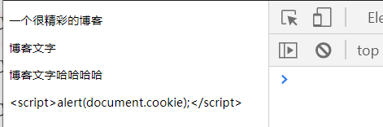

【注意】可以使用npm的xss工具来预防

## 16-10 如何预防 xsrf 攻击

**XSRF攻击 **

> 是指攻击者通过设置好的陷阱，强制对已完成认证的用户进行非预期的个人信息或设定信息等某些状态更新，属于被动攻击
>
> 可能有以下影响：
>
> * 利用已通过认证的用户权限更新设定信息等
> * 利用已通过认证的用户权限购买商品
> * 利用已通过认证的用户权限在留言板上发表

* 你正在购物，看中了某个商品，商品id是100
* 付费接口是`xxx.com/pay?id=100`,但没有任何验证
* 我是攻击者，我看中了一个商品，id是200，我现在想让你去买
* 我向你发送一封电子邮件，邮件标题很吸引人
* 但邮件正文隐藏着`` 
* 你一查看邮件，就帮我购买了id是200的商品

【备注】：你已登录该购物网站，访问邮件的时候用户信息（即cookie）已经带上了，因为img的请求可以跨域，所以你就在该网站购买了id是200的商品

> **XSRF预防**
>
> * 使用post接口（post接口下的跨域需要服务端支持）
> * 增加验证，例如密码，短信验证码，指纹等（现在的购物网站多是这种方式）

# 第18章 其他真题

本章节，通过一部分高频面试真题，带大家分析面试，以及如何解答。

**面试真题**

* 都是网上的高频JS初级面试题
* 验证和复习之前学过的知识
* 补充其他技能，如正则表达式，数组API

**讲解前提示**

* 题目没有按照知识点或者难度排序，即混排
* 只筛选了初级面试题，即本课程知识体系之内的


## 6 split()和join()的区别

```"
'1-2-3'.split('-') //[1,2,3]
[1,2,3].join('-')//"123
```

## 7 数组的pop push unshift shift分别做什么

* 功能是什么？
* 返回值是什么？
* 是否回对原数组造成影响？

**返回元素或length 改变源数组**

```js
const arr = [10, 20, 30, 40]

// pop
const popRes = arr.pop()
console.log(popRes, arr)//40 [ 10, 20, 30 ]

// shift
const shiftRes = arr.shift()
console.log(shiftRes, arr)//10 [ 20, 30 ]

// push
const pushRes = arr.push(50) // 返回 length
console.log(pushRes, arr)//3 [ 20, 30, 50 ]

// unshift
const unshiftRes = arr.unshift(5) // 返回 length
console.log(unshiftRes, arr) //4 [ 5, 20, 30, 50 ]
```

**纯函数：不改变源数组，返回一个新的数组**

```js
// 纯函数：1. 不改变源数组（没有副作用）；2. 返回一个数组
const arr = [10, 20, 30, 40]

// concat
const arr1 = arr.concat([50, 60, 70])
// map
const arr2 = arr.map(num => num * 10)
// filter
const arr3 = arr.filter(num => num > 25)
// slice
const arr4 = arr.slice()
```

**非纯函数**

```js
// 非纯函数
// push pop shift unshift
// forEach
// some every
// reduce
```

## 8 数组slice和splice的区别

* 功能区别（slice-切片，splice-剪接）
* 参数和返回值
* 是否纯函数

```js
// slice 纯函数
const arr = [10, 20, 30, 40,50]
const arr1 = arr.slice()
const arr2 = arr.slice(1, 4)//[20,30,40]不包含结束索引
const arr3 = arr.slice(2)//从2开始直到最后
const arr4 = arr.slice(-3)//倒数前三个
```

```js
// splice 非纯函数
const arr = [10, 20, 30, 40,50]
const spliceRes = arr.splice(1, 2, 'a', 'b', 'c')
console.log(spliceRes, arr) //[ 20, 30 ] [ 10, 'a', 'b', 'c', 40, 50 ]
```

## 9 [10,20,30].map(parseInt)返回结果是什么？

* map的参数和返回值
* parseInt参数和返回值

```js
const res = [10, 20, 30].map(parseInt)
console.log(res)//[ 10, NaN, NaN ]
```

拆开来看

```js
// 拆解
[10, 20, 30].map((num, index) => {
    return parseInt(num, index)
})
```

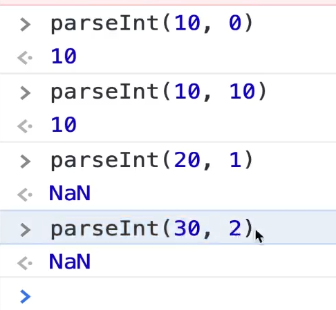

## 32 手写数组flatern，考虑多层级


```js
function flat(arr) {
    // 验证 arr 中，还有没有深层数组 [1, 2, [3, 4]]
    const isDeep = arr.some(item => item instanceof Array)
    if (!isDeep) {
        return arr // 已经是 flatern [1, 2, 3, 4]
    }

    const res = Array.prototype.concat.apply([], arr)
    return flat(res) // 递归
}

const res = flat( [1, 2, [3, 4, [10, 20, [100, 200]]], 5] )
console.log(res)

```

 

## 类数组读写转为数组对象

**什么是类数组对象？**

1. 它必须是一个对象
2. 它有length属性

**类数组转换成**

```js
const arrayLike = {'0':'Bob','1':'Lucy','2':'Daisy',length:3}
```

1. slice

   ```js
   const arr = Arr.prototype.slice.call(arrayLike);
   ```

2. Array.from

   ```js
   const arr = Array.from(arrayLike);
   ```

3. ...

   ```js
   function demo{
       console.log([...arguments]);
   }
   ```

## 33 数组去重

* 传统方式，遍历元素挨个比较、去重

  ```js
  // 传统方式
  function unique(arr) {
      const res = []
      arr.forEach(item => {
          if (res.indexOf(item) < 0) {
              res.push(item)
          }
      })
      return res
  }
  ```

* 使用set

  ```js
  // 使用 Set （无序，不能重复）
  function unique(arr) {
      const set = new Set(arr)
      return [...set]
  }
  ```

* 考虑计算效率，尽量使用set的方式

## 26 如何获取多个数字中的最大值

```js
Math.max(10,20,40,80)
//以及Max.min
```

```js
function max(){
  const nums = Array.prototype.slice.call(arguments)//变为数组
  let max = 0;
  nums.forEach(n=>{
    if(n>max){
      max = n
    }
  })
  return max
}
```

## 13 闭包是什么，有什么特性？有什么负面影响？

* 回顾作用域和自由变量
* 回顾闭包应用场景：函数作为参数被传入，函数作为返回值被返回
* 回顾：自由变量的查找，要在函数定义的地方（而非执行的地方）
* **影响：变量会常驻内存，得不到释放**。所以闭包不要乱用。

代码示例：

```js
// // 自由变量示例 —— 内存会被释放
// let a = 0
// function fn1() {
//     let a1 = 100

//     function fn2() {
//         let a2 = 200

//         function fn3() {
//             let a3 = 300
//             return a + a1 + a2 + a3
//         }
//         fn3()
//     }
//     fn2()
// }
// fn1()

// // 闭包 函数作为返回值 —— 内存不会被释放
// function create() {
//     let a = 100
//     return function () {
//         console.log(a)
//     }
// }
// let fn = create()
// let a = 200
// fn() // 100

function print(fn) {
    let a = 200
    fn()
}
let a = 100
function fn() {
    console.log(a)
}
print(fn) // 100
```

## 24 判断字符串以字母开头，后面字母数字下划线，长度6-30

> `const reg = /^[a-zA-Z]\w{5,29}$/`

推荐文档

https://deerchao.cn/tutorials/regex/regex.html

手写常见正则表达式

`^`是正则表达式匹配**字符串开始**位置

`$`是正则表达式匹配**字符串结束**位置

```js
// 邮政编码
/\d{6}/
// 小写英文字母
/^[a-z]+$/
// 英文字母
/^[a-zA-Z]+$/
// 日期格式 2019.12.1
/^\d{4}-\d{1,2}-\d{1,2}$/
// 用户名
/^[a-zA-Z]\w{5, 17}$/
// 简单的 IP 地址匹配
/\d+\.\d+\.\d+\.\d+/
//英文单词
/[^\s]+/g
```

## 25 手写字符串trim方法，保证浏览器兼容性

```js
//去除字符串前面和后面的空白
String.prototype.trim = function(){
	return this.replace(/^\s+/,'').replace(/\s+$,'')
}
//（原型，this，正则表达式
```

## 28 如何捕获js程序中的异常


## 29 什么是JSON？

> * json是一种数据格式，本质是一段字符串
> * json格式和js对象结构一致，对JS语言更友好
> * `window.JSON`是一个全局对象 
> * `JSON.stringify` 对象转换成json字符串
> * `JSON.parse`字符串转换成对象


**补充一个编程题：获取url参数**

获取 url 中的参数

1. 指定参数名称，返回该参数的值 或者 空字符串
2. 不指定参数名称，返回全部的参数对象 或者 {}
3. 如果存在多个同名参数，则返回数组

输入

```
http://www.nowcoder.com?key=1&key=2&key=3&test=4#hehe key
```

输出

```
[1, 2, 3]
```

答案1 使用正则

```js
function getUrlParam(sUrl,sKey){
	var result = {};
	sUrl.replace(/\??(\w+)=(\w+)&?/g,function(a,k,v){
		if(result[k] !== void 0){
			var t = result[k];
			result[k] = [].concat(t,v);
		}else{
			result[k] = v;
		}
	});
	if(sKey === void 0){
		return result;
	}else{
		return result[sKey] || '';
	}
}

var res = getUrlParam("http://www.nowcoder.com?key=1&key=2&key=3&test=4#hehe","key");
console.log(res);
```

1. replace()的第一个参数是一个正则表达式，第二个参数是一个回调函数，每匹配到一个符合正则表达式的结果就回调一次。参数a代表该次匹配到的字符串，k代表该次匹配到的字符串中符合第一个分组的部分，v代表该次匹配到的字符串中符合第二个分组的部分
2. 当concat()的参数是具体的值时，意味着将参数连接到调用concat()方法的数组上。result原本是一个空的对象，当回调函数第一次执行时，向该对象添加了一个key-value对，但此时的value是一个字符串"1"。因此，在回调函数第二次执行时，要向一个空数组添加字符串"1"和"2"，这也是为什么要用[].concat(k,v)。
3. 正则表达式的开头的\?是不能省略的，否则.com?key=1匹配不到。

## 35 介绍一下 RAF（requestAnimationFrame）

https://www.cnblogs.com/xiaohuochai/p/5777186.html

> * 要想动画流畅，更新频率要60帧/s，即16.67ms更新一次视图
> * setTimeout要手动控制频率，而RAF浏览器会自动控制
> * 后台标签或隐藏iframe中，RAF会暂停，而setTimeout依然执行

```html
<!DOCTYPE html>
<html lang="en">
    <head>
        <meta charset="UTF-8">
        <meta name="viewport" content="width=device-width, initial-scale=1.0">
        <meta http-equiv="X-UA-Compatible" content="ie=edge">
        <title>JS 真题演示</title>

        <style>
            #div1 {
                width: 100px;
                height: 50px;
                background-color: red;
            }
        </style>
    </head>
    <body>
        <p>JS 真题演示</p>
        <div id="div1"></div>
        <script src="https://cdn.bootcss.com/jquery/3.4.0/jquery.js"></script>
        <script src="./RAF.js"></script>
    </body>
</html>
```

```js
// 3s 把宽度从 100px 变为 640px ，即增加 540px
// 60帧/s ，3s 180 帧 ，每次变化 3px

const $div1 = $('#div1')
let curWidth = 100
const maxWidth = 640

// // setTimeout
// function animate() {
//     curWidth = curWidth + 3
//     $div1.css('width', curWidth)
//     if (curWidth < maxWidth) {
//         setTimeout(animate, 16.7) // 自己控制时间
//     }
// }
// animate()

// RAF
function animate() {
    curWidth = curWidth + 3
    $div1.css('width', curWidth)
    if (curWidth < maxWidth) {
        window.requestAnimationFrame(animate) // 时间不用自己控制
    }
}
animate()

```


