# 第1章 课程介绍

本章会出几个面试题，分析每道题目设计的知识点，然后总结出一个完整的知识体系。让我们开始 “题目->知识点->解题” 的快乐之旅吧。

## 1-1 导学

**问题1 - 如何能"快速搞定"**

* 解决方案：直击重点！
* 快速圈出前端常见考点和题目
* 以最易理解的方式讲解清楚


**问题2 - 如何做到”最易理解“**

* 讲知识点，不是题海战术
* 学会一道题，就能应对一类题
* 构建前端知识体系


资料：前端思维导图

**问题3 - 如何做到"匹配大厂"？**

* 大厂偏爱考察基础，特别是对于工作经验少的候选人
* 课程能讲解大厂一面的常见考点和面试题

**讲授方式**

* 先出面试题，引导思考
* 通过题目引出知识点，扩充知识体系
* 问题解答

##  1-2 看了这节课你就知道该怎么准备面试了

**关于面试**

* 基层工程师：基础知识
* 高级工程师：基础知识+项目经验
* 架构师：解决方案能力

**关于基础**

* 工程师的自我修养：基础知识
* 扎实的基础能让你高校学习新技术

##  1-3 先来体验几个面试题

**几个面试题**

* 出题
* 思考


## 1-4 如何搞定所有面试题


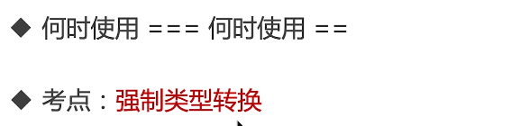


##  1-5 知识体系

**前端知识体系**

* 什么是知识体系
* 从哪些方面梳理
* 知识体系

**什么是知识体系？**

* 高效学习三部曲：找准知识体系；刻意训练；及时反馈；
* 知识体系：结构化的知识范围
* 涵盖所有知识点；结构化、有组织、易扩展

**从哪些方面梳理**

* W3C标准
* ECMA 262标准
* 开发环境
* 运行环境

**知识体系**

* CSS基础知识
* JS基础语法
* JS-Web-API
* 开发环境
* 运行环境
* HTTP协议

# 第2章 面试前的准备

**本章主要内容**

* 面试的环节和流程
* JD分析
* 如何写简历
* 准备工作和注意事项

## 2-1 面试之前需要你准备什么

**面试的环节和流程**

* 什么是面试
* 如何拿到简历
* 面试流程

**什么是面试**

* 经过组织者精心设计
* 以交谈和观察为主要手段
* 评价知识、能力和经验，综合素质

## 2-2 投递简历的几种方式

**如何拿到简历**

* 员工内推
* 猎头推荐
* hr收集（主动搜索，接收邮件）

## 2-3 面试的主要环节

**面试流程**

* 一面：以基础知识为主
* 二面（交叉面试）：从基础知识开始，考察原理，终于项目经验（要有实践经验辅助）
* 三面：不是纯技术，项目leader讲角色定位，产品的想法，未来技术规划
* hr面试：阿里hr有一票否决权；如实回答，阳光积极大方

**校招和社招的区别**

* 校招看中基础知识和能力，主要在一面
* 社招看中经验，主要在二面（基础知识要过关）
* 社招，工作时间越长，越偏重经验

## 2-4 JD分析-知己知彼

**JD分析**

* JD实什么
* JD分析的思路
* 案例

**JD是什么？**

* JD是用人单位发布的招聘信息
* 职位描述
* 岗位要求

**从JD中能看到什么？**

* 工作内容
* 技术栈
* 经验要求

**不过过于在意JD**

* JD是hr发布的
* hr和技术人员可能会沟通不及时
* 不能完全相信JD的要求


## 2-5 如何写简历

**如何写简历**

* 简历包含的内容
* 简历中需要注意的内容
* 案例

**划重点**

* 简历就像高考作文——阅卷时间非常短
* 内容简介
* 直击重点，表现出自己的优势

**简历包含的内容**

* 个人信息
* 教育经历
* 专业技能
* 工作经历
* 项目经历

**简历内容 - 基本信息**

* 必备：姓名 性别 电话 邮箱 籍贯
* 年龄可不写（能从教育经历评估出来）
* 头像无所谓

**简历内容 - 教育经历**

* 写上最高学历即可
* 学校，专业，入学和毕业时间

**简历内容 - 专业技能**

* 表现出自己的核心竞争力
* 内容不要太多，3、5条即可
* 太基础的不要写，例如会用vscode

**简历内容 - 工作经历**

* 如实写
* 写明公司，职位，入职离职时间即可，多写无益
* 如果有空窗期，如实写名即可

**简历内容 - 项目经历**

* 写2-4个具有说服力项目（视工作时间）
* 项目描述，技术栈，个人角色
* 技巧：可以把别人的项目写上，只要你能hold住

**简历内容 - 博客或开源**

* 有博客或者开源作品，会让你更有竞争力
* 切记：需要真的有内容，不可临时抱佛脚
* 可以从现在开始，慢慢积累

**注意事项**

* 界面不要太花哨，简洁明了即可
* 注意用词,"精通"，"熟练"等慎用
* 不可造假，会被拉入黑名单（项目经历那里，不是造假！！！）

## 2-6 简历案例分析

略

## 2-7 面试前准备工作和注意事项

**面试前的准备工作**

* 看JD，是否需要临时准备一下
* 打印纸质简历，带着纸和笔
* 最好带着自己的电脑，先尝可能手写代码

**面试前的注意事项**

* 要有时间观念，如果迟到或者推迟，要提前说
* 衣着适当，不用正装，也不要太随意
* 为何离职？ —— 不要吐槽前东家，说自己的原因
* 能加班吗？ —— 能！除非你特别自信，能找到其他机会
* 不要挑战面试官，即使他错了
* 遇到不会的问题，要表现出自己积极的一面（不会的题也积极表现出想知道）

**其他情况**

https://www.imooc.com/article/300475

# 第3章 CSS 面试题

## 3-1 html、css面试介绍


备注：CSS3动画并不是面试重点，除非是相关岗位

## 3-2 html面试题

### • 如何理解HTML语义化


* 让人更容易读懂（增加代码可读性）
* 让搜索引擎更容易读懂（SEO）

### • 块级元素&内联元素

* `display: block/table` 有 div h1 h2 table ul ol p等
* `display:inline/inline-block` 有span img input button等

## 3-3 布局

### • 盒子模型


* offsetWidth = (内容宽度+内边距+边框)，无外边距
* 答案：122px
* 补充：如果让offetWidth等于100px，该如何做？设置`box-sizing:border-box`(即让width==offsetWidth)，`document.getElementById('div1').offset` 就等于100px了

### • margin纵向重叠


* 相邻元素的margin-top和margin-bottom会发生重叠
* 空白内容的`<p></p>`也会重叠
* 答案：15px

### • margin负值问题


* margin-top和margin-left负值，元素向上，向左移动
* margin-right负值，右侧元素左移，自身不受影响
* margin-bottom负值，下方元素上移，自身不受影响

### • BFC


* Block format context，块级格式化上下文
* BFC是一块独立渲染区域，内部元素的渲染不会影响边界以外的元素
* 形成BFC的常见条件
  1. float不是none
  2. position是absolute或fixed
  3. overflow不是visible
  4. display是flex inline-block等
* BFC的常见应用
  * 清除浮动

**BFC清除浮动代码示例**

```html
    <style type="text/css">
        .container {
            background-color: #f1f1f1;
        }
        .left {
            float: left;
        }
        .bfc {
            overflow: hidden; /* 触发元素 BFC */
        } 
    </style>
</head>
<body>
    <div class="container bfc">
        
        <p class="bfc">某一段文字……</p>
    </div>
</body>
```


### • float布局


**圣杯布局和双飞翼布局的目的**

* 三栏布局，中间一栏最先加载和渲染（内容最重要）
* 两侧内容固定，中间内容随着宽度自适应
* 一般用于PC网页

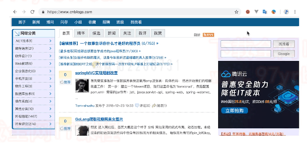

**圣杯布局和双飞翼布局的技术总结**

* 使用float布局
* 两侧使用margin负值，以便和中间内容横向重叠
* 防止中间内容被两侧覆盖，一个用padding（圣杯布局）一个用margin（双飞翼布局）

**圣杯布局代码**


```html
<body>
    <div id="header">this is header</div>
    <div id="container">
        <div id="center" class="column">this is center</div>
        <div id="left" class="column">this is left</div>
        <div id="right" class="column">this is right</div>
    </div>
    <div id="footer">this is footer</div>
</body>
```

```css
<style type="text/css">
        body {
            min-width: 550px;
        }
        #header {
            text-align: center;
            background-color: #f1f1f1;
        }
        #container{
          padding-left: 200px;
          padding-right: 150px;/*1.留出中间的内容*/
        }
        #container .column{
          float: left;/*2.设置float布局*/
        }
        #center {
            background-color: #ccc;
            width: 100%;
        }
        #left {
            background-color: yellow;
            width: 200px;
            margin-left: -100%;/*3.left的父元素的宽度值，设置赋值，以便和中间内容航向重叠*/
            position: relative;
            right: 200px;/*position为relative就是相对自身移动元素*/
        }
        #right {
            background-color: red;
            width: 150px;
            margin-right: -150px;/*4.margin负值*/
        }
        #footer {
          clear: both;/*清除浮动*/
          text-align: center;
          background-color: #f1f1f1;
        }
    </style>
```

**双飞翼代码**（推荐，更简单）

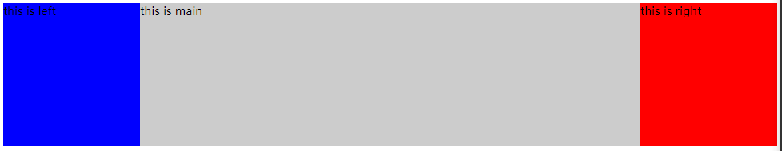

```html
<body>
    <div id="main" class="col">
        <div id="main-wrap">
            this is main
        </div>
    </div>
    <div id="left" class="col">
        this is left
    </div>
    <div id="right" class="col">
        this is right
    </div>
</body>
```

```css
		<style type="text/css">
			body {
				min-width: 550px;
			}
			#main {
				width: 100%;
				height: 200px;
				background-color: #ccc;
			}
      #main-wrap{
        margin: 0 190px 0 190px;
      }
      .col{
        float: left;
      }
		#left {
				width: 190px;
				height: 200px;
				background-color: #0000ff;
        margin-left: -100%;/*margin-left负值*/
			}
			#right {
				width: 190px;
				height: 200px;
				background-color: #ff0000;
        margin-left: -190px;/*自身宽度*/
			}
		</style>
```

**清除浮动代码**

```js
    <div id="container" class="clearfix">
        <div id="center" class="column">this is center</div>
        <div id="left" class="column">this is left</div>
        <div id="right" class="column">this is right</div>
    </div>
```

```js
        /* 手写 clearfix */
        .clearfix:after {
            content: '';
            display: table;
            clear: both;
        }
```


### • flex布局


**常用语法回顾：**

* `flex-direction`属性决定主轴的方向
* `flex-wrap`属性定义，如果一条轴线排不下，如何换行。
* `justify-content`属性定义了项目在主轴上的对齐方式。
* `align-items`属性定义项目在交叉轴上如何对齐
* `align-self`属性允许单个项目有与其他项目不一样的对齐方式，可覆盖

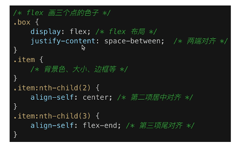

## 3-4 定位

### • relative分别依据什么定位？


```html
<body>
    <p>absolute 和 relative 定位问题</p>
    <div class="relative">
        <div class="absolute">
            this is absolute
        </div>
    </div>
</body>
```

```css
 <style type="text/css">
        body {
            margin: 20px;
        }
        .relative {
            position: relative;
            width: 400px;
            height: 200px;
            border: 1px solid #ccc;
        }
        .absolute {
            position: absolute;
            width: 200px;
            height: 100px;
            border: 1px solid blue;
            top: 20px;/*依据relative的元素定位*/
            left: 50px;
        }
    </style>
```


```css
 <style type="text/css">
        body {
            margin: 20px;
        }
        .relative {
            position: relative;
            width: 400px;
            height: 200px;
            border: 1px solid #ccc;
            top: 20px;/*依据自身定位*/
            left: 50px;
        }
        .absolute {
            position: absolute;
            width: 200px;
            height: 100px;
            border: 1px solid blue;
            top: 20px;
            left: 50px;
        }
    </style>
```


```css
    <style type="text/css">
        body {
            margin: 20px;
        }
        .relative {
            width: 400px;
            height: 200px;
            border: 1px solid #ccc;
        }
        .absolute {
            position: absolute;
            width: 200px;
            height: 100px;
            border: 1px solid blue;
            top: 20px;/*依据body定位*/
            left: 50px;
        }
    </style>
```


### • 居中对齐的实现方式

包括：水平居中 和 垂直居中

**水平居中**


* inline元素：text-align:center

  ```html
      <div class="container container-1">
          <span>一段文字</span>
      </div>
  ```

  ```css
          .container {
              border: 1px solid #ccc;
              margin: 10px;
              padding: 10px;
          }
  
          .container-1 {
              text-align: center;/*水平居中*/
          } 
  ```

  

* block元素:margin：auto

  ```html
      <div class="container container-2">
          <div class="item">
              this is block item
          </div>
      </div>
  ```

  ```css
  		.container {
              border: 1px solid #ccc;
              margin: 10px;
              padding: 10px;
          }
          .container-2 .item {
              background-color: #ccc;
              width: 500px;
              margin: auto;/*水平居中*/
          }
  ```

  

* absolute元素:left:50% + margin-left负值

  ```html
      <div class="container container-3">
          <div class="item">
              this is absolute item
          </div>
      </div>
  ```

  ```css
          .container {
              border: 1px solid #ccc;
              margin: 10px;
              padding: 10px;
          }
  
          .container-3 {
              position: relative;
              height: 100px;
          }
          .container-3 .item {
            background-color: #ccc;
              width: 300px;
              height: 100px;
              position: absolute;
              left: 50%;
              margin-left: -150px;/*需要知道子元素宽度*/
          }
  ```

  

**垂直居中**


* inline元素：line-height的值等于height值

  ```html
      <div class="container container-1">
          <span>一段文字</span>
      </div>
  ```

  ```css
  .container {
              border: 1px solid #ccc;
              margin: 10px;
              padding: 10px;
              height: 200px;
          }
          .container-1{
              text-align: center;
              height: 200px;/*line-height的值等于height值*/
              line-height: 200px;
          }
  ```

  

* absolute元素：top 50% + margin-top负值

  ```html
      <div class="container container-2">
          <div class="item">
              this is item
          </div>
      </div>
  ```

  ```css
          .container-2 {
              position: relative;
          }
          .container-2 .item {
            background-color: #ccc;
              width: 300px;
              height: 100px;
              position: absolute;
              left: 50%;
              margin-left: -150px;
              top: 50%;
              margin-top: -50px;
          }
  ```

  

* absolute元素：transform(-50%.-50%)

  ```html
      <div class="container container-3">
          <div class="item">
              this is item
          </div>
      </div>
  ```

  ```css
          .container-3 {
              position: relative;
          }
          .container-3 .item {
            background-color: #ccc;
              width: 200px;
              height: 80px;
              position: absolute;
              left: 50%;
              top: 50%;
              transform: translate(-50%, -50%)
          }
  ```

  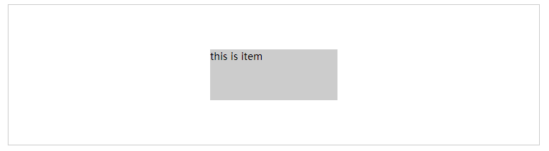

* absolute元素：top left bottom right = 0 + margin : auto

  注意：这个不需要知道子元素的高宽

  ```html
      <div class="container container-4">
          <div class="item">
              this is item
          </div>
      </div>
  ```

  ```css
          .container-4 {
              position: relative;
          }
          .container-4 .item {
            background-color: #ccc;
              width: 100px;
              height: 50px;
              position: absolute;
              top: 0;
              left: 0;
              bottom: 0;
              right: 0;
              margin: auto;
          }
  ```

  


## 3-5  图文样式

### • line-height

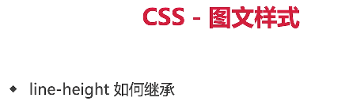

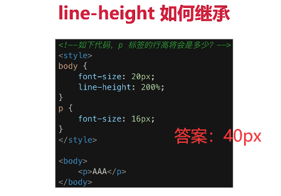


```html
<style type="text/css">
        body {
            font-size: 20px;
            line-height: 200%;
        }
        p {
            background-color: #ccc;
            font-size: 16px;
        }
    </style>
<body>
    <p>这是一行文字</p>
</body>

```


## 3-6 响应式

### • rem


### • 响应式布局的常见方案


```html
<html>
<head>
    <title>响应式布局</title>
    <style type="text/css">
        @media only screen and (max-width: 374px) {
            /* iphone5 或者更小的尺寸，以 iphone5 的宽度（320px）比例设置 font-size */
            html {
                font-size: 86px;
            }
        }
        @media only screen and (min-width: 375px) and (max-width: 413px) {
            /* iphone6/7/8 和 iphone x */
            html {
                font-size: 100px;
            }
        }
        @media only screen and (min-width: 414px) {
            /* iphone6p 或者更大的尺寸，以 iphone6p 的宽度（414px）比例设置 font-size */
            html {
                font-size: 110px;
            }
        }
        body {
            font-size: 0.16rem;
        }
        #div1 {
            width: 1rem;
            background-color: #ccc;
        }
    </style>
</head>
<body>
    <div id="div1">
        this is div
    </div>
</body>
</html>
```

### • vw-wh

**rem的弊端**


**网页视口尺寸**


667 是screen.height 屏幕高度

553 innerHieght

**vw/vh**


# 第4章 JS基础-变量类型和计算

## 4-1 JS 值类型和引用类型


**值**类型在**栈**中存储。**引用**类型在**堆**中申请内存地址

栈是从上往下累加。堆是从下往上排列，一般情况不会重合。


### • typeof能判断哪种类型

* 识别所有值类型
* 识别函数
* 判断是否是引用类型（不可再细分）

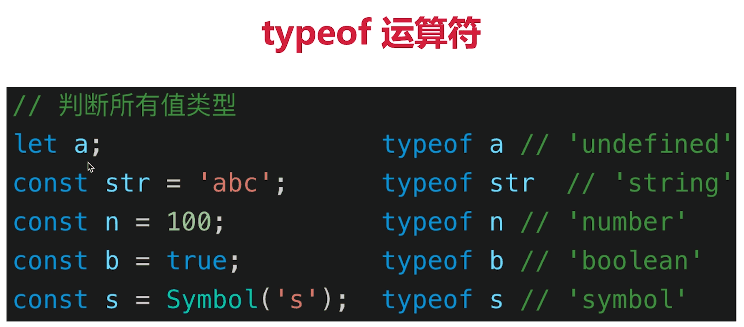


### • 何时使用 === 何时使用 == 

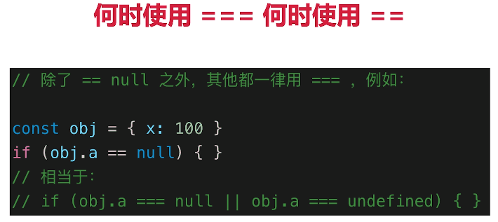

### • 值类型和引用类型的区别


## 4-2 JS 深拷贝

### • 手写深拷贝

* 注意判断值类型还是引用类型
* 注意判断是数组还是对象
* 递归

如何实现引用类型（针对对象和数组）的深拷贝？

```js
/**
 * 深拷贝
 * @param {Object} obj 要拷贝的对象
 */
function deepClone(obj = {}) {
	if (typeof obj !== "object" || obj == null) {
		// obj 是 null ，或者不是对象和数组，直接返回
		return obj;
	}
	// 初始化返回结果
	let result;
	if (obj instanceof Array) {
		result = [];
	} else {
		result = {};
	}
	for (let key in obj) {
		// 保证 key 不是原型的属性
		if (obj.hasOwnProperty(key)) {
			// 递归调用！！！
			result[key] = deepClone(obj[key]);
		}
	}
	// 返回结果
	return result;
}
```

```js
/*eg*/
const obj1 = {
	age: 20,
	name: "xxx",
	address: {
		city: "beijing",
	},
	arr: ["a", "b", "c"],
};

const obj2 = deepClone(obj1);
obj2.address.city = "shanghai";
obj2.arr[0] = "a1";
console.log(obj1.address.city);//beijing
console.log(obj1.arr[0]);//a
```


## 4-3 变量计算 - 注意某些类型转换的坑

**变量计算 - 类型转换** 

知识点

* 字符串拼接
*  == 
* if语句和逻辑运算


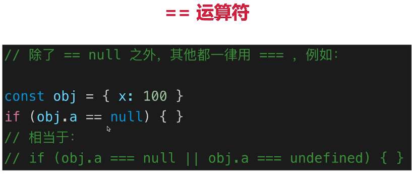

注意：实际工作中，除了判读null和undefined，一般都用 === 


## 4-4 小结

* 值类型 vs 引用类型，堆栈模型，深拷贝
* typeof运算符
* 类型转换，truly和falsely变量

# 第5章 JS基础-原型和原型链

本章介绍原型、原型链和 class 相关的知识点和题目。包括 class ，继承，原型，原型链，instanceof。原型是“JS 三座大山”之一，原型和原型链也是必考知识点。

## 5-1 JS 原型的考点和面试题


## 5-2 如何用 class 实现继承

**class**

* constructor
* 属性
* 方法

**代码演示**

```js
// 类
class Student {
	constructor(name, number) {
		this.name = name;
		this.number = number;
	}
	sayHi() {
		console.log(`姓名 ${this.name} ，学号 ${this.number}`);
	}
}

// 通过类 new 对象/实例
const xialuo = new Student("夏洛", 100);
console.log(xialuo.name);
console.log(xialuo.number);
xialuo.sayHi();
```

**继承**

* extends
* super
* 扩展或重写方法

**代码演示**

```js
// 父类
class People {
    constructor(name) {
        this.name = name
    }
    eat() {
        console.log(`${this.name} eat something`)
    }
}
// 子类
class Student extends People {
    constructor(name, number) {
        super(name)
        this.number = number
    }
    sayHi() {
        console.log(`姓名 ${this.name} 学号 ${this.number}`)
    }
}
// 子类
class Teacher extends People {
    constructor(name, major) {
        super(name)
        this.major = major
    }
    teach() {
        console.log(`${this.name} 教授 ${this.major}`)
    }
}
// 实例
const xialuo = new Student('夏洛', 100)
console.log(xialuo.name)
console.log(xialuo.number)
xialuo.sayHi()
xialuo.eat()
// 实例
const wanglaoshi = new Teacher('王老师', '语文')
console.log(wanglaoshi.name)
console.log(wanglaoshi.major)
wanglaoshi.teach()
wanglaoshi.eat()
```

## 5-3 如何理解 JS 原型（隐式原型和显示原型）

**instanceof**


* instanceof 可以判断引用类型
* Object是所有class的父类

**原型**


备注：`__proto__`隐式原型 `prototype`显示原型


## 5-4 instanceof 是基于原型链实现的


**原型链**

那么`hasOwnPrototype`从哪里来？


**再看Instanceof**


**重要提示！！！**

* class是ES6语法规范，由ECMA委员会发布
* ECMA只规定语法规则，即我们代码的书写规范，不规定如何实现
* 以上实现方式都是v8引擎的实现方式，也是主流的

## 5-5 JS 原型相关面试题

### •  如何准确判断一个变量是不是数组

`a instance Array`

注意：结合原型链的本质理解

### • class的原型本质如何理解？

* 原型和原型链的图示
* 属性和方法的执行规则（沿着原型链搜索，一步一步往上寻找）

### • 手写一个简易的jQuery，考虑插件和扩展性

代码演示：

```js
class jQuery {
    constructor(selector) {
        const result = document.querySelectorAll(selector)
        const length = result.length
        for (let i = 0; i < length; i++) {
            this[i] = result[i]
        }
        this.length = length
        this.selector = selector
    }
    get(index) {
        return this[index]
    }
    each(fn) {
        for (let i = 0; i < this.length; i++) {
            const elem = this[i]
            fn(elem)
        }
    }
    on(type, fn) {
        return this.each(elem => {
            elem.addEventListener(type, fn, false)
        })
    }
    // 扩展很多 DOM API
}

// 插件机制
jQuery.prototype.dialog = function (info) {
    alert(info)
}

// “造轮子”（复写机制）
class myJQuery extends jQuery {
    constructor(selector) {
        super(selector)
    }
    // 扩展自己的方法
    addClass(className) {
    }
    style(data) {
    }
}

// const $p = new jQuery('p')
// $p.get(1)
// $p.each((elem) => console.log(elem.nodeName))
// $p.on('click', () => alert('clicked'))
```

**小结**

* class和继承，介个上面手写的jQuery的示例来理解
* instanceof
* 原型和原型链：图示 & 执行规则

# 第6章 JS基础-作用域和闭包

本章介绍作用域和闭包的知识点和题目。包括作用域，自由变量，闭包，this 等部分。作用域是“JS 三座大山”之二，不知道闭包的话，面试通过概率不大。

**知识点**

* 作用域和自由变量
* 闭包
* this

## 6-1 什么是作用域？什么是自由变量？


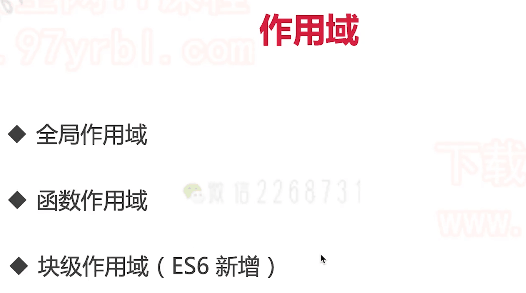

* 全局作用域

* 函数作用域

* 块级作用域

  ```js
  //ES6 块级作用域
  if(true){
  	let x = 100;
  }
  console.log(x);//会报错
  ```


## 6-2 什么是闭包？闭包会用在哪里？


备注：两个打印的都是100

**总结：所有的自由变量的查找，是在函数定义的地方，向上级作用域查找！！！不是在执行的地方！！！！**

## 6-3 this 有几种赋值情况


**总结：this取什么值，是在函数执行的时候确定的！！！不是在函数定义的时候确定的！！！**(适用以上五种场景)

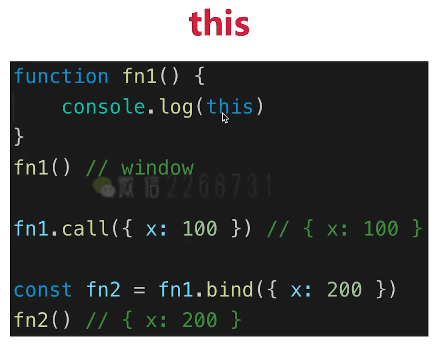

备注：这里适用call和bind改变了this指向，不同的是call会立刻执行，bind返回一个函数


注意：右边箭头函数里的this取值取得是箭头函数的值


注意：this指的是当前创建的这个实例

## 6-4 作用域相关的面试题 

### • this的不同应用场景，如何取值

* 当作普通函数被调用
* 适用call apply bind
* 作为对象方法调用
* 在class的方法中调用
* 箭头函数

### • 手写bind函数

先举个例子演示一下bind如何使用？

```js
function fn1(a,b,c){
  console.log('this',this);
  console.log(a,b,c);
  return 'this is fn1'
}

const fn2 = fn1.bind({x:100},10,20,30)
const res = fn2();
console.log(res);
//this {x:100}
//10 20 30
// this is fn1
```


由上图可以看到bind是function的原型里的方法

自己如何写一个bind？


备注：

* 以上为我们模拟bind编写的函数

* aguments是个列表，但不是个数组，所以要用`Array.prototype.slice.call(arguments)`将其变为数组（这是一个很常用的方式）
* `shift()`获取数组中第一个元素
* `const self=this`是fn1.bind(...)中的fn1

### • 实际开发中闭包的应用场景，举例说明

> 写在前面:
>
> **闭包**是指有权访问另一个函数作用域中的变量的函数。**创建闭包**的常见方式，就是在一个函数内部创建另外一个函数
>
> 出自《js高程》


```js
//闭包隐藏数据，只提供API
function createCache(){
  const data = {} //闭包中的数据，被隐藏，不被外界访问
  return {
    set:function(key,val){
      data[key] = val;
    },
    get:function(key){
      return data[key]
    }
  }
}

const c = createCache();
c.set('a',100);
console.log(c.get('a'));
```

### • 创建10个`<a>`,点击弹出序号


备注：

* 如果i在for外声明。即 let a ,i（全全局作用域），点击任何一个i都弹出10,因为当点击后执行alert的时候，i早都循环完了，都为10
* let i放到for循环里面，每次for循环执行的时候，都会形成一个新的块，alert(i)的i就在该块级作用域里面寻找

**小结**

* 作用域和自由变量
* 闭包：两种常见方式 & 自由变量查找规则
* this

# 第7章 JS基础-异步

本章介绍异步的知识点和题目。包括异步和同步的区别，异步应用场景，以及 Promise 。异步是“JS 三座大山”之三，所有公司的 JS 面试，100% 会考察异步和 Promise 。

**知识点**

* 单线程和异步
* 应用场景
* callback hell 和 Promise

## 7-1 同步和异步有何不同

**单线程和异步**

* JS是单线程语言，只能同时做一件事儿
* 浏览器和nodejs已支持JS启动**进程**，如Web Worker
* JS和DOM渲染共用同一个线程，因为JS可修改DOM结构
* 遇到等到（网络请求，定时任务）不能卡住，所以需要异步
* 异步基于回调callback函数形式


**异步和同步**

* 基于JS是单线程语言
* 异步不会阻塞代码执行
* 同步会阻塞代码执行

## 7-2 异步的应用场景有哪些

**应用场景**

* 网络请求，如ajax图片加载
* 定时任务，如setTimeout


## 7-3 promise的基本使用

【备注;】：多层嵌套可能造成回调地狱，promise是异步编程的一种解决方案，可以使用then，catch来进行异步调用


**使用Promise异步请求数据示例**


## 7-4 JS 异步相关的面试题

### • 同步和异步的区别是什么？

* 基于JS是单线程语言
* 异步不会阻塞代码执行
* 同步会阻塞代码执行

### • 手写用Promise加载一张图片

```js
function loadImg(src) {
    const p = new Promise(
        (resolve, reject) => {
            const img = document.createElement('img')
            img.onload = () => {
                resolve(img)
            }
            img.onerror = () => {
                const err = new Error(`图片加载失败 ${src}`)
                reject(err)
            }
            img.src = src
        }
    )
    return p
}
```

测试例子：

```js
// const url = 'https://img.mukewang.com/5a9fc8070001a82402060220-140-140.jpg'
// loadImg(url).then(img => {
//     console.log(img.width)
//     return img
// }).then(img => {
//     console.log(img.height)
// }).catch(ex => console.error(ex))

const url1 = 'https://img.mukewang.com/5a9fc8070001a82402060220-140-140.jpg'
const url2 = 'https://img3.mukewang.com/5a9fc8070001a82402060220-100-100.jpg'

loadImg(url1).then(img1 => {
    console.log(img1.width)
    return img1 // 普通对象
}).then(img1 => {
    console.log(img1.height)
    return loadImg(url2) // promise 实例
}).then(img2 => {
    console.log(img2.width)
    return img2
}).then(img2 => {
    console.log(img2.height)
}).catch(ex => console.error(ex))

```

### • 前端使用异步的场景有哪些

* **网络请求**，如ajax请求
* **定时任务**，如setTimeout

### • setTimeout输出的问题


答案：1 3 5 4(立刻打印) 2(1s后才打印)

**小结**

- 单线程和异步，异步和同步区别
- 前端异步的应用场景：网络请求 & 定时任务
- Promise 解决 callback hell

## 7-5 JS基础部分的考点总结

**内容**

* 变量的类型和计算
* 原型和原型链
* 作用域和闭包
* 异步和单线程

# 第8章 JS 异步进阶

JS 的特色就是异步编程，所有有很多关于异步的考点，本章都会讲解。如 event loop、promise、async-await、微任务和宏任务。学不会这些，就不算是精通 JS ，也无法进大厂。

## 8-1 本章考点介绍

**JS异步 - 进阶**

* 之前讲解JS异步，在于初阶的应用
* 本章在于JS异步的原理和进阶

**本章主要内容**

* event loop
* promise进阶
* async/await
* 微任务/宏任务

## 8-2 看几个异步的面试题


## 8-3 什么是event loop

**event loop（事件循环/事件轮询）**

* JS是单线程运行的
* 异步是基于回调来实现
* event loop就是异步回调的实现原理

**JS如何执行？**

* 从前到后，一行一行执行
* 如果某一行执行报错，则停止下面代码的执行
* 先把同步代码执行完，再执行异步

**示例：**

```js
console.log('Hi');

setTimeout(function cb1(){
  console.log('cb1');//cb 即callback
},5000)

console.log('bye');
//打印出：Hi bye cb1
```

**开始讲解event loop过程**

* 难理解
* 尽量深入浅出
* 不要扣细节，不要扩大范围，核心是event loop的过程

## 8-4 event loop 的执行过程

**再看一遍示例**

```js
console.log('Hi');

setTimeout(function cb1(){
  console.log('cb1');//cb 即callback
},5000)

console.log('bye');
//打印出：Hi bye cb1
```


**总结event loop过程**

* 同步代码，一行一行放在Call Stack执行
* 遇到异步，会先“记录”下，等待时机（定时，网络请求等）
* 时机到了，就移动到Callback Queue
* 如 Call Stack为空（即同步代码执行完）Event Loop开始工作
* 轮询查找Callback Queue，如有则移动到Call Stack执行
* 然后继续轮询查找（永动机一样）

## 8-5 DOM事件和event loop的关系


**DOM事件和event loop**

* JS是单线程的
* 异步（setTimeout，ajax等）使用回调，基于event loop
* DOM事件也使用回调，基于event loop

## 8-6 Promise有哪三种状态

### • Promise 哪几种状态，如何变化？

**Promise进阶**

*  三种状态
* 状态的表现和变化
* then和catch对状态的影响

**三种状态**

* pending resolved rejected
* pending --> resolved 或 pending -->rejected
* 变化不可逆

**代码演示 - 状态变化**


**状态的表现**

* pending状态，不会触发then和catch
* resolved状态，会触发后续的then回调函数
* rejected状态，会触发后续的catch回调函数

**代码演示 - 状态表现**

```js
const p1 = Promise.resolve(100); //resolved
//console.log('p1',p1);
p1.then(data => {
  console.log('data1',data);
}).catch(err =>{
  console.log('err1',err);
})

const p2 = Promise.reject('err') //rejected
//console.log('p2',p2);
p2.then(data => {
  console.log('data2',data);
}).catch(err =>{
  console.log('err2',err);
})
```

打印：

```
data1 100
err2 err
```

## 8-7 Promise的then和catch如何影响状态的变化

**then和catch改变状态**

* then 正常返回resolved，里面有报错则返回rejected
* catch正常返回resolved，里面有报错则返回rejected

**代码：then影响Promise状态**

```js
const p1 = Promise.resolve().then(()=>{
  return 100
})
//console.log('p1',p1);//resolved 会触发后续then回调
p1.then(()=>{
  console.log('123');
})


const p2 = Promise.resolve().then(()=>{
  throw new Error('then error')
})
//console.log('p2',p2);//rejected 会触发后续catch回调
p2.then(()=>{
  console.log('456');
}).catch(err =>{
  console.log('err100',err);
})
```

打印

```
123
err100 Error:then error
```

**代码2：catch影响Promise状态**

```js
const p3 = Promise.reject('my err').catch(err =>{
  console.log(err);
})
//console.log('p3',p3);//注意 是resolved！触发then回调！
p3.then(()=>{
  console.log(100);
})

const p4 = Promise.reject('my err').catch(err =>{
  throw new Error('catch console.error();')
})
//console.log('p4',p4);//是rejected状态的Promise ！触发catch回调
p4.then(()=>{
  console.log(200);
}).catch(()=>{
  console.log('some error');
}) 

```

打印

```
my err
100
some error
```

## 8-8 Promise关于then和catch的面试题

### • 场景题：Promise的then和catch的连接


```js
// 第一题
Promise.resolve().then(() => {
    console.log(1)
}).catch(() => {
    console.log(2)
}).then(() => {
    console.log(3)
})
// 1 3
```

```js
// 第二题
Promise.resolve().then(() => {
    console.log(1)
    throw new Error('erro1')
}).catch(() => {
    console.log(2)
}).then(() => {
    console.log(3)
})
// 1 2 3
```

```js
// 第三题
Promise.resolve().then(() => {
    console.log(1)
    throw new Error('erro1')
}).catch(() => {
    console.log(2)
}).catch(() => { // 注意这里是 catch
    console.log(3)
})
// 1 2
```

**Promise总结**

* 三种状态，状态的变现和变化
* then和catch对状态的影响（重要）
* then和catch的链式调用（常考）

## 8-9 async-await语法介绍

**async/await**

* 异步回调 callback hell
* Promise then catch链式调用，但也是基于回调函数
* **async/await是同步语法，彻底消灭了回调函数**（备注：**async/await用同步的方式来编写异步代码**，不用再写回调函数）

代码演示

```js
function loadImg(src) {
    const promise = new Promise((resolve, reject) => {
        const img = document.createElement('img')
        img.onload = () => {
            resolve(img)
        }
        img.onerror = () => {
            reject(new Error(`图片加载失败 ${src}`))
        }
        img.src = src
    })
    return promise
}

async function loadImg1() {
    const src1 = 'http://www.imooc.com/static/img/index/logo_new.png'
    const img1 = await loadImg(src1)
    return img1
}

async function loadImg2() {
    const src2 = 'https://avatars3.githubusercontent.com/u/9583120'
    const img2 = await loadImg(src2)
    return img2
}

(async function () {
    // 注意：await 必须放在 async 函数中，否则会报错
    try {
        // 加载第一张图片
        const img1 = await loadImg1()
        console.log(img1)
        // 加载第二张图片
        const img2 = await loadImg2()
        console.log(img2)
    } catch (ex) {
        console.error(ex)
    }
})()
```

## 8-10 async-await和Promise有什么关系

 **async-await和Promise有什么关系**

* async/wait是消灭异步回调的终极武器
* async/wait但和Promise并不互斥
* 反而，async/wait和Promise两者相辅相成


**代码演示**

* async 函数返回结果都是 Promise 对象（如果函数内没返回 Promise ，则自动封装一下）

  ```js
  async function fn1(){
    return 100;
    //return Promise.resolve(200)
  }
  
  const res1 = fn1();//执行async函数，返回的是一个Promise对象
  console.log('res1',res1);//Promise对象
  
  res1.then(data => {
    console.log('data',data);//100
  })
  ```

  

* await 后面跟 Promise 对象：会阻断后续代码，等待状态变为 resolved ，才获取结果并继续执行

  await 后续跟非 Promise 对象：会直接返回

  ```js
  (async function(){
    const p1 = Promise.resolve(300)
    const data = await p1;//await 相当于 Promise then
    console.log('data',data);//打印：data 300
  })();
  
  (async function(){
    const data1 = await 400;//await 后面不是promise，也会自动封装；相当于 await Promise.resolve(400)
    console.log('data1',data1);//打印：data1 400
  })();
  
  
  async function fn1(){
    return 200;
  }
  (async function(){
    const data2 = await fn1();
    console.log('data2',data2);//打印：data2 200
  })();
  ```

  【注意】一个小的点

  ```js
  !(async function(){
    const p4 = Promise.reject('err4');//rejected状态
    const res = await p4;//会报错，await相当于then，但这里是rejected状态，所以不会去执行
    console.log(res);
  })();
  ```

* try...catch捕获rejected状态

  ```js
  !(async function(){
    const p4 = Promise.reject('err4');//rejected状态
    try{
      const res = await p4;
      console.log(res);
    }catch(ex){
      console.log(ex);//try..catch相当于promise catch
    }
  })();
  
  //打印：err4
  ```

>  总结来看
>
> * async 封装 Promise
> * await 处理 Promise 成功
> * try...catch 处理 Promise 失败

## 8-11 async-await是语法糖，异步的本质还是回调函数

**异步的本质**

* async/await是消灭异步回调的终极武器
* JS还是单线程，还得是有异步，还得是基于event loop
* async/await只是一个语法糖，但这颗糖真香！

> await是同步写法，但本质还是异步调用

**代码演示1**

```js
async function async1 () {
  console.log('async1 start')//2 
  await async2() 
  //await的后面，都可以看作是callback里的内容，即异步
    //类似event loop setTimeout(cb1)
  console.log('async1 end') // 关键在这一步，它相当于放在 callback 中，最后执行
}

async function async2 () {
  console.log('async2')//3
}

console.log('script start')//1
async1()
console.log('script end')//4
//同步代码已经执行完(event loop)
```

> 即，只要遇到了`await`，后面的代码都相当于放在callback里

打印顺序：

1. script start
2. async1 start
3.  async2
4. script end
5. async1 end

**代码演示2**

```js
async function async1 () {
  console.log('async1 start')//2
  await async2() 
  
  //下面三行都是异步回调 callback的内容
  console.log('async1 end') //5
  await async3();

    //下面一行是异步回调的内容
    console.log('async1 end 2');//7
}

async function async2 () {
  console.log('async2')//3
}

async function async3 () {
  console.log('async3') //6
}

console.log('script start')//1
async1()
console.log('script end')//4
//同步代码执行完 event loop
```

输出：

1. script start
2. async1 start
3. async2
4. script end
5. async1 end
6. async3
7. async1 end 2

## 8-12 for-of的应用场景

**for...of**

* `for...in`（以及`forEach for`）是常规的同步遍历
* `for...of`常用于**异步的遍历**

**代码演示**

```js
function muti(num){
  return new Promise(resolve => {
    setTimeout(()=>{
      resolve(num*num)
    },1000)
  })
}

const nums = [1,2,3]

//同步遍历
// nums.forEach(async (i)=>{
//   const res = await muti(i);
//   console.log(res);
// })
// //1s后同时打印出1 4 9 

//异步遍历
!(async function(){
  for(let i of nums){
    const res = await muti(i);
    console.log(res);
  }
})();
//每隔1s 依次打印出1 4 9
//（先执行第一个，第一个有结果后再执行第二个。。。。（依次执行））
```

**async/await总结**

* async/await解决了异步回调，是一个很香的语法糖
* async/await和Promise的关系，重要！！！
* for...of的使用

## 8-13 什么是宏任务和微任务

**宏任务 `macroTask` 和微任务 `microTask`**

* 什么是宏任务，什么是微任务
* event loop 和DOM渲染
* 微任务和宏任务的区别

**代码**

```js
console.log(100)
setTimeout(() => {
    console.log(200)
})
Promise.resolve().then(() => {
    console.log(300)
})
console.log(400)
// 100 400 300 200
```

### • 宏任务和微任务的区别


【备注】以上宏任务和微任务其实就是前端所有的异步的情况

## 8-14 event-loop和DOM渲染的关系

**event loop和DOM渲染**

* 再次复习一边event loop的过程
* JS是单线程的，而且和DOM渲染共用一个线程
* JS执行的时候，得留一些时机供DOM渲染


**回顾event loop过程（增加DOM渲染时机）**


## 8-15 为什么微任务比宏任务执行更早

**event loop和DOM渲染**

* 每次Call Stack清空（即每次轮询结束），即同步任务执行完
* 都是DOM重新渲染的机会，DOM结构如有改变则重新渲染
* 然后再去触发下一次Event Loop

**代码演示**

```js
const $p1 = $('<p>一段文字</p>')
const $p2 = $('<p>一段文字</p>')
const $p3 = $('<p>一段文字</p>')
$('#container')
            .append($p1)
            .append($p2)
            .append($p3)

console.log('length',  $('#container').children().length )
alert('本次 call stack 结束，DOM 结构已更新，但尚未触发渲染')
//(alert会阻断js执行，也会阻断DOM渲染，便于查看效果)
```


点击“确定”之后


**微任务和宏任务的区别**

* **宏任务：**DOM渲染**后**触发，如setTimeout
* **微任务：**DOM渲染**前**触发，如Promise
* 下面先演示现象，稍后追究原理

**代码演示**

```js
// 修改 DOM
const $p1 = $('<p>一段文字</p>')
const $p2 = $('<p>一段文字</p>')
const $p3 = $('<p>一段文字</p>')
$('#container')
    .append($p1)
    .append($p2)
    .append($p3)

// 微任务：渲染之前执行（DOM 结构已更新）
 Promise.resolve().then(() => {
     const length = $('#container').children().length
     alert(`micro task ${length}`)
})

// 宏任务：渲染之后执行（DOM 结构已更新）
setTimeout(() => {
    const length = $('#container').children().length
    alert(`macro task ${length}`)
})
```


点击确定后


## 8-16 微任务和宏任务的根本区别

**从event loop解释，为何微任务执行更早？**


可以看到setTimeout的执行是在DOM之后

如果是遇到Promise，会等待时机放到 micro task queue


**为什么有这样的区别？**

* **微任务**是**ES6**语法规定的
* **宏任务**是由**浏览器**规定的

所以，callStack清空后，先执行微任务，在尝试DOM渲染，再触发event loop(执行宏任务)


**微任务和宏任务 - 总结**

* 宏任务有哪些？微任务有哪些？微任务触发时机更早
* 微任务，宏任务和DOM渲染的关系
* 微任务，宏任务和DOM渲染，在event loop的过程

## 8-17 解答JS异步的面试题

### • 描述 event loop 运行机制（可画图）

* 自行回顾event loop的过程
* 和DOM渲染的关系
* 微任务和宏任务在event loop过程中的不同处理

### • 场景题：async/await语法


打印：

```
a 是个promise
b 是100

start
100
200
error //c reject会直接报错
```

 • 场景题：各类异步执行顺序问题


```js
async function async1(){
  console.log('async1 start');//2
  await async2();

  //await后面的都作为回调内容 —— 微任务
  console.log('async1 end');//6
}

async function async2(){
  console.log('async2');//3
}

console.log('script start');//1 

setTimeout(function(){ //宏任务 setTimeout
  console.log('setTimeout');//8
},0)

async1() 

//初始化Promise时，传入的函数会立刻被执行
new Promise (function(resolve){
  console.log('Promise1');//4 
  resolve()
}).then(function(){ //then是异步 —— 微任务
  console.log('Promise2');//7
})

console.log('script emd');//5

```

打印出：

```
script start
async1 start
async2
Promise1
script emd
async1 end
Promise2
setTimeout
```

【解释】

* 第5步之后 同步代码执行完毕(event loop里的call stack被清空)。
* 接下来执行微任务，按照顺序来说，微任务先执行async1 end，再执行promise2
* 执行微任务之后尝试触发DOM渲染（本例子没有DOM渲染）
* 然后触发event loop，执行宏任务，即setTimeout

## 8-18 本章考点总结

**JS异步进阶 - 总结**

* event loop
* promise进阶
* async/await
* 微任务/宏任务

**event loop过程**

* 同步代码，一行一行放在Call Stack执行
* 遇到异步，会先“记录”下，等待时机（定时，网络请求等）
* 时机到了，就移动到Callback Queue
* 如 Call Stack为空（即同步代码执行完）Event Loop开始工作
* 轮询查找Callback Queue，如有则移动到Call Stack执行
* 然后继续轮询查找（永动机一样）

**DOM事件和event loop**

* JS是单线程的
* 异步（setTimeout，ajax等）使用回调，基于event loop
* DOM事件也使用回调，基于event loop

**Promise进阶**

*  三种状态
* 状态的表现和变化
* then和catch对状态的影响

**async/await总结**

* async/await解决了异步回调，是一个很香的语法糖
* async/await和Promise的关系，重要！！！
* for...of的使用

**微任务和宏任务 - 总结**

* 宏任务有哪些？微任务有哪些？微任务触发时机更早
* 微任务，宏任务和DOM渲染的关系
* 微任务，宏任务和DOM渲染，在event loop的过程

# 第9章 JS-Web-API-DOM

本章介绍 DOM 操作的知识点和题目。包括 DOM 结构，常用 DOM 操作，DOM 性能优化等。DOM 是网页结构的基础，学会 DOM 操作才可以做网页开发。

## 9-1 从JS基础到JS-Web-API

**从JS基础到JS-Web-API**

* JS基础语法，规定语法（ECMA 262标准）
* JS Web API，网页操作的API（w3c标准）
* 前者是后者的基础，两者结合才能真正实际应用

**JS Web API有哪些内容?**

* DOM
* BOM
* 事件绑定
* ajax
* 存储

## 9-2 DOM的本质是什么

**前言**

* vue和React框架应用广泛，封装了DOM(Document object Model)操作
* 但DOM操作一直都会是前端工程师的基础，必备知识
* 只会vue而不懂DOM操作的前端程序员，不会长久

**知识点**

* DOM本质
* DOM节点操作
* DOM结构操作
* DOM性能

**DOM本质**


> DOM的本质是从HTML文件解析出来的一棵树


## 9-3 DOM节点操作

**DOM节点操作**

* 获取DOM节点
* attribute
* property

**获取DOM节点**


```html
 <body>
        <div id="div1" class="container">
            <p id="p1">一段文字 1</p>
            <p>一段文字 2</p>
            <p>一段文字 3</p>
        </div>
        <div id="div2" class="container">
            
        </div>
    </body>
```

```js
//通过id  getElementById
console.log("通过id ");
const div1 = document.getElementById('div1')
console.log('div1', div1)

//通过标签名 getElementsByTagName(集合)
console.log("通过标签名");
const divList = document.getElementsByTagName('div') // 集合
console.log('divList.length', divList.length)
console.log('divList[1]', divList[1])

//通过类名 getElementsByClassName(集合)
console.log("通过类名");
const containerList = document.getElementsByClassName('container') // 集合
console.log('containerList.length', containerList.length)
console.log('containerList[1]', containerList[1])

//通过css选择器 querySelectorAll(集合)
console.log("通过css选择器");
const pList = document.querySelectorAll('p')
console.log('pList', pList)
```


**DOM节点的property**


```html
<head>
        <style>
            .container {
                border: 1px solid #ccc;
            }
            .red {
                color: red;
            }
        </style>
    </head>
    <body>
        <div id="div1" class="container">
            <p id="p1">一段文字 1</p>
            <p>一段文字 2</p>
            <p>一段文字 3</p>
        </div>
    </body>
```

```js
// property 形式
//可以设置属性
p1.style.width = '100px'
//获取属性
console.log( p1.style.width ) //100px
p1.className = 'red'
console.log( p1.className ) //red
console.log(p1.nodeName) //p
console.log(p1.nodeType) // 1
```


> property这种形式是通过修改或获取js的属性的方式来改变CSS样式/页面渲染结构

**DOM节点的attribute**


```js
const pList = document.querySelectorAll('p')
const p1 = pList[0]

// attribute
p1.setAttribute('data-name', 'imooc')
console.log( p1.getAttribute('data-name') )
p1.setAttribute('style', 'font-size: 50px;')
console.log( p1.getAttribute('style') )
```


> attribute通过`getAttribute`和`setAttribute`的形式来修改HTML结构

> 总结：
>
> **property和attribute**
>
> * property：修改对象属性，不会体现到HTML机构中
> * attribute：修改html属性，会改变html结构
> * 两者都有可能引起DOM重新渲染

## 9-4 DOM结构操作

**DOM结构操作**

* 新增/插入节点
* 获取子元素列表，获取父元素
* 删除子元素

**新增/插入节点**


```html
<body>
        <div id="div1" class="container">
            <p id="p1">一段文字 1</p>
            <p>一段文字 2</p>
            <p>一段文字 3</p>
        </div>
        <div id="div2" class="container">
            
        </div>   
  </body>
```

```js
const div1 = document.getElementById('div1')
const div2 = document.getElementById('div2')
// 新建节点
const newP = document.createElement('p')
newP.innerHTML = 'this is newP'
// 插入节点
div1.appendChild(newP)

// 移动节点
const p1 = document.getElementById('p1')
div2.appendChild(p1)
```


**获取子元素列表，获取父元素**


```js
const div1 = document.getElementById('div1')
const div2 = document.getElementById('div2')

// 获取父元素
console.log( p1.parentNode )

// 获取子元素列表
const div1ChildNodes = div1.childNodes
console.log( div1.childNodes);//注意这里在p中间有text
const div1ChildNodesP = Array.prototype.slice.call(div1.childNodes).filter(child => {
    if (child.nodeType === 1) {
        return true
    }
    return false
})
console.log('div1ChildNodesP', div1ChildNodesP)
```

备注：

* 使用`Array.prototype.slice.call(div1.childNodes)`将其变为数组
* 使用`filter`排除掉那些text	


**删除节点**


```js
div1.removeChild( div1ChildNodesP[0] )
```

## 9-5 如何优化 DOM 操作的性能

**DOM性能**

* DOM操作非常“昂贵”，所以要避免频繁的DOM操作
* 可以对DOM查询做缓存
* 将频繁操作改为一次性操作


```html
    <body>
        <ul id="list">
        </ul>
        <script src="./dom-3.js"></script>
    </body>
```

```js
const list = document.getElementById('list')

// 创建一个文档片段，此时还没有插入到 DOM 结构中
const frag = document.createDocumentFragment()

for (let i  = 0; i < 20; i++) {
    const li = document.createElement('li')
    li.innerHTML = `List item ${i}`

    // 先插入文档片段中
    frag.appendChild(li)
}

// 都完成之后，再统一插入到 DOM 结构中
list.appendChild(frag)

console.log(list)
```

## 9-6 DOM 操作相关的面试题

### • DOM是哪种数据结构

* 树（DOM树）


### • DOM操作常用API

| API             |                                                             |            |
| --------------- | ----------------------------------------------------------- | ---------- |
| **DOM节点操作** |                                                             |            |
| 1. 获取DOM元素  | `getElementById`                                            | 获取单元素 |
|                 | `getElementsByTagName`                                      | 获取集合   |
|                 | `getElementsByClassName`                                    | 获取集合   |
|                 | `querySelectorAll`                                          | 获取集合   |
| 2 property      | `p.style.width = 100`                                       | 修改样式   |
|                 | `p.className = 'p1'`                                        | 修改class  |
|                 | `p.nodeName`                                                |            |
|                 | `p.nodeType`                                                | 1          |
| 3. attribute    | `p.getAttribute('style')`                                   |            |
|                 | `p.setAttribute('data-name','imooc)`                        |            |
| **DOM结构操作** |                                                             |            |
| 1.新增/插入节点 | `docuemnt.createElement('p')`                               |            |
|                 | `div1.appendChild(p1)`                                      |            |
| 2 获取父元素    | `div1.parentNode`                                           |            |
| 3 获取子元素    | `div1.childodes`                                            |            |
| 4 删除节点      | `const child  = div1.childNodes;div1.removeChild(child[0])` |            |

### • attr和property的区别

* property：修改对象属性，不会体现到HTML机构中
* attribute：修改html属性，会改变html结构
* 两者都有可能引起DOM重新渲染
* 尽量使用property

### • 一次性插入多个DOM节点，考虑性能

* 通过fragment来做
* 考虑DOM节点的缓存

# 第10章 JS-Web-API-BOM

## 10-1 BOM 操作相关的面试题

**知识点**

* navigator
* screen
* location
* history


### •  如何识别浏览器的类型

```js
const ua = navigator.userAgent
const isChrome = ua.indexOf('Chorme')
console.log(isChorme)
```

### •  分析拆解url各个部分

```js
//例子 https://coding.imooc.com/class/evaluation/415.html?user=abc#Anchor
location.href
"https://coding.imooc.com/class/evaluation/415.html?user=abc#Anchor"
location.protocol
"https:"
location.pathname
"/class/evaluation/415.html"
location.search
"?user=abc"
location.hash
"#Anchor
```

**补充一个编程题：获取url参数**

获取 url 中的参数

1. 指定参数名称，返回该参数的值 或者 空字符串
2. 不指定参数名称，返回全部的参数对象 或者 {}
3. 如果存在多个同名参数，则返回数组

输入

```
http://www.nowcoder.com?key=1&key=2&key=3&test=4#hehe key
```

输出

```
[1, 2, 3]
```

答案1 使用正则

```js
function getUrlParam(sUrl,sKey){
	var result = {};
	sUrl.replace(/\??(\w+)=(\w+)&?/g,function(a,k,v){
		if(result[k] !== void 0){
			var t = result[k];
			result[k] = [].concat(t,v);
		}else{
			result[k] = v;
		}
	});
	if(sKey === void 0){
		return result;
	}else{
		return result[sKey] || '';
	}
}

var res = getUrlParam("http://www.nowcoder.com?key=1&key=2&key=3&test=4#hehe","key");
console.log(res);
```

1. replace()的第一个参数是一个正则表达式，第二个参数是一个回调函数，每匹配到一个符合正则表达式的结果就回调一次。参数a代表该次匹配到的字符串，k代表该次匹配到的字符串中符合第一个分组的部分，v代表该次匹配到的字符串中符合第二个分组的部分
2. 当concat()的参数是具体的值时，意味着将参数连接到调用concat()方法的数组上。result原本是一个空的对象，当回调函数第一次执行时，向该对象添加了一个key-value对，但此时的value是一个字符串"1"。因此，在回调函数第二次执行时，要向一个空数组添加字符串"1"和"2"，这也是为什么要用[].concat(k,v)。
3. 正则表达式的开头的\?是不能省略的，否则.com?key=1匹配不到。

# 第11章 JS-Web-API-事件

本章介绍事件绑定的知识点和题目。包括事件绑定，事件冒泡机制，事件代理。事件能让网页和鼠标、键盘进行交互，初级 JS 面试必考。

## 11-1 事件绑定和事件冒泡

**事件绑定**


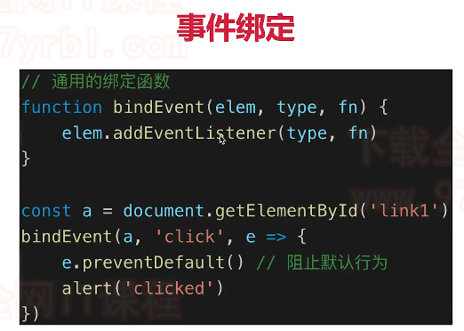

代码演示：

```html
<body>
        <button id="btn1">一个按钮</button>
        <script src="./event.js"></script>
    </body>
```

```js
//通用的事件绑定函数
function bindEvent(elem,type,fn){
  elem.addEventListener(type,fn)
}

const btn1 = document.getElementById('btn1')
bindEvent(btn1,'click',event =>{
  //console.log(event.target);//获取触发的元素：<button id="btn1">一个按钮</button> 
  event.preventDefault();//阻止默认行为
  alert('clicked')
})
```

**事件冒泡**


会先打印 激活，再打印 取消

## 11-2 什么是事件代理


```html
<body>
        <div id="div3">
            <a href="#">a1</a><br>
            <a href="#">a2</a><br>
            <a href="#">a3</a><br>
            <a href="#">a4</a><br>
        </div>
        <script src="./event.js"></script>
    </body>
```

```js
function bindEvent(elem,type,fn){
  elem.addEventListener(type,fn)
}

// 代理绑定（只在父元素上挂载事件，适用于瀑布流，结构复杂不适合每一个都绑定的情况下）
const div3 = document.getElementById('div3')
bindEvent(div3, 'click', event => {
  event.preventDefault()
  const target = event.target;
  if(target.nodeName === 'A'){
    alert(target.innerHTML)
  }
})
```

**事件代理**

* 代码简介
* 减少浏览器内存占用
* 但是，不要滥用


## 11-3 DOM 事件相关的面试题

### • 编写一个通用的事件监听函数

**通用的事件绑定函数**

包含普通绑定和代理绑定

```js
//通用的事件绑定函数
function bindEvent(elem,type,selector,fn){
  if(fn == null){//传了三个函数
    fn = selector;
    selector = null;
  }
  elem.addEventListener(type,event=>{
    const target = event.target;
    if(selector){
      //代理绑定
      if(target.matches(selector)){
        fn.call(target,event)
      }
    }else{
      //普通绑定
      fn.call(target,event)
    }
  })
}
```

备注：如果元素被指定的选择器字符串选择，**`Element.matches()`** 方法返回true; 否则返回false。https://developer.mozilla.org/zh-CN/docs/Web/API/Element/matches

测试

```html
<body>
        <button id="btn1">一个按钮</button>

        <div id="div3">
            <a href="#">a1</a><br>
            <a href="#">a2</a><br>
            <a href="#">a3</a><br>
            <a href="#">a4</a><br>
            <button>加载更多...</button>
        </div>
        <script src="./event.js"></script>
    </body>
```

```js
// 普通绑定
const btn1 = document.getElementById('btn1')
bindEvent(btn1, 'click', function(event) {
  event.preventDefault()//这里不能用this是因为this必须是当前触发的元素(注意不能使用箭头函数！！那样this指的是上层作用域即window)
  alert(this.innerHTML)
})

// 代理绑定
const div3 = document.getElementById('div3')
bindEvent(div3, 'click', 'a', function(event) {
  event.preventDefault()
  alert(this.innerHTML)//this必须是当前触发的元素
})
```


### • 描述事件冒泡的流程

* 基于DOM树形结构
* 事件会顺着触发元素向上冒泡
* 应用场景：代理

### • 下拉的图片列表，如何监听每个图片的点击？

* 事件代理
* 用`e.target`获取触发元素
* 用`matches`来判断是否是触发元素

# 第12章 JS-Web-API-Ajax

本章介绍 ajax 相关的知识点和题目。包括 XMLHttpRequest ，同源策略，跨域方式，以及常用插件介绍。我们早就进入了动态网页时代，而当下的前后端分离开发方式，更加要求每个工程师必须熟练掌握 ajax 。

【备注】：

* 本章学习要使用MAMP开启服务
* 打开MAMP后，E:\softwareInstall\MAMP\htdocs是工作目录的默认路径
* 访问http://localhost/ajax-learn/ajax.html即可

**知识点**

* XMLHttpRequest

* 状态码

* 跨域：同源策略，跨域解决方案

  

  ## 12-1 ajax 的核心API -XMLHttpRequest

**Get请求**

```js
//get请求
const xhr = new XMLHttpRequest;
xhr.open('GET','./data/test.json',true)
xhr.onreadystatechange = function(){
  //这里的函数异步执行，可参考之前JS基础中的异步模块 true代表异步
  if(xhr.readyState === 4){
    if(xhr.status === 200){
      console.log(JSON.parse(xhr.responseText));
      alert(xhr.responseText)
    }else{
      console.log('其他出错情况');
    }
  }
}
xhr.send(null)
```

**Post请求**

```js
const xhr = new XMLHttpRequest;
xhr.open('POST','./login',true)
xhr.onreadystatechange = function(){
  if(xhr.readyState === 4){
    if(xhr.status === 200){
      alert(xhr.responseText)
    }else{
      console.log('其他出错情况');
    }
  }
}

const postData = {
  userName:'sxc',
  password:'123'
}
xhr.send(JSON.stringify(postData));//发送的是字符串注意
```


【备注】：301 永久重定向 302 临时重定向 304 资源未改变（服务器没有返回新的资源，浏览器用自己的缓存资源）

##  12-2 什么是浏览器的同源策略

**跨域**

* 什么是跨域（同源策略）
* JSONP
* CORS（服务端支持）

**同源策略**

* ajax请求时，浏览器要求当前网页和server必须同源（安全考虑）
* 同源：协议，域名，端口，三者必须一致
* 例如：前端：http://a.com:8080/ server:https://b.com/api/xx 这三个就完全不一样

**加载图片 css js可无视同源策略**

* ``
* `<link href=跨域的CSS地址>`
* `<script src=跨域的js地址></script>`
* ``可用于统计打点，可使用第三方统计服务
* `<link/><scirpt>`可使用CDN，CDN一般都是外域
* `<script>`可实现JSONP

**跨域**

* 所有的跨域，都必须经过server端允许和配合
* 未经server端允许就实现跨域，说明浏览器有漏洞，危险信息

## 12-3 实现跨域的常见方式 - jsonp 和 CORS

**JSONP**

* 访问`https://imooc.com`，服务端一定返回一个html文件吗？
* 答：服务器可以任意动态拼接数据返回，只要符号html格式要求
* 同理于`<script src="https://imooc.com/getData.js">`
* `<script>`可绕过跨域限制
* 服务器可以任意动态拼接数据返回
* 所以，`<script>`就可以获得跨域的数据，只要服务端愿意返回


## 12-4 ajax 相关的面试题 

### • 手写一个简易的ajax

**基础版本**


**更好的版本（封装成promise的形式）**

```js  
function ajax(url){
  const p = new Promise((resolve,reject)=>{
    const xhr = new XMLHttpRequest()
    xhr.open('GET',url,true)
    xhr.onreadystatechange = function(){
      if(xhr.readyState === 4){
        if(xhr.status === 200){
          resolve(
            JSON.parse(xhr.responseText)
          )
        }else if(xhr.status === 404){
          reject(new Error('404 not found'))
        }
      }
    }
    xhr.send(null)
  })
  return p
}

const url = './data/test.json';
ajax(url)
.then(res => console.log(res))
.catch(err => console.log(err))
```


### • 跨域的常用实现方式

* JSONP
* CROS


**知识点**

* XMLHttpRequest
* 状态码：readyState status
* 跨域：同源策略（如何绕过），JSONP，CORS

## 12-5 实际项目中 ajax 的常用插件

**1. JQuery**

```js
    $(function(){
        //请求参数
        var list = {};
        //
        $.ajax({
            //请求方式
            type : "POST",
            //请求的媒体类型
            contentType: "application/json;charset=UTF-8",
            //请求地址
            url : "http://127.0.0.1/admin/list/",
            //数据，json字符串
            data : JSON.stringify(list),
            //请求成功
            success : function(result) {
                console.log(result);
            },
            //请求失败，包含具体的错误信息
            error : function(e){
                console.log(e.status);
                console.log(e.responseText);
            }
        });
    });

```

**2. fetch**

https://developer.mozilla.org/zh-CN/docs/Web/API/Fetch_API/Using_Fetch

```js
fetch('http://example.com/movies.json')
  .then(function(response) {
    return response.json();
  })
  .then(function(myJson) {
    console.log(myJson);
  });
```

【注意】fetch只有当网络故障的时候才会进行reject

**3. axios**

对xhr的封装

http://axios-js.com/docs/

```js
const axios = require('axios');

// Make a request for a user with a given ID
axios.get('/user?ID=12345')
  .then(function (response) {
    // handle success
    console.log(response);
  })
  .catch(function (error) {
    // handle error
    console.log(error);
  })
  .then(function () {
    // always executed
  });

// Optionally the request above could also be done as
axios.get('/user', {
    params: {
      ID: 12345
    }
  })
  .then(function (response) {
    console.log(response);
  })
  .catch(function (error) {
    console.log(error);
  })
  .then(function () {
    // always executed
  });  

// Want to use async/await? Add the `async` keyword to your outer function/method.
async function getUser() {
  try {
    const response = await axios.get('/user?ID=12345');
    console.log(response);
  } catch (error) {
    console.error(error);
  }
}
```


# 第13章 JS-Web-API-存储

本章介绍存储的知识点和题目。包括 cookie、localStorage 和 sessionStorage 。本章内容虽然不多，但不可不会。

## 13-1 如何理解 cookie

**cookie**

* 本身用于浏览器和server通讯
* 被“借用”到本地存储来（h5出现之前一直使用）
* 可用`docuemnt.cookie='...'`来修改


**cookie的缺点**

* 存储大小，最大4KB
* http请求时需要发送到服务端，增加请求数据量
* 只能用`document.cookie='...'`来修改，太过简陋

## 13-2 localStorage SessionStorage 和 cookie

**localStorage和sessionSTorage**

* 是HTML5专门为存储而设计的，最大可存5M
* API简单易用，`setItem` `getItem`
* 不会随着http请求被发送出去


**localStorage和sessionSTorage的区别**

* `localStorage`数据会永久存储，除非代码或手动删除
* `sessionStorage`数据只存在于当前会话，浏览器关闭则清空
* 一般用`localStorage`会更多一些

## 13-3 存储面试题

### • 描述localStorage SessionStorage 和 cookie 的区别

* 容量
  1. cookie最大4k
  2. localStorage和sessionStorage最大5M
* API易用性
  1. cookie只能用`document.cookie='...'`来修改，太过简陋
  2. localStorage和SessionStorage使用setItem和getItem来修改
* 是否跟随http请求发送出去
  1. cookie跟随请求发出
  2. localstorage永久存储，sessionStorage只存在于当前会话

# 第14章 http 面试题

前端工程师做出网页，需要通过网络请求向后端获取数据，因此 http 协议是前端面试的必考内容。本章讲解 http 协议常考的知识点，如状态码、header、method、缓存等。特别是 http 缓存策略，非常重要。

## 14-1 http的几个面试题

**http面试题**

* 前端工程师不只开发界面
* 也需要调用后端的接口，提交/获取数据 —— http协议
* 要求实现掌握好ajax

## 14-2 http状态码

**http状态码**

* 状态码分类
* 常见状态码
* 关于协议和规范

### • http常见的状态码有哪些

**状态码分类**

| 状态码分类 |                |       |
| ---------- | -------------- | ----- |
| 1xx        | 服务器收到请求 |       |
| 2xx        | 请求成功       | 如200 |
| 3xx        | 重定向         | 如302 |
| 4xx        | 客户端错误     | 如404 |
| 5xx        | 服务端错误     | 如500 |

**常见状态码**

| 常见状态码 |              |                                                              |
| ---------- | ------------ | ------------------------------------------------------------ |
| 200        | 成功         |                                                              |
| 301        | 永久重定向   | 配合location，浏览器自动处理（eg 你的网站域名到期了，每次访问旧域名都要重新指向新的域名） |
| 302        | 临时重定向   | 配合location，浏览器自动处理（eg 浏览器访问一个地址，这个地址返回302，浏览器自动访问另一个地址（只是这次）） |
| 304        | 资源未被修改 | （eg 之前请求过资源，有有效缓存）                            |
| 404        | 资源未找到   |                                                              |
| 403        | 没有权限     |                                                              |
| 500        | 服务器错误   |                                                              |
| 504        | 网关超时     |                                                              |

**关于协议和规范**

* 就是一个约定
* 要求大家都跟着执行
* 不要违反规范，例如IE浏览器

## 14-4 Restful-API

**http methods**

* 先讲传统的methods
* 在讲现在的methods
* 最后讲一下Restful-API

**传统的methods**

* get获取服务器的数据
* post向服务器提交数据
* 简单的网页功能，就这两个操作

**现在的methods**

* get获取数据
* post新建数据
* patch/put更新数据
* delete删除数据

### • 什么是Restful-API

> **Restful API**
>
> * 一种新的API设计方法（早已推广使用）
> * 传统API设计：把每个url当作一个功能
> * Restful API设计：把每个url当作一个唯一的资源

> **如何设计成一个资源？**
>
> * 尽量不用url参数
> * 用method表示操作类型

1. 不使用url参数
   * 例如：传统的API设计：`/api/list?pageIndex=2 `
   * Restful API设计：`/api/list/2`
2. 用method表示操作类型
   * 传统API设计
     * post请求 `/api/create-blog`
     * post请求 `/api/update-blog?id=100`
     * get请求 `/api/get-blog?id=100`
   * Restful API设计
     * post请求 `/api/blog`
     * fetch请求 `/api/blog/100`
     * get请求 `/api/blog/100`

## 14-5 http header

### • http有哪些常见的header

**http headers**

* 常见的Request Headers
* 常见的Response Headers

> **Request Headers**
>
> * `Accept` 浏览器可接受的数据格式
> * `Accept-Encoding` 浏览器可接受的压缩算法，如gzip
> * `Accept-Language` 浏览器可接受的语言，如zh-CN 
> * `Connection:keep-alive` 一次TCP连接重复使用
> * `cookie`
> * `Host`
> * `User-Agent`（简称UA）浏览器信息
> * `Content-type` 发送数据的格式，如application/json
>
> **Response Headers**
>
> * `Content-type` 返回数据的格式，如application/json
> * `Content-length` 返回数据的大小，多少字节
> * `Content-Encoding`返回数据的压缩算法，如gzip
> * `set-cookie`

以www.baidu.com为例

Request Header


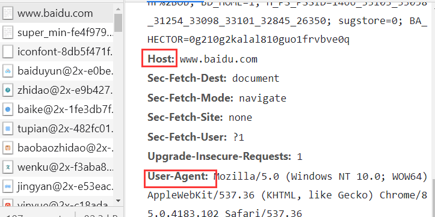

Response Header


**自定义header**


**缓存相关的headers**

* `Cache-Control` Expires
* `Last-Modified` IF-Modified-Since
* `Etag` If-None-Match

## 14-6 http为何需要缓存

**http缓存**

* 关于缓存的介绍
* http缓存策略（强制缓存+协商缓存）
* 刷新操作方式，对缓存的影响

**关于缓存**

* 什么是缓存？

  * 第一次访问完，第二次访问的时候不需要重新获取所有的资源，可以将一些资源暂存下来不用重新获取

* 为什么需要缓存？

  * 使得页面加载更快，网络请求很慢，通过缓存减少网络请求的数量和体积;
  * 网络请求是不稳定的，缓存可以优化用户请求数据的过程

* 哪些资源可以被缓存？

  * 静态资源(js css img)很容易被缓存（因为上线后不易修改）

  * webpack里根据文件内容生成了哈希值，一旦文件内容改变哈希值会改变，如下：

    

  * html和业务数据不应被缓存

## 14-7 http强制缓存

### • cache-control是什么意思

**http缓存 - 强制缓存**


* 如果服务端感觉这个资源可以被缓存，它就加一个Cache-Control
* 如果服务端感觉这个资源没法被缓存或者不适合被缓存，就不加

**Cache-Control**

* 服务端控制，是控制强制缓存的逻辑

* Cache-Control在Response Headers中

* 例如:`Cache-Control:max-age=315360 (单位是秒)`

* 

* 如果有cache-control的情况：

  

  

* 如果缓存失效的情况下：需要重新请求资源，以使得下一次请求可以直接从本地缓存返回资源

  

  

  **cache-control的值**

  * `max-age` 做缓存
  * `no-cache` 不用强制缓存，交给服务端处理（只是不用本地缓存）
  * `no-store` 不用本地缓存，而且不用服务端的一些缓存措施（ 彻底）（不常见)
  * `private`只能允许用户做缓存
  * `public`允许路由/中间代码做缓存

  **关于Expires**

  * 同为Response Headers中
  * 同为控制缓存过期
  * 已被Cache-Control代替

## 14-8 http协商缓存(对比缓存)

**http缓存 - 协商缓存**

* 服务器端缓存策略（ 注意：服务端判断这个资源能不能用缓存的内容，而不是资源缓存到服务端）
* 服务端判断客户端资源，是否和服务端资源一样
* 一致返回304，否则返回200和最新的资源


**资源标识**

* 在Response Headers中，有两种
* `Last-Modified`资源的最后修改时间
* `Etag`资源的唯一标识（一个字符串，类似人类的指纹）

### • Etag和Last-Modified是什么意思

`Last-Modified`资源的最后修改时间


`Etag`资源的唯一标识（根据资源内容来计算的一个字符唯一标识字符串）


**例子**


**Last-Modified和Etag共存**

* 会优先使用Etag
* 因为Lst-Modified只能精确到秒级
* 如果资源被重复生成，而内容不变，则Etag更精确

### • 描述一下http的缓存机制（重要）


## 14-9 刷新页面对http缓存的影响

**三种刷新操作**

* 正常操作：地址栏输入url，跳转链接，前进后退等
* 手动刷新：F5，点击刷新按钮，右击菜单刷新
* 强制刷新：ctrl+f5

**不同刷新操作，不同的缓存策略**

* 正常操作：强制缓存有效，协商缓存有效
* 手动刷新：强制缓存失效，协商缓存有效
* 强制刷新：强制缓存失效，协商缓存失效

> **小结**
>
> * 强制缓存 Cache-Control
> * 协商缓存 Last-Modified和Etag，304状态码
> * 完整的流程图

## 14-10 http考点总结

> **http面试题 - 总结**
>
> * http状态码
> * http method
> * Restful API
> * http headers
> * http缓存策略


# 第15章 开发环境

本章介绍开发环境相关的知识点和题目。包括 git ，调试工具，抓包工具，webpack 和 babel ，以及 linux 常用命令。熟练使用开发环境的各个工具，才能证明你真的做过前端开发，真的有项目经验，否则只能被认定为菜鸟小白。

-  15-1 前端开发常用的开发工具
-  15-2 什么是 git
-  15-3 git 的常用命令有哪些
-  15-4 git 常用命令演示
-  15-5 如何用 chrome 调试 js 代码
-  15-6 移动端 h5 如何抓包网络请求
-  15-7 如何配置 webpack
-  15-8 如何配置 babel
-  15-9 ES6 模块化规范是什么
-  15-10 如何配置 webpack 生产环境
-  15-11 前端用到的 linux 常用命令有哪些
-  15-12 开发环境的考点总结

- 

  ##### 第16章 运行环境【这些会了，你就可以飞了】

  本章介绍运行环境相关的知识点和题目。包括浏览器加载和渲染机制，性能优化，web 安全。网页在浏览器加载和运行，这些内容必须掌握，也是面试常考。

  -  16-1 JS 上线之后在什么哪里运行？
  -  16-2 网页是如何加载并渲染出来的
  -  16-3 网页加载和渲染的示例
  -  16-4 网页加载和渲染相关的面试题
  -  16-5 前端性能优化有哪些方式
  -  16-6 前端性能优化的示例
  -  16-7 手写防抖 debounce
  -  16-8 手写节流 throttle
  -  16-9 如何预防 xss 攻击
  -  16-10 如何预防 xsrf 攻击
  -  16-11 运行环境的考点总结

- 

  ##### 第17章 课程总结【很有必要带你避免面试犯低级错误】

  本章回顾所有题目和知识点，总结课程内容。还会介绍一些实用的面试技巧，避免你在面试中犯一些低级错误。

  -  17-1 课程总结~
  -  17-2 面试技巧

- 

  ##### 第18章 真题模拟【我是来告诉你答案是什么】

  本章节，通过一部分高频面试真题，带大家分析面试，以及如何解答。

  -  18-1 章节介绍
  -  18-2 题目讲解-1：何为变量提升？
  -  18-3 题目讲解-2：手写深度比较 isEqual
  -  18-4 题目讲解-3：你是否真的会用数组 map
  -  18-5 题目讲解-4：再学闭包
  -  18-6 面试讲解-5：回顾 DOM 操作和优化
  -  18-7 面试讲解-6：jsonp 本质是 ajax 吗
  -  18-8 面试讲解-7：是否用过 Object.create()
  -  18-9 面试讲解-8：常见的正则表达式
  -  18-10 面试讲解-9：如何获取最大值
  -  18-11 面试讲解-10：解析 url 参数
  -  18-12 面试讲解-11：数组去重有几种方式？
  -  18-13 面试讲解-12：是否用过 requestAnimationFrame