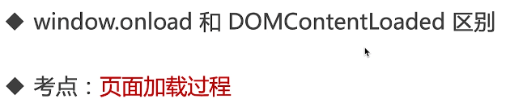

# 第1章 课程介绍

本章会出几个面试题，分析每道题目设计的知识点，然后总结出一个完整的知识体系。让我们开始 “题目->知识点->解题” 的快乐之旅吧。

## 1-1 导学

**问题1 - 如何能"快速搞定"**

* 解决方案：直击重点！
* 快速圈出前端常见考点和题目
* 以最易理解的方式讲解清楚

**问题2 - 如何做到”最易理解“**

* 讲知识点，不是题海战术
* 学会一道题，就能应对一类题
* 构建前端知识体系

资料：前端思维导图

**问题3 - 如何做到"匹配大厂"？**

* 大厂偏爱考察基础，特别是对于工作经验少的候选人
* 课程能讲解大厂一面的常见考点和面试题

**讲授方式**

* 先出面试题，引导思考
* 通过题目引出知识点，扩充知识体系
* 问题解答

##  1-2 看了这节课你就知道该怎么准备面试了

**关于面试**

* 基层工程师：基础知识
* 高级工程师：基础知识+项目经验
* 架构师：解决方案能力

**关于基础**

* 工程师的自我修养：基础知识
* 扎实的基础能让你高校学习新技术

##  1-3 先来体验几个面试题

**几个面试题**

* 出题
* 思考

## 1-4 如何搞定所有面试题

##  1-5 知识体系

**前端知识体系**

* 什么是知识体系
* 从哪些方面梳理
* 知识体系

**什么是知识体系？**

* 高效学习三部曲：找准知识体系；刻意训练；及时反馈；
* 知识体系：结构化的知识范围
* 涵盖所有知识点；结构化、有组织、易扩展

**从哪些方面梳理**

* W3C标准
* ECMA 262标准
* 开发环境
* 运行环境

**知识体系**

* CSS基础知识
* JS基础语法
* JS-Web-API
* 开发环境
* 运行环境
* HTTP协议

# 第2章 面试前的准备

**本章主要内容**

* 面试的环节和流程
* JD分析
* 如何写简历
* 准备工作和注意事项

## 2-1 面试之前需要你准备什么

**面试的环节和流程**

* 什么是面试
* 如何拿到简历
* 面试流程

**什么是面试**

* 经过组织者精心设计
* 以交谈和观察为主要手段
* 评价知识、能力和经验，综合素质

## 2-2 投递简历的几种方式

**如何拿到简历**

* 员工内推
* 猎头推荐
* hr收集（主动搜索，接收邮件）

## 2-3 面试的主要环节

**面试流程**

* 一面：以基础知识为主
* 二面（交叉面试）：从基础知识开始，考察原理，终于项目经验（要有实践经验辅助）
* 三面：不是纯技术，项目leader讲角色定位，产品的想法，未来技术规划
* hr面试：阿里hr有一票否决权；如实回答，阳光积极大方

**校招和社招的区别**

* 校招看中基础知识和能力，主要在一面
* 社招看中经验，主要在二面（基础知识要过关）
* 社招，工作时间越长，越偏重经验

## 2-4 JD分析-知己知彼

**JD分析**

* JD实什么
* JD分析的思路
* 案例

**JD是什么？**

* JD是用人单位发布的招聘信息
* 职位描述
* 岗位要求

**从JD中能看到什么？**

* 工作内容
* 技术栈
* 经验要求

**不过过于在意JD**

* JD是hr发布的
* hr和技术人员可能会沟通不及时
* 不能完全相信JD的要求

## 2-5 如何写简历

**如何写简历**

* 简历包含的内容
* 简历中需要注意的内容
* 案例

**划重点**

* 简历就像高考作文——阅卷时间非常短
* 内容简介
* 直击重点，表现出自己的优势

**简历包含的内容**

* 个人信息
* 教育经历
* 专业技能
* 工作经历
* 项目经历

**简历内容 - 基本信息**

* 必备：姓名 性别 电话 邮箱 籍贯
* 年龄可不写（能从教育经历评估出来）
* 头像无所谓

**简历内容 - 教育经历**

* 写上最高学历即可
* 学校，专业，入学和毕业时间

**简历内容 - 专业技能**

* 表现出自己的核心竞争力
* 内容不要太多，3、5条即可
* 太基础的不要写，例如会用vscode

**简历内容 - 工作经历**

* 如实写
* 写明公司，职位，入职离职时间即可，多写无益
* 如果有空窗期，如实写名即可

**简历内容 - 项目经历**

* 写2-4个具有说服力项目（视工作时间）
* 项目描述，技术栈，个人角色
* 技巧：可以把别人的项目写上，只要你能hold住

**简历内容 - 博客或开源**

* 有博客或者开源作品，会让你更有竞争力
* 切记：需要真的有内容，不可临时抱佛脚
* 可以从现在开始，慢慢积累

**注意事项**

* 界面不要太花哨，简洁明了即可
* 注意用词,"精通"，"熟练"等慎用
* 不可造假，会被拉入黑名单（项目经历那里，不是造假！！！）

## 2-6 简历案例分析

略

## 2-7 面试前的准备工作和注意事项

**面试前的准备工作**

* 看JD，是否需要临时准备一下
* 打印纸质简历，带着纸和笔
* 最好带着自己的电脑，先尝可能手写代码

**面试前的注意事项**

* 要有时间观念，如果迟到或者推迟，要提前说
* 衣着适当，不用正装，也不要太随意
* 为何离职？ —— 不要吐槽前东家，说自己的原因
* 能加班吗？ —— 能！除非你特别自信，能找到其他机会
* 不要挑战面试官，即使他错了
* 遇到不会的问题，要表现出自己积极的一面（不会的题也积极表现出想知道）

**其他情况**

https://www.imooc.com/article/300475

# 第3章 CSS 面试题

本章讲解 CSS 中常考和必考的知识点，包括布局、定位、响应式等。其中会讲到很多常考问题，如 BFC、居中对齐、flex 布局等。前端一面中，CSS 一般最先考察，不过关则直接宣告失败。

-  3-1 html、css面试介绍
-  3-2 html面试题
-  3-3 布局-题目
-  3-4 布局-解题-1
-  3-5 布局-解题-2
-  3-6 布局-解题-3
-  3-7 布局-解题-4
-  3-8 布局-解题-5
-  3-9 定位-解题-1
-  3-10 定位-解题-2
-  3-11 图文样式-解题
-  3-12 响应式-解题
-  3-13 2 css-响应式-vw-wh
-  3-14 css面试总结

- 

  ##### 第4章 JS基础-变量类型和计算【不会变量，别说你会JS】

  本章介绍变量的类型和计算的知识点和题目，包括值类型和引用类型区别，类型判断，深拷贝等。变量和类型是一个任何一门语言的基础，不了解的话，会被认为是 JS 语法不过关。

  -  4-1 JS 值类型和引用类型的区别
  -  4-2 手写 JS 深拷贝
  -  4-3 变量计算 - 注意某些类型转换的坑
  -  4-4 变量类型相关的面试题

- 

  ##### 第5章 JS基础-原型和原型链【三座大山之一，必考！！！】

  本章介绍原型、原型链和 class 相关的知识点和题目。包括 class ，继承，原型，原型链，instanceof。原型是“JS 三座大山”之一，原型和原型链也是必考知识点。

  -  5-1 JS 原型的考点和面试题
  -  5-2 如何用 class 实现继承
  -  5-3 如何理解 JS 原型（隐式原型和显示原型）
  -  5-4 instanceof 是基于原型链实现的
  -  5-5 JS 原型本章相关的面试题

- 

  ##### 第6章 JS基础-作用域和闭包【三座大山之二，不会闭包，基本不会通过】

  本章介绍作用域和闭包的知识点和题目。包括作用域，自由变量，闭包，this 等部分。作用域是“JS 三座大山”之二，不知道闭包的话，面试通过概率不大。

  -  6-1 什么是作用域？什么是自由变量？
  -  6-2 什么是闭包？闭包会用在哪里？**试看**
  -  6-3 this 有几种赋值情况
  -  6-4 作用域相关的面试题 - part1
  -  6-5 作用域相关的面试题 - part2
  -  6-6 补充 - 原型中的 this

- 

  ##### 第7章 JS基础-异步【三座大山之三，必考！！！】

  本章介绍异步的知识点和题目。包括异步和同步的区别，异步应用场景，以及 Promise 。异步是“JS 三座大山”之三，所有公司的 JS 面试，100% 会考察异步和 Promise 。

  -  7-1 同步和异步有何不同
  -  7-2 异步的应用场景有哪些
  -  7-3 promise的基本使用
  -  7-4 JS 异步相关的面试题
  -  7-5 JS基础部分的考点总结

- 

  ##### 第8章 JS 异步进阶【想要进大厂，更多异步的问题等着你】

  JS 的特色就是异步编程，所有有很多关于异步的考点，本章都会讲解。如 event loop、promise、async-await、微任务和宏任务。学不会这些，就不算是精通 JS ，也无法进大厂。

  -  8-1 本章考点介绍
  -  8-2 看几个异步的面试题
  -  8-3 什么是event loop
  -  8-4 event loop 的执行过程
  -  8-5 DOM事件和event loop的关系
  -  8-6 Promise有哪三种状态
  -  8-7 Promise的then和catch如何影响状态的变化
  -  8-8 Promise关于then和catch的面试题
  -  8-9 async-await语法介绍-part1
  -  8-10 async-await和Promise有什么关系
  -  8-11 async-await是语法糖，异步的本质还是回调函数
  -  8-12 for-of的应用场景
  -  8-13 什么是宏任务和微任务
  -  8-14 event-loop和DOM渲染的关系
  -  8-15 为什么微任务比宏任务执行更早
  -  8-16 微任务和宏任务的根本区别
  -  8-17 解答JS异步的面试题
  -  8-18 本章考点总结

- 

  ##### 第9章 JS-Web-API-DOM【学会DOM，才能具备网页开发的基础】

  本章介绍 DOM 操作的知识点和题目。包括 DOM 结构，常用 DOM 操作，DOM 性能优化等。DOM 是网页结构的基础，学会 DOM 操作才可以做网页开发。

  -  9-1 从JS基础到JS-Web-API
  -  9-2 DOM的本质是什么
  -  9-3 DOM节点操作
  -  9-4 DOM结构操作
  -  9-5 如何优化 DOM 操作的性能
  -  9-6 DOM 操作相关的面试题

- 

  ##### 第10章 JS-Web-API-BOM【内容虽然不多，但是你不能不会】

  本章介绍 BOM 操作的知识点和题目。本章内容虽然不多，但不可不会。

  -  10-1 BOM 操作相关的面试题

- 

  ##### 第11章 JS-Web-API-事件【事件不会，等于残废，必考！必考！】

  本章介绍事件绑定的知识点和题目。包括事件绑定，事件冒泡机制，事件代理。事件能让网页和鼠标、键盘进行交互，初级 JS 面试必考。

  -  11-1 事件绑定和事件冒泡
  -  11-2 什么是事件代理（面试必考）
  -  11-3 DOM 事件相关的面试题

- 

  ##### 第12章 JS-Web-API-Ajax【每个工程师必须熟练掌握的技能】

  本章介绍 ajax 相关的知识点和题目。包括 XMLHttpRequest ，同源策略，跨域方式，以及常用插件介绍。我们早就进入了动态网页时代，而当下的前后端分离开发方式，更加要求每个工程师必须熟练掌握 ajax 。

  -  12-1 ajax 的核心API - XMLHttpRequest
  -  12-2 什么是浏览器的同源策略
  -  12-3 实现跨域的常见方式 - jsonp 和 CORS
  -  12-4 ajax 相关的面试题 - part1
  -  12-5 ajax 本章相关的面试题 - part2
  -  12-6 实际项目中 ajax 的常用插件

- 

  ##### 第13章 JS-Web-API-存储【内容虽然不多，但不可不会】

  本章介绍存储的知识点和题目。包括 cookie、localStorage 和 sessionStorage 。本章内容虽然不多，但不可不会。

  -  13-1 如何理解 cookie
  -  13-2 localStorage SessionStorage 和 cookie 的区别

- 

  ##### 第14章 http 面试题【前后端分离的时代，网络请求是前端的生命线】

  前端工程师做出网页，需要通过网络请求向后端获取数据，因此 http 协议是前端面试的必考内容。本章讲解 http 协议常考的知识点，如状态码、header、method、缓存等。特别是 http 缓存策略，非常重要。

  -  14-1 http的几个面试题
  -  14-2 http常见的状态码有哪些-part1
  -  14-3 http常见的状态码有哪些-part2
  -  14-4 什么是Restful-API
  -  14-5 http哪些常见header
  -  14-6 http为何需要缓存
  -  14-7 cache-control是什么意思-http强制缓存
  -  14-8 Etag和Last-Modified是什么意思-http协商缓存
  -  14-9 刷新页面对http缓存的影响
  -  14-10 http考点总结

- 

  ##### 第15章 开发环境【不会这些，你就会被认定是菜鸟小白，没做过项目】

  本章介绍开发环境相关的知识点和题目。包括 git ，调试工具，抓包工具，webpack 和 babel ，以及 linux 常用命令。熟练使用开发环境的各个工具，才能证明你真的做过前端开发，真的有项目经验，否则只能被认定为菜鸟小白。

  -  15-1 前端开发常用的开发工具
  -  15-2 什么是 git
  -  15-3 git 的常用命令有哪些
  -  15-4 git 常用命令演示
  -  15-5 如何用 chrome 调试 js 代码
  -  15-6 移动端 h5 如何抓包网络请求
  -  15-7 如何配置 webpack
  -  15-8 如何配置 babel
  -  15-9 ES6 模块化规范是什么
  -  15-10 如何配置 webpack 生产环境
  -  15-11 前端用到的 linux 常用命令有哪些
  -  15-12 开发环境的考点总结

- 

  ##### 第16章 运行环境【这些会了，你就可以飞了】

  本章介绍运行环境相关的知识点和题目。包括浏览器加载和渲染机制，性能优化，web 安全。网页在浏览器加载和运行，这些内容必须掌握，也是面试常考。

  -  16-1 JS 上线之后在什么哪里运行？
  -  16-2 网页是如何加载并渲染出来的
  -  16-3 网页加载和渲染的示例
  -  16-4 网页加载和渲染相关的面试题
  -  16-5 前端性能优化有哪些方式
  -  16-6 前端性能优化的示例
  -  16-7 手写防抖 debounce
  -  16-8 手写节流 throttle
  -  16-9 如何预防 xss 攻击
  -  16-10 如何预防 xsrf 攻击
  -  16-11 运行环境的考点总结

- 

  ##### 第17章 课程总结【很有必要带你避免面试犯低级错误】

  本章回顾所有题目和知识点，总结课程内容。还会介绍一些实用的面试技巧，避免你在面试中犯一些低级错误。

  -  17-1 课程总结~
  -  17-2 面试技巧

- 

  ##### 第18章 真题模拟【我是来告诉你答案是什么】

  本章节，通过一部分高频面试真题，带大家分析面试，以及如何解答。

  -  18-1 章节介绍
  -  18-2 题目讲解-1：何为变量提升？
  -  18-3 题目讲解-2：手写深度比较 isEqual
  -  18-4 题目讲解-3：你是否真的会用数组 map
  -  18-5 题目讲解-4：再学闭包
  -  18-6 面试讲解-5：回顾 DOM 操作和优化
  -  18-7 面试讲解-6：jsonp 本质是 ajax 吗
  -  18-8 面试讲解-7：是否用过 Object.create()
  -  18-9 面试讲解-8：常见的正则表达式
  -  18-10 面试讲解-9：如何获取最大值
  -  18-11 面试讲解-10：解析 url 参数
  -  18-12 面试讲解-11：数组去重有几种方式？
  -  18-13 面试讲解-12：是否用过 requestAnimationFrame