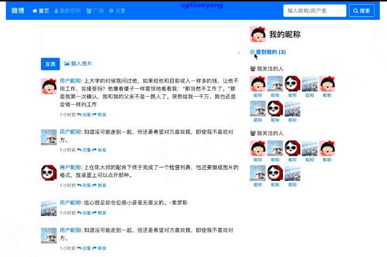
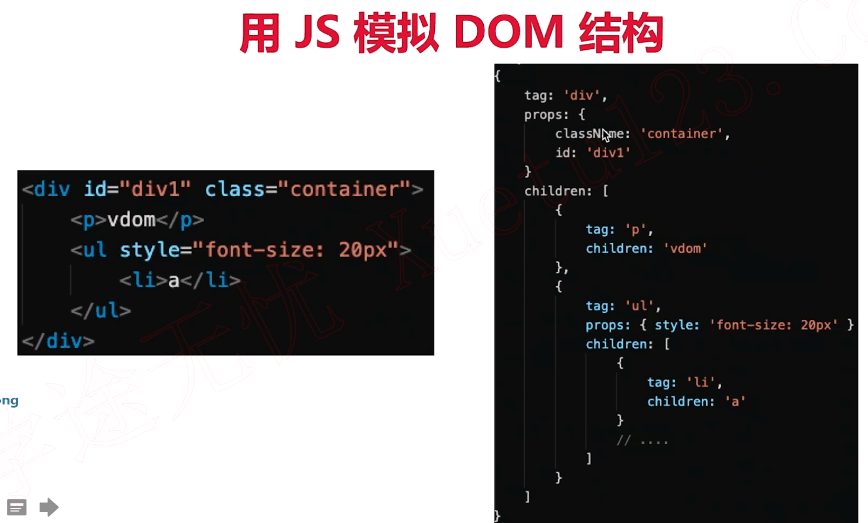
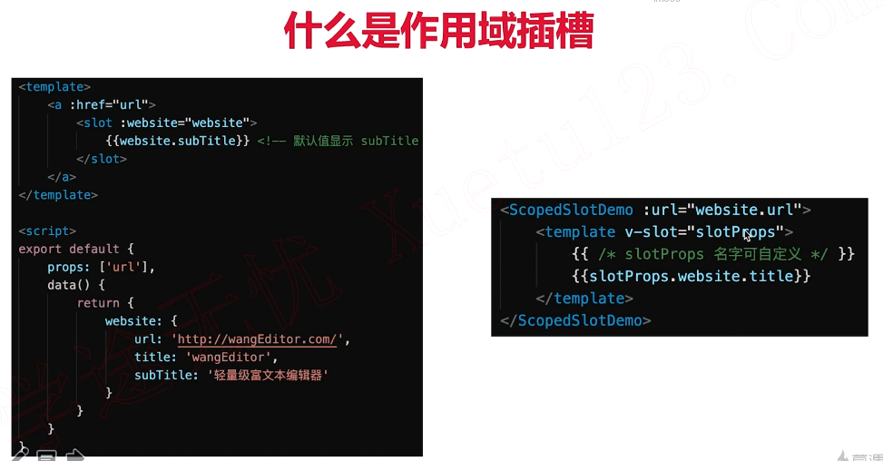

# 前端框架及项目面试

# 第1章 课程导学

##  1-1 框架面试导学

可否自己复习面试题？可以，但需要足够的时间，有自学能力，有毅力

**全面**

* 全面的面试体系
* 大量的面试真题
* 完整的技术面试流程

**高效**

* 直击面试考点和重点，无需自己扒文档
* 深入浅出讲解原理，无需自己读源码
* 解读项目设计的思路，提炼项目经验

**学习前提**

* 了解js和ES6基本语法
* 用过Vue React 和Webpack

**面试流程**


**知识点介绍**

思维导图

**讲授方式**

* 体系为导向，知识点讲解+真题验证
* 讲解一个题，学会一类题

**注意事项**

* 不是零基础入门课程
* 讲原理，但不讲源码
* 不是实战项目

# 第2章 课程介绍

##  2-1 先看几个面试题

**先看几个面试题**

* 先看几个面试题，先不解答，自己思考
* 思考如何应对这些，以及所有的面试？

**Vue面试题**

* v-show和v-if的区别
* 为何v-for中要用key
* 描述Vue组件生命周期（有父子组件的情况）
* Vue组件如何通讯
* 描述组件渲染和更新的过程
* 双向数据绑定v-model的实现原理

**如何应对上述面试题**

* 框架的使用（基本使用，高级特性，周边插件）
* 框架的原理（基本原理的了解，热门技术的深度，全面性）
* 框架的实际应用，即设计能力（组件结构，数据结构）

**面试官为何要这样考察？**

* 保证候选人能正常工作 —— 考察使用

# 第3章 Vue 使用

Vue 是前端面试必考内容，首先要保证自己要会使用 Vue 。本章讲解 Vue 基本使用、组件使用、高级特性和 Vuex Vue-router ，这些部分的知识点和面试题。

## 3-1 vue使用-考点串讲

**Vue使用**

* 基本使用，组件使用 —— 常用，必须会
* 高级特性 —— 不常用，但体现深度
* Vuex和Vue-router使用

**自己去看文档不行吗？**

* 行，但这是一种最低效的方式
* 文档是一个备忘录，给会用的人查阅，并不是入门教程
* 文档全面冗长且细节过多，不能突出面试考点

##  3-2 vue基本使用part1

**Vue基本使用**

* 日常使用，必须掌握，面试会考（不一定全考）
* 梳理知识点，从冗长的文档中摘出考点和重点
* 考察形式不限（参考后面的面试真题），但都在范围之内

### vue-cli创建项目

> * Vue CLI 是一个基于 Vue.js 进行快速开发的完整系统
> * 组成部分
>   * CLI `@vue/cli`是一个全局安装的npm包，提供了终端里的vue命令
>   * CLI服务`@vue/cli-service`是一个开发依赖环境，构建于`webpack`和`webpack-dev-server`
>   * CLI插件是向你的Vue项目提供可选功能的npm包，例如`@vue/cli-plugin-`或`vue-cli-plugin-`

**下面使用vue-cli创建项目**

创建一个新项目：`vue create interview-demo`

以后均以这样的方式演示代码示例


### 模板（插值，指令）

>* 插值、表达式
>* 指令、动态属性
>* v-html：会有XSS风险，会覆盖子组件

```html
<template>
    <div>
        <p>文本插值 {{message}}</p>
        <p>JS 表达式 {{ flag ? 'yes' : 'no' }} （只能是表达式，不能是 js 语句）</p>

        <p :id="dynamicId">动态属性 id</p>

        <hr/>
        <p v-html="rawHtml">
            <span>有 xss 风险</span>
            <span>【注意】使用 v-html 之后，将会覆盖子元素</span>
        </p>
    </div>
</template>

<script>
export default {
    data() {
        return {
            message: 'hello vue',
            flag: true,
            rawHtml: '指令 - 原始 html <b>加粗</b> <i>斜体</i>',
            dynamicId: `id-${Date.now()}`
        }
    }
}
</script>

```


### computed和watch

> * computed有缓存，data不变则不会重新计算
> * watch如何深度监听？
> * watch监听引用类型，拿不到oldVal

**computed举例**

```html
<template>
    <div>
        <p>num {{num}}</p>
        <p>double1 {{double1}}</p>
        <input v-model="double2"/>
    </div>
</template>

<script>
export default {
    data() {
        return {
            num: 20
        }
    },
    computed: {
        double1() {
            return this.num * 2
        },
        double2: {
            get() {
                return this.num * 2
            },
            set(val) {
                this.num = val/2
            }
        }
    }
}
</script>
```


**watch举例**

```html
<template>
    <div>
        <input v-model="name"/>
        <input v-model="info.city"/>
    </div>
</template>

<script>
export default {
    data() {
        return {
            name: '双越',
            info: {
                city: '北京'
            }
        }
    },
    watch: {
        name(oldVal, val) {
            // eslint-disable-next-line
            console.log('watch name', oldVal, val) // 值类型，可正常拿到 oldVal 和 val
        },
        info: {
            handler(oldVal, val) {
                // eslint-disable-next-line
                console.log('watch info', oldVal, val) // 引用类型，拿不到 oldVal 。因为指针相同，此时已经指向了新的 val
            },
            deep: true // 【深度监听】，info的子属性/子属性的子属性改了也可以被监听
        }
    }
}
</script>
```

### class和style

> * 使用动态属性
> * 使用驼峰式写法

```html
<template>
    <div>
        <!--对象写法-->
        <p :class="{ black: isBlack, yellow: isYellow }">使用 class</p>
        <!--数组写法-->
        <p :class="[black, yellow]">使用 class （数组）</p>
        <!--对象里面的属性要用驼峰式！！-->
        <p :style="styleData">使用 style</p>
    </div>
</template>

<script>
export default {
    data() {
        return {
            isBlack: true,
            isYellow: true,

            black: 'black',
            yellow: 'yellow',

            styleData: {
                fontSize: '40px', // 转换为驼峰式
                color: 'red',
                backgroundColor: '#ccc' // 转换为驼峰式
            }
        }
    }
}
</script>

<style scoped>
    .black {
        background-color: #999;
    }
    .yellow {
        color: yellow;
    }
</style>
```

### 条件

> * `v-if` `v-else`的用法，可使用变量，也可以使用 `===`表达式
> * `v-if`和`v-else`的区别？
>   * v-if 只渲染符合条件的，v-show都渲染，对于不符合条件的使用`display:none`
> * `v-if`和`v-else`的使用场景？
>   * 一次性选择，更新不频繁，使用 v-if
>   * 很频繁的切换，使用v-show，用`display：none`切换显示与隐藏，v-if会有DOM的加载和销毁，损耗性能大

```html
<template>
    <div>
        <p v-if="type === 'a'">A</p>
        <p v-else-if="type === 'b'">B</p>
        <p v-else>other</p>

        <p v-show="type === 'a'">A by v-show</p>
        <p v-show="type === 'b'">B by v-show</p>
    </div>
</template>

<script>
export default {
    data() {
        return {
            type: 'a'
        }
    }
}
</script>
```


### 循环（列表）渲染

* 如何遍历对象？ ---- 也可以用`v-for`
* key的重要性。key不能乱写（如random或者index这样没有意义，key应该选有意义和业务相关的的例如id这样的）
* v-for和v-if不能一起使用！

```html
<template>
    <div>
        <p>遍历数组</p>
        <ul>
            <li v-for="(item, index) in listArr" :key="item.id">
                {{index}} - {{item.id}} - {{item.title}}
            </li>
        </ul>
        <p>遍历对象</p>
        <ul >
            <li v-for="(val, key, index) in listObj" :key="key">
                {{index}} - {{key}} -  {{val.title}}
            </li>
        </ul>
    </div>
</template>

<script>
export default {
    data() {
        return {
            flag: false,
            listArr: [
                { id: 'a', title: '标题1' }, // 数据结构中，最好有 id ，方便使用 key
                { id: 'b', title: '标题2' },
                { id: 'c', title: '标题3' }
            ],
            listObj: {
                a: { title: '标题1' },
                b: { title: '标题2' },
                c: { title: '标题3' },
            }
        }
    }
}
</script>
```


### 事件

> * event参数，自定义参数
>   * event是原生的
>   * 事件被挂载到当前元素
> * 事件修饰符，按键修饰符
> * 【观察】事件被绑定到哪里?
>   * 事件被挂载到当前元素

**事件**

```html
<template>
    <div>
        <p>{{num}}</p>
        <button @click="increment1">+1</button>
		<!--自定义参数-->
        <button @click="increment2(2, $event)">+2</button>
    </div>
</template>

<script>
export default {
    data() {
        return {
            num: 0
        }
    },
    methods: {
        increment1(event) {
            console.log('event', event, event.__proto__.constructor) // 是原生的 event 对象
            console.log(event.target)
            console.log(event.currentTarget) // 注意，事件是被注册到当前元素的，和 React 不一样
            this.num++
            // 1. event 是原生的
            // 2. 事件被挂载到当前元素
            // 和 DOM 事件一样
        },
        increment2(val, event) {
            console.log(event.target)
            this.num = this.num + val
        },
        loadHandler() {
            // do some thing
        }
    },
    mounted() {
        window.addEventListener('load', this.loadHandler)
    },
    beforeDestroy() {
        //【注意】用 vue 绑定的事件，组建销毁时会自动被解绑
        // 自己绑定的事件，需要自己销毁！！！
        window.removeEventListener('load', this.loadHandler)
    }
}
</script>
```


**事件修饰符**


### 表单

> * `v-model`
> * 常见表单项`textarea checkbox radio select`
> * 修饰符`lazy number trim` 

```html
<template>
    <div>
        <p>输入框: {{name}}</p>
        <input type="text" v-model.trim="name"/>
        <input type="text" v-model.lazy="name"/>
        <input type="text" v-model.number="age"/>

        <p>多行文本: {{desc}}</p>
        <textarea v-model="desc"></textarea>
        <!-- 注意，<textarea>{{desc}}</textarea> 是不允许的！！！ -->

        <p>复选框 {{checked}}</p>
        <input type="checkbox" v-model="checked"/>

        <p>多个复选框 {{checkedNames}}</p>
        <input type="checkbox" id="jack" value="Jack" v-model="checkedNames">
        <label for="jack">Jack</label>
        <input type="checkbox" id="john" value="John" v-model="checkedNames">
        <label for="john">John</label>
        <input type="checkbox" id="mike" value="Mike" v-model="checkedNames">
        <label for="mike">Mike</label>

        <p>单选 {{gender}}</p>
        <input type="radio" id="male" value="male" v-model="gender"/>
        <label for="male">男</label>
        <input type="radio" id="female" value="female" v-model="gender"/>
        <label for="female">女</label>

        <p>下拉列表选择 {{selected}}</p>
        <select v-model="selected">
            <option disabled value="">请选择</option>
            <option>A</option>
            <option>B</option>
            <option>C</option>
        </select>

        <p>下拉列表选择（多选） {{selectedList}}</p>
        <select v-model="selectedList" multiple>
            <option disabled value="">请选择</option>
            <option>A</option>
            <option>B</option>
            <option>C</option>
        </select>
    </div>
</template>

<script>
export default {
    data() {
        return {
            name: '双越',
            age: 18,
            desc: '自我介绍',

            checked: true,
            checkedNames: [],

            gender: 'male',

            selected: '',
            selectedList: []
        }
    }
}
</script>
```

> **总结**
>
> * 必须掌握，否则面试不会通过
> * 重点和考点

##  3-3 vue基本知识点串讲-part2

**Vue组件使用**

* props和$emit
* 组件间通讯 - 自定义事件
* 组件生命周期

## 3-4 vue父子组件如何通讯

### props和$emit

**props和$emit代码演示**


index.vue

```html
<template>
  <div>
    <Input @add="addHandler"/>
    <List :list="list" @delete="deleteHandler"/>
  </div>
</template>

<script>
import Input from './Input'
import List from './List'
export default {
  components:{
    Input,
    List
  },
  data(){
    return {
      list:[
        {
          id:'1-1',
          title:'标题1-1'
        },
        {
          id:'1-2',
          title:'标题1-2'
        }
      ]
    }
  },
  methods:{
    addHandler(title){
      console.log("父级add啦",title);
      this.list.push({
        id:`id-${Date.now()}`,
        title
      })
    },
    deleteHandler(id){
      console.log("父级delete啦",id);
      this.list = this.list.filter(item => item.id !==id)
    }
  }
}
</script>

<style>

</style>
```

input.vue

```html
<template>
  <div>
    <input type="text" v-model="title"/>
    <button @click="addTitle">add</button>
  </div>
</template>

<script>
export default {
  data(){
    return{
      title:''
    }
  },
  methods:{
    //调用父组件的事件
    addTitle(){
      this.$emit('add',this.title)
    }
  }
}
</script>

<style>

</style>
```

list.vue

```html
<template>
  <div>
    <ul>
      <li v-for="item in list" :key="item.id">
        {{ item.title }}
        <button @click="deleteItem(item.id)">删除</button>
      </li>
    </ul>
  </div>
</template>

<script>
export default {
  props: ["list"],
  // props: {
  //   // prop 类型和默认值
  //   list: {
  //     type: Array,
  //     default() {
  //       return [];
  //     },
  //   },
  // },
  methods: {
    deleteItem(id) {
      this.$emit("delete", id);
    },
  },
};
</script>

<style>
</style>
```

## 3-5 如何用自定义事件进行vue组件通讯

>  兄弟组件如何通信？ 使用自定义事件

1. **引入event**

   

   在input和list中引入event，利用一个vue实例来解决

   ```js
   import event from './event'
   ```

2. **绑定自定义函数**

   在list.vue中给自定义事件绑定一个函数名字`event.$on('onAddTitle', this.addTitleHandler)`，使用函数名字方便在`beforeDstory`解绑自定义事件

   ```html
   <template>
       <div>
           <ul>
               <li v-for="item in list" :key="item.id">
                   {{item.title}}
               </li>
           </ul>
       </div>
   </template>
   
   <script>
   import event from './event'
   
   export default {
       props: ['list']
       methods: {
           addTitleHandler(title) {
               // eslint-disable-next-line
               console.log('on add title', title)
           }
       },
       mounted() {
           // 绑定自定义事件
           event.$on('onAddTitle', this.addTitleHandler)
       },
       beforeDestory(){
           //及时销毁，否则可能造成内存泄漏
           event.$off('onAddTitle',this.addTitleHandler)
       }
   }
   </script>
   ```

3. **触发自定义事件**

   在input中触发

   ```html
   <template>
       <div>
           <input type="text" v-model="title"/>
           <button @click="addTitle">add</button>
       </div>
   </template>
   
   <script>
   import event from './event'
   
   export default {
       data() {
           return {
               title: ''
           }
       },
       methods: {
           addTitle() {
               // 调用父组件的事件
               this.$emit('add', this.title)
   
               // 调用自定义事件
               event.$emit('onAddTitle', this.title)
   
               this.title = ''
           }
       }
   }
   </script>
   ```

**注意**：这两个写法很相似要注意！！！

```js
            // 调用父组件的事件
            this.$emit('add', this.title)

            // 调用自定义事件
            event.$emit('onAddTitle', this.title)
```

##  3-6 vue父子组件生命周期调用顺序

> 生命周期（单个组件)
>
> * 挂载阶段
> * 更新阶段
> * 销毁阶段

参考博客：https://www.jianshu.com/p/410b6099be69


**自己补充内容**

```html
<template>
  <div class="app-content" v-show="rendered">
    content
  </div>
</template>

<script>
export default {
  data(){
    return{
      rendered:true,
    }
  },
  beforeCreate(){
    console.log('---beforeCreate---');
    console.log((this.rendered));//undefined
  },
  created(){
    console.log('---created--');
    console.log(this.$el);//undefined
    console.log(this.rendered);//true
  },
  beforeMount(){
    console.log('---beforeMount---')
    console.log(this.$el);//undefined
  },
  mounted(){
    console.log('---mounted---');
    console.log(this.$el);
  },
  deforeDestory(){
    console.log('---beforeDestory---');
    console.log(this.$el);
    console.log(this.rendered);
  },
  destory(){
    console.log('---destory---');
    console.log(this.$el);
    console.log(this.rendered);
  }
}
</script>
```


> **created和mounted有什么区别？**
>
> * created是初始化vue实例，并没有开始渲染
> * mounted是组件在网页上真正绘制渲染完了，大部分情况在mounted里面进行操作，因为页面已经渲染完了，可以通过ajax获取信息，绑定事件等等
>
> **beforeDestory中可以做什么事情？**
>
> * 解除绑定、销毁子组件以及事件监听器
>
> （参考vue官网试图）

实例讲解：带有父子组件的生命周期


以index和list组件为例演示

```html
<template>
  <div>
    <Input @add="addHandler" />
    <List :list="list" @delete="deleteHandler" />
  </div>
</template>

<script>
import Input from "./Input";
import List from "./List";
export default {
  components: {
    Input,
    List,
  },
  data() {
    return {
      list: [
        {
          id: "1-1",
          title: "标题1-1",
        },
        {
          id: "1-2",
          title: "标题1-2",
        },
      ],
    };
  },
  methods: {
    addHandler(title) {
      this.list.push({
        id: `id-${Date.now()}`,
        title,
      });
    },
    deleteHandler(id) {
      this.list = this.list.filter((item) => item.id !== id);
    },
  },
  //---------------------------------------------
  created() {
    console.log("index created");
  },
  mounted() {
    console.log("index mounted");
  },
  beforeUpdate() {
    console.log("index before update");
  },
  updated() {
    console.log("index updated");
  },
     //---------------------------------------------
};
</script>

<style>
</style>
```

list.vue

```html
<template>
  <div>
    <ul>
      <li v-for="item in list" :key="item.id">
        {{ item.title }}
        <button @click="deleteItem(item.id)">删除</button>
      </li>
    </ul>
  </div>
</template>

<script>
import event from './event.js'
export default {
  props: ["list"],
  // props: {
  //   // prop 类型和默认值
  //   list: {
  //     type: Array,
  //     default() {
  //       return [];
  //     },
  //   },
  // },
  methods: {
    deleteItem(id) {
      this.$emit("delete", id);
    },
    //接受兄弟组件传来的参数
    addTitleHandler(title) {
      console.log("on add title", title);
    },
  },
  //---------------------------------------------
  created() {
    console.log("list created");
  },
  mounted() {
    console.log("list mounted");
    // 绑定自定义事件
    event.$on("onAddTitle", this.addTitleHandler);
  },
  beforeUpdate() {
    console.log("list before update");
  },
  updated() {
    console.log("list updated");
  },
  beforeDestroy() {
    // 及时销毁，否则可能造成内存泄露
    event.$off("onAddTitle", this.addTitleHandler);
  },
  //---------------------------------------------
};
</script>

<style>
</style>
```


当添加新数据时


> **总结**
>
> * props和$emit
> * 组件间通讯 - 自定义事件
> * 组件生命周期


##  3-7 面试会考察哪些vue高级特性

**Vue高级特性**

* 不是每个都很常用，但用到的时候必须要知道
* 考察候选人对Vue的掌握是否全面，且有深度
* 考察做过的项目是否有深度和复杂度（至少能用到高级特性）

> **Vue高级特性**
>
> * 自定义v-model
> * $nextTick
> * slot
> * 动态、异步组件
> * keep-alive
> * mixin

## 3-8 vue如何自己实现v-model

### 自定义 v-model


index.vue

```html
<template>
  <div>
    <p>vue 高级特性</p>
    <p>{{name}}</p>
    <CustomVModel v-model="name"/>
  </div>
</template>

<script>
import CustomVModel from './CustomVModel.vue'
export default {
  components:{
    CustomVModel
  },
  data(){
    return{
      name:'sxc',
    }
  }
}
</script>
```

CustomVModel

```html
<template>
  <input type="text" :value="text1" @input="$emit('change1',$event.target.value)">
</template>

<script>
export default {
  //2.定义model
  model:{
    prop:'text1',//对应props text1
    event:'change1' //和input事件对应起来
  },
  //1.定义props
  props:{
    text1:String,
    default(){
      return ''
    }
  }
}
</script>

<style>

</style>
```

> **自定义v-model实现数据双向绑定**
>
> 1. 上面的 input 使用了 :value 而不是 v-model
> 2. 上面的 change1 和 model.event 要对应起来
> 3. text1 属性对应起来

**自己补充的内容**

> 来自官方原文
>
> vue2.2后新增model选项，model选项允许自定义prop和event。
>
> 允许一个自定义组件在使用 v-model 时定制 prop 和 event。默认情况下，一个组件上的 v-model 会把 value 用作 prop 且把 input 用作 event，但是一些输入类型比如单选框和复选框按钮可能想使用 value prop 来达到不同的目的。使用 model 选项可以回避这些情况产生的冲突。
>
> 一个组件上的`v-model`默认会利用名为`value`的 prop 和名为`input`的事件，但是像单选框、复选框等类型的输入控件可能会将`value`attribute 用于[不同的目的](https://link.zhihu.com/?target=https%3A//developer.mozilla.org/en-US/docs/Web/HTML/Element/input/checkbox%23Value)。`model`选项可以用来避免这样的冲突： ———— 摘自 vue 官网

## 3-9 vue组件更新之后如何获取最新DOM

### $nextTick

> **$nextTick**
>
> * vue是异步渲染（原理部分会详细讲解）
> * vue的data改变之后，DOM不会立刻渲染
>   * **一个重要概念：异步更新队列**：Vue在观察到数据变化时并不直接更新DOM，而是开启一个队列，并缓冲在同一事件循环中发生的所有数据改变，在缓冲时会去除重复数据，从而避免比不要的计算和DOM操作。然后，在下一个事件循环tick中，Vue刷新队列并执行实际（已去重的）工作。 
> * `$nextTick`会在DOM渲染之后被触发，以获取最新DOM节点

index.vue

```html
  <div>
    <p>Vue高级特性</p>
    <hr>
    <NextTick/>
  </div>
```


NextTick.vue

```html
<template>
  <div>
    <div id="app">
      <ul ref="ul1">
        <li v-for="(item, index) in list" :key="index">
          {{ item }}
        </li>
      </ul>
      <button @click="addItem">添加一项</button>
    </div>
  </div>
</template>

<script>
export default {
  name: "app",
  data() {
    return {
      list: ["a", "b", "c"],
    };
  },
  methods: {
    addItem() {
      this.list.push(`${Date.now()}`);
      this.list.push(`${Date.now()}`);
      this.list.push(`${Date.now()}`); 

      //1.异步渲染(data改变不会立刻渲染)，$next待DOM渲染完再回调
      //2.页面渲染时会将data的修改做整合，多次data修改只会渲染一次
      this.$nextTick(() => {
        //获取DOM元素
        const ulElem = this.$refs.ul1;//通过ref拿到DOM元素的节点
        console.log(ulElem.childNodes.length);
      });
    },
  },
};
</script>
```

## 3-10 slot是什么

> **slot**
>
> * 基本使用：父组件往子组件中插入一段内容(内容分发)
>   * props传递数据，events触发事件和slot内容分发就构成了Vue组件的3个API来源，再复杂的组件也是由这三部分组成的。
> * 作用域插槽
>   * 父组件模板的内容是在父组件作用域内编译，子组件模板的内容实在子组件作用域内编译
>   * slot分发的内容，作用域实在父组件上
> * 具名插槽

**基本使用**

slotDemo.vue

```html
<template>
  <a :href="url">
    <slot>
      默认内容，即父组件没设置内容时，这里显示
    </slot>
  </a>
</template>

<script>
export default {
  props:['url'],
  data(){
    return{}
  }
}
</script>

<style>

</style>
```

```html
<template>
  <div>
    <p>Vue高级特性</p>
    <hr />
    <slot-demo :url="website.url">
      {{website.title}}
    </slot-demo>
  </div>
</template>

<script>
import slotDemo from "./SlotDemo";
export default {
  components: {
    slotDemo,
  },
  data() {
    return {
      website: {
        url: "http://imooc.com/",
        title: "imooc",
        subTitle: "程序员的梦工厂",
      },
    };
  },
};
</script>

<style>
</style>
```


**2. 作用域插槽**

作用域插槽是一种特殊的slot，使用一个可以复用的模板替换已渲染元素

scopedslotDemo

```html
<template>
    <a :href="url">
        <slot :slotData="website">
            {{website.subTitle}} <!-- 默认值显示 subTitle ，即父组件不传内容时 -->
        </slot>
    </a>
</template>

<script>
export default {
    props: ['url'],
    data() {
        return {
          //设置默认值
            website: {
                url: 'http://wangEditor.com/',
                title: 'wangEditor',
                subTitle: '轻量级富文本编辑器'
            }
        }
    }
}
</script>
```

index.vue

```html
<template>
  <div>
    <p>Vue高级特性</p>
    <hr />

    <SlotDemo :url="website.url">
      <template v-slot="slotProps">
        {{ slotProps.slotData.title }}
      </template>
    </SlotDemo>
  </div>
</template>

<script>
import SlotDemo from "./SlotDemo";
export default {
  components: {
    SlotDemo,
  },
  data() {
    return {
      website: {
        url: "http://imooc.com/",
        title: "imooc",
        subTitle: "程序员的梦工厂",
      },
    };
  },
};
</script>

<style>
</style>
```


**3. 具名插槽**

给`<slot>`指定name后可以分发多个内容，具名slot可以和单个slot共存


##  3-11 vue动态组件是什么

### :is="component-name"

> **动态组件**
>
> * `:is="component-name"`用法：动态挂载不同的组件
> * 需要根据数据，动态渲染的场景。即组件类型不确定

例如：

动态引入之前的nextTick组件

```html
<template>
    <div>
        <p>vue 高级特性</p>
        <hr>
        <!-- 动态组件 -->
        <component :is="NextTickName"/>
    </div>
</template>

<script>
import NextTick from './NextTick'

export default {
    components: {
        NextTick
    },
    data() {
        return {
            NextTickName: "NextTick",//注意组件的名字要写对，跟compoent里面的对应好
        }
    }
}
</script>
```


以这个为例子

```html
<template>
  <div>
    <p>Vue高级特性</p>
    <hr/>
    <div v-for="(val,key) in newsData" :key="key">
      <component :is="val.type"/>
    </div>
  </div>
</template>

<script>
import text from './text'
import image from './image'
export default {
  components: {
    text,
    image,
  },
  data() {
    return {
	  newsData:{
        1:{
          type:'text'
        },
        2:{
          type:'text'
        },
        3:{
          type:'image'
        }
      }
    };
  },
};
</script>
```

##  3-12 vue如何异步加载组件

### import()

> **异步组件**
>
> 对于很大的组件，如何加载？
>
> * `import()`函数
> * 按需加载，异步加载大组件

```html
<template>
    <div>
        <p>vue 高级特性</p>
        <hr> 
        <!-- 异步组件 -->
        <FormDemo v-if="showFormDemo"/>
        <button @click="showFormDemo = true">show form demo</button>
    </div>
</template>

<script>
import FormDemo from '../BaseUse/FormDemo'

export default {
    components: {
         FormDemo: () => import('../BaseUse/FormDemo'),//注意这里！按需异步加载组件！！！
    },
    data() {
        return {
            showFormDemo: false
        }
    }
}
</script>
```


点击按钮后


## 3-13 vue如何缓存组件 

### keep-alive

> **keep-alive**
>
> * 缓存组件
> * 保持组件的状态，如果频繁切换，以避免重复渲染导致的性能问题
> * Vue常见性能优化的答案之一


KeepAliveStageA如下

```html
<template>
    <p>state A</p>
</template>

<script>
export default {
    mounted() {
        // eslint-disable-next-line
        console.log('A mounted')
    },
    destroyed() {
        // eslint-disable-next-line
        console.log('A destroyed')
    }
}
</script>
```

index如下

```html
<template>
    <div>
        <button @click="changeState('A')">A</button>
        <button @click="changeState('B')">B</button>
        <button @click="changeState('C')">C</button>

        <keep-alive> <!-- tab 切换 -->
            <KeepAliveStageA v-if="state === 'A'"/> <!-- v-show -->
            <KeepAliveStageB v-if="state === 'B'"/>
            <KeepAliveStageC v-if="state === 'C'"/>
        </keep-alive>
    </div>
</template>

<script>
import KeepAliveStageA from './KeepAliveStateA'
import KeepAliveStageB from './KeepAliveStateB'
import KeepAliveStageC from './KeepAliveStateC'

export default {
    components: {
        KeepAliveStageA,
        KeepAliveStageB,
        KeepAliveStageC
    },
    data() {
        return {
            state: 'A'
        }
    },
    methods: {
        changeState(state) {
            this.state = state
        }
    }
}
</script>
```

可以看到abc三个组件只渲染了一次


## 3-14 vue组件如何抽离公共逻辑

### mixin

> mixin
>
> * 多个组件有相同的逻辑，抽离出来
> * mixin(混合)并不是完美的解决方案，会有一些问题
> * Vue3提出的CompositionAPI旨在解决这些问题

mixin.js

这里的逻辑是多个组件公用的

```js
export default {
    data() {
        return {
            city: '北京'
        }
    },
    methods: {
        showName() {
            // eslint-disable-next-line
            console.log(this.name)
        }
    },
    mounted() {
        // eslint-disable-next-line
        console.log('mixin mounted', this.name)
    }
}

```

MixinDemo.vue

```html
<template>
    <div>
        <p>{{name}} {{major}} {{city}}</p>
        <button @click="showName">显示姓名</button>
    </div>
</template>

<script>
import myMixin from './mixin'

export default {
    mixins: [myMixin], // 可以添加多个，会自动合并起来
    data() {
        return {
            name: '双越',
            major: 'web 前端'
        }
    },
    methods: {
    },
    mounted() {
        // eslint-disable-next-line
        console.log('component mounted', this.name)
    }
}
</script>
```

> mixin的问题
>
> * 变量来源不明确，不利于阅读
> * 多mixin可能造成命名冲突
> * mixin和组件可能出现多对多的关系，复杂度较高

## 3-15 vue高级特性知识点小结

**总结**

* 自定义 v-model
* $nextTick
* slot
* 动态、异步组件
* keep-alive
* mixin

**相关的面试技巧**

* 可以不太深入，但必须知道
* 熟练基本用法，了解使用场景
* 最好能和自己的项目经验结合起来

##  3-16 vuex知识点串讲

**Vuex使用**

* 面试考点并不多（因为熟悉Vue之后，vuex没有难度）
* 但基本概念，基本使用和API必须要掌握
* 可能会考察state的数据结构设计（后面会讲）

### Vuex

* `state`
  * vuex使用 单一状态树，意味着，每个应用仅仅包含一个store实例
* `getters`
  * 可以认为是store的计算属性
* `mutation`
  * 更改store中状态的唯一方法是提交mutation
  * 每个mutation都有一个字符串的事件类型(type)和一个回调函数(handler)
  * mutation必须是**同步**函数
  * `store.commit`
* `action`
  * Action提交的是mutation，而不是直接变更状态
  * 异步操作必须在Actions里完成
  * 通过`store.dispatch`触发

### 用于Vue

* `dispatch`
* `commit`
* `mapState`
* `mapGetters`
* `mapActions`
* `mapMutations`

**图很重要！！**


## 3-17 vue-router知识点串讲

**Vue-router使用**

* 面试考点并不多（前提是熟悉Vue）
* 路由模式（hash、H5 history）
* 路由配置（动态路由、懒加载）

> Vue-router路由模式
>
> * hash模式(默认)，如http://abc.com/#/user/10
> * H5 history模式，如http://abc.com/user/20
> * 后者需要server端支持，因此无特殊需求可选择前者


> Vuex Vue-router总结
>
> * 面试考点并不多（前提是熟悉Vue）
> * 掌握基本概念，基本使用
> * 面试官时间有限，需考察最核心、最常用的问题，而非边角问题

## 3-18 vue使用-考点总结和复习

**Vue使用 - 总结**

* 基本使用
* 高级特性
* Vuex和Vue-router使用

**接下来**

* 有些题目会了，有些题目还不会
* 不会的，设计了Vue原理，后面马上介绍
* 后面还有很多Vue题目来等待你回答，不要学完了就忘掉

# 第4章 Vue 原理

要保证自己的面试竞争力，必须掌握 Vue 原理，前端高级面试或者大厂面试中常考。本章讲解虚拟DOM，diff 算法，响应式，模板编译，组件渲染等 Vue 原理常考的知识点和面试题。

## 4-1 vue原理

**Vue原理（大厂必备）**

* 面试为何会考察原理？
* 面试中如何考察？以何种方式？
* Vue原理包括哪些？

**面试为何会考察原理，又用不到？**

* 之前然知其所以然 —— 各行业通用的道理
* 了解原理，才能应用的更好（竞争激烈，择优录取）
* 大厂造轮子（有钱有资源，业务定制，技术KPI）

**面试如何考察Vue原理？**

* 考察重点，而不是考察细节。掌握好2/8原则
* 和使用相关联的原理，例如vdom、模块渲染
* 整体流程是否全面？热门技术是否有深度？

> **Vue原理内容**
>
> * 组件化和MVVM
> * 响应式原理
> * vdom和diff算法
> * 模板编译
> * 组件渲染过程
> * 前端路由

## 4-2 如何理解MVVM

**组件化基础**

* “很久以前”就有组件化
* 数据驱动试图（MVVM，setState）

**“很久以前”的组件化**

* asp jsp php已经有组件化了
* nodejs 中也有类似的组件化




> **数据驱动视图**
>
> * 传统组件，只是静态渲染，更新还要依赖于操作DOM
> * 数据驱动视图 - Vue MVVM
> * 数据驱动视图 -React setState
>
> **Vue MVVM（Model-view-viewModel）**
>
> 来看图！
>
> 来看例子！

**总结**

* 组件化
* 数据驱动视图
* MVVM

## 4-3 监听data变化的核心API是什么

**Vue响应式**

* 组件data的数据一旦变化，立刻触发视图的更新
* 实现数据驱动的第一步
* 考察Vue原理的第一题 

**Vue响应式**

* 核心API - Object.defineProperty
* 如何实现响应式，代码演示
* Object.defineProperty的一些缺点(Vue3.0启用Proxy)

**Proxy有兼容性问题**

* Proxy兼容性不好，且无法polyfill
* Vue2.x还会存在一段时间，所以都得学
* Vue3.0相关知识，下一章将，这里先提一下


> Object.defineProperty实现响应式
>
> * 监听对象，监听数组
> * 复杂对象，深度监听
> * 几个缺点
>   * 深度监听，需要递归到底，一次性计算量大
>   * 无法监听新增属性/删除属性(Vue.set Vue.delete)
>   * 无法原生监听数组，需要特殊处理


## 4-4 如何深度监听data变化

代码演示

## 4-5 vue如何监听数组变化

**总结**

* 基础API - Object.defineProperty
* 如何监听对象（深度监听），监听数组
* Object.defineProperty的缺点

## 4-6 虚拟DOM-面试里的网红

**虚拟DOM(Virtual DOM)和diff**

* vdom是实现vue和React的重要及时
* diff算法是vdom中最核心、最关键的部分
* vdom是一个热门话题，也是面试中的热门问题
* DOM操作非常耗费性能
* 以前用jQuery，可以自行控制DOM操作的时机，手动调整
* Vue和React是数据驱动视图，如何有效控制DOM操作？

**解决方案 - vdom**

* 有了一定复杂度，想减少计算次数比较难
* 能不能把计算，更多的转移JS计算？因为JS执行速度很快
* vdom - 用JS模拟DOM结构，计算出最小的变更，操作DOM



**通过snabbdom学习vdom**

* 简介强大的vdom库，易学易用
* Vue参考它实现的vdom和diff
* http://github.com/snabbdom/snabbdom
* Vue3.0 重写了vdom的代码，优化了性能
* 但vdom的基本理念不变，面试考点也不变
* React vdom具体实现和Vue也不同，但不妨碍统一学习

## 4-7 用过虚拟DOM吗

**diff算法**

* diff算法是vdom中最核心、最关键的部分
* diff算法能在日常使用vue React中体现出来（如key）
* diff算法是前端热门话题，面试“宠儿”

> **diff算法概述**
>
> * diff即对比，是一个广泛的概念，如linux diff命令，git diff等
> * 两个js对象也可以做diff，如`https://github.com/sujojs/jiff`
> * 两棵树做diff，如这里的vdom diff

4-8 虚拟DOM-diff算法概述

4-9 深入diff算法源码-生成vnode

-10 深入diff算法源码-patch函数

4-11 深入diff算法源码-patchVnode函数

4-12 深入diff算法源码-updateChildren函数

4-13 虚拟DOM-考点总结和复习

## 4-14 模板编译前置知识点-with语法

**模板编译**

* 模板是vue开发中最常用的部分，即与使用相关联的原理
* 它不是html，有指令、插值、JS表达式，到底是什么？
* 面试不会直接问，但会通过“组件渲染和更新过程”考察
* 前置只是：JS的with语法
* vue template complier将模板编译为render函数
* 执行render函数生成vnode

**with语法**


* 改变`{}`内自由变量的查找规则，当作obj属性来查找
* 如果找不到匹配的obj属性，就会报错

-  with要慎用，它打破了作用域规则，易读性变差

## 4-15 vue模板被编译成什么

**编译模板**

* 模板不是html，有指令、插值、JS表达式，能实现判断、循环
* html是标签语言，只有JS才能实现判断、控制（图灵完备的）
* 因此，模板一定是转换为某种JS代码，即编译模板

代码演示


**编译模板**

* 模板编译为render函数，执行render函数返回vnode
* 基于vnode再执行patch和diff（后面会讲）
* 使用 webpack vue-loader，会在开发环境下编译模板（重要）

## 4-16 vue组件可用render代替template


* 讲完模板编译，再讲这个render，就比较好理解了
* 在有些复杂情况下，不能用template，可以考虑用render
* React一直都用render（没有模板），和这里一样

**总结**

* with语法
* 模板到render函数，再到vnode，再到渲染和更新
* vue组件可以用render代替template


## 4-17 回顾和复习已学的知识点

**组件渲染/更新过程**

* 一个组件渲染到页面，修改data触发更新（数据驱动视图）
* 其背后原理是什么，需要掌握哪些要点？
* 考察对流程了解的全面程度

**回顾学过的知识**

* 响应式：监听data属性getter setter（包括数组）
* 模板编译：模板到render函数，再到vnode
* vdom：`patch(elem,vnode)`和`patch(vnode,newVnode)`

## 4-18 vue组件是如何渲染和更新的

> **初次渲染过程**
>
> * 解析模板为render函数（或再开发环境已完成，vue-loader）
> * 触发响应式，监听data属性getter setter
> * 执行render函数，生成vnode，patch(elem,vnode)


> **更新过程**
>
> * 修改data，触发setter（此前在getter中已被监听）
> * 重新执行render函数，生成newVnode
> * `patch(vnode,newVnode)`


## 4-19 vue组件是异步渲染的

> **异步渲染**
>
> * 回顾`$nextTick`
> * 汇总data的修改、一次性更新视图
> * 减少DOM操作次数，提高性能

**总结1**

* 渲染和响应式的关系
* 渲染和模板编译的关系
* 渲染和vdom的关系

## 4-20 如何用JS实现hash路由


**前端路由原理**

* 稍微复杂一点的SPA，都需要路由

* vue-router也是vue全家桶的标配之一

* 属于“和日常使用相关联的原理”，面试常考

* 回顾vue-router的路由模式：

  * hash 
  * H5 history

  

> **hash的特点**
>
> * hash变化会触发网页跳转，即浏览器的签进、后退
> * hash变化不会刷新页面，SPA必需的特点
> * hash永远不会提交到server端（前端自生自灭）

代码演示

## 4-21 如何用JS实现H5 history路由

> **H5 history**
>
> * 用url规范的路由，但跳转时不刷新页面
> * `history.pushState`


**两者选择**

* to B的系统推荐用hash，简单易用，对url规范不敏感
* to C的系统，可以考虑选择H5 history，但需要服务端支持
* 能选择简单的，就别用复杂的，要考虑成本和收益

## 4-22 vue原理-考点总结和复习

> Vue原理 - 总结
>
> * 组件化
> * 响应式
> * vdom和diff
> * 模板编译
> * 渲染过程
> * 前端路由

# 第5章 Vue 面试真题演练

学习完 Vue 的使用和原理，就来模拟面试吧。本章给出了大量的 Vue 常考面试题，帮你验证学习效果，温故知新。

## 1 v-show和v-if的区别

> * v-show通过CSS display控制显示和隐藏
> * v-if组件真正的渲染和销毁，而不是显示和隐藏
> * 频繁切换显示状态用v-show,否则用v-if

## 2 为何在v-for中用key

> * 必须用key，且不能是index和random
> * diff算法中通过tag和key来判断，是否是sameNode
> * 减少渲染次数，提升渲染性能


## 3 描述Vue组件声明周期（父子组件）

> * 单组件生命周期图
> * 父子组件声明周期关系

## 4 Vue组件如何通讯（常见）

> * 父子组件`props`和`this.$emit`
> * 自定义事件`event.$on event.$off` `event.$emit`
> * vuex

## 5 描述组件渲染和更新的过程


## 6 双向数据绑定v-model的实现原理

> vue利用`v-model`来实现数据的双向绑定。**v-model**是`v-bind`和`v-on`配合使用的语法糖

v-model实现了表单输入的双向绑定，我们一般这么写

```html
<div id="app">
	<input v-model="name">
</div>
//.....
new Vue({
	el:'#app',
	data:{
		name:''
	}
});
```

通过该语句实现name变量与输入值的双向绑定

实际v-model只是一个语法糖：

```html
<input type="text" v-model="name">
<input type="text" v-bind:value="name" v-on:input="value=$event.target.value">
```

上述代码分几个步骤：

1. 将输入框的值绑定的name变量上，这是单向绑定，意味着改变name的值可以改变input的value（v-bind只能实现单向绑定）
2. 监听input事件（input输入框都有该事件，当输入内容时自动触发该事件），当输入框输入内容就单向改变name的值

这就v-model(v-bind+触发的input事件)就实现了双向绑定

## 7 对MVVM的理解


## 8 computed有何特点

> * 缓存，data不变不会重新计算
> * 提高性能

## 9 为何组件data必须是一个函数


> * export default该文件被vue编译后得到的实际是一个class，这个组件是一个class
> * 在哪些地方使用组件的话，其实是对这个类的实例化
> * 在实例化时执行这个data，如果这个data不是函数，那么每一个实例的数据的data就共享了，如果data是函数，执行多个实例，data的数据都会在各自的闭包当中，不会彼此影响
> * **一个组件的 `data` 选项必须是一个函数**，**因此每个实例可以维护一份被返回对象的独立的拷贝**

## 10 ajax请求应该放在哪个生命周期

> * mounted
> * JS是单线程的，ajax异步获取数据
> * 放在mounted之前没有用，只会让逻辑更加混乱

## 11 如何将组件所有的props传递给子组件

> * `$props`
> * `<User v-bind="$props"/>`
> * 细节知识点，优先级不高

## 12 如何自己实现v-model


**自己补充**

参考：https://www.cnblogs.com/lhuser/p/11269546.html


## 13 多个组件有相同的逻辑，如何抽离？

> * mixin
> * 以及mixin的一些缺点

## 14 何时要使用异步组件？

> * 加载大组件（eg 编辑器、图表组件）
> * 路由异步加载

## 15 何时使用keep-alive

> * 缓存组件，不需要重复渲染
> * 如多个静态tab页的切换
> * 优化性能  

## 16 何时需要使用beforeDestroy

> * 解除自定义事件`event.$off`
> * 清除定时器
> * 解绑自定义的DOM事件，如window scroll等

## 17 什么是作用域插槽



## 18 Vuex中action和mutation有何区别

> * action中异步处理，mutation不可以
> * mutation做原子操作
> * action可以整合多个mutation

## 19 Vue-router常见的路由模式

> * hash默认
> * H5 history（需要服务端支持）
> * 两者比较

## 20 如何配置Vue-router异步加载


## 21 请用vnode描述一个DOM结构


## 22 监听data变化的核心API是什么

> * `Object.defineProperty`
> * 以及深度监听，监听数组
> * 有何缺点

## 23 Vue如何监听数组变化

> * `Object.defineProperty`不能监听数组变化
> * 重新定义原型，重写push pop等方法，实现监听
> * Proxy可以原生支持监听数组变化

## 24 请描述响应式原理

> * 监听data变化
> * 组件渲染和更新的流程


## 25-diff算法时间复杂度

> * O(n)
> * 在O(n^3)基础上做了一些调整

## 26 简述diff算法过程

> * `patch(elem,vnode)`和`patch(vnode,newVnode)`
> * `patchVnode` 和`addVnodes` 和`removeVnodes`
> * `updateChildren`（key的重要性）

## 27 Vue为何是异步渲染，$nextTick何用？

> * 异步渲染（以及合并data修改），以提高渲染性能
> * `$nextTick`在DOM更新完之后，触发回调

## 28 vue常见性能优化

> * 合理使用v-show和v-if
> * 合理使用computed
> * v-for时加key，以及避免和v-if同时使用
> * 自定义事件，DOM事件及时销毁
> * 合理使用异步组件
> * 合理使用keep-alive
> * data层级不要太深
> * 使用vue-loader在开发环境做模板编译（预编译）
> * webpack层面的优化（后面会讲）
> * 前端通用的性能优化，如图片懒加载
> * 使用SSR

##### 第6章 Vue3预学习

Vue3 发布在即。本章介绍 Vue3 的升级内容，以及使用 Proxy 实现响应式。其他内容待 Vue3 正式发布、使用之后，及时更新。

-  6-1 vue3要来了vue2就过时了吗
-  6-2 Proxy 基本使用-part1
-  6-3 Proxy 基本使用-part2
-  6-4 vue3用Proxy实现响应式

- 

  ##### 第7章 React 使用

  和 Vue 一样，React 也是面试必备技能，而且大厂的考察概率更高。本章讲解 React 基本使用，高级特性，性能优化，redux 等内容的知识点和面试题。

  -  7-1 React使用-考点串讲
  -  7-2 JSX基本知识点串讲
  -  7-3 JSX如何判断条件和渲染列表
  -  7-4 React事件为何bind this
  -  7-5 React事件和DOM事件的区别
  -  7-6 React表单知识点串讲
  -  7-7 React父子组件通讯
  -  7-8 setState为何使用不可变值
  -  7-9 setState是同步还是异步
  -  7-10 setState合适会合并state
  -  7-11 React组件生命周期
  -  7-12 React基本使用-知识点总结和复习
  -  7-13 React函数组件和class组件有何区别
  -  7-14 什么是React非受控组件
  -  7-15 什么场景需要用React Portals
  -  7-16 是否用过React Context
  -  7-17 React如何异步加载组件
  -  7-18 React性能优化-SCU的核心问题在哪里
  -  7-19 React性能优化-SCU默认返回什么
  -  7-20 React性能优化-SCU一定要配合不可变值
  -  7-21 React性能优化-PureComponent和memo
  -  7-22 React性能优化-了解immutable.js
  -  7-23 什么是React高阶组件
  -  7-24 什么是React Render Props
  -  7-25 React高级特性考点总结
  -  7-26 Redux考点串讲
  -  7-27 描述Redux单项数据流
  -  7-28 串讲react-redux知识点
  -  7-29 Redux action如何处理异步
  -  7-30 简述Redux中间件原理
  -  7-31 串讲react-router知识点
  -  7-32 React使用-考点总结

- 

  ##### 第8章 React 原理

  和 Vue 相比，使用 React 时更需要开发人员了解其原理，面试也会重点考察。本章讲解 JSX 编译、事件机制、batchUpdate ，组件更新渲染过程等 React 原理常考的知识点和面试题。

  -  8-1 React原理-考点串讲
  -  8-2 再次回顾不可变值
  -  8-3 vdom和diff是实现React的核心技术
  -  8-4 JSX本质是什么
  -  8-5 说一下React的合成事件机制
  -  8-6 说一下React的batchUpdate机制
  -  8-7 简述React事务机制
  -  8-8 说一下React组件渲染和更新的过程
  -  8-9 React-fiber如何优化性能
  -  8-10 React原理-考点总结和复习

- 

  ##### 第9章 React 面试真题演练

  学习完 React 的使用和原理，就来模拟面试吧。本章给出了大量的 React 常考面试题，帮你验证学习效果，温故知新。

  -  9-1 React真题演练-1-组件之间如何通讯
  -  9-2 React真题演练-2-ajax应该放在哪个生命周期
  -  9-3 React真题演练-3-组件公共逻辑如何抽离
  -  9-4 React真题演练-4-React常见性能优化方式
  -  9-5 React真题演练-5-React和Vue的区别

- 

  ##### 第10章 webpack 和 babel

  webpack 是前端必备工具，面试必考内容，特别是性能优化。本章讲解 webpack 常用配置，详细的性能优化手段，已经 babel 。最后会给出常考面试题，做面试真题演练。

  -  10-1 webpack考点梳理
  -  10-2 webpack基本配置串讲（上）
  -  10-3 webpack基本配置串讲（下）
  -  10-4 webpack如何配置多入口
  -  10-5 webpack如何抽离压缩css文件
  -  10-6 webpack如何抽离公共代码和第三方代码
  -  10-7 webpack如何实现异步加载JS
  -  10-8 module chunk bundle 的区别
  -  10-9 webpack优化构建速度-知识点串讲
  -  10-10 用IngorePlugin忽略无用文件
  -  10-11 happyPack是什么
  -  10-12 webpack如何配置热更新
  -  10-13 何时使用DllPlugin
  -  10-14 webpack优化构建速度-考点总结和复习
  -  10-15 webpack优化产出代码-考点串讲
  -  10-16 什么是Tree-Shaking
  -  10-17 ES Module 和 Commonjs 的区别
  -  10-18 什么是Scope Hosting
  -  10-19 babel基本概念串讲
  -  10-20 babel-polyfill是什么
  -  10-21 babel-polyfill如何按需引入
  -  10-22 babel-runtime是什么
  -  10-23 webpack考点总结和复习
  -  10-24 webpack面试真题-前端代码为何要打包
  -  10-25 webpack面试真题-为何Proxy不能被Polyfill
  -  10-26 webpack面试真题-常见性能优化方法

- 

  ##### 第11章 项目设计

  掌握了 Vue 和 React 的使用和原理，是否能设计出一个项目功能呢？面试会考察项目设计能力。本章讲解项目设计的常见考察方式，以及解题思路和方法。

  -  11-1 面试为何会考察组件和状态设计
  -  11-2 状态设计的思路和要点
  -  11-3 组件设计的思路和要点
  -  11-4 React实现TodoList代码演示
  -  11-5 组件设计和状态设计的总结
  -  11-6 Vue实现购物车-你将如何设计
  -  11-7 Vue实现购物车data如何设计
  -  11-8 Vue实现购物车-组件设计和代码演示
  -  11-9 结合vuex实现购物车
  -  11-10 状态设计和组件设计的考点总结

- 

  ##### 第12章 项目流程

  本章讲解一个标准前端项目的开发流程，项目角色，以及项目进行中将会遇到的问题和解决方案。帮你提炼自己的项目经验，成为职场“老司机”。

  -  12-1 面试为何会考察项目流程
  -  12-2 和前端开发相关的项目角色有哪些
  -  12-3 一个完整的项目要分哪些阶段
  -  12-4 评审项目需求时需要注意哪些事项
  -  12-5 如何做好技术方案设计
  -  12-6 如何保证代码质量
  -  12-7 项目过程中PM加需求怎么办
  -  12-8 不要对QA说：我电脑没问题！
  -  12-9 项目上线
  -  12-10 项目沟通的重要性
  -  12-11 项目流程总结

- 

  ##### 第13章 课程总结

  总结课程主要内容和知识点

  -  13-1 课程总结

- 

  ##### 第14章 react hooks

  本章节，介绍了hooks的 核心考点，和class的对比，面试过程中要注意的一些点，以及面试解答分析。

  -  14-1 出几道React-Hooks面试题
  -  14-2 class组件存在哪些问题
  -  14-3 用useState实现state和setState功能
  -  14-4 用useEffect模拟组件生命周期
  -  14-5 用useEffect模拟WillUnMount时的注意事项
  -  14-6 useRef和useContext
  -  14-7 useReducer能代替redux吗
  -  14-8 使用useMemo做性能优化
  -  14-9 使用useCallback做性能优化
  -  14-10 什么是自定义Hook（上）
  -  14-11 什么是自定义Hook（下）
  -  14-12 使用Hooks的两条重要规则
  -  14-13 为何Hooks要依赖于调用顺序？
  -  14-14 class组件逻辑复用有哪些问题
  -  14-15 Hooks组件逻辑复用有哪些好处
  -  14-16 Hooks使用中的几个注意事项
  -  14-17 Hooks面试题解答